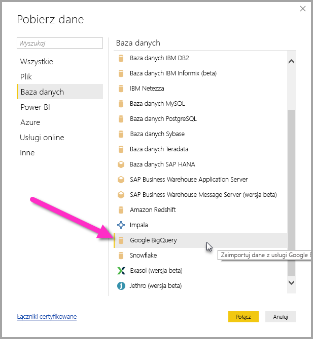
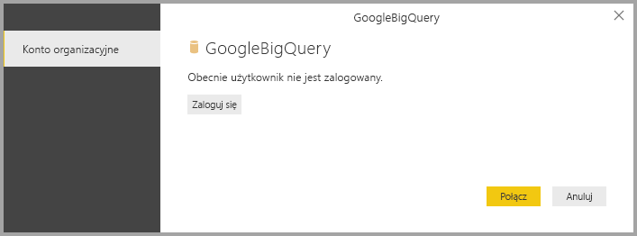
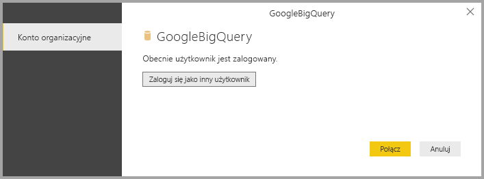
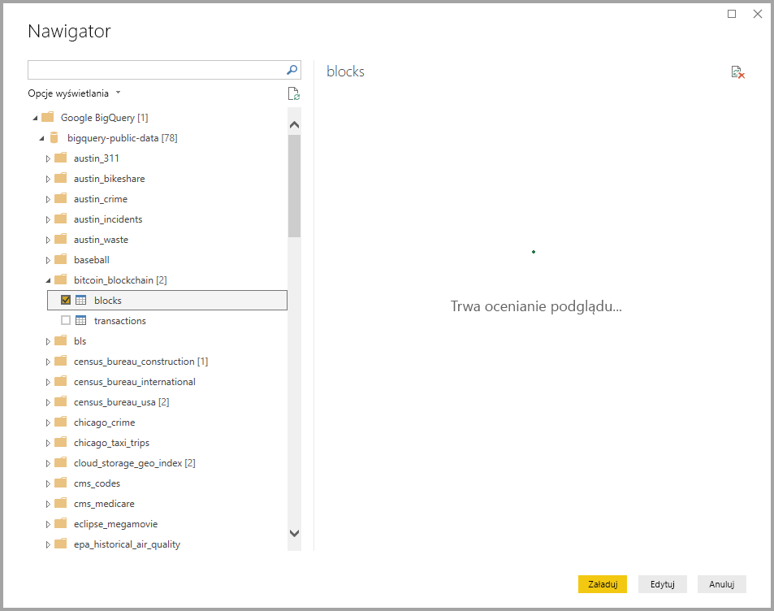

# <a name="connect-to-a-google-bigquery-database-in-power-bi-desktop"></a>Łączenie z bazą danych Google BigQuery w programie Power BI Desktop
W programie Power BI Desktop możesz nawiązać połączenie z bazą danych Google **BigQuery** i korzystać z danych źródłowych w taki sam sposób, jak w przypadku dowolnego innego źródła danych w programie Power BI Desktop.

## <a name="connect-to-google-bigquery"></a>Łączenie z bazą danych Google BigQuery
Aby nawiązać połączenie z bazą danych Google **BigQuery**, wybierz pozycję **Pobierz dane** z poziomu wstążki **Narzędzia główne** w programie Power BI Desktop. Wybierz pozycję **Baza danych** z kategorii po lewej stronie. Zostanie wyświetlona pozycja **Google BigQuery**.



W wyświetlonym oknie **Google BigQuery** zaloguj się do konta bazy danych Google BigQuery i wybierz pozycję **Connect** (Połącz).



Po zalogowaniu zobaczysz poniższe okno wskazujące, że uwierzytelnienie się powiodło. 



Po pomyślnym nawiązaniu połączenia zostanie wyświetlone okno **Nawigator** z wyświetlonymi danymi dostępnymi na serwerze, z których możesz wybrać jeden lub więcej elementów do zaimportowania i używania w programie **Power BI Desktop**.



## <a name="considerations-and-limitations"></a>Istotne zagadnienia i ograniczenia
Istnieje kilka ograniczeń i zagadnień, które należy wziąć pod uwagę w przypadku łącznika Google **BigQuery**:

* Łącznik Google BigQuery jest dostępny w programie Power BI Desktop i usłudze Power BI. W usłudze Power BI dostęp do łącznika można uzyskać przy użyciu połączenia chmura-chmura z usługi Power BI do bazy danych Google BigQuery.

Usługi Power BI można używać z **projektem rozliczeń** bazy danych Google BigQuery. Domyślnie usługa Power BI używa pierwszego projektu z listy zwróconej dla użytkownika. Aby dostosować zachowanie projektu rozliczeń używanego w usłudze Power BI, wykonaj następujące czynności:

 * Określenie wartości poniższej opcji w podstawowym obszarze M w kroku źródła, który można dostosować za pomocą **edytora Power Query** w programie Power BI Desktop:

    ```Source = GoogleBigQuery.Database([BillingProject="Include-Billing-Project-Id-Here"])```

## <a name="next-steps"></a>Następne kroki
Z poziomu programu Power BI Desktop możesz łączyć się z danymi różnego rodzaju. Więcej informacji na temat źródeł danych znajdziesz w następujących zasobach:

* [Co to jest Power BI Desktop?](desktop-what-is-desktop.md)
* [Źródła danych w programie Power BI Desktop](desktop-data-sources.md)
* [Kształtowanie i łączenie danych w programie Power BI Desktop](desktop-shape-and-combine-data.md)
* [Łączenie się ze skoroszytami programu Excel w programie Power BI Desktop](desktop-connect-excel.md)   
* [Wprowadzanie danych bezpośrednio w programie Power BI Desktop](desktop-enter-data-directly-into-desktop.md)   

