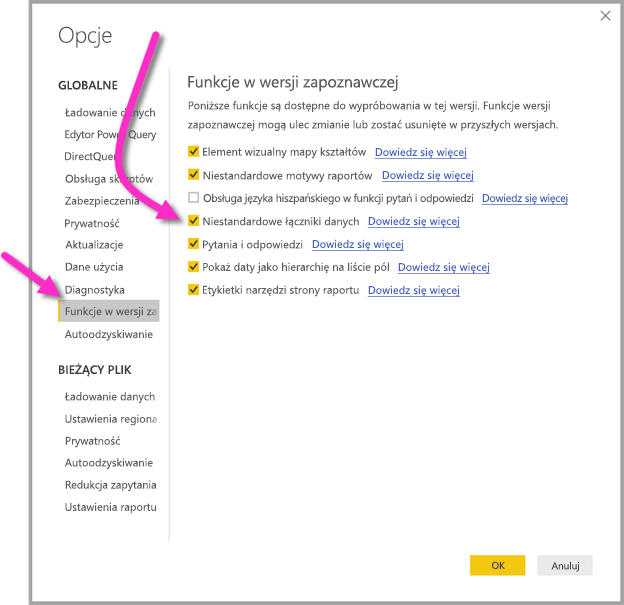

# Łączenie się z danymi utworzonymi przez przepływy danych usługi Power BI w programie Power BI Desktop (wersja zapoznawcza)
W programie **Power BI Desktop** możesz nawiązać połączenie z danymi utworzonymi przez **przepływy danych usługi Power BI** w taki sam sposób, jak w przypadku dowolnego innego źródła danych w programie Power BI Desktop.

Łącznik **Przepływy danych usługi Power BI (wersja zapoznawcza)** umożliwia łączenie się z jednostkami utworzonymi przez przepływy danych w usłudze Power BI. Ponieważ przepływy danych są w wersji zapoznawczej, musisz wykonać kilka kroków, aby łącznik przepływów danych był dostępny w Twoim systemie. 

## Pobieranie i włączanie łącznika przepływów danych usługi Power BI (wersja zapoznawcza)

Musisz pobrać kopię łącznika **przepływów danych usługi Power BI**, a następnie skopiować go do określonej lokalizacji na komputerze. W nadchodzącej miesięcznej aktualizacji programu Power BI Desktop łącznik będzie automatycznie uwzględniony na liście łączników danych i te kroki nie będą potrzebne.

**Łącznik przepływów danych usługi Power BI** można pobrać z tej lokalizacji: [łącznik przepływów danych usługi Power BI](https://visuals.azureedge.net/cds-analytics/PublicPreview/CDSA.mez)

Wykonaj poniższe kroki, aby łącznik **przepływów danych usługi Power BI** (wersja zapoznawcza) był dostępny na Twoim komputerze:

1. Pobierz kopię pliku MEZ (pliku łącznika danych). Klienci korzystający z prywatnej wersji zapoznawczej otrzymają informacje dotyczące pobierania pliku MEZ bezpośrednio od firmy Microsoft.

2. Umieść pobrany plik łącznika danych w następującym folderze na komputerze: **Dokumenty > Power BI Desktop > folder łączników niestandardowych**

3. W programie Power BI Desktop wybierz pozycję **Plik > Opcje i ustawienia > Opcje**, a następnie wybierz pozycję **Funkcje w wersji zapoznawczej** w okienku po lewej stronie.

    

4. Zaznacz pole **Niestandardowe łączniki danych**, jeśli nie jest zaznaczone. 

5. Uruchom ponownie program **Power BI Desktop**, aby łącznik został wyświetlony.

## Używanie łącznika przepływów danych usługi Power BI (wersja zapoznawcza)
Po ponownym uruchomieniu programu **Power BI Desktop** łącznik będzie wyświetlany jako dostępne źródło danych. Aby połączyć się z pulą danych, wybierz pozycję **Pobierz dane > Usługi online > Przepływy danych usługi Power BI (wersja beta)** jak pokazano na poniższej ilustracji:

## Istotne zagadnienia i ograniczenia

Aby korzystać z tej wersji zapoznawczej **łącznika przepływów danych usługi Power BI**, musisz mieć uruchomioną najnowszą wersję programu **Power BI Desktop**. Zawsze możesz [pobrać program Power BI Desktop](desktop-get-the-desktop.md) i zainstalować go na komputerze, aby upewnić się, że masz najnowszą wersję.  

Uwaga: kiedy łącznik przepływów danych usługi Power BI pojawi się w nadchodzącej miesięcznej aktualizacji programu **Power BI Desktop**, *musisz* usunąć ten pobrany plik MEZ z folderu **Dokumenty > Power BI Desktop > Łączniki niestandardowe** w celu uniknięcia konfliktów. 

## Następne kroki
Istnieje wiele ciekawych rzeczy, które można zrobić za pomocą połączeń danych usługi Power BI, a także wiele artykułów na temat programu **Power BI Desktop**, które mogą okazać się przydatne:

* [Źródła danych w programie Power BI Desktop](desktop-data-sources.md)
* [Kształtowanie i łączenie danych w programie Power BI Desktop](desktop-shape-and-combine-data.md)
* [Wprowadzanie danych bezpośrednio w programie Power BI Desktop](desktop-enter-data-directly-into-desktop.md)   

