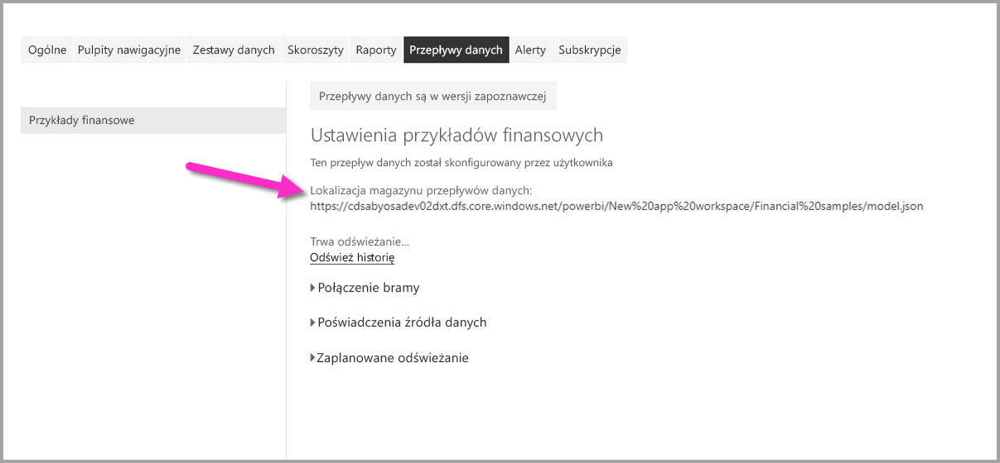

# Łączenie z danymi utworzonymi przez przepływy danych usługi Power BI w programie Power BI Desktop (wersja beta)
W programie **Power BI Desktop** możesz nawiązać połączenie z danymi utworzonymi przez **przepływy danych usługi Power BI** w taki sam sposób, jak w przypadku dowolnego innego źródła danych w programie Power BI Desktop.

Łącznik **Przepływy danych usługi Power BI (wersja beta)** umożliwia łączenie z jednostkami utworzonymi przez przepływy danych w usłudze Power BI. 

## Istotne zagadnienia i ograniczenia

Aby korzystać z tej wersji beta **łącznika przepływów danych usługi Power BI**, musisz mieć uruchomioną najnowszą wersję programu **Power BI Desktop**. Zawsze możesz [pobrać program Power BI Desktop](desktop-get-the-desktop.md) i zainstalować go na komputerze, aby upewnić się, że masz najnowszą wersję.  

> [!NOTE]
> Poprzednia wersja łącznika przepływów danych usługi Power BI wymagała pobrania pliku MEZ i umieszczenia go w folderze. Bieżące wersje programu **Power BI Desktop** obejmują łącznik przepływów danych usługi Power BI, dzięki czemu plik nie jest już wymagany i może powodować konflikt z uwzględnioną wersją łącznika. Jeśli plik MEZ został ręcznie umieszczony w folderze, *musisz* usunąć pobrany plik MEZ z folderu **Dokumenty > Power BI Desktop > Łączniki niestandardowe** w celu uniknięcia konfliktów. 

## Wydajność programu Desktop
Program **Power BI Desktop** działa lokalnie na komputerze, na którym został zainstalowany. Wydajność pozyskiwania przepływów danych zależy od różnych czynników. Obejmują one rozmiar danych, procesor i pamięć RAM komputera, przepustowość sieci, odległość od centrum danych oraz inne czynniki.

Wydajność pozyskiwania danych dla przepływów danych można poprawić. Jeśli na przykład rozmiar pozyskiwanych danych jest zbyt duży, aby program **Power BI Desktop** mógł zarządzać nimi na komputerze, można w przepływach danych użyć jednostek połączonych i obliczonych do agregowania danych (w ramach przepływów danych) i pozyskiwania tylko wstępnie przygotowanych, zagregowanych danych. Dzięki temu przetwarzanie dużych ilości danych będzie wykonywane w trybie online w przepływach danych, a nie lokalnie w uruchomionym wystąpieniu programu **Power BI Desktop**. Takie podejście umożliwia programowi Power BI Desktop pozyskiwanie mniejszej ilości danych i zapewnia szybkie i dynamiczne środowisko przepływów danych.

## Istotne zagadnienia i ograniczenia

Większość przepływów danych znajduje się w dzierżawie usługi Power BI. Jednak użytkownicy programu **Power BI Desktop** nie mogą uzyskiwać dostępu do przepływów danych przechowywanych na koncie usługi Azure Data Lake Storage Gen2, chyba że są właścicielami przepływu danych lub mają jawną autoryzację do korzystania z folderu CDM przepływu danych. Rozpatrzmy następującą sytuację:

1.  Anna tworzy nowy obszar roboczy aplikacji i konfiguruje go do przechowywania przepływów danych w usłudze Data Lake w organizacji.
2.  Jan, który również jest członkiem obszaru roboczego utworzonego przez Annę, chce używać programu Power BI Desktop i łącznika przepływu danych do pobierania danych z przepływu danych, który utworzyła Anna.
3.  Jan zobaczy komunikat o błędzie, ponieważ nie został dodany jako autoryzowany użytkownik do folderu CDM przepływu danych w usłudze Data Lake.

    

Aby rozwiązać ten problem, Jan musi mieć uprawnienia czytelnika do folderu CDM i jego plików. Dowiedz się więcej na temat sposobu przyznawania dostępu do folderu CDM w [tym artykule](https://go.microsoft.com/fwlink/?linkid=2029121).

## Następne kroki
Istnieje wiele interesujących czynności, które można wykonać przy użyciu przepływów danych usługi Power BI. Więcej informacji możesz uzyskać w następujących zasobach:

* [Przygotowywanie danych samoobsługi przy użyciu przepływów danych](service-dataflows-overview.md)
* [Tworzenie i używanie przepływów danych w usłudze Power BI](service-dataflows-create-use.md)
* [Używanie obliczonych jednostek w usłudze Power BI Premium (wersja zapoznawcza)](service-dataflows-computed-entities-premium.md)
* [Używanie przepływów danych z lokalnymi źródłami danych (wersja zapoznawcza)](service-dataflows-on-premises-gateways.md)
* [Zasoby dla deweloperów dotyczące przepływów danych usługi Power BI (wersja zapoznawcza)](service-dataflows-developer-resources.md)

Aby uzyskać więcej informacji na temat integracji z usługą Azure Data Lake Storage Gen2, zapoznaj się z następującymi artykułami:

* [Integracja przepływów danych z usługą Azure Data Lake (wersja zapoznawcza)](service-dataflows-azure-data-lake-integration.md)
* [Konfigurowanie ustawień przepływów danych w obszarze roboczym (wersja zapoznawcza)](service-dataflows-configure-workspace-storage-settings.md)
* [Dodawanie folderu CDM do usługi Power BI jako przepływu danych (wersja zapoznawcza)](service-dataflows-add-cdm-folder.md)
* [Łączenie usługi Azure Data Lake Storage Gen2 na potrzeby magazynowania przepływów danych (wersja zapoznawcza)](service-dataflows-connect-azure-data-lake-storage-gen2.md)

Dostępne są także artykuły dotyczące programu **Power BI Desktop**, które mogą się okazać przydatne:

* [Źródła danych w programie Power BI Desktop](desktop-data-sources.md)
* [Kształtowanie i łączenie danych w programie Power BI Desktop](desktop-shape-and-combine-data.md)
* [Wprowadzanie danych bezpośrednio w programie Power BI Desktop](desktop-enter-data-directly-into-desktop.md)   

