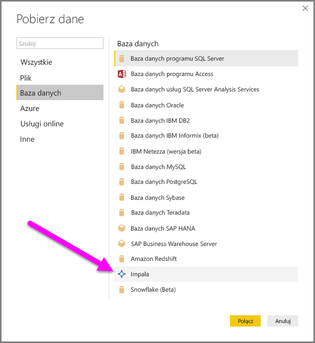
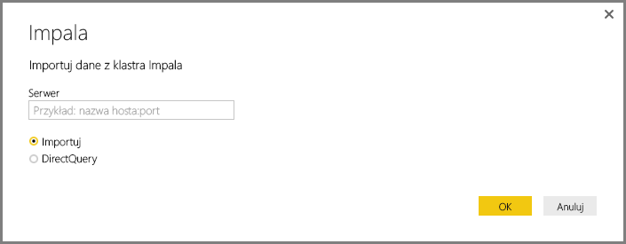
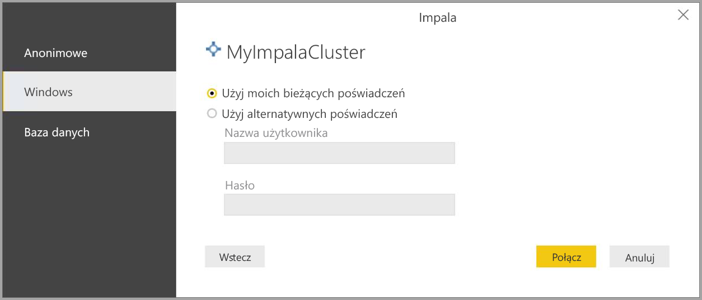
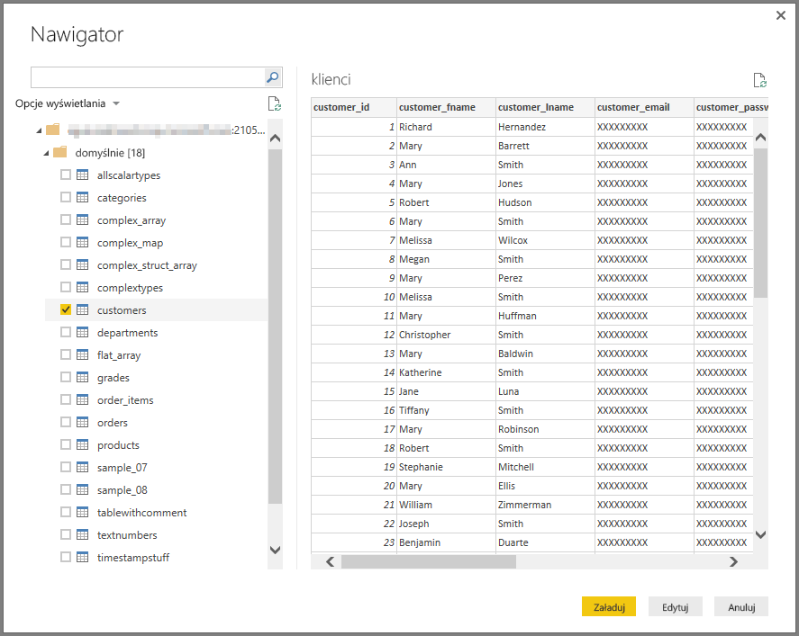

# Łączenie się z bazą danych Impala w programie Power BI Desktop
W programie Power BI Desktop możesz nawiązać połączenie z bazą danych **Impala** i korzystać z danych źródłowych w taki sam sposób jak w przypadku dowolnego innego źródła danych w programie Power BI Desktop.

## Łączenie się z bazą danych Impala
Aby nawiązać połączenie z bazą danych **Impala**, wybierz pozycję **Pobierz dane** z poziomu wstążki **Narzędzia główne** w programie Power BI Desktop. Wybierz pozycję **Baza danych** z kategorii po lewej stronie. Zostanie wyświetlona pozycja **Impala**.

W wyświetlonym oknie **Impala** wpisz lub wklej nazwę serwera Impala w polu i wybierz przycisk **OK**. Pamiętaj, że możesz **zaimportować** dane bezpośrednio do usługi Power BI lub możesz użyć **zapytania bezpośredniego**. Tutaj możesz dowiedzieć się więcej o [używaniu zapytania bezpośredniego](desktop-use-directquery.md).

Gdy zostanie wyświetlony monit, wpisz nazwę użytkownika i hasło lub połącz się anonimowo — każda opcja jest obsługiwana.

> [!NOTE]
> Po wprowadzeniu nazwy użytkownika i hasła dla określonego serwera **Impala** program Power BI Desktop będzie używać tych samych poświadczeń przy kolejnych próbach połączenia. Te poświadczenia można zmodyfikować, wybierając pozycję **Plik > Opcje i ustawienia > Ustawienia źródła danych**.
> 
> 

Po pomyślnym nawiązaniu połączenia zostanie wyświetlone okno **Nawigator** z wyświetlonymi danymi dostępnymi na serwerze, z których możesz wybrać jeden lub więcej elementów do zaimportowania i używania w programie **Power BI Desktop**.

## Istotne zagadnienia i ograniczenia
Istnieje kilka ograniczeń i zagadnień, które należy wziąć pod uwagę w przypadku łącznika **Impala**:

* Plany na przyszłość uwzględniają umożliwienie obsługi odświeżania za pomocą usługi **Power BI Gateway**.

## Następne kroki
Z poziomu programu Power BI Desktop możesz łączyć się z danymi różnego rodzaju. Więcej informacji na temat źródeł danych znajdziesz w następujących zasobach:

* [Wprowadzenie do programu Power BI Desktop](desktop-getting-started.md)
* [Źródła danych w programie Power BI Desktop](desktop-data-sources.md)
* [Kształtowanie i łączenie danych w programie Power BI Desktop](desktop-shape-and-combine-data.md)
* [Łączenie się ze skoroszytami programu Excel w programie Power BI Desktop](desktop-connect-excel.md)   
* [Wprowadzanie danych bezpośrednio w programie Power BI Desktop](desktop-enter-data-directly-into-desktop.md)   

