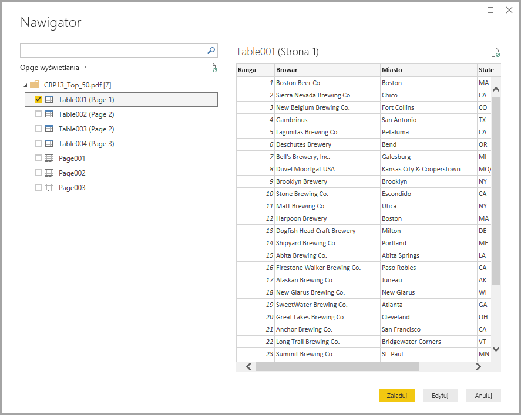
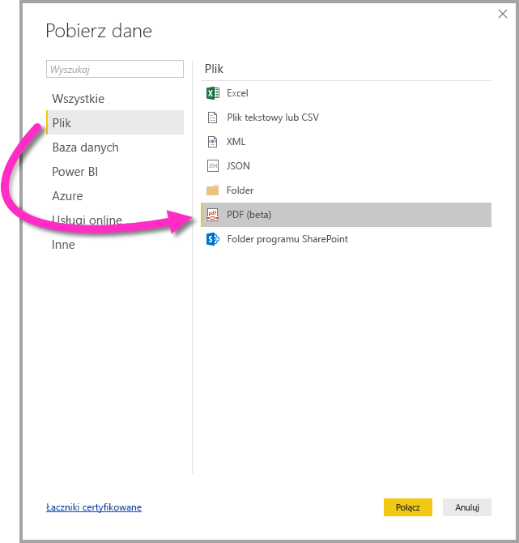

# Łączenie się z plikiem PDF w programie Power BI Desktop (wersja zapoznawcza)
W programie Power BI Desktop możesz nawiązać połączenie z **plikiem PDF** i korzystać z zawartych w nim danych w taki sam sposób jak w przypadku dowolnego innego źródła danych w programie Power BI Desktop.

W poniższych sekcjach opisano, jak nawiązać połączenie z **plikiem PDF**, wybrać dane i przenieść dane do programu **Power BI Desktop**.

## Włączanie łącznika PDF
Łącznik PDF jest obecnie w wersji zapoznawczej dla programu **Power BI Desktop** i musi zostać włączony. Aby włączyć łącznik PDF, wybierz pozycję **Plik > Opcje i ustawienia > Opcje > Funkcje w wersji zapoznawczej**, a następnie zaznacz pole wyboru obok pozycji **Pobieranie danych z plików PDF**. 

Po zaznaczeniu należy uruchomić ponownie program **Power BI Desktop**.

Podczas pierwszego użycia łącznika **PDF (beta)** otrzymasz ostrzeżenie, że łącznik PDF jest nadal w fazie opracowywania i może ulec zmianie w przyszłości. Wybierz pozycję **Kontynuuj**, aby korzystać z łącznika.

Zawsze zalecamy uaktualnienie programu **Power BI Desktop** do najnowszej wersji, którą można pobrać za pomocą linku na stronie [Uzyskiwanie programu Power BI Desktop](desktop-get-the-desktop.md). 

## Łączenie się z plikiem PDF
Aby nawiązać połączenie z plikiem **PDF**, wybierz pozycję **Pobierz dane** na wstążce **Narzędzia główne** w programie Power BI Desktop. Wybierz pozycję **Plik** z kategorii po lewej stronie. Zostanie wyświetlona pozycja **PDF (beta)**.

Zostanie wyświetlony monit o podanie lokalizacji pliku PDF, którego chcesz użyć. Po podaniu lokalizacji pliku i załadowaniu pliku PDF zostanie wyświetlone okno **Nawigator** z wyświetlonymi danymi dostępnymi w pliku, z których możesz wybrać jeden lub więcej elementów do zaimportowania i używania w programie **Power BI Desktop**.

Zaznaczenie pola wyboru obok odnalezionych elementów w pliku PDF spowoduje ich wyświetlenie w okienku po prawej stronie. Gdy wszystko będzie gotowe do importu, wybierz przycisk **Załaduj**, aby przenieść dane do programu **Power BI Desktop**.

## Następne kroki
Z poziomu programu Power BI Desktop możesz łączyć się z danymi różnego rodzaju. Więcej informacji na temat źródeł danych znajdziesz w następujących zasobach:

* [Co to jest Power BI Desktop?](desktop-what-is-desktop.md)
* [Źródła danych w programie Power BI Desktop](desktop-data-sources.md)
* [Kształtowanie i łączenie danych w programie Power BI Desktop](desktop-shape-and-combine-data.md)
* [Łączenie się ze skoroszytami programu Excel w programie Power BI Desktop](desktop-connect-excel.md)   
* [Wprowadzanie danych bezpośrednio w programie Power BI Desktop](desktop-enter-data-directly-into-desktop.md)   

