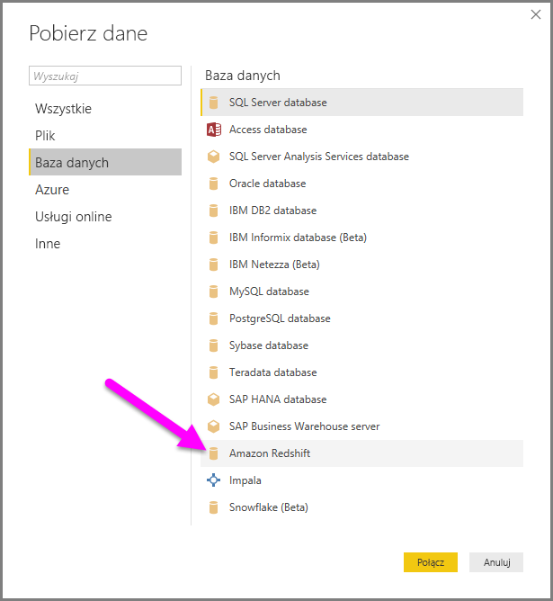
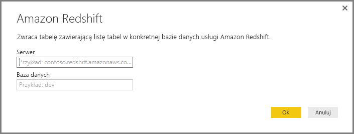
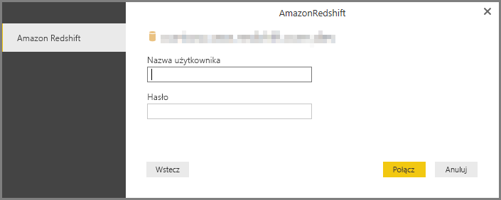
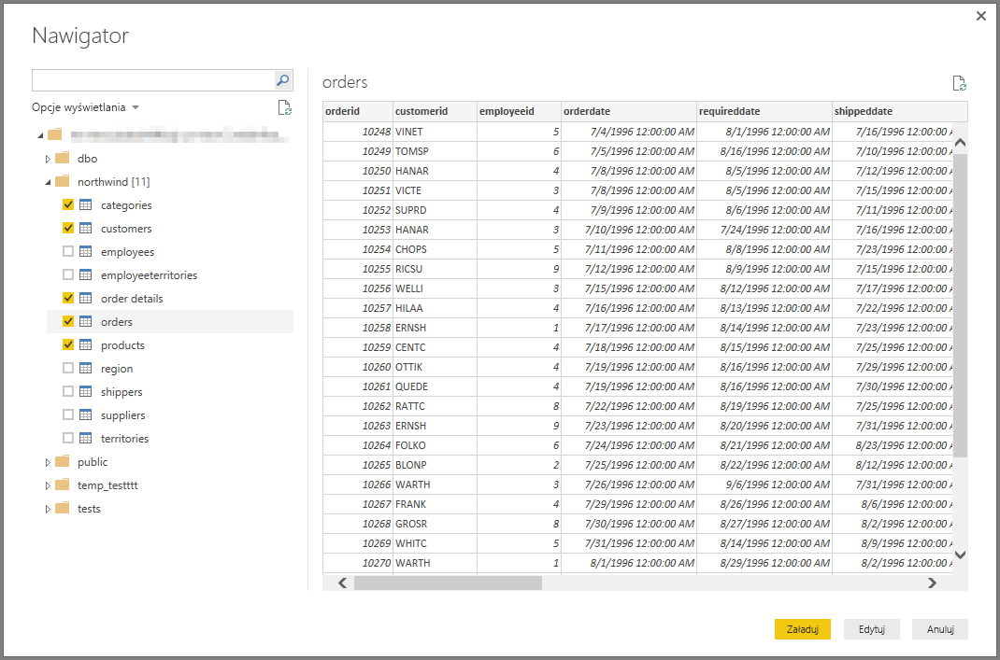

# Nawiązywanie połączenia z bazą danych Amazon Redshift w programie Power BI Desktop
W programie **Power BI Desktop** możesz nawiązać połączenie z bazą danych **Amazon Redshift** i korzystać z danych źródłowych w taki sam sposób, jak w przypadku dowolnego innego źródła danych w programie Power BI Desktop.

## Nawiązywanie połączenia z bazą danych Amazon Redshift
Aby nawiązać połączenie z bazą danych **Amazon Redshift**, wybierz pozycję **Pobierz dane** z poziomu wstążki **Narzędzia główne** w programie Power BI Desktop. Wybierz pozycję **Baza danych** z kategorii po lewej stronie. Zostanie wyświetlona pozycja **Amazon Redshift**.

W oknie **Amazon Redshift** wpisz lub wklej w polu nazwę Twojego serwera **Amazon Redshift**. Jako część pola *Serwer* użytkownicy mogą określić port w następującym formacie: *adres_URL_serwera:port*

Po wyświetleniu monitu wprowadź nazwę użytkownika i hasło.

Po pomyślnym nawiązaniu połączenia zostanie wyświetlone okno **Nawigator** z wyświetlonymi danymi dostępnymi na serwerze, z których możesz wybrać jeden lub więcej elementów do zaimportowania i używania w programie **Power BI Desktop**.

Po dokonaniu wyborów w oknie **Nawigator** możesz **załadować** lub**edytować** dane.

* Jeśli zdecydujesz się **załadować** dane, zostanie wyświetlony monit dotyczący wyboru trybu, który ma zostać użyty do załadowania danych: *Import* czy *Zapytanie bezpośrednie*. Aby uzyskać więcej informacji, zapoznaj się z [tym artykułem zawierającym omówienie zapytania bezpośredniego](desktop-use-directquery.md).
* Jeśli wybrano opcję **edytowania** danych, zostanie wyświetlony **Edytor zapytań**, w którym można zastosować szeroką gamę przekształceń i filtrów dotyczących danych, z których wiele ma zastosowanie względem samej bazy danych **Amazon Redshift**  (jeśli jest to obsługiwane).

## Następne kroki
Z poziomu programu Power BI Desktop możesz łączyć się z danymi różnego rodzaju. Więcej informacji na temat źródeł danych znajdziesz w następujących zasobach:

* [Wprowadzenie do programu Power BI Desktop](desktop-getting-started.md)
* [Źródła danych w programie Power BI Desktop](desktop-data-sources.md)
* [Kształtowanie i łączenie danych w programie Power BI Desktop](desktop-shape-and-combine-data.md)
* [Łączenie się ze skoroszytami programu Excel w programie Power BI Desktop](desktop-connect-excel.md)   
* [Wprowadzanie danych bezpośrednio w programie Power BI Desktop](desktop-enter-data-directly-into-desktop.md)   

