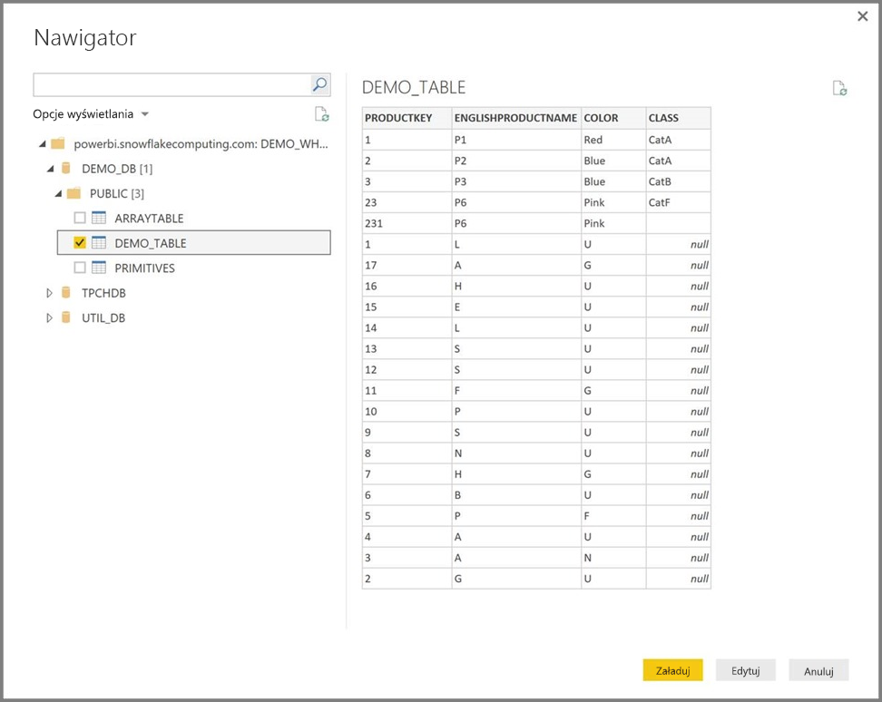

# Łączenie się z usługą Snowflake w programie Power BI Desktop
W programie Power BI Desktop możesz nawiązać połączenie z magazynem **Snowflake Computing** i korzystać z danych źródłowych w taki sam sposób jak w przypadku dowolnego innego źródła danych w programie Power BI Desktop. 

> [!NOTE]
> Ponadto *musisz* zainstalować **sterownik ODBC usługi Snowflake** na komputerach, które korzystają z łącznika **Snowflake**, przy użyciu architektury zgodnej z instalacją programu **Power BI Desktop**: 32-bitowej lub 64-bitowej. Skorzystaj z następującego linku i [pobierz odpowiedni sterownik ODBC usługi Snowflake](http://go.microsoft.com/fwlink/?LinkID=823762).
> 
> 

## Łączenie się z magazynem Snowflake Computing
Aby połączyć się z magazynem **Snowflake Computing**, wybierz pozycję **Pobierz dane** na wstążce **Narzędzia główne** w programie Power BI Desktop. Wybierz pozycję **Baza danych** z kategorii po lewej stronie. Zostanie wyświetlona pozycja **Snowflake**.

W wyświetlonym oknie usługi **Snowflake** wpisz lub wklej nazwę odpowiedniego magazynu Snowflake Computing i wybierz przycisk **OK**. Pamiętaj, że możesz **zaimportować** dane bezpośrednio do usługi Power BI lub możesz użyć **zapytania bezpośredniego**. Tutaj możesz dowiedzieć się więcej o [używaniu zapytania bezpośredniego](desktop-use-directquery.md).

Po wyświetleniu monitu wprowadź nazwę użytkownika i hasło.

> [!NOTE]
> Po wprowadzeniu nazwy użytkownika i hasła dla określonego serwera **Snowflake** program Power BI Desktop będzie używać tych samych poświadczeń przy kolejnych próbach połączenia. Te poświadczenia można zmodyfikować, wybierając pozycję **Plik > Opcje i ustawienia > Ustawienia źródła danych**.
> 
> 

Po pomyślnym nawiązaniu połączenia zostanie wyświetlone okno **Nawigator** z wyświetlonymi danymi dostępnymi na serwerze, z których możesz wybrać jeden lub więcej elementów do zaimportowania i używania w programie **Power BI Desktop**.

Możesz użyć polecenia **Załaduj** dla wybranej tabeli, co spowoduje pobranie całej tabeli do programu **Power BI Desktop**, lub możesz użyć polecenia **Edytuj** w stosunku do zapytania, co spowoduje otworzenie okna **Edytor zapytań** umożliwiającego filtrowanie i uściślenie zestawu danych, którego chcesz użyć. Następnie możesz załadować ten dopracowany zestaw danych do programu **Power BI Desktop**.

## Następne kroki
Z poziomu programu Power BI Desktop możesz łączyć się z danymi różnego rodzaju. Więcej informacji na temat źródeł danych znajdziesz w następujących zasobach:

* [Wprowadzenie do programu Power BI Desktop](desktop-getting-started.md)
* [Źródła danych w programie Power BI Desktop](desktop-data-sources.md)
* [Kształtowanie i łączenie danych w programie Power BI Desktop](desktop-shape-and-combine-data.md)
* [Łączenie się ze skoroszytami programu Excel w programie Power BI Desktop](desktop-connect-excel.md)   
* [Wprowadzanie danych bezpośrednio w programie Power BI Desktop](desktop-enter-data-directly-into-desktop.md)   

