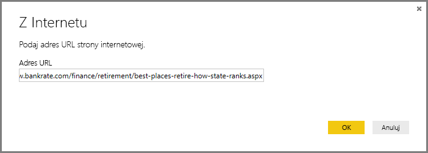
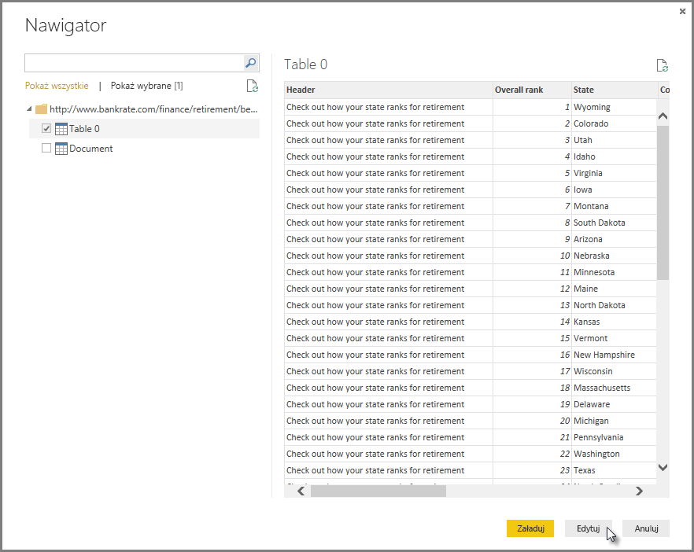
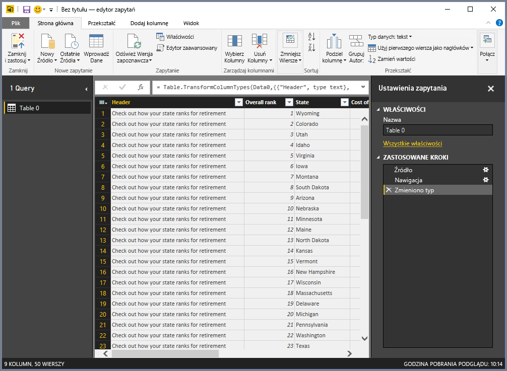
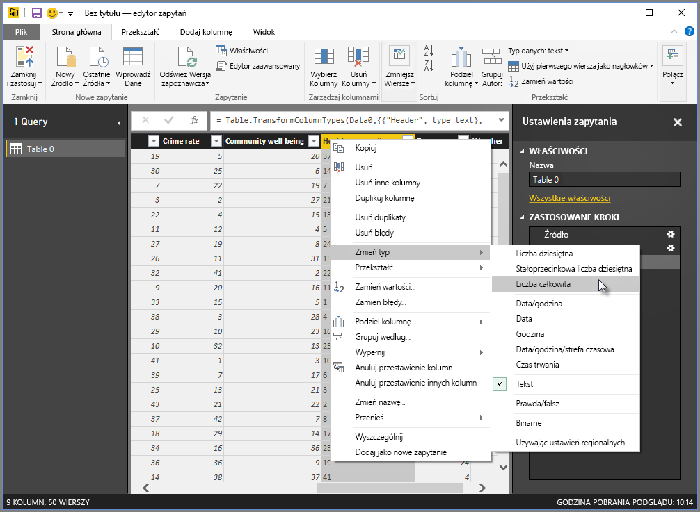
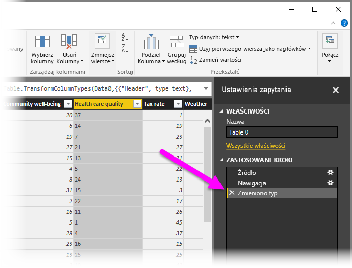
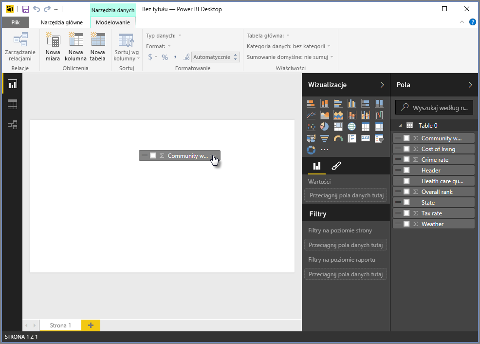
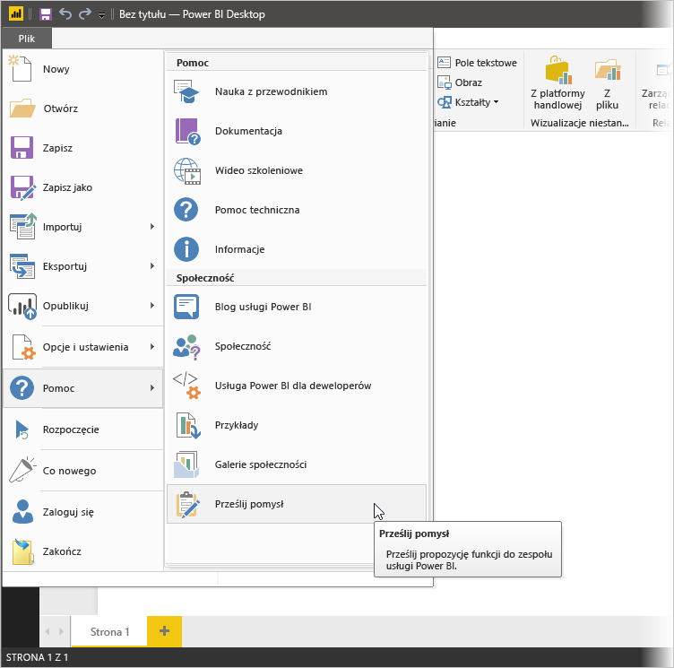

# Łączenie się z danymi w programie Power BI Desktop
Za pomocą programu Power BI Desktop możesz łatwo połączyć się z nieustannie rozszerzającym się światem danych. Jeśli nie masz programu Power BI Desktop, możesz go [pobrać](http://go.microsoft.com/fwlink/?LinkID=521662) i zainstalować.

W programie Power BI Desktop są dostępne źródła danych *wielu typów*. Na poniższej ilustracji pokazano sposób łączenia z danymi przez wybranie wstążki **Plik**, a następnie pozycji **Pobierz dane \> Więcej**.

W tym przykładzie połączymy się ze źródłem danych **Internet**.

Wyobraź sobie, że przechodzisz na emeryturę — i chcesz przenieść się w miejsce, w którym jest dużo słońca, znośne podatki i dobra opieka zdrowotna. Albo... jesteś analitykiem danych i potrzebujesz tych informacji, aby pomóc klientom — na przykład pomóc producentowi płaszczy przeciwdeszczowych trafić ze sprzedażą do miejsc, gdzie *dużo pada*.

Tak czy siak, znajdujesz zasób internetowy z interesującymi danymi na te tematy i nie tylko:

[*http://www.bankrate.com/finance/retirement/best-places-retire-how-state-ranks.aspx*](http://www.bankrate.com/finance/retirement/best-places-retire-how-state-ranks.aspx)

Wybierasz pozycję **Pobierz dane \> Internet** i wpisujesz adres.

Po wybraniu przycisku **OK** funkcja **Zapytanie** programu Power BI Desktop przystępuje do pracy. Program Power BI Desktop łączy się z zasobem internetowym i w oknie **Nawigator** zwracane są wyniki znalezione na stronie internetowej. W tym przypadku została znaleziona tabela (Table 0) i cały dokument (Document). Interesuje nas tabela, więc wybieramy ją z listy. W oknie **Nawigator** pojawia się podgląd.

Na tym etapie możemy poddać edycji zapytanie przed załadowaniem tabeli, wybierając pozycję **Edytuj** u dołu okna, albo załadować tabelę.

Wybranie pozycji **Edytuj** spowoduje załadowanie tabeli i uruchomienie Edytora zapytań. Zostanie wyświetlone okienko **Ustawienia zapytania**. Jeśli tak się nie stanie, możesz wybrać pozycję **Wyświetl** ze wstążki, a następnie pozycje **Pokaż \> Ustawienia zapytania** w celu wyświetlenia okienka **Ustawienia zapytania**. Oto jak to wygląda.

Wszystkie te oceny to tekst, nie liczby, a potrzebujemy liczb. Żaden problem — po prostu kliknij nagłówek kolumny prawym przyciskiem myszy i wybierz pozycje **Zmień typ \> Liczba całkowita** w celu ich zmiany. Aby zaznaczyć więcej niż jedną kolumnę, zaznacz kolumnę, naciśnij i przytrzymaj klawisz **SHIFT**, wybierz kolejne przyległe kolumny, a następnie kliknij prawym przyciskiem myszy nagłówek kolumny w celu zmienienia wszystkich zaznaczonych kolumn. Użyj klawisza **CTRL**, aby wybrać kolumny, które ze sobą nie sąsiadują.

W okienku **Ustawienia zapytania** sekcja **Zastosowane kroki** będzie odzwierciedlać wszelkie wprowadzone zmiany. W miarę wprowadzania dodatkowych zmian do danych Edytor zapytań będzie je rejestrować w sekcji **Zastosowane akcje**. Jej zawartość można zgodnie z potrzebami dostosowywać, analizować, przebudowywać i usuwać.

Dodatkowe zmiany do tabeli można nadal wprowadzać po jej załadowaniu, ale póki co to wystarczy. Gdy wszystko jest gotowe, wybieramy pozycję **Zamknij i zastosuj** ze wstążki **Narzędzia główne**. Program Power BI Desktop zastosuje nasze zmiany i zamknie Edytor zapytań.

Przy załadowanym modelu danych w widoku **Raport** w programie Power BI Desktop możemy rozpocząć tworzenie wizualizacji, przeciągając pola na kanwę.

Oczywiście jest to prosty model z pojedynczym połączeniem danych. Większość raportów w programie Power BI Desktop będzie mieć połączenia do różnych źródeł danych, dostosowane odpowiednio do potrzeb, z relacjami tworzącymi rozbudowany model danych. 

### Następne kroki
Przy użyciu programu Power BI Desktop można wykonywać różnorodne zadania. Aby uzyskać więcej informacji na temat jego możliwości, skorzystaj z następujących zasobów:

* [Co to jest Power BI Desktop?](desktop-what-is-desktop.md)
* [Omówienie zapytań w programie Power BI Desktop](desktop-query-overview.md)
* [Źródła danych w programie Power BI Desktop](desktop-data-sources.md)
* [Kształtowanie i łączenie danych w programie Power BI Desktop](desktop-shape-and-combine-data.md)
* [Typowe zadania dotyczące zapytań w programie Power BI Desktop](desktop-common-query-tasks.md)   

Chcesz przesłać nam swoją opinię? Wspaniale — użyj elementu menu **Prześlij pomysł** w programie Power BI Desktop lub odwiedź forum [Community Feedback](http://community.powerbi.com/t5/Community-Feedback/bd-p/community-feedback) (Opinia społeczności). Czekamy na informacje od Ciebie!

