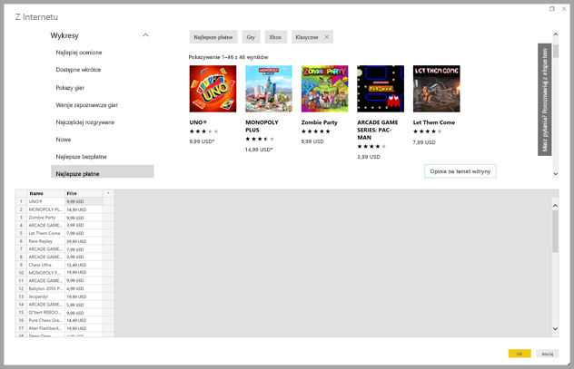

# Pobieranie danych ze strony internetowej przez podanie przykładu

Pobieranie danych ze strony internetowej umożliwia użytkownikom łatwe wyodrębnianie danych ze stron internetowych i importowanie ich do programu **Power BI Desktop**. Często jednak dane na stronach internetowych nie są umieszczane w uporządkowanych, łatwych do wyodrębnienia tabelach, dlatego pobieranie danych z tych stron — nawet gdy są one spójne i mają odpowiednią strukturę — może stanowić wyzwanie. 

Ale ten problem można rozwiązać. Przy użyciu funkcji **Pobieranie danych z Internetu według przykładu** można zasadniczo pokazać programowi **Power BI Desktop**, które dane mają zostać wyodrębnione, podając co najmniej jeden przykład w oknie dialogowym łącznika. Program będzie zbierać na stronie pozostałe dane zgodne z tymi przykładami. Stosując to rozwiązanie, można wyodrębniać szeroką gamę danych ze stron internetowych, w tym dane w tabelach *i* inne dane niepochodzące z tabel. 

## Używanie funkcji Pobieranie danych z Internetu według przykładu

Aby użyć funkcji **Pobieranie danych z Internetu według przykładu**, wybierz pozycję **Pobierz dane** z menu wstążki **Narzędzia główne**. W wyświetlonym oknie wybierz kategorię **Inne** spośród kategorii dostępnych w lewym okienku, a następnie wybierz pozycję **Internet**.

Z tego miejsca wprowadź adres URL strony internetowej, z której chcesz wyodrębnić dane. W tym artykule użyjemy strony internetowej sklepu Microsoft Store i zademonstrujemy sposób działania tego łącznika. 

Jeśli chcesz być na bieżąco, możesz użyć [adresu URL sklepu Microsoft Store](https://www.microsoft.com/en-us/store/top-paid/games/xbox?category=classics), takiego jak w tym artykule:

    https://www.microsoft.com/en-us/store/top-paid/games/xbox?category=classics

Po wybraniu przycisku **OK** nastąpi przejście do okna dialogowego **Nawigator**, gdzie są prezentowane wszystkie tabele wykrywane automatycznie na stronie internetowej. W przypadku pokazanym na poniższej ilustracji nie znaleziono żadnych tabel, ale dzięki przyciskowi znajdującemu się w dolnej części strony o nazwie **Wyodrębnij tabelę przy użyciu przykładów** można podać przykłady.

Wybranie przycisku **Wyodrębnij tabelę przy użyciu przykładów** spowoduje otwarcie okna interaktywnego, w którym można wyświetlić podgląd zawartości strony internetowej i wprowadzić przykładowe wartości danych do wyodrębnienia. 

W tym przykładzie wyodrębnimy *nazwę* i *cenę* każdej z gier na stronie. W tym celu można określić kilka przykładów ze strony dla każdej kolumny, jak pokazano na poniższej ilustracji. Gdy te przykłady są wpisywane, dodatek **Power Query** (podstawowa technologia do wyodrębnia danych ze strony internetowej) jest w stanie wyodrębnić dane pasujące do wzorca przykładowych wpisów przy użyciu inteligentnych algorytmów wyodrębniania danych.

Gdy dane wyodrębnione ze strony internetowej przyjmą pożądany kształt, wybieramy przycisk **OK**, aby przejść do **Edytora zapytań**, gdzie można dokonać kolejnych przekształceń danych, takich jak łączenie tych danych z danymi z innych źródeł.

W tym miejscu możesz tworzyć wizualizacje lub używać danych ze strony internetowej w inny sposób podczas tworzenia raportów programu **Power BI Desktop**.

## Następne kroki
Z poziomu programu **Power BI Desktop** możesz łączyć się z danymi różnego rodzaju. Więcej informacji na temat źródeł danych znajdziesz w następujących zasobach:

* [Dodawanie kolumn według przykładu](desktop-add-column-from-example.md)
* [Łączenie ze stroną internetową](desktop-connect-to-web.md)
* [Źródła danych w programie Power BI Desktop](desktop-data-sources.md)
* [Kształtowanie i łączenie danych w programie Power BI Desktop](desktop-shape-and-combine-data.md)
* [Łączenie się ze skoroszytami programu Excel w programie Power BI Desktop](desktop-connect-excel.md)   
* [Łączenie się z plikami CSV w programie Power BI Desktop](desktop-connect-csv.md)   
* [Wprowadzanie danych bezpośrednio w programie Power BI Desktop](desktop-enter-data-directly-into-desktop.md)   

