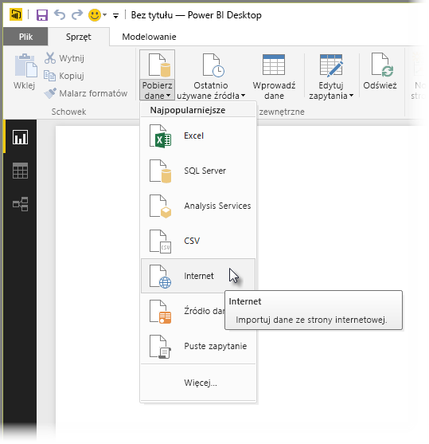
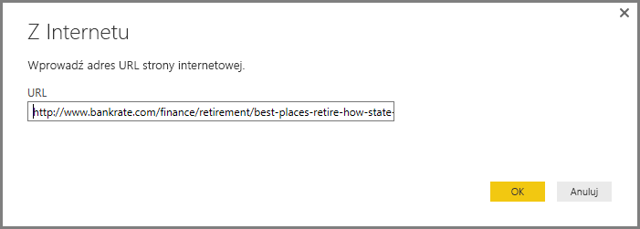
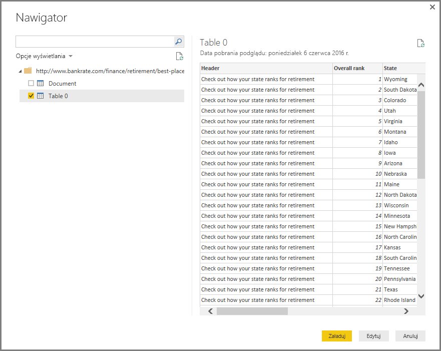
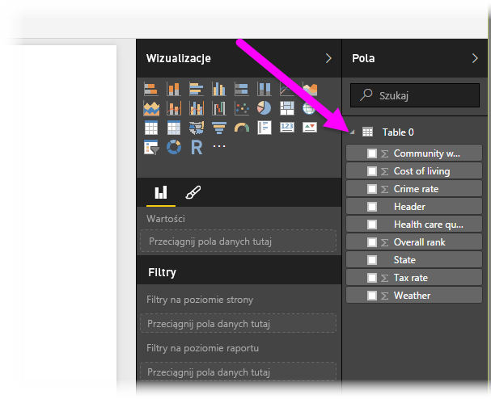

# Łączenie się ze stroną internetową w programie Power BI Desktop
Możesz nawiązać połączenie ze stroną internetową i zaimportować jej dane do programu Power BI Desktop, aby używać ich w wizualizacjach oraz w modelach danych.

W programie Power BI Desktop wybierz pozycję **Pobierz dane > Internet** na karcie **Narzędzia główne** wstążki.

Zostanie wyświetlone okno dialogowe z pytaniem o adres URL strony internetowej, z której chcesz zaimportować dane.

Po wpisaniu (lub wklejeniu) adresu URL wybierz przycisk **OK**. Program Power BI Desktop połączy się z tą stroną, a następnie wyświetli dane dostępne na stronie w oknie **Nawigator**. Po wybraniu jednego z dostępnych elementów danych, takiego jak tabela całej strony, w oknie **Nawigator** zostanie wyświetlony podgląd tych danych po prawej stronie okna.

Możesz wybrać przycisk **Edytuj**, co spowoduje uruchomienie **Edytora zapytań**, w którym możesz kształtować i przekształcać dane na tej stronie internetowej przed zaimportowaniem ich do programu Power BI Desktop. Możesz też wybrać przycisk **Załaduj** i zaimportować wszystkie elementy danych wybrane w lewym okienku.

Po wybraniu przycisku **Załaduj** program Power BI Desktop importuje wybrane elementy i udostępnia je w okienku **Pola** znajdującym się po prawej stronie widoku Raporty w programie Power BI Desktop.

To wszystko, jeśli chodzi o łączenie się ze stroną internetową i pobieranie jej danych do programu Power BI Desktop.

Następnie można przeciągać te pola na kanwę raportu i tworzyć dowolne wizualizacje. Możesz także pracować z tymi danymi ze strony internetowej tak jak z każdymi innymi danymi — możesz je kształtować, tworzyć relacje między nimi i innymi źródłami danych w modelu i wykonywać wszystkie inne czynności w celu utworzenia raportu usługi Power BI.

Aby dokładniej poznać funkcję łączenia się ze stroną internetową i zobaczyć, jak ona działa, zapoznaj się z tematem [Wprowadzenie do programu Power BI Desktop — przewodnik](desktop-getting-started.md).

### Następne kroki
Z poziomu programu Power BI Desktop możesz łączyć się z danymi różnego rodzaju. Więcej informacji na temat źródeł danych znajdziesz w następujących zasobach:

* [Źródła danych w programie Power BI Desktop](desktop-data-sources.md)
* [Kształtowanie i łączenie danych w programie Power BI Desktop](desktop-shape-and-combine-data.md)
* [Łączenie się ze skoroszytami programu Excel w programie Power BI Desktop](desktop-connect-excel.md)   
* [Łączenie się z plikami CSV w programie Power BI Desktop](desktop-connect-csv.md)   
* [Wprowadzanie danych bezpośrednio w programie Power BI Desktop](desktop-enter-data-directly-into-desktop.md)   

