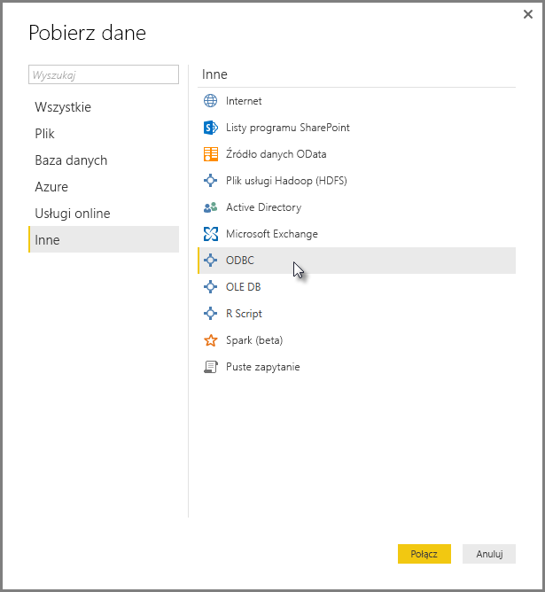
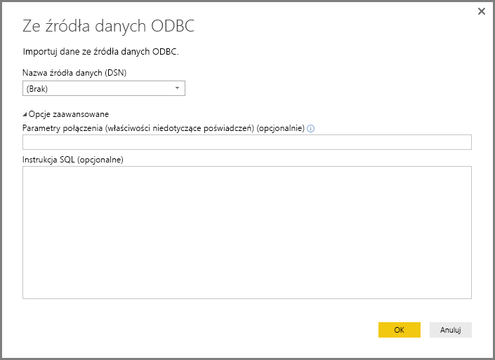
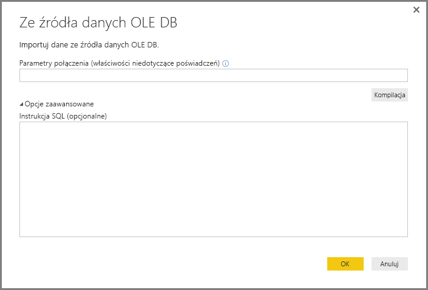
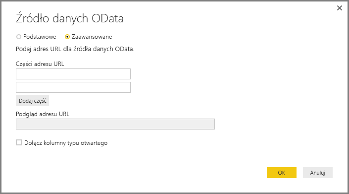
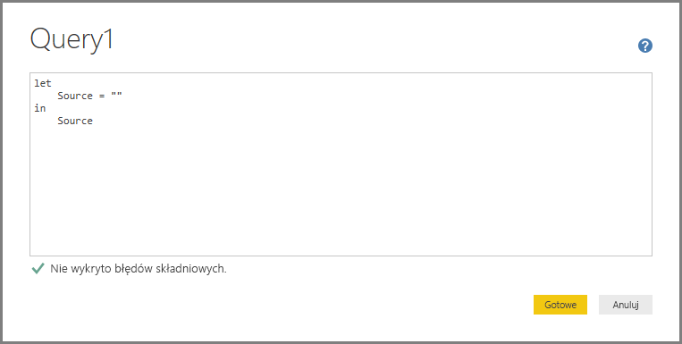
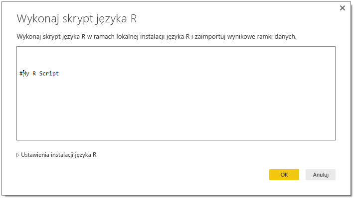

# Łączenie się z danymi przy użyciu interfejsów ogólnych w usłudze Power BI
Możesz połączyć się z wieloma różnymi źródłami danych w programie **Power BI Desktop**, korzystając z wbudowanych łączników obejmujących różne rozwiązania od **Baz danych programu Access** po zasoby **Zendesk**, jak pokazano w oknie **Pobieranie danych**. Aby rozszerzyć opcje łączności, możesz też nawiązać połączenie z różnymi *innymi* źródłami danych, korzystając z interfejsów ogólnych (np. **ODBC** lub **interfejsy API REST**) wbudowanych w program **Power BI Desktop**.

## Interfejsy danych programu Power BI Desktop
Program **Power BI Desktop** obejmuje nieustannie rozwijającą się kolekcję łączników danych, które zostały opracowane w celu nawiązywania połączenia z konkretnym źródłem danych. Na przykład łącznik danych **Lista programu SharePoint** zapewnia konkretne pola i informacje pomocnicze w sekwencji połączenia zaprojektowane z myślą o **listach programu SharePoint**, podobnie jak w przypadku innych źródeł danych wyświetlanych w oknie po wybraniu opcji **Pobierz dane > Więcej...** (pokazane na poprzedniej ilustracji).

Ponadto program **Power BI Desktop** umożliwia nawiązywanie połączenia ze źródłami danych, które nie zostały zidentyfikowane na listach okna **Pobieranie danych**, poprzez użycie jednego z następujących ogólnych interfejsów danych:

* **ODBC**
* **OLE DB**
* **OData**
* **Interfejsy API REST**
* **Skrypty języka R**

Poprzez podanie odpowiednich parametrów w oknach połączenia zapewnianych przez te ogólne interfejsy znacznie zwiększamy świat źródeł danych, do których można uzyskać dostęp i których można używać w programie **Power BI Desktop**.

W poniższych sekcjach możesz znaleźć listy źródeł danych, do których można uzyskać dostęp za pośrednictwem tych interfejsów ogólnych.

Nie możesz znaleźć źródła danych, którego chcesz użyć w programie **Power BI Desktop**? Prześlij swój pomysł na [listę pomysłów i próśb](https://ideas.powerbi.com/) zespołu usługi Power BI.

## Źródła danych dostępne za pośrednictwem interfejsu ODBC
Łącznik **ODBC** w programie **Power BI Desktop** umożliwia importowanie danych z dowolnego sterownika ODBC innej firmy poprzez określenie **nazwy źródła danych (DSN)** lub *parametrów połączenia*. Opcjonalnie możesz też określić instrukcję SQL do wykonania wobec sterownika ODBC.

Poniżej przedstawiono szczegółową listę z kilkoma przykładami źródeł danych, z którymi program **Power BI Desktop** może się połączyć przy użyciu interfejsu ogólnego **ODBC**.

| Ogólny łącznik programu Power BI Desktop | Zewnętrzne źródło danych | Link umożliwiający uzyskanie dodatkowych informacji |
| --- | --- | --- |
| ODBC |Cassandra |[Sterownik Cassandra ODBC](http://www.simba.com/drivers/cassandra-odbc-jdbc/) |
| ODBC |Couchbase DB |[Couchbase i usługa Power BI](https://powerbi.microsoft.com/en-us/blog/visualizing-data-from-couchbase-server-v4-using-power-bi/) |
| ODBC |DynamoDB |[Sterownik DynamoDB ODBC](http://www.simba.com/drivers/dynamodb-odbc-jdbc/) |
| ODBC |Google BigQuery |[Sterownik BigQuery ODBC](http://www.simba.com/drivers/bigquery-odbc-jdbc/) |
| ODBC |Hbase |[Sterownik Hbase ODBC](http://www.simba.com/drivers/hbase-odbc-jdbc/) |
| ODBC |Hive |[Sterownik Hive ODBC](http://www.simba.com/drivers/hive-odbc-jdbc/) |
| ODBC |IBM Netezza |[Informacje o IBM Netezza](https://www.ibm.com/support/knowledgecenter/SSULQD_7.2.1/com.ibm.nz.datacon.doc/c_datacon_plg_overview.html) |
| ODBC |Presto |[Sterownik Presto ODBC](http://www.simba.com/drivers/presto-odbc-jdbc/) |
| ODBC |Project Online |[Artykuł dotyczący Project Online](desktop-project-online-connect-to-data.md) |
| ODBC |Progress OpenEdge |[Wpis na blogu dotyczący sterownika Progress OpenEdge ODBC](https://na01.safelinks.protection.outlook.com/?url=https%3A%2F%2Fwww.progress.com%2Fblogs%2Fconnect-microsoft-power-bi-to-openedge-via-odbc-driver&data=02%7C01%7CMatt.Masson%40microsoft.com%7C5e63742e6c454308b58a08d4034b5923%7C72f988bf86f141af91ab2d7cd011db47%7C1%7C0%7C636137069555329811&sdata=gSu2Rq3vZ0uBVOgjaXxd8Y3uBf%2B8DidX6PG33jwAduY%3D&reserved=0) |

## Źródła danych dostępne za pośrednictwem interfejsu OLE DB
Łącznik **OLE DB** w programie **Power BI Desktop** umożliwia importowanie danych z dowolnego sterownika OLE DB innej firmy poprzez określenie *parametrów połączenia*. Opcjonalnie możesz też określić instrukcję SQL do wykonania wobec sterownika OLE DB.

Poniżej przedstawiono szczegółową listę z kilkoma przykładami źródeł danych, z którymi program **Power BI Desktop** może się połączyć przy użyciu interfejsu ogólnego **OLE DB**.

| Ogólny łącznik programu Power BI Desktop | Zewnętrzne źródło danych | Link umożliwiający uzyskanie dodatkowych informacji |
| --- | --- | --- |
| OLE DB |SAS OLE DB |[Dostawca SAS dla OLE DB](https://support.sas.com/downloads/package.htm?pid=648) |
| OLE DB |Sybase OLE DB |[Dostawca Sybase dla OLE DB](http://infocenter.sybase.com/help/index.jsp?topic=/com.sybase.infocenter.dc35888.1550/doc/html/jon1256941734395.html) |

## Źródła danych dostępne za pośrednictwem interfejsu OData
Łącznik **OData** w programie **Power BI Desktop** umożliwia importowanie danych z dowolnego adresu URL **OData** poprzez wpisanie lub wklejenie adresu URL **OData**. Możesz dodać wiele części adresu URL, wpisując lub wklejając te linki w polach tekstowych dostępnych w oknie **Źródło danych OData**.

Poniżej przedstawiono szczegółową listę z kilkoma przykładami źródeł danych, z którymi program **Power BI Desktop** może się połączyć przy użyciu interfejsu ogólnego **OData**.

| Ogólny łącznik programu Power BI Desktop | Zewnętrzne źródło danych | Link umożliwiający uzyskanie dodatkowych informacji |
| --- | --- | --- |
| OData |Już wkrótce |Wróć wkrótce, aby uzyskać informacje o źródłach danych OData |

## Źródła danych dostępne za pośrednictwem interfejsów API REST
Możesz połączyć się ze źródłami danych przy użyciu **interfejsów API REST** i używać danych ze wszystkich rodzajów źródeł danych, które obsługują architekturę **REST**.

Poniżej przedstawiono szczegółową listę z kilkoma przykładami źródeł danych, z którymi program **Power BI Desktop** może się połączyć przy użyciu interfejsów ogólnych **API REST**.

| Ogólny łącznik programu Power BI Desktop | Zewnętrzne źródło danych | Link umożliwiający uzyskanie dodatkowych informacji |
| --- | --- | --- |
| Interfejsy API REST |Couchbase DB |[Informacje o interfejsie API REST Couchbase](https://powerbi.microsoft.com/en-us/blog/visualizing-data-from-couchbase-server-v4-using-power-bi/) |

## Źródła danych dostępne za pośrednictwem skryptu języka R
Możesz użyć **skryptów języka R**, aby uzyskać dostęp do źródeł danych i używać tych danych w programie **Power BI Desktop**.

Poniżej przedstawiono szczegółową listę z kilkoma przykładami źródeł danych, z którymi program **Power BI Desktop** może się połączyć przy użyciu interfejsu ogólnego **Skrypty języka R**.

| Ogólny łącznik programu Power BI Desktop | Zewnętrzne źródło danych | Link umożliwiający uzyskanie dodatkowych informacji |
| --- | --- | --- |
| Skrypt języka R |Pliki SAS |[Wskazówki dotyczące skryptu języka R z sieci CRAN](https://cran.r-project.org/doc/manuals/R-data.html) |
| Skrypt języka R |Pliki SPSS |[Wskazówki dotyczące skryptu języka R z sieci CRAN](https://cran.r-project.org/doc/manuals/R-data.html) |
| Skrypt języka R |Pliki statystyczne języka R |[Wskazówki dotyczące skryptu języka R z sieci CRAN](https://cran.r-project.org/doc/manuals/R-data.html) |

## Następne kroki
Z poziomu programu **Power BI Desktop** możesz łączyć się ze źródłami danych różnego rodzaju. Więcej informacji na temat źródeł danych znajdziesz w następujących zasobach:

* [Co to jest Power BI Desktop?](desktop-what-is-desktop.md)
* [Źródła danych w programie Power BI Desktop](desktop-data-sources.md)
* [Kształtowanie i łączenie danych w programie Power BI Desktop](desktop-shape-and-combine-data.md)
* [Łączenie się ze skoroszytami programu Excel w programie Power BI Desktop](desktop-connect-excel.md)   
* [Wprowadzanie danych bezpośrednio w programie Power BI Desktop](desktop-enter-data-directly-into-desktop.md)   

