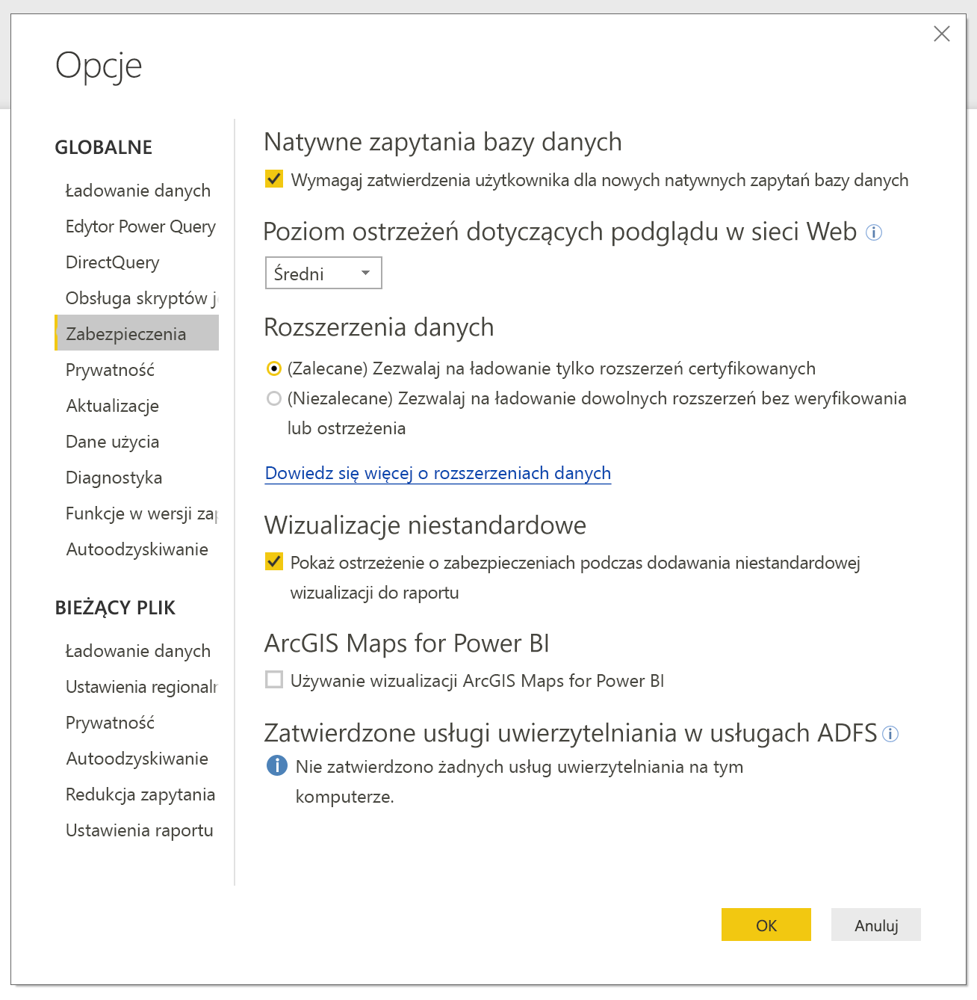
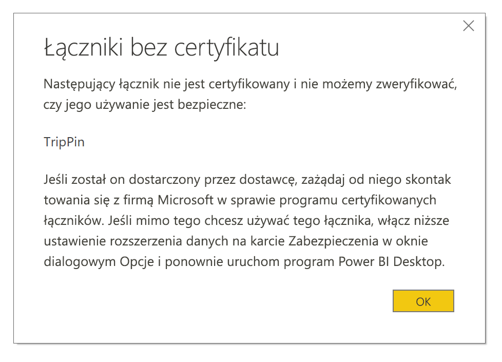

# Rozszerzalność łącznika w usłudze Power BI

W usłudze Power BI klienci i deweloperzy mogą rozszerzać źródła danych, z którymi mogą nawiązać połączenie na wiele sposobów, np. przy użyciu istniejących łączników i ogólnych źródeł danych (takich jak ODBC, OData, Oledb, CSV, XML, JSON lub internetowe źródło danych). Oprócz tych źródeł danych deweloperzy mogą tworzyć rozszerzenia danych nazywane **łącznikami niestandardowymi**, a także certyfikować łączniki, aby mogły one stać się **łącznikami certyfikowanymi**.

Obecnie możliwość używania **łączników niestandardowych** jest włączana za pomocą przełącznika funkcji. Zanim ta funkcja w wersji beta stanie się ogólnie dostępna, dodaliśmy menu pozwalające na bezpieczne kontrolowanie poziomu kodu niestandardowego, który może być uruchamiany w systemie: wszystkie łączniki niestandardowe lub tylko łączniki, które są certyfikowane i dystrybuowane przez firmę Microsoft w oknie dialogowym **Pobieranie danych**.

## Łączniki niestandardowe

**Łączniki niestandardowe** mogą być bardzo różne — od niewielkich interfejsów API, które mają kluczowe znaczenie dla Twojej firmy, do dużych usług branżowych, dla których firma Microsoft nie udostępniła łącznika. Wiele łączników jest dystrybuowanych przez samych dostawców, więc jeśli potrzebujesz użyć określonego łącznika danych, skontaktuj się z dostawcą.

Aby użyć **łącznika niestandardowego**, umieść go w folderze *\[Documents]\\Power BI Desktop\\Custom Connectors*, a następnie dostosuj ustawienia zabezpieczeń zgodnie z opisem w poniższej sekcji.

Do użycia **łączników certyfikowanych** nie jest konieczne dostosowywanie ustawień zabezpieczeń.

## Zabezpieczenia rozszerzenia danych

Aby zmienić ustawienia zabezpieczeń rozszerzenia danych w programie **Power BI Desktop**, wybierz pozycję **Plik > Opcje i ustawienia > Opcje > Zabezpieczenia**.

W obszarze **Rozszerzenia danych** możesz wybrać jeden z dwóch poziomów zabezpieczeń:

* (Zalecane) Zezwalaj na ładowanie tylko rozszerzeń certyfikowanych
* (Niezalecane) Zezwalaj na ładowanie wszystkich rozszerzeń bez ostrzeżenia

Jeśli planowane jest użycie **łączników niestandardowych** lub łączników utworzonych i dystrybuowanych przez Ciebie lub inną firmę, należy wybrać pozycję **„(Niezalecane) Zezwalaj na ładowanie wszystkich rozszerzeń bez ostrzeżenia”**. Nie zalecamy tego ustawienia zabezpieczeń, chyba że całkowicie ufasz swoim łącznikom niestandardowym, ponieważ znajdujący się w nich kod może obsługiwać poświadczenia (w tym wysyłać je za pośrednictwem protokołu HTTP) oraz ignorować poziomy prywatności.

Jeśli zostanie użyte ustawienie zabezpieczeń **„(Zalecane)”**, a w systemie istnieją łączniki niestandardowe, zostanie wyświetlony błąd z opisem łączników, których nie można załadować ze względu na zabezpieczenia.

Aby naprawić ten błąd i móc użyć takich łączników, należy zmienić ustawienia zabezpieczeń na wartość **„(Niezalecane)”** zgodnie z wcześniejszym opisem, a następnie ponownie uruchomić program **Power BI Desktop**.

## Łączniki certyfikowane

Ograniczony podzbiór rozszerzeń danych jest traktowany jako **certyfikowany** i takie certyfikowane łączniki są dostępne za pośrednictwem okna **Pobieranie danych**, ale za obsługę i pomoc techniczną nadal jest odpowiedzialna inna firma, która utworzyła łącznik. Firma Microsoft dystrybuuje takie łączniki, ale nie jest odpowiedzialna za ich wydajność ani nieprzerwane działanie.

Jeśli chcesz, aby łącznik niestandardowy uzyskał certyfikat, poproś swojego dostawcę o napisanie wiadomości na adres dataconnectors@microsoft.com.
