# Tworzenie relacji i zarządzanie nimi w programie Power BI Desktop
Gdy importujesz wiele tabel, istnieje prawdopodobieństwo, że wykonasz jakieś analizy z użyciem danych ze wszystkich tych tabel. Relacje między tymi tabelami są konieczne w celu dokładnego obliczenia wyników i wyświetlenia poprawnych informacji w raportach. Dzięki programowi Power BI Desktop tworzenie relacji jest łatwe. W większości przypadków nie musisz nawet nic robić, ponieważ wyręczy Cię funkcja Autowykrywanie. Jednak w niektórych przypadkach konieczne może być samodzielne utworzenie relacji lub wprowadzenie w niej pewnych zmian. W każdym razie ważne jest zrozumienie relacji w programie Power BI Desktop, a także poznanie sposobów ich tworzenia i edycji.

## Autowykrywanie podczas ładowania
Jeśli utworzysz zapytanie dotyczące co najmniej dwóch tabel jednocześnie, podczas ładowania danych program Power BI Desktop podejmie próbę znalezienia i utworzenia relacji. Właściwości Kardynalność, Kierunek filtrowania krzyżowego i Aktywne zostaną ustawione automatycznie. Program Power BI Desktop sprawdza nazwy kolumn w tabelach, których dotyczą Twoje zapytania, aby ustalić, czy istnieją jakieś potencjalne relacje. Jeśli tak, te relacje zostaną utworzone automatycznie. Jeśli program Power BI Desktop nie ustali z wysokim poziomem pewności, że istnieje dopasowanie, wówczas nie utworzy relacji automatycznie. W takim przypadku nadal można użyć okna dialogowego Zarządzanie relacjami w celu tworzenia i edytowania relacji.

## Tworzenie relacji przy użyciu autowykrywania
Na karcie **Narzędzia główne** kliknij polecenie **Zarządzanie relacjami** \> **Autowykrywanie**.

## Ręczne tworzenie relacji
1. Na karcie **Narzędzia główne** kliknij polecenie **Zarządzanie relacjami** \> **Nowy**.
2. W oknie dialogowym **Tworzenie relacji** z pierwszej listy rozwijanej tabel wybierz tabelę, a następnie wybierz kolumnę, której chcesz użyć w relacji.
3. Z drugiej listy rozwijanej tabel wybierz drugą tabelę, której chcesz użyć w relacji, a następnie wybierz drugą kolumnę do użycia i kliknij przycisk **OK**.

Domyślnie program Power BI Desktop automatycznie skonfiguruje właściwości Kardynalność (kierunek), Kierunek filtrowania krzyżowego oraz Aktywne dla nowej relacji, jednak można je w razie potrzeby zmienić. Aby dowiedzieć się więcej, zobacz sekcję Omówienie opcji dodatkowych w dalszej części tego artykułu.

Należy pamiętać, że jeśli żadna z tabel wybranych dla relacji nie zawiera unikatowych wartości, zostanie wyświetlony błąd informujący, że *jedna z tych kolumn musi zawierać unikatowe wartości*. Co najmniej jedna tabela w relacji *musi* zawierać odrębną, unikatową listę wartości klucza, co jest typowym wymogiem w przypadku wszystkich technologii relacyjnych baz danych. 

Jeśli wystąpi ten błąd, istnieje kilka sposobów, aby rozwiązać problem:

* Użyj opcji „Usuń zduplikowane wiersze”, aby utworzyć kolumnę o unikatowych wartościach. Wadą tego podejścia jest fakt, że spowoduje to utratę informacji podczas usuwania zduplikowanych wierszy, a często klucz (wiersz) jest zduplikowany w określonym celu.
* Dodaj tabelę pośrednią utworzoną z listy unikatowych wartości kluczy do modelu, który następnie zostanie połączony z obydwoma oryginalnymi kolumnami w relacji.

Aby uzyskać szczegółowe informacje, zobacz [wpis w blogu](https://blogs.technet.microsoft.com/cansql/2016/12/19/relationships-in-power-bi-fixing-one-of-the-columns-must-have-unique-values-error-message/) zawierający szczegółowe omówienie tego zagadnienia.

## Edycja relacji
1. Na karcie **Narzędzia główne** kliknij polecenie **Zarządzanie relacjami**.
2. W oknie dialogowym **Zarządzanie relacjami** wybierz relację, a następnie kliknij polecenie **Edytuj**.

## Konfigurowanie opcji dodatkowych
Podczas tworzenia lub edytowania relacji można skonfigurować opcje dodatkowe.  Domyślnie opcje dodatkowe są konfigurowane automatycznie w oparciu o najbardziej prawdopodobny wybór. W przypadku każdej relacji może być on różny i jest uzależniony od danych w kolumnach.

## Kardynalność
**Wiele do jednego (\*:1)** — jest to najbardziej typowy, domyślny typ. Oznacza, że kolumna w jednej tabeli może zawierać więcej niż jedno wystąpienie wartości, a druga, powiązana tabela — często nazywana tabelą odnośników — zawiera tylko jedno wystąpienie wartości.

**Jeden do jednego (1:1)** — oznacza, że kolumna w jednej tabeli zawiera tylko jedno wystąpienie określonej wartości, a druga, powiązana tabela również zawiera tylko jedno wystąpienie określonej wartości.

Więcej informacji o tym, kiedy zmienić kardynalność, zawiera sekcja Omówienie opcji dodatkowych w dalszej części tego artykułu.

## Kierunek filtrowania krzyżowego
**Oba** — jest to najbardziej typowy, domyślny kierunek. Oznacza, że na potrzeby filtrowania obie tabele są traktowane jak jedna tabela.  Dobrze się sprawdza w przypadku pojedynczej tabeli z szeregiem tabel odnośników.  Przykładem jest tabela rzeczywistej sprzedaży z tabelą odnośników dla każdego działu.  Taki układ jest często nazywany konfiguracją w schemacie gwiazdy (centralna tabela z kilkoma tabelami odnośników).  Jeśli jednak istnieją co najmniej dwie tabele, które również mają tabele odnośników (częściowo wspólne), wówczas użycie ustawienia Oba jest niewskazane.  W tym przypadku, kontynuując poprzedni przykład, mamy również tabelę budżetu, która zawiera rekordy budżetu docelowego dla każdego działu.  Tabela działu jest połączona z tabelą sprzedaży oraz tabelą budżetu.  W przypadku konfiguracji tego rodzaju należy unikać ustawienia Oba.

**Jeden** — oznacza, że opcje filtrowania w połączonych tabelach dotyczą tabeli, w której następuje agregacja wartości. W przypadku zaimportowania modelu danych z dodatku Power Pivot w programie Excel 2013 lub wcześniejszym wszystkie relacje będą miały jeden kierunek. 

Więcej informacji o tym, kiedy zmienić kierunek filtrowania krzyżowego, zawiera sekcja Omówienie opcji dodatkowych w dalszej części tego artykułu.

## Aktywuj tę relację
Jeśli ta opcja jest zaznaczona, relacja pełni rolę aktywnej, domyślnej relacji.  Gdy między dwiema tabelami istnieje więcej niż jedna relacja, aktywna relacja umożliwia programowi Power BI Desktop automatyczne tworzenie wizualizacji, które uwzględniają obie tabele.

Więcej informacji o tym, kiedy ustawić konkretną relację jako aktywną, zawiera sekcja Omówienie opcji dodatkowych w dalszej części tego artykułu.

## Omówienie relacji
Po połączeniu dwóch tabel relacją można pracować z danymi w obu tabelach w taki sposób, jakby były w jednej tabeli, dzięki czemu nie trzeba zajmować się szczegółami relacji ani przekształcać tych tabel w jedną przed zaimportowaniem.  W wielu sytuacjach program Power BI Desktop może tworzyć relacje automatycznie, dlatego samodzielne tworzenie relacji może być niepotrzebne. Jeśli program Power BI Desktop nie może ustalić z wysokim poziomem pewności, że relacja między dwiema tabelami powinna istnieć, wówczas nie utworzy relacji automatycznie. W takim przypadku konieczne będzie utworzenie relacji.   

Wykonamy teraz zadania z krótkiego samouczka, który pozwoli Ci lepiej zrozumieć działanie relacji w programie Power BI Desktop.

>[!TIP]
>Tę lekcję możesz ukończyć samodzielnie. Skopiuj poniższą tabelę ProjectHours do arkusza programu Excel, zaznacz wszystkie komórki, a następnie kliknij polecenie **WSTAW** \> **Tabela**. W oknie dialogowym **Tworzenie tabeli** po prostu kliknij przycisk **OK**. Następnie w polu **Nazwa tabeli** wpisz **ProjectHours**. Te same czynności wykonaj w odniesieniu do tabeli CompanyProject. Następnie możesz zaimportować dane, używając polecenia **Pobierz dane** w programie Power BI Desktop. Wybierz skoroszyt i tabele jako źródło danych.

Pierwsza tabela, ProjectHours, stanowi ewidencję czasu pracy zawierającą liczbę godzin przepracowanych przez daną osobę w ramach konkretnego projektu.  

**ProjectHours**

| **Ticket** | **SubmittedBy** | **Hours** | **Project** | **DateSubmit** |
| ---:|:--- | ---:|:--- | ---:|
| 1001 |Brewer, Alan |22 |Blue |1/1/2013 |
| 1002 |Brewer, Alan |26 |Red |2/1/2013 |
| 1003 |Ito, Shu |34 |Yellow |12/4/2012 |
| 1004 |Brewer, Alan |13 |Orange |1/2/2012 |
| 1005 |Bowen, Eli |29 |Purple |10/1/2013 |
| 1006 |Bento, Nuno |35 |Green |2/1/2013 |
| 1007 |Hamilton, David |10 |Yellow |10/1/2013 |
| 1008 |Han, Mu |28 |Orange |1/2/2012 |
| 1009 |Ito, Shu |22 |Purple |2/1/2013 |
| 1010 |Bowen, Eli |28 |Green |10/1/2013 |
| 1011 |Bowen, Eli |9 |Blue |10/15/2013 |

Druga tabela, CompanyProject, jest listą projektów z przypisanymi priorytetami A, B lub C. 

**CompanyProject**

| **ProjName** | **Priority** |
| --- | --- |
| Blue |A |
| Red |B |
| Green |C |
| Yellow |C |
| Purple |B |
| Orange |C |

Zwróć uwagę na to, że każda tabela zawiera kolumnę projektu. Nazwy każdej z nich różnią się nieznacznie, ale wartości prawdopodobnie są takie same. Jest to ważne i niebawem do tego wrócimy.

Po zaimportowaniu obu tabel do modelu możemy utworzyć raport. Najpierw chcemy uzyskać liczbę zgłoszonych godzin według priorytetu projektu, dlatego w obszarze Pola wybieramy pozycje **Priority** i **Hours**.

 

W tabeli na kanwie Raport widać, że liczba godzin to **256** dla każdego projektu. Jest to też łączna liczba godzin. Bez wątpienia te liczby są niepoprawne. Dlaczego? Ponieważ nie możemy obliczyć sumy wartości z jednej tabeli (Hours w tabeli ProjectHours) podzielonej według wartości z innej tabeli (Priority w tabeli CompanyProject) bez relacji między tymi dwiema tabelami.

Zatem utwórzmy relację między tymi dwiema tabelami.

Pamiętasz te kolumny z nazwami projektów, które widzieliśmy w obu tabelach, a których wartości wyglądały podobnie? Użyjemy tych dwóch kolumn, aby utworzyć relację między naszymi tabelami.

Dlaczego te kolumny? Kolumna Project w tabeli ProjectHours zawiera wartości takie jak Blue, Red, Yellow, Orange itp. Kilka wierszy zawiera nawet tę samą wartość. W efekcie mamy wiele wartości kolorów w kolumnie Project.

W kolumnie ProjName tabeli CompanyProject widzimy, że każda wartość koloru dla projektu występuje tylko jeden raz. Każda wartość koloru w tej tabeli jest unikatowa i jest to ważne, ponieważ dzięki temu możemy utworzyć relację między tymi dwiema tabelami. W tym przypadku będzie to relacja wiele do jednego. W relacji wiele do jednego co najmniej jedna kolumna w jednej z tabel musi zawierać unikatowe wartości. W przypadku niektórych relacji istnieją pewne dodatkowe opcje, którymi zajmiemy się później. Teraz utworzymy relację między kolumnami Project w każdej z naszych dwóch tabel.

### Aby utworzyć nową relację
1. Kliknij opcję **Zarządzanie relacjami**.
2. W obszarze **Zarządzanie relacjami** kliknij opcję **Nowy**. Spowoduje to otwarcie okna dialogowego **Tworzenie relacji**, w którym można wybrać tabele, kolumny i dowolne ustawienia dodatkowe dla relacji.
3. W pierwszej tabeli wybierz pozycję **ProjectHours**, a następnie wybierz kolumnę **Project**. To jest strona „wiele” naszej relacji.
4. W drugiej tabeli wybierz pozycję **CompanyProject**, a następnie wybierz kolumnę **ProjName**. To jest strona „jeden” naszej relacji.  
5. Kliknij przycisk **OK** w oknie dialogowym **Tworzenie relacji** i oknie dialogowym **Zarządzanie relacjami**.

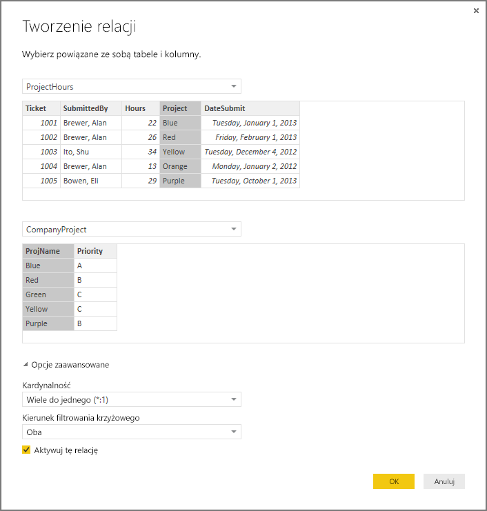

Aby wszystko było jasne, musimy przyznać, że ten sposób to niepotrzebne komplikowanie tworzenia relacji. Wystarczyło kliknąć przycisk Autowykrywanie w oknie dialogowym Zarządzanie relacjami. Prawdę mówiąc, autowykrywanie wykonałoby wszystkie te operacje podczas ładowania danych, gdyby obie kolumny miały tę samą nazwę. Ale co to za wyzwanie?

Teraz przyjrzymy się ponownie tabeli na naszej kanwie Raport.

 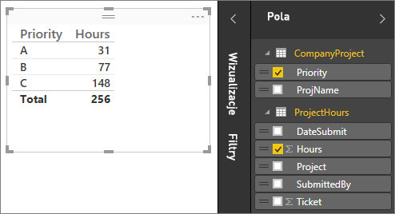

Wygląda o wiele lepiej, prawda?

W przypadku sumowania godzin według priorytetu (Priority) program Power BI Desktop wyszuka każde wystąpienie unikatowej wartości koloru w tabeli odnośników CompanyProject, a następnie wyszuka każde wystąpienie tych wartości w tabeli ProjectHours, po czym obliczy sumę dla każdej unikatowej wartości.

Poszło całkiem sprawnie, a dzięki autowykrywaniu mogłoby pójść jeszcze sprawniej.

## Omówienie opcji dodatkowych
Podczas tworzenia relacji — z użyciem autowykrywania lub ręcznie — program Power BI Desktop automatycznie konfiguruje opcje dodatkowe na podstawie danych zawartych w tabelach. Możesz skonfigurować te dodatkowe właściwości relacji znajdujące się w najniższej części okna dialogowego Tworzenie/Edytowanie relacji.

 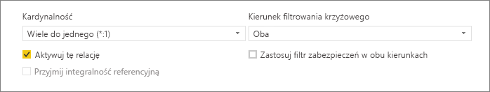

Jak już mówiliśmy, te właściwości są zwykle ustawiane automatycznie i nie ma potrzeby ingerowania w te ustawienia. Istnieje jednak kilka sytuacji, w których konieczne może być samodzielne skonfigurowanie opcji dodatkowych.

## Przyszłe aktualizacje danych wymagają innej kardynalności
Zwykle program Power BI Desktop automatycznie określa najlepszą kardynalność dla relacji.  Jeśli zachodzi potrzeba zastąpienia automatycznego ustawienia, ponieważ wiadomo, że dane ulegną zmianie w przyszłości, można wybrać odpowiednie ustawienie w kontrolce Kardynalność. Przyjrzyjmy się jednemu przykładowi, w którym konieczne jest wybranie innej kardynalności.

Poniższa tabela CompanyProjectPriority jest listą wszystkich projektów firmowych i ich priorytetów. Tabela ProjectBudget jest zestawem projektów, dla których został zatwierdzony budżet.

**ProjectBudget**

| **Approved Projects** | **BudgetAllocation** | **AllocationDate** |
|:--- | ---:| ---:|
| Blue |40 000 |12/1/2012 |
| Red |100 000 |12/1/2012 |
| Green |50 000 |12/1/2012 |

**CompanyProjectPriority**

| **Project** | **Priority** |
| --- | --- |
| Blue |A |
| Red |B |
| Green |C |
| Yellow |C |
| Purple |B |
| Orange |C |

Jeśli utworzymy relację między kolumną Project w tabeli CompanyProjectPriority a kolumną ApprovedProjects w tabeli ProjectBudget w sposób przedstawiony poniżej:

 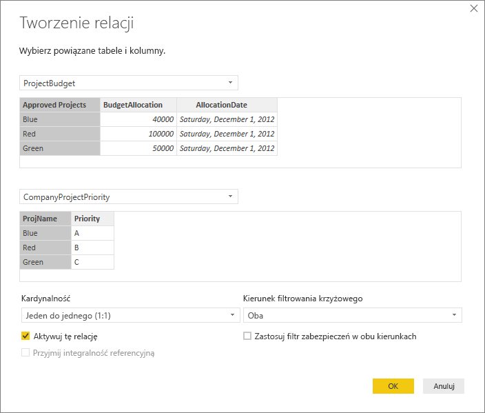

Kardynalność zostanie automatycznie ustawiona na wartość Jeden do jednego (1:1), a filtrowanie krzyżowe na wartość Oba (jak pokazano).  To dlatego, że dla programu Power BI Desktop najlepsza kombinacja tych dwóch tabel wygląda następująco:

| **Project** | **Priority** | **BudgetAllocation** | **AllocationDate** |
|:--- | --- | ---:| ---:|
| Blue |A |40 000 |12/1/2012 |
| Red |B |100 000 |12/1/2012 |
| Green |C |50 000 |12/1/2012 |
| Yellow |C |  |  |
| Purple |B |  |  |
| Orange |C |  |  |

Między tymi dwiema tabelami istnieje relacja jeden do jednego, ponieważ kolumna Project połączonej tabeli nie zawiera powtarzających się wartości. Kolumna Project jest unikatowa, ponieważ każda wartość występuje w niej tylko raz, dlatego wiersze z obu tabel mogą zostać połączone bezpośrednio bez duplikowania.

Jednak załóżmy, że wiesz, że dane ulegną zmianie po następnym odświeżeniu. Odświeżona wersja tabeli ProjectBudget zawiera dodatkowe wiersze dla projektów Blue i Red:

**ProjectBudget**

| **Approved Projects** | **BudgetAllocation** | **AllocationDate** |
| --- | ---:| ---:|
| Blue |40 000 |12/1/2012 |
| Red |100 000 |12/1/2012 |
| Green |50 000 |12/1/2012 |
| Blue |80 000 |6/1/2013 |
| Red |90 000 |6/1/2013 |

 Oznacza to, że najlepsza kombinacja tych dwóch tabel teraz wygląda następująco: 

| **Project** | **Priority** | **BudgetAllocation** | **AllocationDate** |
| --- | --- | ---:| ---:|
| Blue |A |40 000 |12/1/2012 |
| Red |B |100 000 |12/1/2012 |
| Green |C |50 000 |12/1/2012 |
| Yellow |C |  |  |
| Purple |B |  |  |
| Orange |C |  |  |
| Blue |A |80 000 |6/1/2013 |
| Red |B |90 000 |6/1/2013 |

W tej nowej połączonej tabeli kolumna Project zawiera powtarzające się wartości.  Gdy tabela zostanie odświeżona, dwie pierwotne tabele nie będą połączone relacją jeden do jednego. Ponieważ w tym przypadku wiemy, że przyszłe aktualizacje spowodują duplikaty w kolumnie Project, chcemy ustawić właściwość Kardynalność na wartość Wiele do jednego (\*:1), przy czym stroną „wiele” będzie tabela ProjectBudget, a stroną „jeden” — CompanyProjectPriority.

## Dostosowywanie kierunku filtrowania krzyżowego dla złożonego zestawu tabel i relacji
W przypadku większości relacji kierunek filtrowania krzyżowego jest ustawiony na wartość „Oba”.  Istnieją jednak pewne mniej typowe sytuacje, w których może pojawić się potrzeba zastosowania ustawienia innego niż domyślne, na przykład w przypadku importowania modelu ze starszej wersji dodatku Power Pivot, w którym każda relacja jest ustawiona na jeden kierunek. 

Ustawienie Oba umożliwia programowi Power BI Desktop traktowanie wszystkich aspektów połączonych tabel w taki sposób, jakby były jedną tabelą.  Jednak w niektórych sytuacjach program Power BI Desktop nie może jednocześnie ustawić kierunku filtrowania krzyżowego na wartość „Oba” i zachować jednoznacznego zestawu ustawień domyślnych dostępnych na potrzeby raportowania. Jeśli kierunek filtrowania krzyżowego relacji nie jest ustawiony na wartość Oba, najczęstszą przyczyną jest to, że takie ustawienie spowodowałoby powstanie niejednoznaczności.  Jeśli dane ustawienie filtrowania krzyżowego nie działa w danym przypadku, spróbuj ustawić je na konkretną tabelę lub wybrać ustawienie Oba.

Filtrowanie krzyżowe w jednym kierunku działa w wielu sytuacjach.  W przypadku zaimportowania modelu z dodatku Power Pivot w programie Excel 2013 lub wcześniejszym wszystkie relacje zostaną ustawione na jeden kierunek.  Jeden kierunek oznacza, że opcje filtrowania w połączonych tabelach dotyczą tabeli, w której odbywa się agregowanie.  Czasami zrozumienie filtrowania krzyżowego może być trudne, dlatego przyjrzyjmy się przykładowi.

 

W przypadku filtrowania krzyżowego w jednym kierunku, jeśli utworzysz raport, który podsumowuje godziny projektów, możesz wybrać podsumowanie (lub filtrowanie) według kolumny Priority z tabeli CompanyProject lub kolumny City z tabeli CompanyEmployee.   Jeśli jednak zechcesz policzyć liczbę pracowników w każdym projekcie (rzadziej występujące pytanie), to rozwiązanie nie zadziała. Otrzymasz kolumnę wartości, które będą takie same.  W poniższym przykładzie kierunek filtrowania krzyżowego obu relacji jest ustawiony na jeden kierunek — do tabeli ProjectHours:

 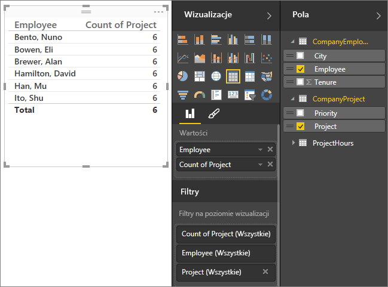

Specyfikacja filtru będzie przepływać z tabeli CompanyProject do tabeli ProjectHours (co przedstawia powyższa ilustracja), ale nie będzie przepływać do tabeli CompanyEmployee.  Jednak jeśli ustawisz kierunek filtrowania krzyżowego na wartość Oba, wszystko będzie działać prawidłowo.  Ustawienie Oba pozwoli na przepływ specyfikacji filtru do kolumny Employee.

 

Po ustawieniu kierunku filtrowania krzyżowego na wartość Oba nasz raport jest teraz poprawny:

 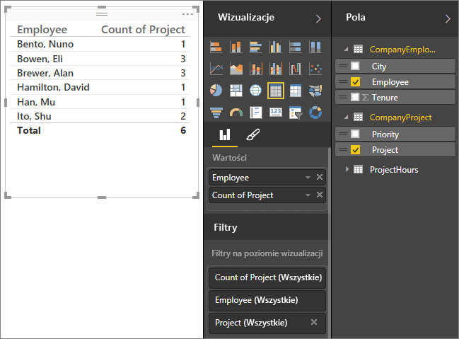

Filtrowanie krzyżowe w obu kierunkach działa dobrze dla wzorca relacji tabel, który przypomina powyższy wzorzec. Najczęściej taki wzorzec jest nazywany schematem gwiazdy:

 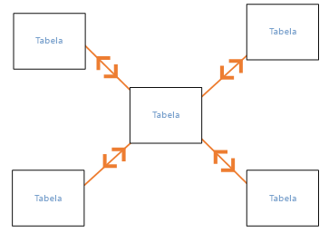

Kierunek filtrowania krzyżowego nie działa dobrze z bardziej ogólnym wzorcem, który często występuje w bazach danych, przedstawionym na poniższym diagramie:

 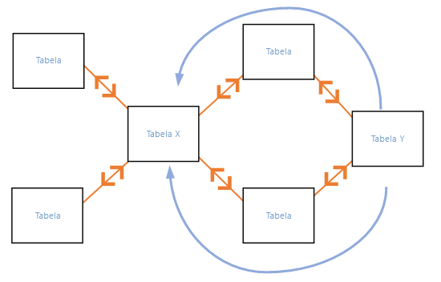

Jeśli masz wzorzec tabel podobny do powyższego, z pętlami, filtrowanie krzyżowe może spowodować powstanie niejednoznacznego zestawu relacji. Jeśli na przykład obliczysz sumę pola z tabeli TableX, a następnie wykonasz filtrowanie według pola z tabeli TableY, nie będzie jasne, którędy powinno odbywać się filtrowanie — przez górną czy dolną tabelę. Typowy przykład wzorca tego rodzaju jest następujący: tabela TableX jest tabelą sprzedaży i zawiera dane rzeczywiste, a tabela TableY zawiera dane budżetu. Tabele w środku są tabelami odnośników zawierającymi na przykład dane o działach lub regionach, z których korzystają obie te tabele. 

Podobnie jak w przypadku relacji aktywnych/nieaktywnych, program Power BI Desktop nie zezwoli na ustawienie relacji Oba, jeśli mogłoby to spowodować niejednoznaczność w raportach. Istnieje kilka sposobów na poradzenie sobie z tym problemem, a oto dwa najczęściej stosowane:

* Usunięcie relacji lub oznaczenie ich jako nieaktywnych, aby ograniczyć niejednoznaczność. Wtedy być może uda się ustawić filtrowanie krzyżowe relacji na wartość Oba.
* Dwukrotne wprowadzenie tabeli (z inną nazwą za drugim razem), aby wyeliminować pętle.  Dzięki temu wzorzec relacji będzie przypominał schemat gwiazdy.  Schemat gwiazdy umożliwia ustawienie wszystkich relacji na wartość Oba.

## Niewłaściwa aktywna relacja
Gdy program Power BI Desktop automatycznie tworzy relacje, czasami napotyka więcej niż jedną relację między dwiema tabelami.  W takiej sytuacji tylko jedna relacja jest ustawiana jako aktywna.  Aktywna relacja pełni rolę relacji domyślnej, aby w przypadku wybrania pól z dwóch różnych tabel program Power BI Desktop mógł automatycznie utworzyć wizualizację.  Jednak w niektórych przypadkach automatycznie wybrana relacja może być nieprawidłowa.  W oknie dialogowym Zarządzanie relacjami można ustawić relację jako aktywną lub nieaktywną. Aktywną relację można także ustawić w oknie dialogowym Edytowanie relacji. 

Aby zapewnić istnienie relacji domyślnej, program Power BI Desktop zezwala tylko na jedną aktywną relację między dwiema tabelami w danym momencie.  Dlatego najpierw należy ustawić bieżącą relację jako nieaktywną, a następnie ustawić relację, która ma być aktywna.

Spójrzmy na przykład. Pierwsza tabela ma nazwę ProjectTickets, a następna — EmployeeRole.

**ProjectTickets**

| **Ticket** | **OpenedBy** | **SubmittedBy** | **Hours** | **Project** | **DateSubmit** |
| ---:|:--- |:--- | ---:|:--- | ---:|
| 1001 |Perham, Tom |Brewer, Alan |22 |Blue |1/1/2013 |
| 1002 |Roman, Daniel |Brewer, Alan |26 |Red |2/1/2013 |
| 1003 |Roth, Daniel |Ito, Shu |34 |Yellow |12/4/2012 |
| 1004 |Perham, Tom |Brewer, Alan |13 |Orange |1/2/2012 |
| 1005 |Roman, Daniel |Bowen, Eli |29 |Purple |10/1/2013 |
| 1006 |Roth, Daniel |Bento, Nuno |35 |Green |2/1/2013 |
| 1007 |Roth, Daniel |Hamilton, David |10 |Yellow |10/1/2013 |
| 1008 |Perham, Tom |Han, Mu |28 |Orange |1/2/2012 |
| 1009 |Roman, Daniel |Ito, Shu |22 |Purple |2/1/2013 |
| 1010 |Roth, Daniel |Bowen, Eli |28 |Green |10/1/2013 |
| 1011 |Perham, Tom |Bowen, Eli |9 |Blue |10/15/2013 |

**EmployeeRole**

| **Employee** | **Role** |
| --- | --- |
| Bento, Nuno |Project Manager |
| Bowen, Eli |Project Lead |
| Brewer, Alan |Project Manager |
| Hamilton, David |Project Lead |
| Han, Mu |Project Lead |
| Ito, Shu |Project Lead |
| Perham, Tom |Project Sponsor |
| Roman, Daniel |Project Sponsor |
| Roth, Daniel |Project Sponsor |

W tym przypadku istnieją dwie relacje. Jedna między kolumną SubmittedBy tabeli ProjectTickets i kolumną Employee tabeli EmployeeRole, a druga między kolumną OpenedBy tabeli ProjectTickets a kolumną Employee tabeli EmployeeRole.

 

Jeśli dodamy obie te relacje do modelu (najpierw relację z kolumną OpenedBy), w oknie dialogowym Zarządzanie relacjami aktywna będzie relacja z kolumną OpenedBy:

 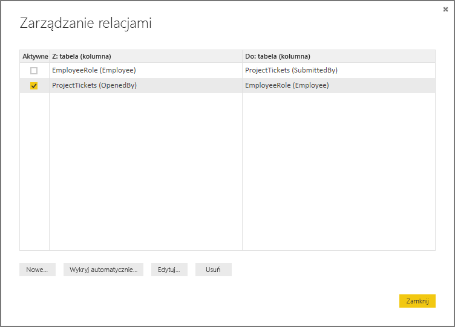

Jeśli teraz utworzymy raport korzystający z pól Role i Employee z tabeli EmployeeRole oraz pola Hours z tabeli ProjectTickets w wizualizacji tabeli na kanwie Raport, zobaczymy tylko pracowników przypisanych do roli sponsorów projektu (Project Sponsor), ponieważ tylko oni otworzyli zgłoszenie dotyczące projektu.

 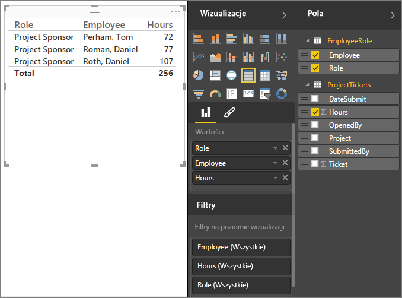

Możemy zmienić aktywną relację na relację z kolumną SubmittedBy zamiast z kolumną OpenedBy. W oknie dialogowym Zarządzanie relacjami usuwamy zaznaczenie relacji ProjectTickets(OpenedBy) z EmployeeRole(Employee), a następnie zaznaczamy relację ProjectTickets(SubmittedBy) z EmployeeRole(Employee).

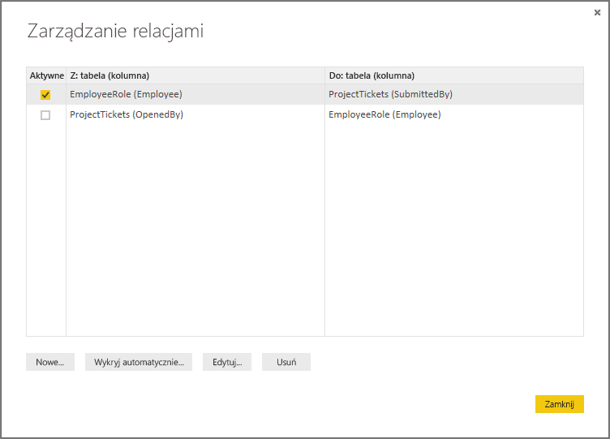

## Wyświetlanie wszystkich relacji w widoku relacji
Czasami model obejmuje wiele tabel i złożone relacje między nimi. Widok relacji w programie Power BI Desktop przedstawia wszystkie relacje w modelu wraz z kierunkami i kardynalnością w przejrzystym i dostosowywalnym diagramie. Aby dowiedzieć się więcej, zobacz [Widok relacji w programie Power BI Desktop](desktop-relationship-view.md).

