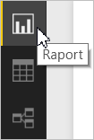
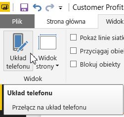
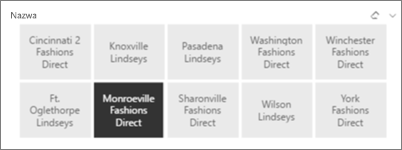
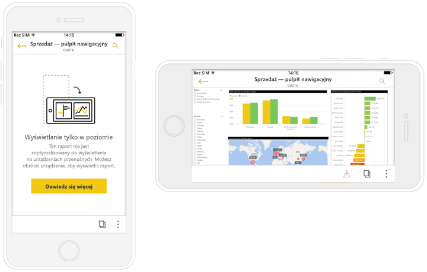

# Tworzenie raportów zoptymalizowanych pod kątem aplikacji Power BI na telefony
Podczas [tworzenia raportu w programie Power BI Desktop](desktop-report-view.md) można ulepszyć korzystanie z niego w aplikacjach mobilnych na telefony przez utworzenie wersji raportu przystosowanej specjalnie do telefonów. Zmieniając rozmieszczenie i rozmiar — chociaż może nie wszystkich — wizualizacji, można przystosować raport do telefonu i zoptymalizować sposób używania go. Ponadto można tworzyć [*dynamiczne* wizualizacje](#optimize-a-visual-for-any-size) i [dynamiczne fragmentatory](#enhance-slicers-to-to-work-well-in-phone-reports), które dostosowują swój rozmiar, gdy są wyświetlane w telefonie. Oprócz tego po dodaniu filtrów do raportu filtry te będą automatycznie wyświetlane w raporcie na telefon. Czytelnicy raportu mogą je widzieć i filtrować raport za ich pomocą.

## Układ strony raportu dla telefonu w programie Power BI Desktop
Po [utworzeniu raportu w programie Power BI Desktop](desktop-report-view.md) można przeprowadzić jego optymalizację pod kątem telefonów.

1. W programie Power BI Desktop wybierz pozycję **Widok raportu** na pasku nawigacyjnym po lewej stronie.
   
    
2. Na karcie **Widok** wybierz pozycję **Układ telefonu**.  
   
    
   
    Zostanie wyświetlona pusta kanwa telefonu. Wszystkie wizualizacje ze strony oryginalnego raportu są wyświetlane w okienku Wizualizacje po prawej stronie.
3. Aby dodać wizualizację do układu telefonu, przeciągnij ją z okienka Wizualizacje na kanwę telefonu.
   
    Raporty na telefon używają układu siatki. Gdy przeciągasz wizualizacje na kanwę, są one przyciągane do siatki.
   
    
   
    Do strony raportu na telefon możesz dodać niektóre lub wszystkie wizualizacje ze strony głównego raportu. Każdą wizualizację można dodać tylko raz.
4. Rozmiar wizualizacji na siatce można zmieniać podobnie jak w przypadku kafelków na pulpitach nawigacyjnych i mobilnych pulpitach nawigacyjnych.
   
   > [!NOTE]
   > Siatka raportu na telefon przystosowuje się do różnych rozmiarów telefonów, więc raport będzie wyglądać dobrze zarówno na telefonie z małym, jak i dużym ekranem.
   > 
   > 
   
   

## Optymalizacja wizualizacji pod kątem dowolnej wielkości
Można ustawić wizualizację na pulpicie nawigacyjnym lub w raporcie na opcję *Elastyczna*, aby zmieniała się dynamicznie i wyświetlała maksymalną ilość danych i szczegółowych informacji niezależnie od rozmiaru ekranu. 

Gdy wizualizacja zmienia rozmiar, usługa Power BI nadaje priorytet widokowi danych, na przykład usuwając dopełnienia i automatycznie przenosząc legendę na górę wizualizacji, tak aby wizualizacja dostarczała odpowiednią ilość informacji, nawet gdy się zmniejszy.

Włączenie lub wyłączenie elastyczności każdej wizualizacji zależy od użytkownika. Dowiedz się więcej na temat [optymalizacji wizualizacji](desktop-create-responsive-visuals.md).

## Zagadnienia dotyczące tworzenia układów raportu na telefon
* W przypadku raportów o wielu stronach można zoptymalizować wszystkie strony lub tylko niektóre. 
* Jeśli kolor tła strony raportu został określony, raport na telefon będzie miał taki sam kolor tła.
* Nie można modyfikować ustawień formatowania tylko dla telefonu. Formatowanie jest wspólne dla głównego i mobilnego układu. Na przykład rozmiary czcionek będą takie same.
* Aby wprowadzić zmiany w wizualizacji, na przykład zmienić formatowanie, zestaw danych, filtry lub inny atrybut, wróć do zwykłego trybu tworzenia raportów.
* Usługa Power BI dostarcza domyślne tytuły i nazwy stron dla raportów na telefon w aplikacji mobilnej. Jeśli utworzono wizualizacje tekstowe dla tytułów i nazw stron w raporcie, rozważ rezygnację z dodawania ich do raportów na telefon.     

## Usuwanie wizualizacji z układu na telefon
* Aby usunąć wizualizację, kliknij przycisk X w prawym górnym rogu wizualizacji na kanwie telefonu lub zaznacz ją i wybierz pozycję **Usuń**.
  
   Usunięcie wizualizacji w tym miejscu powoduje jej usunięcie wyłącznie na kanwie układu telefonu. Działanie to nie ma wpływu na wizualizację i oryginalny raport.
  
   

## Ulepszanie fragmentatorów w celu zapewnienia ich prawidłowego działania w raportach na telefon
Fragmentatory oferują filtrowanie danych raportu na kanwie. Podczas projektowania fragmentatorów w zwykłym trybie tworzenia raportów można zmodyfikować niektóre ustawienia fragmentatorów, aby były bardziej użyteczne w raportach na telefon:

* Zdecyduj, czy czytelnicy raportu mogą wybierać tylko jeden czy więcej niż jeden element.
* Umieść ramkę wokół fragmentatora, aby ułatwić przeglądanie raportu.
* Ustaw fragmentator w pionie, w poziomie lub jako *dynamiczny*. 

Jeśli ustawisz fragmentator jako dynamiczny, zmiana jego kształtu i rozmiaru będzie powodować wyświetlanie większej lub mniejszej liczby opcji. Fragmentator może być długi, krótki, szeroki lub wąski. Jeśli odpowiednio go zmniejszysz, stanie się jedynie ikoną filtru na stronie raportu. 

Przeczytaj więcej na temat [tworzenia fragmentatorów dynamicznych](power-bi-slicer-filter-responsive.md).

## Publikowanie raportu na telefon
* Aby opublikować raport w wersji na telefon, można [opublikować główny raport z programu Power BI Desktop do usługi Power BI](desktop-upload-desktop-files.md), a wersja na telefon zostanie opublikowana w tym samym czasie.
  
    Dowiedz się więcej o [udostępnianiu i uprawnieniach w usłudze Power BI](service-how-to-collaborate-distribute-dashboards-reports.md).

## Wyświetlanie zoptymalizowanych i niezoptymalizowanych raportów na telefonie
W aplikacjach mobilnych na telefony usługa Power BI automatycznie wykrywa zoptymalizowane i niezoptymalizowane raporty na telefon. Jeśli dostępny jest raport zoptymalizowany pod kątem telefonu, aplikacja Power BI na telefon automatycznie otwiera raport w trybie raportu na telefon.

Jeśli nie jest dostępny żaden raport zoptymalizowany pod kątem telefonu, raporty będą otwierane w niezoptymalizowanym widoku poziomym.  

Podczas wyświetlania raportu na telefon zmiana orientacji telefonu na poziomą spowoduje otwarcie raportu w niezoptymalizowanym widoku z oryginalnym układem raportu bez względu na to, czy raport jest zoptymalizowany, czy nie.

Jeśli zoptymalizowane są tylko niektóre strony, w widoku pionowym czytelnicy zobaczą komunikat informujący, że raport jest dostępny w widoku poziomym.

Czytelnik raportu może obrócić telefon na bok, aby wyświetlić stronę w widoku poziomym. Dowiedz się więcej na temat [podejmowania interakcji z raportami usługi Power BI zoptymalizowanymi pod kątem telefonu](mobile-apps-view-phone-report.md).

## Następne kroki
* [Tworzenie widoku pulpitu nawigacyjnego dla telefonu w usłudze Power BI](service-create-dashboard-mobile-phone-view.md)
* [Wyświetlanie raportów usługi Power BI zoptymalizowanych pod kątem telefonu](mobile-apps-view-phone-report.md)
* [Tworzenie elastycznych wizualizacji zoptymalizowanych pod kątem dowolnego rozmiaru](desktop-create-responsive-visuals.md)
* Masz więcej pytań? [Zadaj pytanie społeczności usługi Power BI](http://community.powerbi.com/)

