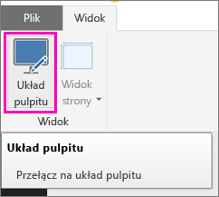
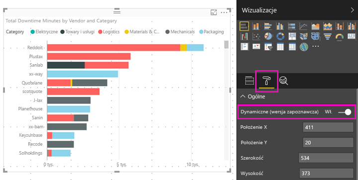

# Optymalizacja wizualizacji usługi Power BI pod kątem dowolnej wielkości
Można ustawić wizualizację na pulpicie nawigacyjnym lub w raporcie na opcję *Elastyczna*, aby zmieniała się dynamicznie i wyświetlała maksymalną ilość danych i szczegółowych informacji niezależnie od rozmiaru ekranu.

Gdy wizualizacja zmienia rozmiar, usługa Power BI nadaje priorytet widokowi danych, na przykład usuwając dopełnienia i automatycznie przenosząc legendę na górę wizualizacji, tak aby wizualizacja dostarczała odpowiednią ilość informacji, nawet gdy się zmniejszy. Elastyczność jest szczególnie przydatna w przypadku wizualizacji w aplikacji mobilnej Power BI na telefonach.

Elastyczność można włączyć dla dowolnej wizualizacji zawierającej osie X i Y oraz fragmentatory.

## Włączanie elastyczności w programie Power BI Desktop
1. W programie Power BI Desktop na karcie **Widok** upewnij się, że jesteś w obszarze **Układ pulpitu**.
   
    
2. Wybierz wizualizację, a następnie w okienku **Wizualizacje** wybierz sekcję **Format**.
3. Rozwiń listę **Ogólne** i przesuń suwak **Elastyczna** w położenie **Włącz**.
   
    
   
     Teraz gdy [utworzysz raport zoptymalizowany na potrzeby telefonu](desktop-create-phone-report.md) i dodasz tę wizualizację, będzie ona bez problemu zmieniała rozmiar.

## Włączanie elastyczności w usłudze Power BI
Włączasz elastyczność dla wizualizacji w raporcie w usłudze Power BI. Musisz mieć możliwość edytowania raportu.

1. W raporcie w usłudze Power BI ([https://powerbi.com](https://powerbi.com)) wybierz pozycję **Edytuj raport**.
2. Wybierz wizualizację, a następnie w okienku **Wizualizacje** wybierz sekcję **Format**.
3. Rozwiń listę **Ogólne** i przesuń suwak **Elastyczna** w położenie **Włącz**.
   
    
   
     Teraz gdy [utworzysz widok pulpitu nawigacyjnego dla telefonu](service-create-dashboard-mobile-phone-view.md) i dodasz tę wizualizację, będzie ona bez problemu zmieniała rozmiar.

## Następne kroki
* [Tworzenie raportów zoptymalizowanych pod kątem aplikacji Power BI na telefony](desktop-create-phone-report.md)
* [Tworzenie widoku pulpitu nawigacyjnego dla telefonu w usłudze Power BI](service-create-dashboard-mobile-phone-view.md)
* [Wyświetlanie raportów usługi Power BI zoptymalizowanych pod kątem telefonu](mobile-apps-view-phone-report.md)
* Masz więcej pytań? [Zadaj pytanie społeczności usługi Power BI](http://community.powerbi.com/)

