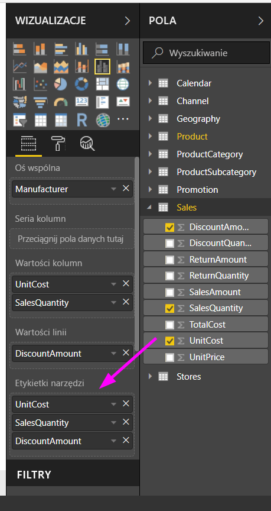
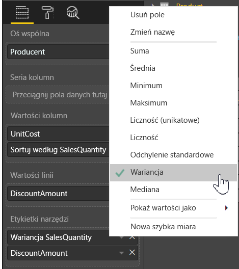

# Dostosowywanie etykietek narzędzi w programie Power BI Desktop
Etykietki narzędzi to elegancki sposób zapewniania większej ilości informacji kontekstowych i szczegółowych dotyczących punktów danych w wizualizacji. Na poniższej ilustracji przedstawiono etykietkę narzędzia zastosowaną względem wykresu w programie Power BI Desktop.

Po utworzeniu wizualizacji w domyślnej etykietce narzędzia wyświetlana jest wartość i kategoria punktu danych. Możliwość edytowania informacji zawartych na etykietce narzędzia może być przydatna w wielu sytuacjach i pozwala na przekazanie dodatkowego kontekstu i dodatkowych informacji użytkownikom, którzy wyświetlają wizualizację. Niestandardowe etykietki narzędzi umożliwiają określanie dodatkowych punktów danych, które są wyświetlane jako część etykietki narzędzia.

## Jak dostosować etykietki narzędzi
Aby utworzyć niestandardową etykietkę narzędzia, w obszarze **Pola** okienka **Wizualizacje** po prostu przeciągnij pole do zasobnika **Etykietki narzędzi** pokazanego na poniższym obrazie. Poniższa ilustracja przedstawia dwa pola umieszczone w zasobniku **Etykietki narzędzi**.

Po dodaniu etykietek narzędzi do obszaru pól zatrzymanie wskaźnika myszy na punkcie danych na wizualizacji spowoduje wyświetlenie wartości dla tych pól w etykietce narzędzia.

## Dostosowywanie etykietek narzędzi za pomocą agregacji lub przy użyciu szybkich obliczeń
Dostosowywanie etykietki narzędzia można kontynuować, wybierając funkcję agregacji lub *Szybkie obliczenie* poprzez wybranie strzałki obok pola w zasobniku **Etykietki narzędzi** i wybranie odpowiedniej opcji.

Istnieje wiele sposobów dostosowywania **etykietek narzędzi** przy użyciu dowolnych pól z zestawu danych celem przekazania skróconych informacji i najważniejszych szczegółów użytkownikom, którzy wyświetlają raporty lub pulpity nawigacyjne.

