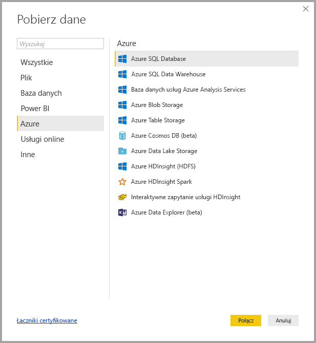
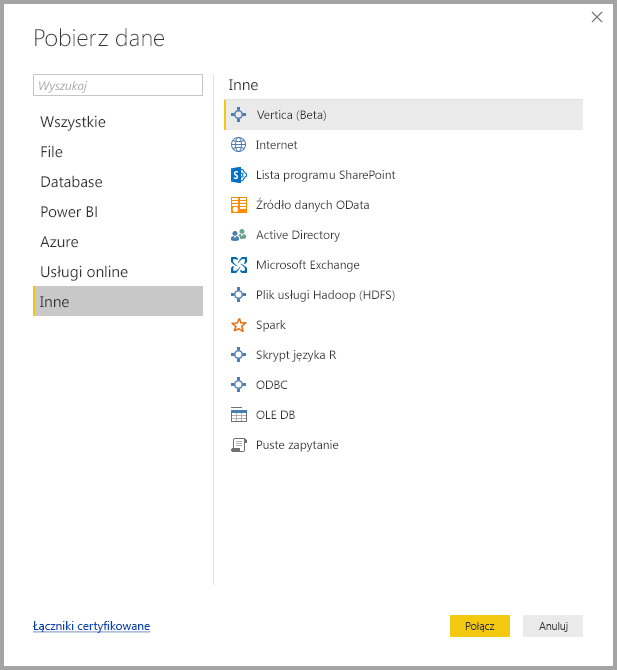

# Źródła danych w programie Power BI Desktop
Korzystając z programu Power BI Desktop, możesz nawiązywać połączenie z danymi z wielu różnych źródeł. Pełna lista dostępnych źródeł danych znajduje się w dolnej części tej strony.

Aby nawiązać połączenie z danymi, wybierz pozycję **Pobierz dane** z karty **Narzędzia główne** wstążki. Jeśli wybierzesz strzałkę w dół obok przycisku lub znajdujący się na nim tekst **Pobierz dane**, zostanie wyświetlone menu przedstawiające **Najpopularniejsze** typy danych. Widać je na poniższej ilustracji:

Po wybraniu pozycji **Więcej...** z menu **Najpopularniejsze** zostanie wyświetlone okno **Pobieranie danych**. Okno **Pobieranie danych** można również wywołać (z pominięciem menu **Najpopularniejsze**), bezpośrednio wybierając **przycisk ikony** **Pobierz dane**.

> [!NOTE]
> Zespół usługi Power BI nieustannie rozszerza źródła danych dostępne w programie **Power BI Desktop** i **usłudze Power BI**. Z tego powodu często będzie można zauważyć wczesne wersje eksperymentalnych źródeł danych oznaczone jako *beta* lub *wersja zapoznawcza*. Wszystkie źródła danych oznaczone jako *beta* lub *wersja zapoznawcza* mają ograniczone wsparcie i funkcjonalność, dlatego nie powinny być używane w środowiskach produkcyjnych.
> 
> 

## Źródła danych
Typy danych sklasyfikowano w następujące kategorie:

* Wszystkie
* Plik
* Baza danych
* Power BI
* Azure
* Usługi online
* Inne

Kategoria **Wszystkie** obejmuje wszystkie typy połączeń danych ze wszystkich kategorii.

Kategoria **Plik** udostępnia następujące połączenia danych:

* Excel
* Plik tekstowy lub CSV
* XML
* JSON
* Folder
* PDF (beta)
* Folder programu SharePoint

Na poniższej ilustracji przedstawiono okno **Pobieranie danych** dla kategorii **Plik**.

Kategoria **Baza danych** udostępnia następujące połączenia danych:

* Baza danych programu SQL Server
* Baza danych programu Access
* Baza danych usług SQL Server Analysis Services
* Oracle Database
* Baza danych IBM DB2
* Baza danych IBM Informix (beta)
* IBM Netezza
* Baza danych MySQL
* Baza danych PostgreSQL
* Baza danych Sybase
* Teradata Database
* Baza danych SAP HANA
* SAP Business Warehouse Application Server
* SAP Business Warehouse Message Server (wersja beta)
* Amazon Redshift
* Impala
* Google BigQuery
* Snowflake
* Exasol (wersja beta)
* Jethro (wersja beta)

> [!NOTE]
> Niektóre łączniki baz danych wymagają włączenia przez wybranie pozycji **Plik > Opcje i ustawienia > Opcje**, a następnie wybranie opcji **Funkcje wersji zapoznawczej** i włączenie łącznika. Jeśli chcesz użyć niektórych łączników wymienionych powyżej, ale ich nie widzisz, sprawdź ustawienie **Funkcje wersji zapoznawczej**. Pamiętaj jednak, że wszystkie źródła danych oznaczone jako *beta* lub *wersja zapoznawcza* mają ograniczone wsparcie i funkcjonalność, dlatego nie powinny być używane w środowiskach produkcyjnych.
> 
> 

Na poniższej ilustracji przedstawiono okno **Pobieranie danych** dla kategorii **Baza danych**.

Kategoria **Power BI** udostępnia następujące połączenia danych:

* Zestawy danych usługi Power BI
* Przepływy danych usługi Power BI (wersja beta)

Na poniższej ilustracji przedstawiono okno **Pobieranie danych** dla kategorii **Power BI**.

Kategoria **Azure** udostępnia następujące połączenia danych:

* Azure SQL Database
* Azure SQL Data Warehouse
* Baza danych usług Azure Analysis Services
* Azure Blob Storage
* Azure Table Storage
* Azure Cosmos DB (beta)
* Azure Data Lake Store
* Azure HDInsight (HDFS)
* Azure HDInsight Spark
* Interaktywne zapytanie usługi HDInsight (beta)
* Azure KustoDB (beta)

Na poniższej ilustracji przedstawiono okno **Pobieranie danych** dla kategorii **Azure**.

Kategoria **Usługi online** udostępnia następujące połączenia danych:

* Lista usługi SharePoint Online
* Microsoft Exchange Online
* Dynamics 365 (online)
* Dynamics NAV (beta)
* Dynamics 365 Business Central
* Common Data Service for Apps (beta)
* Common Data Service (beta)
* Microsoft Azure Consumption Insights (beta)
* Visual Studio Team Services (beta)
* Obiekty Salesforce
* Raporty Salesforce
* Google Analytics
* Adobe Analytics
* appFigures (beta)
* comScore Digital Analytix (beta)
* Dynamics 365 for Customer Insights (beta)
* Data.World — pobierz zestaw danych (beta)
* Facebook
* GitHub (beta)
* MailChimp (beta)
* Marketo (beta)
* Mixpanel (beta)
* Planview Enterprise One — PRM (beta)
* Planview Projectplace (beta)
* QuickBooks Online (beta)
* Smartsheet
* SparkPost (beta)
* Stripe (beta)
* SweetIQ (beta)
* Planview Enterprise One — CMT (beta)
* Twilio (beta)
* tyGraph (beta)
* Webtrends (beta)
* Zendesk (beta)
* TeamDesk (beta)

Na poniższej ilustracji przedstawiono okno **Pobieranie danych** dla kategorii **Usługi online**.

Kategoria **Inne** udostępnia następujące połączenia danych:

* Vertica (wersja beta)
* Internet
* Listy programu SharePoint
* Źródło danych OData
* Active Directory
* Microsoft Exchange
* Plik usługi Hadoop (HDFS)
* Spark
* Skrypt języka R
* Skrypt języka Python
* ODBC
* OLE DB
* Puste zapytanie

Na poniższej ilustracji przedstawiono okno **Pobieranie danych** dla kategorii **Inne**.

> [!NOTE]
> Aktualnie nie jest możliwe nawiązanie połączenia z niestandardowymi źródłami danych zabezpieczonymi przy użyciu usługi Azure Active Directory.
> 
> 

## Nawiązywanie połączenia ze źródłem danych
Aby nawiązać połączenie ze źródłem danych, wybierz źródło danych w oknie **Pobieranie danych** i wybierz przycisk **Połącz**. Na poniższej ilustracji zaznaczono pozycję **Internet** z kategorii **Inne** połączeń danych.

Zostanie wyświetlone okno połączenia specyficzne dla typu połączenia danych. Jeśli wymagane są poświadczenia, zostanie wyświetlony monit o ich podanie. Na poniższej ilustracji przedstawiono adres URL wprowadzany w celu nawiązania połączenia ze źródłem danych Internet.

Po wprowadzeniu adresu URL lub informacji o połączeniu z zasobem wybierz przycisk **OK**. Program Power BI Desktop nawiązuje połączenie ze źródłem danych i prezentuje dostępne źródła danych w okienku **Nawigator**.

Możesz załadować dane, wybierając przycisk **Załaduj** w dolnej części okienka **Nawigator**, lub zmodyfikować zapytanie przed załadowaniem danych, wybierając przycisk **Edytuj**.

To wystarczy, aby nawiązać połączenie ze źródłami danych w programie Power BI Desktop. Spróbuj nawiązać połączenie z danymi, korzystając z naszej ciągle uzupełnianej listy źródeł danych. Sprawdzaj często tę listę, ponieważ stale dodajemy do niej nowe pozycje.

## Następne kroki
Przy użyciu programu Power BI Desktop można wykonywać różnorodne zadania. Aby uzyskać więcej informacji na temat jego możliwości, skorzystaj z następujących zasobów:

* [Co to jest Power BI Desktop?](desktop-what-is-desktop.md)
* [Omówienie zapytań w programie Power BI Desktop](desktop-query-overview.md)
* [Typy danych w programie Power BI Desktop](desktop-data-types.md)
* [Kształtowanie i łączenie danych w programie Power BI Desktop](desktop-shape-and-combine-data.md)
* [Typowe zadania dotyczące zapytań w programie Power BI Desktop](desktop-common-query-tasks.md)    
