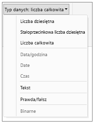

# Typy danych w programie Power BI Desktop
W tym artykule opisano typy danych obsługiwane w programie Power BI Desktop i języku wyrażeń analizy danych (DAX, Data Analysis Expressions). 

Podczas ładowania danych program Power BI Desktop podejmuje próbę przekonwertowania typu danych kolumny źródłowej, tak aby zapewnić lepszą wydajność magazynowania, obliczeń i wizualizacji danych. Na przykład jeśli kolumna zaimportowana z programu Excel nie zawiera wartości ułamkowych, program Power BI Desktop przekonwertuje całą kolumnę danych na liczby całkowite, które lepiej nadają się do przechowywania wartości całkowitych.

Takie podejście jest ważne, ponieważ niektóre funkcje języka DAX mają specjalne wymagania dotyczące typu danych. W wielu przypadkach język DAX automatycznie przeprowadzi niejawną konwersję typu danych, ale nie zawsze.  Na przykład jeśli funkcja języka DAX wymaga typu danych Data, ale kolumna zawiera wartości tekstowe, funkcja ta nie będzie działać prawidłowo.  Z tego względu zagwarantowanie, aby w kolumnie znajdowały się dane o prawidłowym typie, jest ważne i przydatne. Niejawne konwersje zostały opisane w dalszej części tego artykułu.

## Określanie typu danych w kolumnie
W programie Power BI Desktop typ danych w kolumnie można określić w Edytorze zapytań, widoku danych lub widoku raportu:

**Typy danych w Edytorze zapytań**

**Typy danych w widoku danych lub widoku raportu**

Lista rozwijana Typ danych w Edytorze zapytań zawiera dwie pozycje, które nie są aktualnie dostępne w widoku danych ani widoku raportu: **Data/godzina/strefa czasowa** i **Czas trwania**. Jeśli kolumna zawierająca dane jednego z tych typów zostanie załadowana do modelu i wyświetlona w widoku danych lub widoku raportu, dane typu Data/godzina/strefa czasowa zostaną przekonwertowane na typ Data/godzina, a dane typu Czas trwania — na typ Liczba dziesiętna.

### Typy liczbowe
Program Power BI Desktop obsługuje trzy typy liczbowe:

**Liczba dziesiętna** — reprezentuje 64-bitową (8-bajtową) liczbę zmiennoprzecinkową. To najczęściej spotykany typ liczbowy, odpowiadający powszechnemu postrzeganiu liczb.  Jest on przeznaczony do obsługi liczb z częścią ułamkową, ale można go również używać do obsługi liczb całkowitych.  Typ Liczba dziesiętna zapewnia obsługę wartości ujemnych z przedziału od -1,79E +308 do -2,23E -308, liczby 0 oraz wartości dodatnich z przedziału od 2,23E -308 do 1,79E +308. Na przykład liczby 34, 34,01 i 34,000367063 to prawidłowe liczby dziesiętne. Największa wartość, którą można przedstawić za pomocą typu Liczba dziesiętna, składa się z 15 cyfr.  Separator dziesiętny może występować w dowolnym miejscu takiej liczby. Program Excel przechowuje liczby za pomocą typu Liczba dziesiętna.

**Stałoprzecinkowa liczba dziesiętna** — miejsce separatora dziesiętnego jest stałe. Z prawej strony separatora dziesiętnego zawsze znajdują się cztery cyfry, a liczba cyfr znaczących wynosi 19.  Największa wartość, którą można przedstawić za pomocą tego typu, to 922 337 203 685 477,5807 (dodatnia lub ujemna).  Typ Stałoprzecinkowa liczba dziesiętna jest przydatny w sytuacjach, w których zaokrąglanie może powodować błędy.  Dotyczy to przypadków obejmujących działania na wielu liczbach z małymi wartościami ułamkowymi, które czasami mogą się sumować, co wpływa na nieznaczną zmianę wyniku.  Użycie typu Stałoprzecinkowa liczba dziesiętna pomaga uniknąć takich błędów, ponieważ wartości znajdujące się za czterema cyframi dziesiętnymi są obcinane.   Osoby zaznajomione z programem SQL Server mogą wiedzieć, że ten typ danych odpowiada dziesiętnemu typowi danych w programie SQL Server (19,4) lub typowi danych walutowych w dodatku Power Pivot. 

**Liczba całkowita** — reprezentuje 64-bitową (8-bajtową) wartość całkowitą. Jako liczba całkowita, nie ma ona cyfr dziesiętnych. Za pomocą 19 cyfr pozwala ona przedstawiać dodatnie lub ujemne liczby całkowite z przedziału od -9 223 372 036 854 775 808 (-2^63) do 9 223 372 036 854 775 807 (2^63-1).  Typ ten umożliwia reprezentację największych możliwych liczb różnych typów liczbowych.  Podobnie jak typ Stałoprzecinkowa liczba dziesiętna, typ Liczba całkowita może być przydatny w sytuacjach wymagających kontroli nad zaokrąglaniem. 

### Typy daty/godziny
Program Power BI Desktop obsługuje pięć typów danych daty/godziny w widoku zapytań i trzy typy danych w modelu i widoku raportu.   Zarówno typ Data/godzina/strefa czasowa, jak i typ Czas trwania są konwertowane podczas ładowania do modelu.

**Data/godzina** — reprezentuje wartość daty oraz godziny.  Wartość Data/godzina jest wewnętrznie przechowywana jako liczba dziesiętna.  Dzięki temu wartość jednego typu można konwertować na drugi typ — i odwrotnie.   Część godzinowa daty jest przechowywana jako ułamek będący wielokrotnością 1/300 sekundy (3,33 ms).  Obsługiwane są daty od 1900 r. do 9999 r.

**Data** — reprezentuje tylko datę (bez części godzinowej).  Po przekonwertowaniu na model wartość typu Data jest taka sama jak wartość typu Data/godzina bez części ułamkowej.

**Godzina** — reprezentuje tylko godzinę (bez części datowej).  Po przekonwertowaniu na model wartość typu Godzina jest taka sama jak wartość typu Data/godzina bez cyfr z lewej strony separatora dziesiętnego.

**Data/godzina/strefa czasowa** — reprezentuje datę/godzinę UTC.  Obecnie w przypadku ładowania do modelu wartość ta jest konwertowana na typ Data/godzina.

**Czas trwania** — reprezentuje okres. W przypadku ładowania do modelu wartość ta jest konwertowana na typ Liczba dziesiętna.  Z tego względu można ją dodawać lub odejmować od pola typu Data/godzina, uzyskując poprawne wyniki.  Można również łatwo z niej korzystać w wizualizacjach przedstawiających wartości.

### Typ Tekst
**Tekst** — ciąg danych znakowych Unicode. Mogą to być ciągi, liczby lub daty reprezentowane w formacie tekstowym. Maksymalna długość ciągu to 268 435 456 znaków Unicode (256 mebiznaków) lub 536 870 912 bajtów.

### Typ prawda/fałsz
**Prawda/fałsz** — wartość logiczna Prawda lub Fałsz.

### Typ Blank/null
**Blank** (wartość pusta) — typ danych w języku DAX, który reprezentuje i zastępuje wartości null języka SQL. Wartości puste można tworzyć za pomocą funkcji [BLANK](http://msdn.microsoft.com/library/ee634820.aspx), a do sprawdzania, czy dana wartość jest wartością pustą, służy funkcja logiczna [ISBLANK](https://msdn.microsoft.com/library/ee634204.aspx).

### Typ danych Table
Typ danych Table jest używany w języku DAX w wielu funkcjach, takich jak agregacje i obliczenia analizy czasowej. Niektóre funkcje wymagają odwołania do tabeli; inne funkcje zwracają tabelę, której można następnie używać jako danych wejściowych innych funkcji. W niektórych funkcjach wymagających tabeli jako danych wejściowych można określić wyrażenie, którego wynikiem jest tabela; w przypadku niektórych innych funkcji wymagane jest odwołanie do tabeli podstawowej. Aby uzyskać informacje dotyczące wymagań określonych funkcji, zobacz temat [Funkcje języka DAX — kompendium](https://msdn.microsoft.com/library/ee634396.aspx).

## Jawna i niejawna konwersja typu danych w formułach języka DAX
Poszczególne funkcje języka DAX mają konkretne wymagania dotyczące typów danych wejściowych i wyjściowych. Na przykład argumenty niektórych funkcji muszą być liczbami całkowitymi, a innych — datami. Jeszcze inne funkcje wymagają wartości tekstowych lub tabel.

Jeśli dane w kolumnie podanej jako argument są niezgodne z typem danych wymaganych przez funkcję, w wielu przypadkach język DAX zwróci błąd. Jednak gdy tylko jest to możliwe, język DAX podejmie próbę niejawnej konwersji danych na wymagany typ danych. Na przykład:

* Można wpisać datę jako ciąg, a w języku DAX ciąg ten zostanie zanalizowany i nastąpi próba zrzutowania go na jeden z formatów daty i godziny systemu Windows.
* Można wykonać dodawanie PRAWDA+1 i otrzymać wynik 2, ponieważ wartość PRAWDA jest niejawnie konwertowana na liczbę 1 i przeprowadzana jest operacja 1+1.
* W przypadku dodawania wartości tekstowej (np. „12”) do liczby (12) język DAX niejawnie konwertuje ciąg na liczbę, a następnie wykonuje operację dodawania, uzyskując wynik liczbowy. Następujące wyrażenie zwraca wynik 44: = "22" + 22.
* Jeśli spróbujesz złączyć dwie liczby, program Excel przedstawi je jako ciągi, a następnie połączy. Następujące wyrażenie zwraca wynik „1234”: = 12 & 34.

### Tabela niejawnych konwersji danych
O typie przeprowadzanej konwersji decyduje operator, który przed wykonaniem żądanej operacji rzutuje wymagane przez siebie wartości. Poniższe tabele zawierają listę operatorów i wskazują, jaka konwersja jest przeprowadzana dla danego typu danych w kolumnie, jeśli „spotka się” on z innym typem danych w przecinającym ją wierszu.

> [!NOTE]
>  Typy danych tekstowych nie zostały uwzględnione w tych tabelach. Jeśli wartość liczbowa zostanie przedstawiona w formacie tekstowym, w niektórych przypadkach usługa Power BI spróbuje ustalić typ tej wartości i przedstawić ją jako liczbę.
> 
> 

**Dodawanie (+)**

| Operator (+) | LICZBA CAŁKOWITA | WALUTA | LICZBA RZECZYWISTA | Data/godzina |
| --- | --- | --- | --- | --- |
| LICZBA CAŁKOWITA |LICZBA CAŁKOWITA |WALUTA |LICZBA RZECZYWISTA |Data/godzina |
| WALUTA |WALUTA |WALUTA |LICZBA RZECZYWISTA |Data/godzina |
| LICZBA RZECZYWISTA |LICZBA RZECZYWISTA |LICZBA RZECZYWISTA |LICZBA RZECZYWISTA |Data/godzina |
| Data/godzina |Data/godzina |Data/godzina |Data/godzina |Data/godzina |

Jeśli na przykład liczba rzeczywista jest używana w operacji dodawania w połączeniu z danymi walutowymi, obie wartości są konwertowane na liczby rzeczywiste i wynikiem jest wartość typu Liczba rzeczywista.

**Odejmowanie (-)**

W poniższej tabeli nagłówek wiersza jest odjemną (lewa strona), a nagłówek kolumny jest odjemnikiem (prawa strona).

| Operator (-) | LICZBA CAŁKOWITA | WALUTA | LICZBA RZECZYWISTA | Data/godzina |
| --- | --- | --- | --- | --- |
| LICZBA CAŁKOWITA |LICZBA CAŁKOWITA |WALUTA |LICZBA RZECZYWISTA |LICZBA RZECZYWISTA |
| WALUTA |WALUTA |WALUTA |LICZBA RZECZYWISTA |LICZBA RZECZYWISTA |
| LICZBA RZECZYWISTA |LICZBA RZECZYWISTA |LICZBA RZECZYWISTA |LICZBA RZECZYWISTA |LICZBA RZECZYWISTA |
| Data/godzina |Data/godzina |Data/godzina |Data/godzina |Data/godzina |

Jeśli na przykład data jest używana w operacji odejmowania razem z jakimkolwiek innym typem danych, obie wartości są konwertowane na daty i zwracana wartość jest również datą.

> [!NOTE]
>    Modele danych obsługują także operator jednoargumentowy - (negacja), ale ten operator nie zmienia typu danych argumentu.
> 
> 

**Mnożenie (*)**

| Operator (\*) | LICZBA CAŁKOWITA | WALUTA | LICZBA RZECZYWISTA | Data/godzina |
| --- | --- | --- | --- | --- |
| LICZBA CAŁKOWITA |LICZBA CAŁKOWITA |WALUTA |LICZBA RZECZYWISTA |LICZBA CAŁKOWITA |
| WALUTA |WALUTA |LICZBA RZECZYWISTA |WALUTA |WALUTA |
| LICZBA RZECZYWISTA |LICZBA RZECZYWISTA |WALUTA |LICZBA RZECZYWISTA |LICZBA RZECZYWISTA |

Jeśli na przykład liczba całkowita jest używana w operacji mnożenia w połączeniu z liczbą rzeczywistą, obie liczby są konwertowane na liczby rzeczywiste i zwracana wartość jest również liczbą rzeczywistą.

**Dzielenie (/)**

W poniższej tabeli nagłówek wiersza jest licznikiem, a nagłówek kolumny jest mianownikiem.

| Operator (/) (wiersz/kolumna) | LICZBA CAŁKOWITA | WALUTA | LICZBA RZECZYWISTA | Data/godzina |
| --- | --- | --- | --- | --- |
| LICZBA CAŁKOWITA |LICZBA RZECZYWISTA |WALUTA |LICZBA RZECZYWISTA |LICZBA RZECZYWISTA |
| WALUTA |WALUTA |LICZBA RZECZYWISTA |WALUTA |LICZBA RZECZYWISTA |
| LICZBA RZECZYWISTA |LICZBA RZECZYWISTA |LICZBA RZECZYWISTA |LICZBA RZECZYWISTA |LICZBA RZECZYWISTA |
| Data/godzina |LICZBA RZECZYWISTA |LICZBA RZECZYWISTA |LICZBA RZECZYWISTA |LICZBA RZECZYWISTA |

Jeśli na przykład liczba całkowita jest używana w operacji dzielenia w połączeniu z wartością walutową, obie wartości są konwertowane na liczby rzeczywiste i wynik jest również liczbą rzeczywistą.

### Operatory porównania
W wyrażeniach porównania wartości logiczne są traktowane jako większe niż wartości ciągu, a wartości ciągu są traktowane jako większe niż wartości daty/godziny. Wartości liczbowe i wartości daty/godziny są traktowane jako równe. W przypadku wartości logicznych lub wartości ciągu nie są wykonywane niejawne konwersje. Wartość pusta (BLANK) jest konwertowana na wartość 0/""/fałsz, w zależności od typu danych drugiej porównywanej wartości.

Poniższe wyrażenia języka DAX pokazują to zachowanie:

=IF(FALSE()\>"true","Wyrażenie jest prawdziwe", "Wyrażenie jest fałszywe"), zwraca "Wyrażenie jest prawdziwe"

=IF("12"\>12,"Wyrażenie jest prawdziwe", "Wyrażenie jest fałszywe"), zwraca "Wyrażenie jest prawdziwe"

=IF("12"=12,"Wyrażenie jest prawdziwe", "Wyrażenie jest fałszywe"), zwraca "Wyrażenie jest fałszywe"

Konwersje typów liczbowych i daty/godziny są wykonywane niejawnie, tak jak pokazano w poniższej tabeli:

| Operator porównania | LICZBA CAŁKOWITA | WALUTA | LICZBA RZECZYWISTA | Data/godzina |
| --- | --- | --- | --- | --- |
| LICZBA CAŁKOWITA |LICZBA CAŁKOWITA |WALUTA |LICZBA RZECZYWISTA |LICZBA RZECZYWISTA |
| WALUTA |WALUTA |WALUTA |LICZBA RZECZYWISTA |LICZBA RZECZYWISTA |
| LICZBA RZECZYWISTA |LICZBA RZECZYWISTA |LICZBA RZECZYWISTA |LICZBA RZECZYWISTA |LICZBA RZECZYWISTA |
| Data/godzina |LICZBA RZECZYWISTA |LICZBA RZECZYWISTA |LICZBA RZECZYWISTA |Data/godzina |

### Obsługa wartości pustych, ciągów pustych i wartości zerowych
W języku DAX wartość null, wartość pusta, pusta komórka i wartość brakująca są reprezentowane przez ten sam nowy typ wartości — BLANK. Można również generować wartości puste, używając funkcji BLANK, a do sprawdzania, czy dana wartość jest wartością pustą, służy funkcja ISBLANK.

Sposób obsługi wartości pustych w operacjach, takich jak dodawanie i łączenie, zależy od indywidualnej funkcji. W poniższej tabeli podsumowano różnice w sposobie obsługi wartości pustych w formułach języka DAX i programu Microsoft Excel.

| Wyrażenie | DAX | Excel |
| --- | --- | --- |
| BLANK + BLANK |BLANK |0 (zero) |
| BLANK + 5 |5 |5 |
| BLANK * 5 |BLANK |0 (zero) |
| 5/BLANK |Nieskończoność |Błąd |
| 0/BLANK |NaN |Błąd |
| BLANK/BLANK |BLANK |Błąd |
| Fałsz LUB BLANK |Fałsz |Fałsz |
| Fałsz I BLANK |Fałsz |Fałsz |
| Prawda LUB BLANK |Prawda |Prawda |
| Prawda I BLANK |Fałsz |Prawda |
| BLANK LUB BLANK |BLANK |Błąd |
| BLANK I BLANK |BLANK |Błąd |

