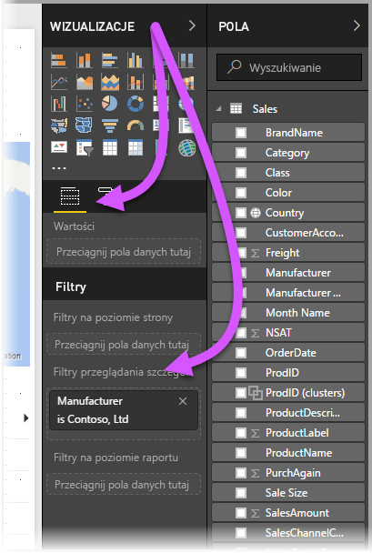
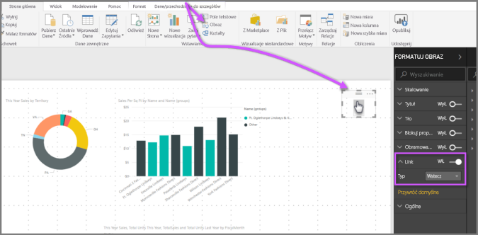
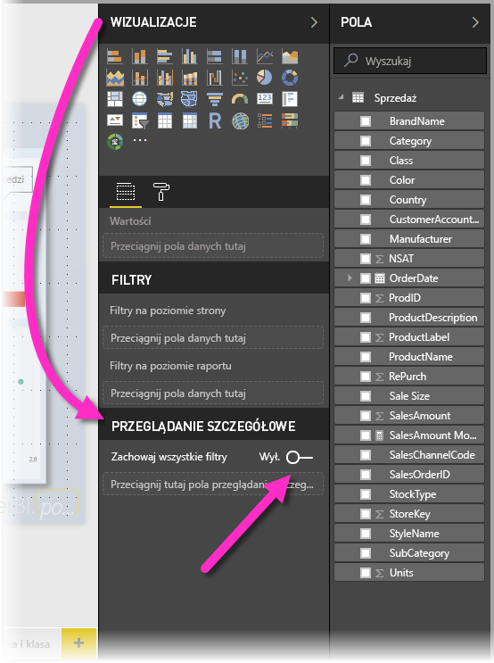
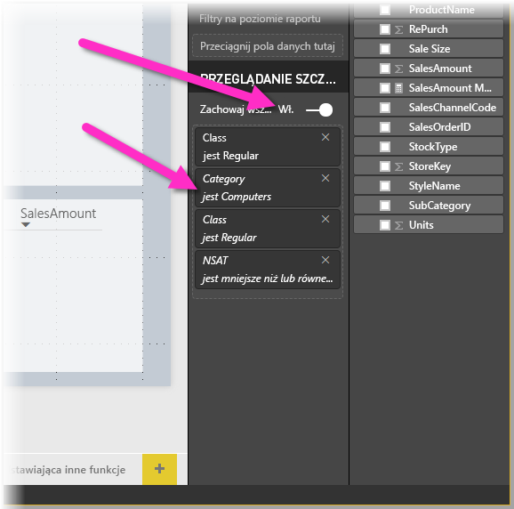
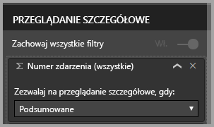

# Używanie przeglądania szczegółowego w programie Power BI Desktop
**Przeglądanie szczegółowe** w programie **Power BI Desktop** umożliwia utworzenie strony w raporcie, która koncentruje się na określonej jednostce, takiej jak dostawca, klient lub producent. Użytkownicy mogą kliknąć prawym przyciskiem myszy punkt danych na innych stronach raportu. Następnie mogą oni przejść do wybranej strony, aby uzyskać szczegółowe informacje filtrowane do danego kontekstu.

## Korzystanie z przeglądania szczegółowego
1. Aby używać **przeglądania szczegółowego**, utwórz stronę raportu zawierającą wybrane wizualizacje dotyczące typu jednostki, dla którego chcesz przeprowadzić przeglądanie szczegółowe. 

    Załóżmy na przykład, że chcesz udostępnić przeglądanie szczegółowe dla producentów. Możesz więc utworzyć stronę przeglądania szczegółowego z wizualizacjami przedstawiającymi sprzedaż całkowitą, sumę wysłanych jednostek, sprzedaż według kategorii, sprzedaż według regionu itd. W ten sposób, gdy przejdziesz do szczegółów znajdujących się na tej stronie, wizualizacje będą dotyczyć wybranego producenta.

2. Następnie na tej stronie przeglądania szczegółowego w sekcji **Pola** okienka **Wizualizacje** przeciągnij pole, którego szczegóły chcesz przeglądać, do obszaru **Filtry przeglądania szczegółowego**.

    

    Po dodaniu pola do obszaru **Filtry przeglądania szczegółowego** program **Power BI Desktop** automatycznie utworzy wizualizację przycisku *wstecz*. Ta wizualizacja stanie się przyciskiem w opublikowanych raportach. Użytkownicy korzystający z raportu w **usłudze Power BI** mogą za pomocą tego przycisku wrócić do strony raportu, z której nastąpiło przejście.

    

## Używanie własnego obrazu na przycisku Wstecz    
 Ponieważ przycisk Wstecz jest obrazem, możesz zastąpić obraz tej wizualizacji dowolnym obrazem. Będzie on nadal działać jako przycisk Wstecz, aby użytkownicy raportu mogli przechodzić z powrotem do swojej oryginalnej strony. Aby użyć własnego obrazu na przycisku Wstecz, wykonaj następujące kroki:

1. Na karcie **Narzędzia główne** wybierz pozycję **Obraz**. Następnie zlokalizuj swój obraz i umieść go na stronie przeglądania szczegółowego.

2. Wybierz nowy obraz na stronie przeglądania szczegółowego. W sekcji **Formatowanie obrazu** ustaw suwak **Link** na **Wł.**, a następnie ustaw pozycję **Typ** na **Wstecz**. Twój obraz działa teraz jako przycisk Wstecz.

    

    
     Użytkownicy mogą teraz kliknąć prawym przyciskiem myszy punkt danych w raporcie i otworzyć menu kontekstowe obsługujące przeglądanie szczegółowe na tej stronie. 

    

    Gdy użytkownicy raportu wybiorą opcję przeglądania szczegółowego, strona zostanie odfiltrowana w celu wyświetlenia informacji na temat punktu danych, który kliknięto prawym przyciskiem myszy. Załóżmy na przykład, że kliknięto prawym przyciskiem myszy punkt danych związany z firmą Contoso (producentem) i wybrano opcję przeglądania szczegółowego. Strona przeglądania szczegółowego, do której przechodzą użytkownicy, jest filtrowana do danych firmy Contoso.

## Przekazywanie wszystkich filtrów w przeglądaniu szczegółowym

Począwszy od programu **Power BI Desktop** w wersji z maja 2018 r. wszelkie zastosowane filtry można przekazać do okna przeglądania szczegółowego. Na przykład można wybrać tylko konkretną kategorię produktów i wizualizacje odfiltrowane pod kątem tej kategorii, a następnie wybrać przeglądanie szczegółowe. Może Cię zainteresować, jak wyglądałoby przeglądanie szczegółowe z zastosowanymi wszystkimi tymi filtrami.

Aby zachować wszystkie zastosowane filtry, w sekcji **Przeglądanie szczegółowe** okienka **Wizualizacje** ustaw przełącznik **Przekaż wszystkie filtry** na pozycję **Włączone**. 

W wersjach programu **Power BI Desktop** wydanych przed majem 2018 r. zachowanie jest takie samo jak w przypadku ustawienia tego przełącznika na pozycję **Wyłączone**.

Gdy następnie będziesz przechodzić do szczegółów w wizualizacji, zobaczysz, które filtry zostały zastosowane w efekcie zastosowania filtrów tymczasowych w wizualizacjach źródłowych. W oknie przeglądania szczegółowego te filtry przejściowe są pokazywane kursywą. 

Pamiętaj, że można to zrobić na stronach etykietek narzędzi, ale będzie to dziwne doświadczenie, ponieważ etykietki będą wyglądały na działające nieprawidłowo. Z tego powodu używanie etykietek nie jest zalecane.

## Dodawanie miary do obszaru przeglądania szczegółowego

Oprócz przekazywania wszystkich filtrów do okna przeglądania szczegółowego, możesz również dodać miarę lub podsumowaną kolumnę liczbową do obszaru przeglądania szczegółowego. W tym celu przeciągnij pole przeglądania szczegółowego do karty przeglądania szczegółowego. 

Po dodaniu miary lub podsumowanej kolumny liczbowej możesz przejść do szczegółów na stronie, gdy to pole jest używane w obszarze *Wartość* wizualizacji.

To wszystko na temat używania **przeglądania szczegółowego** w raportach. Jest to doskonały sposób wyświetlania rozszerzonych informacji na temat jednostki wybranej dla filtru przeglądania szczegółowego.

## Następne kroki

Może zainteresują Cię również następujące artykuły:

* [Korzystanie z fragmentatorów w programie Power BI Desktop](visuals/desktop-slicers.md)

