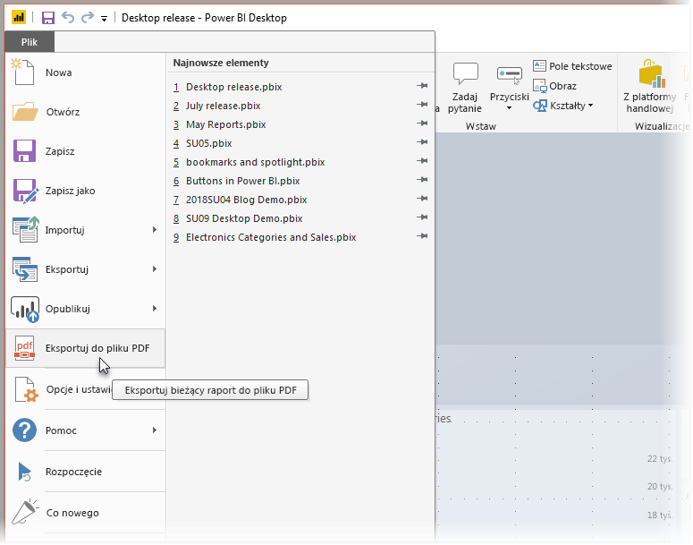
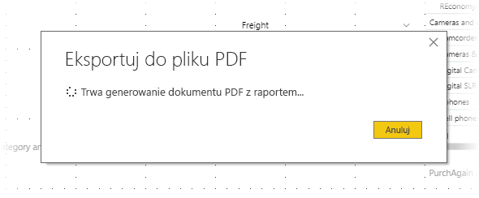

# Eksportowanie raportów do formatu PDF z programu Power BI Desktop
Program **Power BI Desktop** umożliwia eksportowanie raportów do pliku PDF oraz łatwe udostępnianie i drukowanie raportów w formacie PDF.

Proces eksportowania raportu z programu **Power BI Desktop** do pliku PDF jest prosty — dzięki temu można wydrukować plik PDF lub udostępnić go innym użytkownikom. Po prostu wybierz kolejno pozycje **Plik > Eksportuj do formatu PDF** w programie Power BI Desktop.

W ramach procesu **eksportowania do formatu PDF** są eksportowane wszystkie *widoczne* strony w raporcie, a każda strona raportu jest eksportowana jako pojedyncza strona w pliku PDF. Strony raportów, które nie są obecnie widoczne, takie jak etykietki narzędzi lub ukryte strony, nie są eksportowane do pliku PDF. 

Wybranie pozycji **Plik > Eksportuj do formatu PDF** powoduje zainicjowanie eksportowania i wyświetlenie okna dialogowego z informacją o trwającym procesie eksportowania. Okno dialogowe jest wyświetlane na ekranie do czasu zakończenia procesu eksportowania. W trakcie procesu eksportowania wszystkie interakcje z eksportowanym raportem są wyłączone. Jedynym sposobem na interakcję z raportem jest zaczekanie na ukończenie procesu eksportowania lub anulowanie eksportowania. 

Po ukończeniu eksportowania plik PDF jest ładowany do domyślnej przeglądarki plików PDF na komputerze. 

## Istotne zagadnienia i ograniczenia
Istnieje kilka zagadnień, które należy wziąć pod uwagę w przypadku funkcji **Eksportowanie do formatu PDF**:

* Funkcja **Eksportowanie do formatu PDF** jest dostępna tylko w programie **Power BI Desktop** i nie jest obecnie dostępna w **usłudze Power BI**.
* Funkcja umożliwia eksportowanie niestandardowych wizualizacji, ale *nie* umożliwia eksportowania tapet zastosowanych do raportu.

Tapeta nie jest eksportowana do pliku PDF, dlatego należy zwrócić szczególną uwagę na raporty z ciemnymi tapetami. Jeśli tekst w raporcie ma biały lub bardzo jasny kolor wyróżniający go na ciemnej tapecie, będzie trudny lub niemożliwy do odczytania w procesie eksportowania do formatu PDF, ponieważ tapeta nie zostanie wyeksportowana z pozostałą częścią raportu. 

## Następne kroki
W programie **Power BI Desktop** istnieją różnego rodzaju interesujące funkcje i elementy wizualizacji. Więcej informacji znajdziesz w następujących zasobach:

* [Używanie elementów wizualizacji do ulepszania raportów usługi Power BI](desktop-visual-elements-for-reports.md)
* [Co to jest Power BI Desktop?](desktop-what-is-desktop.md)

