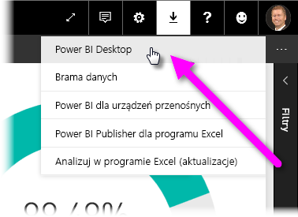
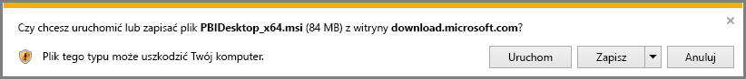
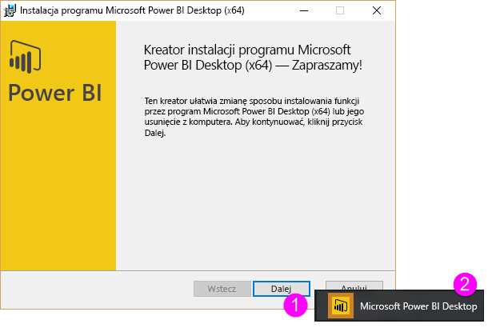
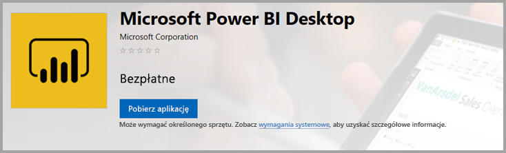
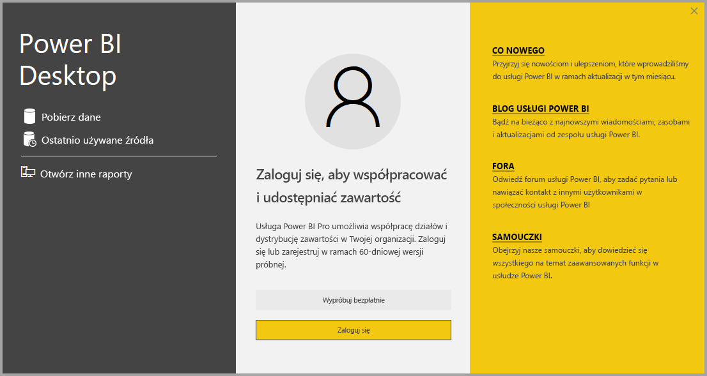

# Uzyskiwanie programu Power BI Desktop
Program **Power BI Desktop** umożliwia tworzenie zaawansowanych zapytań, modeli i raportów z wizualizowaniem danych. Przy użyciu programu **Power BI Desktop** możesz tworzyć modele danych i raporty oraz udostępniać swoją pracę poprzez publikowanie w usłudze Power BI.  Program **Power BI Desktop** można pobrać bezpłatnie.

Możesz pobrać program **Power BI Desktop** na dwa sposoby. Każdy z nich został opisany w następujących sekcjach:

* **Pobieranie** bezpośrednie (pakiet MSI do pobrania i zainstalowania na komputerze)
* Instalacja w formie aplikacji ze **Sklepu Windows**

Każda z tych metod zapewnia najnowszą wersję programu **Power BI Desktop** do zainstalowania na komputerze, ale istnieje kilka różnic, na które warto zwrócić uwagę. Zostały one opisane w poniższych sekcjach.

## Pobieranie programu Power BI Desktop
Aby pobrać najnowszą wersję programu **Power BI Desktop**, wybierz ikonę pobierania w prawym górnym rogu usługi Power BI i wybierz opcję **Power BI Desktop**.

Możesz również pobrać najnowszą wersję programu Power BI Desktop z następującej strony pobierania:

* [**Pobieranie programu Power BI Desktop** (wersje 32- i 64-bitowe)](https://powerbi.microsoft.com/desktop).
  
  

Niezależnie od tego, w jaki sposób pobierzesz program **Power BI Desktop**, po jego pobraniu zostanie wyświetlony monit o uruchomienie pliku instalacyjnego:

Program **Power BI Desktop** jest instalowany jako aplikacja i jest uruchamiany na pulpicie.

> [!NOTE]
> Instalowanie pobranej wersji (MSI) oraz wersji ze **Sklepu Windows** programu **Power BI Desktop** na tym samym komputerze (czasami zwane instalacją *obok siebie*) nie jest obsługiwane.
> 
> 

## Instalacja w formie aplikacji ze Sklepu Windows
Możesz też pobrać program **Power BI Desktop** ze Sklepu Windows, korzystając z następującego linku:

* [Instalacja programu **Power BI Desktop** ze **Sklepu Windows**](http://aka.ms/pbidesktopstore)

Pobranie programu **Power BI Desktop** ze Sklepu Windows ma kilka zalet:

* **Aktualizacje automatyczne** — system Windows pobiera najnowszą wersję automatycznie w tle zawsze wtedy, gdy jest dostępna, więc wersja oprogramowania będzie zawsze aktualna.
* **Mniejsze pliki do pobrania** — **Sklep Windows** gwarantuje, że podczas każdej aktualizacji na komputer będą pobierane tylko te elementy, które uległy zmianie, a więc za każdym razem będzie trzeba pobrać mniejsze pliki.
* **Uprawnienia administratora nie są wymagane** — w przypadku bezpośredniego pobierania i instalacji pliku MSI musisz być administratorem, aby instalacja została zakończona pomyślnie. W przypadku pobierania programu **Power BI Desktop** ze Sklepu Windows uprawnienia administratora *nie* są wymagane.
* **Łatwiejsze wdrożenie IT** — wersja ze **Sklepu Windows** jest łatwiejsza do wdrożenia lub *zaimplementowania* dla wszystkich użytkowników w organizacji. Ponadto umożliwia udostępnienie programu **Power BI Desktop** za pośrednictwem usługi **Sklep Microsoft dla firm**.
* **Wykrywanie języka** — wersja ze **Sklepu Windows** obejmuje wszystkie obsługiwane języki i sprawdza, które języki są używane na komputerze podczas każdego uruchomienia. Ma to również wpływ na lokalizację modeli utworzonych w programie **Power BI Desktop**; na przykład wbudowane hierarchie dat będą pasować do języka używanego przez program **Power BI Desktop** w momencie utworzenia pliku pbix.

Istnieje kilka uwag i ograniczeń związanych z instalacją programu **Power BI Desktop** ze Sklepu Windows, które opisano poniżej:

* Jeśli używasz łącznika SAP, może być konieczne przeniesienie plików sterownika SAP do folderu *Windows\System32*.

> [!NOTE]
> Instalowanie pobranej wersji (MSI) oraz wersji ze **Sklepu Windows** programu **Power BI Desktop** na tym samym komputerze (czasami zwane instalacją *obok siebie*) nie jest obsługiwane.
> 
> [!NOTE]
> Wersja serwera raportów usługi Power BI programu **Power BI Desktop** jest osobną instalacją inną od wersji omawianych w tym artykule. Aby uzyskać informacje o wersji serwera raportów programu **Power BI Desktop**, zobacz artykuł [Szybki start: tworzenie raportu usługi Power BI dla serwera raportów usługi Power BI](report-server/quickstart-create-powerbi-report.md).
> 
> 

## Używanie programu Power BI Desktop
Po uruchomieniu programu **Power BI Desktop** zostanie wyświetlony ekran *powitalny*.

Jeśli jest to pierwsze użycie programu **Power BI Desktop** (jeśli instalacja nie jest uaktualnieniem), zobaczysz monit o uzupełnienie formularza i udzielenie odpowiedzi na kilka pytań lub zalogowanie się do **usługi Power BI** przed kontynuowaniem pracy.

Z tego miejsca możesz rozpocząć tworzenie modeli danych lub raportów, a następnie udostępnić je innym osobom w usłudze Power BI. Sprawdź linki zawierające **więcej informacji** pod koniec tego artykułu, aby uzyskać linki do przewodników ułatwiających rozpoczęcie korzystania z programu **Power BI Desktop**.

## Minimalne wymagania
Na poniższej liście przedstawiono minimalne wymagania do uruchomienia programu **Power BI Desktop**:

* Windows 7 / Windows Server 2008 R2 lub nowszy
* .NET 4.5
* Internet Explorer 9 lub nowszy
* **Pamięć (RAM):** co najmniej 1 GB dostępnej pamięci, zalecane 1,5 GB lub więcej.
* **Ekran:** zalecana rozdzielczość co najmniej 1440 x 900 lub 1600 x 900 (16:9). Nie zaleca się stosowania niższych rozdzielczości, takich jak 1024 x 768 lub 1280 x 800, ponieważ niektóre kontrolki (np. zamknięcie ekranu startowego) są wyświetlane poza tymi rozdzielczościami.
* **Ustawienia wyświetlania systemu Windows:** jeśli ustawienia wyświetlania zostały skonfigurowane tak, aby zmieniać rozmiar tekstu, aplikacji i innych elementów na wartość ponad 100%, użytkownik może nie zobaczyć niektórych okien dialogowych, które muszą być zamknięte lub na które należy zareagować, aby kontynuować używanie programu **Power BI Desktop**. Jeśli wystąpi ten problem, sprawdź **Ustawienia wyświetlania**, przechodząc do pozycji **Ustawienia > System > Wyświetlanie** w systemie Windows i użyj suwaka, aby przywrócić ustawienia wyświetlania do 100%.
* **Procesor:** zalecany jest 86- lub 64-bitowy procesor o taktowaniu 1 GHz lub szybszy.

## Następne kroki
Po zainstalowaniu programu **Power BI Desktop** następująca zawartość może pomóc Ci szybko zacząć z niego korzystać:

* [Wprowadzenie do programu Power BI Desktop](desktop-getting-started.md)
* [Omówienie zapytań w programie Power BI Desktop](desktop-query-overview.md)
* [Źródła danych w programie Power BI Desktop](desktop-data-sources.md)
* [Łączenie się z danymi w programie Power BI Desktop](desktop-connect-to-data.md)
* [Kształtowanie i łączenie danych w programie Power BI Desktop](desktop-shape-and-combine-data.md)
* [Typowe zadania dotyczące zapytań w programie Power BI Desktop](desktop-common-query-tasks.md)   

