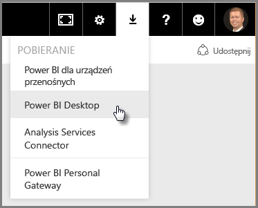
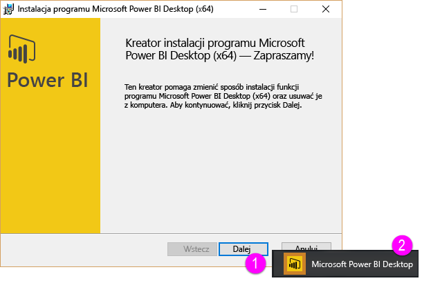
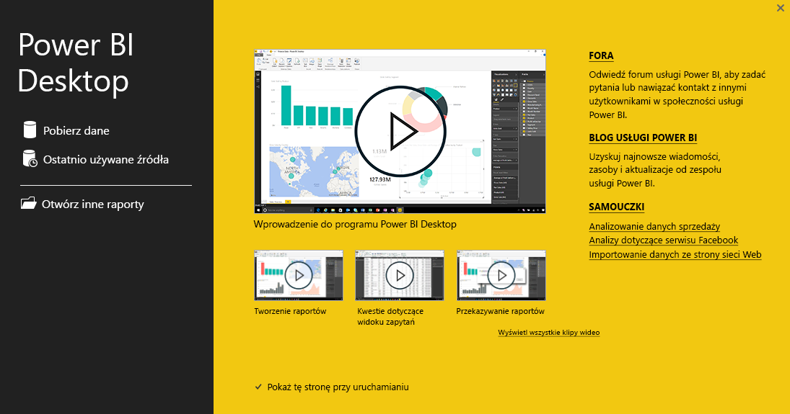
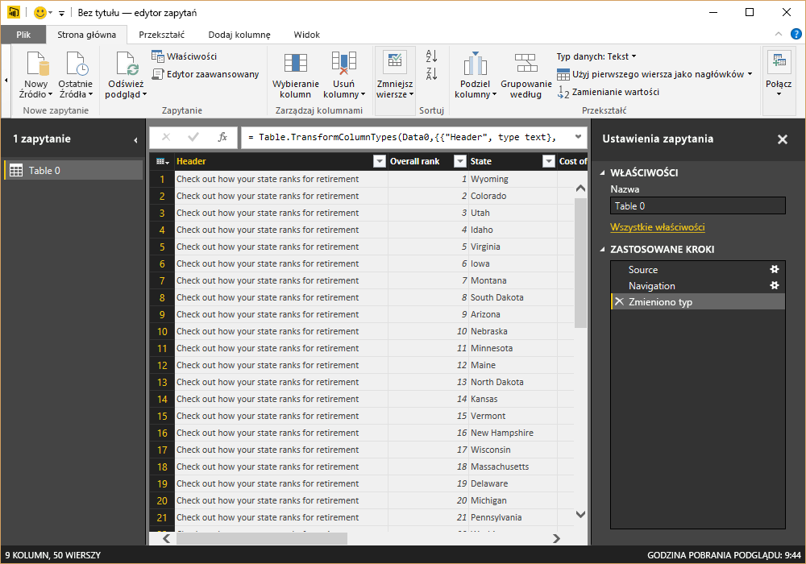
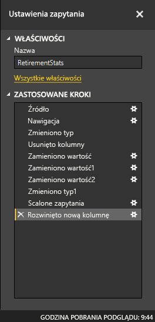
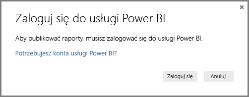

# Wprowadzenie do programu Power BI Desktop
Witamy **przewodniku Wprowadzenie do programu Power BI Desktop**. Ten krótki przewodnik po programie Power BI Desktop umożliwia zapoznanie się z działaniem programu, demonstruje jego możliwości i przyspiesza tworzenie niezawodnych modeli danych — wraz z zachwycającymi raportami — które uzupełniają działania w zakresie analizy biznesowej. 

Wolisz oglądać zamiast czytać? Możesz też [obejrzeć nasz wprowadzający film wideo](desktop-videos.md). A jeśli chcesz używać przykładowych danych podczas oglądania filmu, możesz [pobrać ten przykładowy skoroszyt programu Excel](http://go.microsoft.com/fwlink/?LinkID=521962).

Program Power BI Desktop umożliwia tworzenie kolekcji zapytań, połączeń danych i raportów, które z łatwością można udostępniać innym osobom. Program Power BI Desktop integruje sprawdzone technologie firmy Microsoft — zaawansowany aparat zapytań, modelowanie danych i wizualizacje — i współpracuje bezproblemowo z usługą internetową [**Power BI**](https://app.powerbi.com/).

Dzięki połączeniu programu **Power BI Desktop** (w którym analitycy i inne osoby mogą tworzyć zaawansowane połączenia danych, modele i raporty) z [**usługą Power BI**](https://preview.powerbi.com/) (w której raporty programu Power BI Desktop można udostępniać innym użytkownikom w celu ich wyświetlania lub wchodzenia z nimi w interakcje) nowe szczegółowe informacje ze świata danych można jeszcze łatwiej modelować, tworzyć, udostępniać i rozszerzać.

Dla analityków danych program Power BI Desktop to zaawansowane, elastyczne i wysoce dostępne narzędzie do łączenia i kształtowania danych, tworzenia niezawodnych modeli i opracowywania raportów o odpowiedniej strukturze.

## Jak używać tego przewodnika
Możesz użyć tego przewodnika na kilka sposobów — przeskanować go, aby uzyskać szybki przegląd informacji lub przeczytać uważnie każdą sekcję, aby dobrze zrozumieć sposób działania programu Power BI Desktop.

Jeśli nie masz czasu, możesz pobieżnie przejrzeć ten przewodnik w ciągu kilku minut, aby zrozumieć, jak działa program Power BI Desktop i jak go używać. Większą część tego przewodnika stanowią zrzuty ekranu, które wizualnie pokazują sposób działania programu Power BI Desktop.

Aby zapewnić bardziej dokładne zrozumienie, możesz przeczytać każdą sekcję, wykonać kroki i odejść z własnym plikiem programu Power BI Desktop gotowym do opublikowania w usłudze **Power BI** i udostępnienia innym osobom.

>[!NOTE]
>Istnieje również osobna, wyspecjalizowana wersja usługi **Power BI** o nazwie [**Serwer raportów usługi Power BI**](report-server/get-started.md) przeznaczona dla klientów, którzy chcą lokalnie obsługiwać swoje dane i raporty. Istnieje również przeznaczona do użycia z tą specjalną wersją oddzielna, wyspecjalizowana wersja programu **Power BI Desktop** o nazwie **Power BI Desktop dla serwera raportów usługi Power BI**, która działa tylko w przypadku wersji serwera raportów dla usługi Power BI. W tym artykule opisano standardowy program **Power BI Desktop**.

## Jak działa program Power BI Desktop
Przy użyciu programu Power BI Desktop możesz *łączyć się z danymi* (zazwyczaj wieloma źródłami danych), *kształtować dane* (przy użyciu zapytań tworzących interesujące, szczegółowe modele danych) oraz używać modeli do *tworzenia raportów* (do używania, rozwijania i współdzielenia przez inne osoby).

Po wykonaniu kroków zgodnie z oczekiwaniami — nawiązaniu połączenia, ukształtowaniu danych i utworzeniu raportu — możesz zapisać pracę w pliku programu Power BI Desktop, który ma rozszerzenie pbix. Pliki Power BI Desktop można udostępniać tak jak dowolne inne formaty plików, ale najbardziej atrakcyjnym sposobem udostępniania plików programu Power BI Desktop jest ich przekazanie (udostępnienie) w [**usłudze Power BI**](https://preview.powerbi.com/). 

Program Power BI Desktop centralizuje, upraszcza i ułatwia proces projektowania i tworzenia repozytoriów i raportów analizy biznesowej, który może być w innym przypadku odłączony, rozproszony i uciążliwy.

Chcesz spróbować? Zaczynajmy.

## Instalowanie i uruchamianie programu Power BI Desktop
Możesz pobrać program Power BI Desktop z usługi **Power BI**, wybierając ikonę **koła zębatego** i opcję **Power BI Desktop**.

Program Power BI Desktop jest instalowany jako aplikacja i jest uruchamiany na pulpicie.

Po uruchomieniu programu Power BI Desktop zostanie wyświetlony ekran *powitalny*.

Możesz użyć opcji **Pobierz dane**, zobaczyć **Ostatnio używane źródła** lub skorzystać z opcji **Otwórz inne** **Raporty** bezpośrednio z ekranu *powitalnego* (przy użyciu linków w okienku po lewej stronie). Jeśli zamkniesz ekran (ikona **x** w prawym górnym rogu), zostanie wyświetlony widok **Raport** programu Power BI Desktop.

Program Power BI Desktop zawiera trzy różne widoki: **Raport**, **Dane** i **Relacje**. Program Power BI Desktop zawiera również **Edytor zapytań**, który jest otwierany w osobnym oknie. W **Edytorze zapytań** możesz tworzyć zapytania i przekształcać dane, a następnie załadować dostosowany model danych do programu Power BI Desktop i tworzyć raporty.

Następujący ekran pokazuje trzy ikony widoków po lewej stronie programu Power BI Desktop: **Raport**, **Dane** i **Relacje**, od góry do dołu. Obecnie wyświetlany widok jest wskazywany przez żółty pasek wzdłuż lewej strony. W tym przypadku obecnie wyświetlany jest widok **Raport**. Możesz zmienić widoki, wybierając dowolną z tych trzech ikon.

Po zainstalowaniu programu Power BI Desktop masz wszystko gotowe, aby nawiązywać połączenia z danymi, kształtować dane i tworzyć raporty (zazwyczaj w tej kolejności). W kolejnych sekcjach omówimy każdy z tych kroków.

## Łączenie się z danymi
Po zainstalowaniu programu Power BI Desktop możesz połączyć się z nieustannie rozszerzającym się światem danych. W oknie zapytania są dostępne źródła danych *wielu typów*. Na poniższej ilustracji pokazano sposób łączenia z danymi przez wybranie wstążki **Narzędzia główne**, a następnie pozycji **Pobierz dane \> Więcej**.

 

W tym szybkim przewodniku nawiążemy połączenie z kilkoma różnymi **internetowymi** źródłami danych.

Wyobraź sobie, że przechodzisz na emeryturę — chcesz mieszkać w miejscu o dużym nasłonecznieniu, w którym stosuje się preferencyjne podatki i zapewnia się dobrą opiekę zdrowotną. A może jesteś analitykiem danych i potrzebujesz tych informacji, aby pomóc swoim klientom. Przykładowo chcesz pomóc sprzedawcy okularów przeciwsłonecznych w nakierowaniu sprzedaży na miejsca, w których słońce świeci najczęściej.

Tak czy siak, poniższy zasób internetowy zawiera interesujące dane dotyczące tych tematów i nie tylko:

[*http://www.bankrate.com/finance/retirement/best-places-retire-how-state-ranks.aspx*](http://www.bankrate.com/finance/retirement/best-places-retire-how-state-ranks.aspx)

Wybierz pozycję **Pobierz dane \> Internet** i wklej adres.

 

Po wybraniu przycisku **OK** funkcja **Zapytanie** programu Power BI Desktop przystępuje do pracy. Zapytanie łączy się z zasobem internetowym i w oknie **Nawigator** zwracane są wyniki znalezione na stronie internetowej. W tym przypadku została znaleziona tabela (*Table 0*) i cały dokument internetowy (Web Document). Interesuje nas tabela, więc wybieramy ją z listy. W oknie **Nawigator** pojawia się podgląd.

 

Na tym etapie możemy poddać edycji zapytanie przed załadowaniem tabeli, wybierając pozycję **Edytuj** u dołu okna, albo załadować tabelę.

Gdy wybierzemy opcję **Edytuj**, zostanie uruchomiony Edytor zapytań oraz zostanie wyświetlony reprezentatywny widok tabeli. Zostanie wyświetlone okienko **Ustawienia zapytania**. Jeśli tak się nie stanie, możesz wybrać pozycję **Wyświetl** ze wstążki, a następnie pozycje **Pokaż \> Ustawienia zapytania** w celu wyświetlenia okienka **Ustawienia zapytania**. Oto jak to wygląda.

 

Aby uzyskać więcej informacji o łączeniu się z danymi, zobacz [Nawiązywanie połączenia z danymi w programie Power BI Desktop](desktop-connect-to-data.md).

W następnej sekcji dostosujemy dane do naszych potrzeb. Proces dostosowania podłączonych danych nazywa się *kształtowaniem* danych.

## Kształtowanie i łączenie danych
Teraz po nawiązaniu połączenia ze źródłem danych musimy dostosować dane do naszych potrzeb. Czasami dostosowywanie oznacza *przekształcanie* danych, np. zmienianie nazw kolumn lub tabel, zmienianie tekstu na liczby, usuwanie wierszy, ustawianie pierwszego wiersza jako nagłówków i tak dalej.

W Edytorze zapytań programu Power BI Desktop bardzo często używane są menu dostępne po kliknięciu prawym przyciskiem myszy oraz zadania dostępne we wstążce. Większość opcji, które można wybrać we wstążce **Przekształć**, jest również dostępna po kliknięciu prawym przyciskiem myszy elementu (takiego jak kolumna) i wybraniu z menu, które zostanie wyświetlone.

## Kształtowanie danych
Kształtując dane w **Edytorze zapytań**, udostępniasz instrukcje krok po kroku (wykonywane przez **Edytor zapytań**), aby dostosować dane, które **Edytor zapytań** ładuje i prezentuje. Nie wpływa to na oryginalne źródło danych. Dostosowywanie, czyli *kształtowanie*, dotyczy tylko tego konkretnego widoku danych.

Określone kroki (takie jak zmiana nazwy tabeli, przekształcenie typu danych lub usunięcie kolumn) są rejestrowane przez **Edytor zapytań**, a następnie wykonywane za każdym razem, gdy to zapytanie połączy się ze źródłem danych. Dzięki temu dane są zawsze kształtowane zgodnie z Twoimi instrukcjami. Ten proces odbywa się za każdym, gdy użyjesz zapytania w programie Power BI Desktop lub gdy dowolny użytkownik użyje Twojego udostępnionego zapytania, na przykład w usłudze **Power BI**. Kroki są przechwytywane sekwencyjnie w okienku **Ustawienia zapytania** w obszarze **Zastosowane kroki**.

Poniższy obraz przedstawia okienko **Ustawienia zapytania** dla zapytania, które zostało ukształtowane — w kilku następnych akapitach przyjrzymy się każdemu z tych kroków.

 

Wróćmy do naszych danych dotyczących emerytury, które znaleźliśmy po nawiązaniu połączenia z internetowym źródłem danych, i ukształtujmy te dane zgodnie z naszymi potrzebami.

Po pierwsze większość klasyfikacji zostało przeniesionych do **Edytora zapytań** jako liczby całkowite, ale nie wszystkie z nich (jedna kolumna zawierała tekst i liczby, więc nie została automatycznie skonwertowana). Potrzebne nam są dane w formie liczb. Żaden problem — po prostu kliknij nagłówek kolumny prawym przyciskiem myszy i wybierz pozycje **Zmień typ \> Liczba całkowita** w celu zmiany typu danych. Aby w razie potrzeby zaznaczyć więcej niż jedną kolumnę, zaznacz kolumnę, naciśnij i przytrzymaj klawisz **SHIFT**, wybierz kolejne przyległe kolumny, a następnie kliknij prawym przyciskiem myszy nagłówek kolumny w celu zmienienia wszystkich zaznaczonych kolumn. Możesz też użyć klawisza **CTRL**, aby wybrać kolumny, które ze sobą nie sąsiadują.

 

Ponadto możesz zmienić lub *przekształcić* te kolumny z tekstu na nagłówek, korzystając ze wstążki **Przekształć**. Oto wstążka **Przekształć** i strzałka wskazująca przycisk **Typ danych**, który umożliwia przekształcenie bieżącego typu danych na inny.

 

Zauważ, że w okienku **Ustawienia zapytania** sekcja **Zastosowane kroki** odzwierciedla wprowadzone zmiany. Aby usunąć dowolny krok z procesu kształtowania, po prostu wybierz ten krok, a następnie wybierz symbol **X** po lewej stronie kroku.

 

Aby zapytanie było zgodne z naszymi oczekiwaniami, musimy wprowadzić jeszcze kilka zmian:

* *Usuniemy pierwszą kolumnę* — nie potrzebujemy jej. Zawiera tylko zbędne wiersze z tekstem „Check out how your state ranks for retirement”, co jest pozostałością po tym, że jest tabelą internetową.

<!-- -->

* *Naprawimy kilka błędów* — na stronie internetowej jedna z kolumn zawierała tekst i liczby (niektóre stany powiązane w jednej kategorii). Dane działają nieźle na stronie internetowej, ale niezbyt dobrze w przypadku naszej analizy danych. Naprawienie tego błędu jest proste (w tym przypadku) i zademonstruje nam ciekawe funkcje i możliwości **Edytora zapytań** i opcji **Zastosowane kroki**.

<!-- -->

* *Zmienimy nazwę tabeli* — **Table 0** nie jest przydatną nazwą, ale jej zmiana jest prosta.

Każdy z tych kroków został zaprezentowany w sekcji **[Kształtowanie i łączenie danych w programie Power BI Desktop](desktop-shape-and-combine-data.md)**. Możesz sprawdzić tę stronę lub kontynuować pracę z tym dokumentem, aby zobaczyć, co możesz zrobić dalej. Następna sekcja rozpoczyna się od momentu wprowadzenia powyższych zmian.

## Łączenie danych
Dane dotyczące różnych stanów są interesujące i będą użyteczne podczas tworzenia dodatkowych zapytań i analizowania. Jest jednak jeden problem: w większości istniejących danych używane są dwuliterowe skróty kodów stanów, a nie pełne nazwy. Potrzebujemy sposobu na skojarzenie nazw stanów z ich skrótami.

Mamy szczęście: istnieje inne publiczne źródło danych, które właśnie to robi, ale zanim połączymy je z naszą tabelą dotyczącą emerytur, konieczna będzie znaczna ilość operacji w celu ukształtowania danych. Oto zasób internetowy zawierający skróty nazw stanów:

<http://en.wikipedia.org/wiki/List_of_U.S._state_abbreviations>

Ze wstążki **Narzędzia główne** w **Edytorze zapytań** wybieramy polecenie **Pobierz dane\> Internet** i wpisujemy adres. Następnie wybieramy przycisk **OK**, a **Nawigator** wyświetli to, co znalazł na tej stronie internetowej.

 

Wybieramy tabelę **Table[edit]**, ponieważ zawiera ona dane, których potrzebujemy, ale dostosowanie danych z tej tabeli będzie wymagało znacznej liczby operacji kształtowania. Każdy z tych kroków został zaprezentowany również w sekcji **[Kształtowanie i łączenie danych w programie Power BI Desktop](desktop-shape-and-combine-data.md)**. Podsumujmy te kroki:

Wybierzemy opcję **Edytuj**, a następnie:

* *Usuniemy dwa pierwsze wiersze* — są one wynikiem sposobu utworzenia tabeli na stronie internetowej i nie są nam potrzebne.

<!-- -->

* *Usuniemy 26 ostatnich wierszy* — wszystkie one dotyczą terytoriów i nie musimy ich uwzględniać.

<!-- -->
* *Odfiltrujemy Waszyngton DC* — tabela statystyk dotyczących emerytury nie obejmuje regionu DC, więc wykluczymy go z naszej listy.

<!-- -->

* *Usuniemy kilka niepotrzebnych kolumn* — potrzebujemy tylko odwzorowania nazwy stanu na jej oficjalny dwuliterowy skrót, dlatego możemy usunąć inne kolumny.

<!-- -->

* *Użyjemy pierwszego wiersza jako nagłówków* — usunęliśmy trzy pierwsze wiersze i obecny pierwszy wiersz jest nagłówkiem, którego potrzebujemy.

    >[!NOTE]
    >To dobry moment na to, aby wspomnieć, że *kolejność* zastosowanych kroków w **Edytorze zapytań** jest istotna i może wpłynąć na kształt danych. Należy również pamiętać o tym, że jeden krok może wpłynąć na kolejne kroki. Jeśli usuniesz krok z obszaru **Zastosowane kroki**, kolejne kroki mogą zachowywać się inaczej niż oczekiwano z powodu wpływu sekwencji kroków w zapytaniu.

* *Zmienimy nazwy kolumn oraz samej tabeli* — jak zwykle istnieje kilka sposobów na zmianę nazwy kolumny. Możesz wybrać dowolny z nich.

Ukształtowaliśmy tabelę *StateCodes*, a teraz możemy połączyć te dwie tabele (zapytania) w jedną. Obecne tabele są wynikiem zapytań zastosowanych względem danych, dlatego często są nazywane *zapytaniami*.

Istnieją dwa podstawowe sposoby łączenia zapytań — *scalanie* i *dołączanie*.

Jeśli masz co najmniej jedną kolumnę, którą chcesz dodać do innego zapytania, **scalasz** zapytania. Jeśli masz dodatkowe wiersze danych, które chcesz dodać do istniejącego zapytania, wówczas **dołączasz** zapytanie.

W tym przypadku chcemy scalić zapytania. Aby rozpocząć, możemy wybrać zapytanie, *z którym* chcemy scalić inne zapytanie, a następnie wybrać opcję **Scal zapytania** na karcie **Narzędzia główne** na wstążce.

 

Zostanie wyświetlone okno **Scalanie** z prośbą o wybranie tabeli, która ma zostać scalona z wybraną tabelą, oraz pasujących kolumn na potrzeby scalania. Wybierz kolumnę *State* z tabeli (zapytania) *RetirementStats*, a następnie zapytanie *StateCodes* (w tym przypadku jest łatwo, ponieważ istnieje tylko jedno inne zapytanie — w przypadku nawiązania połączenia z wieloma źródłami danych istnieje wiele zapytań do wyboru). Gdy wybierzemy poprawne pasujące kolumny — *State* z zapytania *RetirementStats* i *State Name* z zapytania *StateCodes* — wówczas okno **Scalanie** będzie wyglądać podobnie, jak poniższe, a przycisk **OK** będzie włączony.

 

Na końcu zapytania zostanie utworzona kolumna **Nowa kolumna**, w której znajduje się zawartość tabeli (zapytania) scalonej z istniejącym zapytaniem. Wszystkie kolumny ze scalonego zapytania są zmniejszone do kolumny **Nowa kolumna**, ale można wybrać opcję **Rozwiń**, aby rozwinąć tabelę i dołączyć dowolne kolumny. Aby rozwinąć scaloną tabelę i wybrać kolumny do dołączenia, wybierz ikonę Rozwiń (). Zostanie wyświetlone okno **Rozwijanie**.

 

W tym przypadku potrzebujemy tylko kolumny *State Code*, dlatego wybieramy tylko ją, a następnie przycisk **OK**. Usuwamy zaznaczenie pola wyboru **Użyj oryginalnej nazwy kolumny jako prefiksu**, ponieważ nie potrzebujemy tej opcji. Jeśli to pole pozostanie zaznaczone, scalona kolumna będzie miała nazwę *Nowa kolumna.State Code* (oryginalna nazwa kolumny, czyli *Nowa kolumna*, kropka, a następnie nazwa kolumny wprowadzanej do zapytania).

>[!NOTE]
>Chcesz wypróbować wprowadzanie tej tabeli *Nowa kolumna*? Możesz trochę poeksperymentować, a jeśli nie spodobają Ci się wyniki, po prostu usuń ten krok z listy **Zastosowane kroki** w okienku **Ustawienia zapytania**. Zapytanie wróci do stanu sprzed zastosowania kroku **Rozwiń**. Możesz powtarzać te czynności dowolną liczbę razy, aż dostosujesz proces rozwijania do swoich potrzeb.

Teraz mamy pojedyncze zapytanie (tabelę), które łączy w sobie dwa źródła danych, a każde z nich zostało ukształtowane zgodnie z naszymi potrzebami. To zapytanie może służyć jako podstawa dla wielu dodatkowych, interesujących połączeń danych, takich jak statystyki wydatków na mieszkania, dane demograficzne lub oferty pracy w dowolnym stanie.

Aby uzyskać bardziej szczegółowy opis każdego z tych kroków kształtowania i łączenia danych, zobacz [Kształtowanie i łączenie danych w programie Power BI Desktop](desktop-shape-and-combine-data.md).

Na razie mamy dość danych, aby utworzyć kilka interesujących raportów w programie Power BI Desktop. Ponieważ jest to ważny etap, zapiszemy ten plik programu Power BI Desktop — nazwijmy go **Wprowadzenie do programu Power BI Desktop**. Aby zastosować zmiany w **Edytorze zapytań** i załadować je do programu Power BI Desktop, użyj opcji **Zamknij i zastosuj** na wstążce **Narzędzia główne**.

## Tworzenie raportów
Po załadowaniu tabeli można wprowadzić dodatkowe zmiany. Możesz też ponownie załadować model, aby zastosować wszelkie wprowadzone zmiany. Jednak chwilowo wystarczy to, co mamy. W widoku **Raport** programu Power BI Desktop możesz rozpocząć tworzenie raportów.

Widok **Raport** ma pięć głównych obszarów:

1. Wstążka, która wyświetla typowe zadania związane z raportami i wizualizacjami.
2. Widok **Raport** (czyli kanwa), w którym tworzy się i rozmieszcza wizualizacje.
3. Obszar karty **Strony** u dołu, który umożliwia wybranie lub dodanie strony raportu.
4. Okienko **Wizualizacje**, w którym można zmieniać wizualizacje, dostosowywać kolory lub osie, stosować filtry, przeciągać pola i wykonywać inne czynności.
5. Okienko **Pola**, w którym można przeciągać elementy zapytania i filtry do widoku **Raport** lub obszaru **Filtry** okienka **Wizualizacje**.
   
   

Okienka **Wizualizacje** i **Pola** można zwinąć, wybierając małą strzałkę wzdłuż krawędzi, co daje więcej miejsca w widoku **Raport** na tworzenie atrakcyjnych wizualizacji. Podczas modyfikowania wizualizacji te strzałki będą wskazywać w górę lub w dół, co oznacza, że odpowiednio można rozwinąć lub zwinąć tę sekcję.

 

Aby utworzyć wizualizację, po prostu przeciągnij pole z listy **Pola** do widoku **Raport**. W takim razie przeciągnijmy pole *Stan* z obszaru *RetirementStats* i zobaczmy, co się stanie.

 

Popatrz... Program Power BI Desktop automatycznie utworzył wizualizację opartą na mapie, ponieważ rozpoznał, że pole *Stan* zawiera dane geolokalizacji.

Zwróć uwagę, że w okienku **Wizualizacje** mogę wybrać różne rodzaje wizualizacji, a w obszarze poniżej tych ikon mogę przeciągnąć pola do innych obszarów, aby zastosować legendę lub w inny sposób zmodyfikować wizualizację.

 

Przyspieszmy nieco bieg wypadków i zobaczmy, jak widok **Raport** będzie wyglądać po dodaniu kilku wizualizacji oraz kilku nowych stron raportu. Aby uzyskać więcej informacji o raportach, zobacz [Widok raportu w programie Power BI Desktop](desktop-report-view.md).

Pierwsza strona raportu zapewnia perspektywę danych w oparciu o *Klasyfikację ogólną*. Gdy wybierzemy jedną z wizualizacji, okienko **Pola i filtry** wskaże wybrane pola i strukturę wizualizacji (które pola są zastosowane do pozycji **Udostępniona oś**, **Wartości kolumny** i **Wartości wiersza**).

 

Ten raport zawiera sześć **stron**. Każda strona wizualizuje wybrane elementy danych.

1. Pierwsza strona, pokazana powyżej, przedstawia wszystkie stany w oparciu o *Klasyfikację ogólną*.
2. Druga strona skupia się na dziesięciu najpopularniejszych stanach w oparciu o *Klasyfikację ogólną*.
3. Trzecia strona zawiera wizualizację najlepszych 10 stanów pod kątem kosztów utrzymania (i skojarzone dane).
4. Na czwartej stronie skupiono się na pogodzie z filtrowaniem do 15 najbardziej nasłonecznionych stanów.
5. Na piątej stronie opracowano wykresy i wizualizację dobrobytu społeczności dla 15 najlepszych stanów.
6. W końcu opracowano wizualizację statystyk dotyczących przestępczości, aby przedstawić najlepsze (oraz najgorsze) dziesięć stanów.

Oto jak wygląda strona raportu skupiająca się na kosztach utrzymania.

 

Istnieją różnego rodzaju interesujące raporty i wizualizacje, które możesz utworzyć.

## Udostępnianie wyników pracy
Teraz, skoro mamy już względnie ukończony raport programu Power BI Desktop, możemy udostępnić go innym osobom w usłudze **Power BI**. Istnieje kilka sposobów na udostępnianie pracy w programie Power BI Desktop. Możesz opublikować w usłudze **Power BI**, przekazać plik pbix bezpośrednio z usługi Power BI lub zapisać plik pbix i wysłać go tak jak każdy inny plik.

Najpierw przyjrzyjmy się opcji publikowania w usłudze **Power BI** bezpośrednio z programu Power BI Desktop. Na wstążce **Narzędzia główne** wybierz opcję **Publikuj**.

Może zostać wyświetlony monit logowania do usługi Power BI.

Po zalogowaniu i zakończeniu procesu publikowania zostanie wyświetlone następujące okno dialogowe.

Po zalogowaniu się do usługi Power BI zobaczysz załadowany plik programu Power BI Desktop w sekcjach **Pulpity nawigacyjne**, **Raporty** i **Zestawy danych** w usłudze.

Innym sposobem udostępnienia pracy jest załadowanie pliku z poziomu usług **Power BI**. Poniższy link otworzy usługę **Power BI** w przeglądarce:

`https://app.powerbi.com`

Wybierz opcję **Pobierz dane**, aby rozpocząć proces ładowania raportu programu Power BI Desktop.

 

Pojawi się strona **Pobieranie danych**, na której możesz wybrać, skąd chcesz pobrać dane. W tym przypadku wybieramy opcję **Pobierz** w polu **Pliki**.

Zostanie wyświetlony widok **Pliki**. W tym przypadku wybieramy opcję **Plik lokalny**.

Po wybraniu pliku usługa Power BI przekazuje plik.

Po przekazaniu pliku można wybrać plik w sekcji **Raporty** w okienku po lewej stornie w usłudze Power BI.

Usługa **Power BI** wyświetli pierwszą stronę raportu. Wzdłuż dolnej części strony możesz wybrać dowolną kartę, aby wybrać tę stronę raportu.

 

Możesz wprowadzić zmiany w raporcie w usłudze **Power BI**, wybierając opcję **Edytuj raport** w górnej części kanwy raportu.

Aby zapisać raport, wybierz opcję **Plik \> Zapisz jako** w usłudze. Istnieją różnego rodzaju interesujące wizualizacje, które możesz utworzyć w usłudze **Power BI** z raportu, a następnie przypiąć je do *pulpitu nawigacyjnego*. Aby dowiedzieć się więcej o pulpitach nawigacyjnych w usłudze **Power BI**, zobacz <strong>[Porady dotyczące projektowania doskonałych pulpitów nawigacyjnych](service-dashboards-design-tips.md)</strong>.

 

Po zapisaniu wybierz ikonę **Udostępnij** na stronie głównej.

 

W tym miejscu możesz wysłać wiadomość e-mail do współpracowników, którym chcesz udostępnić pulpit nawigacyjny.

 

Aby uzyskać więcej informacji o tworzeniu, udostępnianiu i modyfikowaniu pulpitów nawigacyjnych, zobacz [Udostępnianie pulpitu nawigacyjnego](service-share-dashboards.md).

Istnieją różne rodzaje interesujących kombinacji i wizualizacji związanych z danymi, które możesz wykonać przy użyciu programu Power BI Desktop i usługi Power BI. Zapoznaj się z następną sekcją, aby uzyskać więcej informacji.

## Diagnostyka

Program Power BI Desktop obsługuje nawiązywanie połączenia z portem diagnostycznym. Port diagnostyczny umożliwia innym narzędziom nawiązywanie połączenia i przeprowadzanie śledzeń w celach diagnostycznych. *Wprowadzanie jakichkolwiek zmian w modelu nie jest obsługiwane! Zmiany w modelu mogą prowadzić do uszkodzenia i utraty danych.*

## Następne kroki
Przy użyciu programu Power BI Desktop można wykonywać różnorodne zadania. Aby uzyskać więcej informacji na temat jego możliwości, skorzystaj z następujących zasobów:

* [Omówienie zapytań w programie Power BI Desktop](desktop-query-overview.md)
* [Źródła danych w programie Power BI Desktop](desktop-data-sources.md)
* [Łączenie się z danymi w programie Power BI Desktop](desktop-connect-to-data.md)
* [Kształtowanie i łączenie danych w programie Power BI Desktop](desktop-shape-and-combine-data.md)
* [Typowe zadania dotyczące zapytań w programie Power BI Desktop](desktop-common-query-tasks.md)   