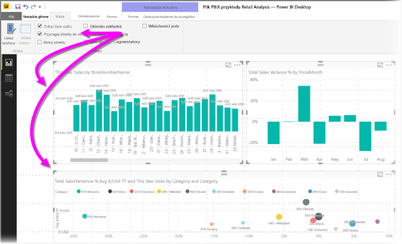
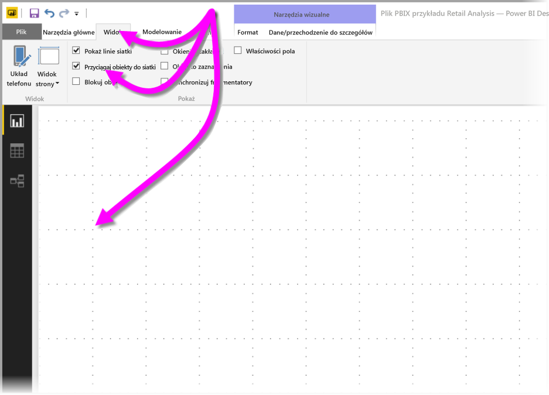
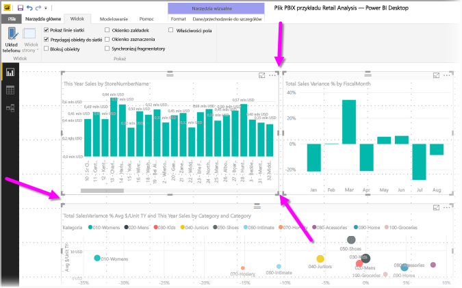
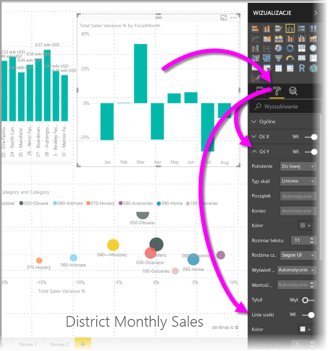
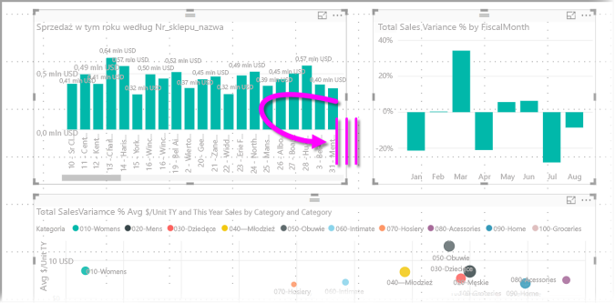
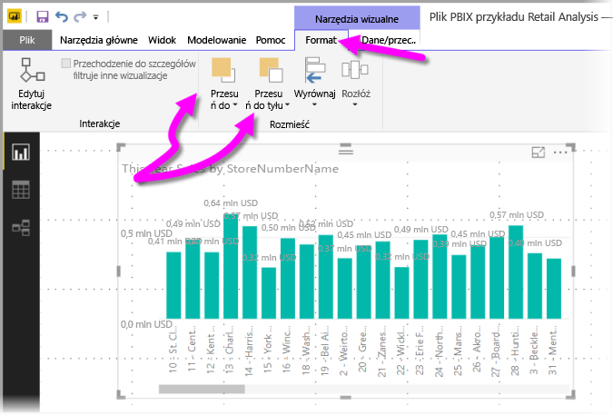
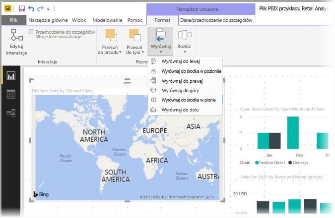
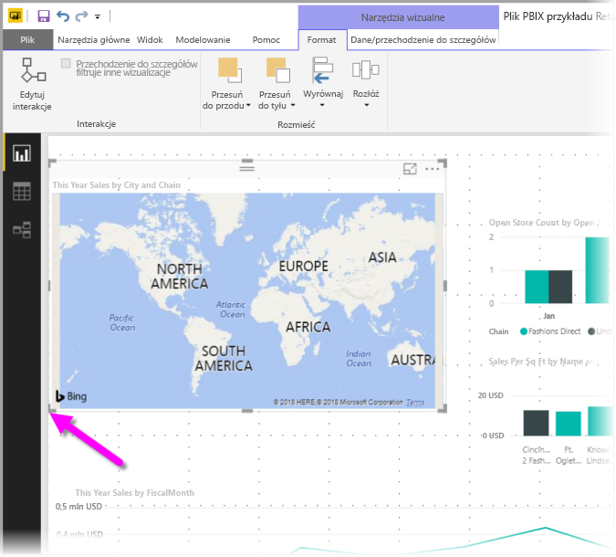
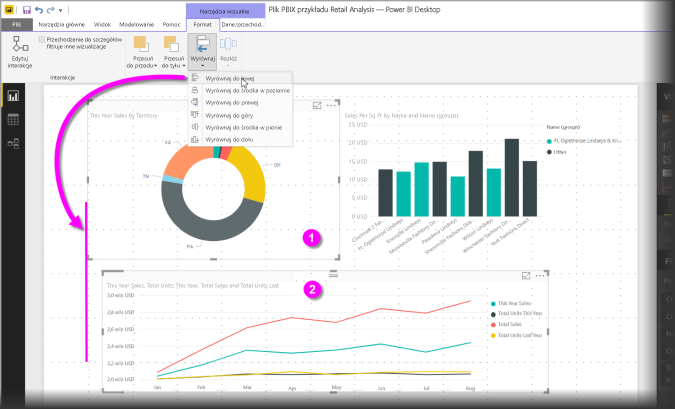
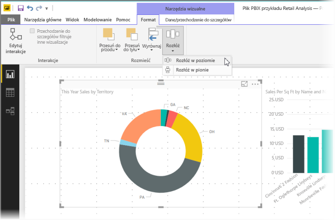

# Używanie linii siatki i przyciągania do siatki w raportach programu Power BI Desktop
Kanwa raportu programu **Power BI Desktop** udostępnia linie siatki, które pozwalają starannie wyrównywać wizualizacje na stronie raportu i korzystać z funkcji przyciągania do siatki, dzięki czemu wizualizacje w raportach wyglądają przejrzyście, są wyrównane i mają równe odstępy.

W programie **Power BI Desktop** można również dostosować porządek osi Z (przesuwanie do przodu i do tyłu) obiektów w raporcie, a także wyrównać lub równomierne rozłożyć wybrane wizualizacje na kanwie.

### Włączanie linii siatki i przyciągania do siatki
Aby włączyć linie siatki i przyciąganie do siatki, wybierz wstążkę **Widok**, a następnie zaznacz pola wyboru dla opcji **Pokaż linie siatki** i **Przyciągaj obiekty do siatki**. Możesz zaznaczyć jedną lub obie opcje, działają one niezależnie.

> [!NOTE]
> Jeśli opcje **Pokaż linie siatki** i **Przyciągaj obiekty do siatki** są wyłączone, połącz się z dowolnym źródłem danych, a zostaną one włączone.
> 
> 

### Używanie linii siatki
Linie siatki są widocznymi prowadnicami, które ułatwiają wyrównanie wizualizacji. Gdy próbujesz określić, czy dwie (lub więcej) wizualizacje są wyrównane w poziomie lub pionie, skorzystaj z linii siatki, aby ustalić, czy ich obramowania są wyrównane.

Możesz użyć kombinacji CTRL+kliknięcie, aby wybrać więcej niż jedną wizualizację naraz, co powoduje wyświetlenie obramowań wszystkich zaznaczonych wizualizacji, dzięki czemu możesz łatwo sprawdzić, czy wizualizacje są dobrze wyrównane.

#### Używanie linii siatki wewnątrz wizualizacji
W usłudze Power BI linie siatki znajdują się również wewnątrz wizualizacji —są one widocznymi prowadnicami umożliwiającymi porównywanie punktów danych i wartości. Począwszy od wersji programu **Power BI Desktop** z września 2017 r., liniami siatki wewnątrz wizualizacji można zarządzać przy użyciu kart **Oś X** lub **Oś Y** (odpowiednio w zależności od typu wizualizacji), które znajdują się w sekcji **Format** okienka **Wizualizacje**. Można zarządzać następującymi elementami linii siatki wewnątrz wizualizacji:

* Włączanie i wyłączanie linii siatki
* Zmienianie koloru linii siatki
* Dostosowywanie obrysu (szerokości) linii siatki
* Wybieranie stylu linii siatki w wizualizacji, takiego jak ciągła, kreskowana lub kropkowana

Modyfikowanie niektórych elementów linii siatki może być szczególnie przydatne w raportach, w których wizualizacje mają ciemne tło. Poniższy obraz przedstawia sekcję **Linie siatki** na karcie **Oś Y**.

### Używanie przyciągania do siatki
Po włączeniu opcji **Przyciągaj obiekty do siatki** wszystkie wizualizacje na kanwie programu **Power BI Desktop**, które będziesz przenosić (lub których rozmiar będziesz zmieniać), będą automatycznie wyrównywane do najbliższej osi siatki, znacznie ułatwiając wyrównywanie dwóch lub większej liczby wizualizacji do tej samej lokalizacji pionowej lub poziomej bądź do tego samego rozmiaru.

I to wszystko, jeśli chodzi o używanie **linii siatki** i **przyciągania do siatki** w celu zapewnienia starannego wyrównania wizualizacji w raportach.

### Używanie porządku osi Z, wyrównywania i rozkładania
Można zarządzać kolejnością od przodu do tyłu wizualizacji w raporcie, co często jest nazywane *porządkiem osi Z* elementów. Dzięki tej funkcji możesz dowolnie nakładać na siebie wizualizacje, a następnie dostosować kolejność od przodu do tyłu każdej wizualizacji. Do ustawiania porządku wizualizacji służą przyciski **Przesuń do przodu** i **Przesuń do tyłu** znajdujące się w sekcji **Rozmieszczanie** wstążki **Format**. Wstążka **Format** pojawia się natychmiast po wybraniu jednej lub kilku wizualizacji na stronie.

Za pomocą wstążki **Format** można wyrównywać wizualizacje na wiele różnych sposobów, co zapewnia wyrównanie wizualizacji na stronie w sposób, który wygląda i działa najlepiej.

Użycie przycisku **Wyrównaj** wyrównuje zaznaczoną wizualizację do krawędzi (lub środka) kanwy raportu, jak pokazano na poniższej ilustracji.

Gdy są wybrane co najmniej dwie wizualizacje, są one wyrównywane do siebie i do ich wyrównania jest używane istniejące wyrównane obramowanie wizualizacji. Na przykład po zaznaczeniu dwóch wizualizacji i wybraniu przycisku **Wyrównaj do lewej** zaznaczone wizualizacje zostaną wyrównane do skrajnego lewego obramowania wszystkich zaznaczonych wizualizacji.

Możesz również równomiernie rozłożyć wizualizacje na kanwie raportu w pionie lub w poziomie. Wystarczy użyć przycisku **Rozłóż** na wstążce **Formatowane**.

Dzięki wybraniu kilku opcji z tych narzędzi linii siatki, wyrównywania i rozkładania Twoje raporty będą wyglądały dokładnie tak, jak chcesz.

