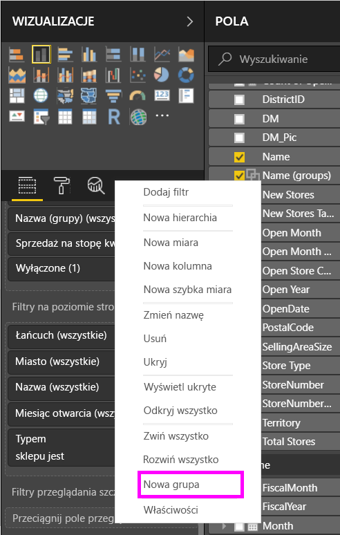
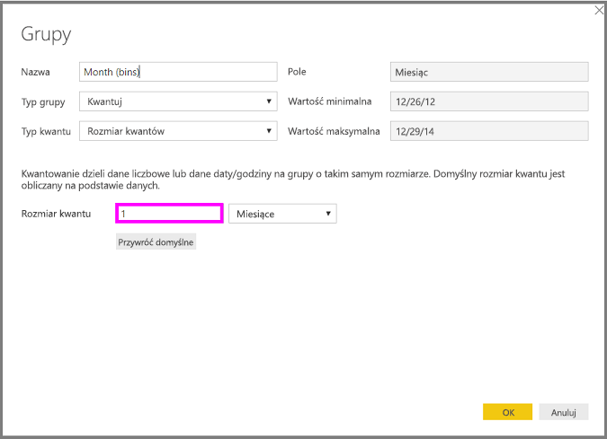
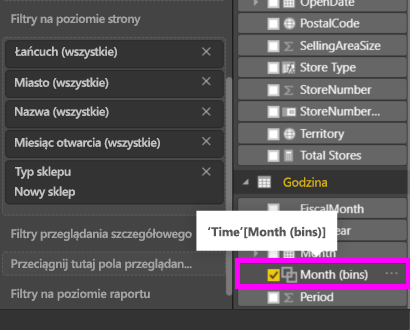

# Używanie grupowania i kwantowania w programie Power BI Desktop
Podczas tworzenia wizualizacji w programie **Power BI Desktop** dane są agregowane we fragmenty (czyli grupy) na podstawie wartości znalezionych w danych bazowych. W większości przypadków taka organizacja jest wystarczająca, ale mogą wystąpić sytuacje, kiedy zajdzie potrzeba doprecyzowania sposobu prezentowania tych fragmentów. Można na przykład umieścić trzy kategorie produktów w jednej większej kategorii (jednej *grupie*). Dane dotyczące sprzedaży można również podzielić na pojemniki o rozmiarach 1 000 000 dolarów, zamiast wynikającego z równego podziału rozmiaru 923 983 dolarów.

W programie Power BI Desktop można **grupować** punkty danych, aby ułatwić wyraźne wyświetlanie danych oraz ich analizowanie, a także eksplorowanie danych i trendów w wizualizacjach. Można również definiować **rozmiar pojemnika**, co jest często nazywane *kwantowaniem*, aby umieszczać wartości w równego rozmiaru grupach, co ułatwia wizualizowanie danych w zrozumiały sposób.

### Korzystanie z grupowania
Aby użyć grupowania, wybierz co najmniej dwa elementy wizualizacji, klikając je z naciśniętym klawiszem Ctrl w celu wybrania wielu elementów. Następnie kliknij prawym przyciskiem myszy jeden z wybranych elementów i w wyświetlonym menu wybierz polecenie **Grupuj**.

Po utworzeniu grupa jest dodawana do zasobnika **Legenda** wizualizacji, a także jest wyświetlana na liście **Pola**.

Po utworzeniu grupy można łatwo edytować jej elementy, klikając prawym przyciskiem myszy pole w zasobniku **Legenda** lub pozycję na liście **Pola**, a następnie wybierając polecenie **Edytuj grupy**.

W wyświetlonym oknie **Grupy** można tworzyć nowe grupy lub modyfikować istniejące. Można również *zmienić nazwę* dowolnej grupy przez dwukrotne kliknięcie tytułu grupy w polu **Grupy i elementy członkowskie** i wpisanie nowej nazwy.

Grup można używać w różnych sytuacjach. Elementy z obszaru **Niezgrupowane wartości** można dodawać do nowej grupy lub do jednej z istniejących grup. Aby utworzyć nową grupę, wybierz co najmniej dwa elementy (klikając je z naciśniętym klawiszem Ctrl) z obszaru **Niezgrupowane wartości**, a następnie kliknij przycisk **Grupuj** znajdujący się poniżej tego obszaru.

Niezgrupowaną wartość można dodać do istniejącej grupy. W tym celu wystarczy wybrać niezgrupowaną wartość, a następnie wybrać istniejącą grupę, do której ma ona zostać dodana, i kliknąć przycisk **Grupuj**. Aby usunąć element z grupy, wybierz go w obszarze **Grupy i elementy członkowskie**, a następnie kliknij przycisk **Rozgrupuj**. Istnieje również możliwość wybrania, czy niezgrupowane kategorie powinny zostać umieszczone w grupie **Inne**, czy powinny pozostać niezgrupowane.

> [!NOTE]
> Grupy można utworzyć dla dowolnego pola na karcie **Pola** bez konieczności wybierania wielu elementów z istniejącej wizualizacji. Wystarczy kliknąć pole prawym przyciskiem myszy i z wyświetlonego menu wybrać polecenie **Nowa grupa**.
> 
> 

### Korzystanie z kwantowania
W programie **Power BI Desktop** można ustawić rozmiar pojemnika dla pól liczbowych i pól czasu. Korzystając z kwantowania, można ustawić odpowiedni rozmiar dla danych wyświetlanych w programie **Power BI Desktop**.

Aby zastosować rozmiar pojemnika, kliknij **Pole** prawym przyciskiem myszy i wybierz polecenie **Nowa grupa**.

W oknie **Grupy** ustaw pożądany **Rozmiar pojemnika**.

Po wybraniu przycisku **OK** w okienku **Pola** pojawi się nowe pole z oznaczeniem *(pojemniki)*. Takie pole można następnie przeciągnąć na kanwę, aby użyć rozmiaru pojemnika w wizualizacji.

Aby zobaczyć **kwantowanie** w działaniu, obejrzyj ten [klip wideo](https://www.youtube.com/watch?v=BRvdZSfO0DY).

Zadaniem **grupowania** i **kwantowania** jest zapewnienie, że wizualizacje w Twoich raportach wyświetlają dane zgodnie z Twoimi oczekiwaniami.

