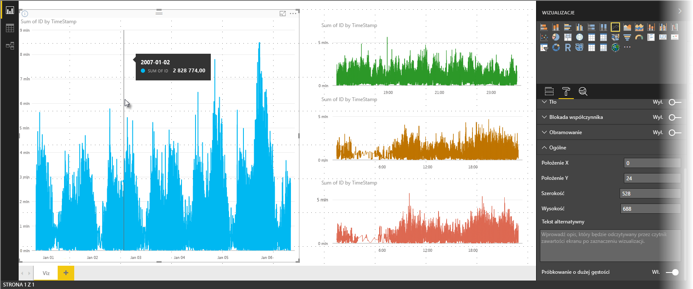
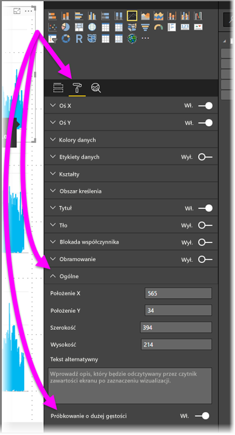

# Próbkowanie liniowe o wysokiej gęstości w usłudze Power BI
Wraz z wersją programu **Power BI Desktop** wydaną w czerwcu 2017 r. i aktualizacjami usługi **Power BI** dostępny jest nowy algorytm próbkowania, który usprawnia wizualizacje, które próbkują dane o wysokiej gęstości. Możesz na przykład utworzyć wykres liniowy wyników sprzedaży sklepów detalicznych wydających ponad 10 000 paragonów rocznie. Wykres liniowy tego rodzaju informacji sprzedażowych próbkuje dane (wybiera reprezentatywną próbę danych, aby pokazać, w jaki sposób sprzedaż zmienia się w czasie) z danych dla każdego sklepu i tworzy wykres liniowy składający się z wielu serii, który odzwierciedla dane bazowe. Jest to powszechną praktyką w przypadku wizualizowania danych o wysokiej gęstości, a program Power BI Desktop umożliwia teraz lepsze próbkowanie danych o wysokiej gęstości. Szczegółowe informacje przedstawiono w tym artykule.

> [!NOTE]
> Algorytm **próbkowania o wysokiej gęstości** opisany w tym artykule dotyczy programu **Power BI Desktop** oraz **usługi Power BI** i jest dostępny w obu środowiskach.
> 
> 

## Jak działa próbkowanie liniowe o wysokiej gęstości
Wcześniej usługa **Power BI** wybierała punkty danych do próby spośród całego zakresu danych bazowych w sposób deterministyczny. Na przykład w przypadku danych o wysokiej gęstości na wizualizacji obejmującej jeden rok kalendarzowy może być wyświetlona próba zawierająca 350 punktów danych, z których każdy został wybrany tak, aby zagwarantować, że wizualizacja będzie odzwierciedlać cały zakres danych (całą serię danych bazowych). Aby lepiej zrozumieć, jak to się dzieje, załóżmy, że tworzymy wykres cen akcji w okresie jednego roku i wybraliśmy 365 punktów danych, aby utworzyć wizualizację w formie wykresu liniowego (czyli jeden punkt danych na każdy dzień).

W takiej sytuacji w ciągu jednego dnia cena akcji ma różne wartości. Oczywiście istnieje też najwyższa lub najniższa cena w ciągu dnia, ale mogą one występować w dowolnym momencie dnia w godzinach otwarcia giełdy. W przypadku próbkowania liniowego o wysokiej gęstości jeśli wybrano próbę danych bazowych z godziny 10:30 i 12:00 każdego dnia, otrzymamy reprezentatywny obraz danych bazowych (ceny o godzinie 10:30 i 12:00), ale może on nie uwzględniać faktycznej najwyższej i najniższej ceny akcji dla tego reprezentatywnego punktu danych (dnia). W takich i innych sytuacjach próbkowanie jest reprezentatywne dla danych bazowych, ale nie zawsze odzwierciedla ważne punkty — w tym przypadku byłaby to najwyższa i najniższa cena akcji w ciągu dnia.

Zgodnie z definicją, dane o wysokiej gęstości są próbkowane tak, aby umożliwić w miarę szybkie tworzenie wizualizacji, i reagują na interakcję (nadmiar punktów danych na wizualizacji może ją przeciążyć i zmniejszyć widoczność trendów). Sposób próbkowania danych zapewniający najlepsze działanie wizualizacji stanowi podstawę tworzenia algorytmu próbkowania. W programie Power BI Desktop algorytm został ulepszony, aby połączyć krótki czas reakcji, reprezentatywność i czytelne przedstawienie ważnych punktów w każdym przedziale czasowym.

## Jak działa nowy algorytm próbkowania liniowego
Nowy algorytm próbkowania liniowego o wysokiej gęstości jest dostępny dla wizualizacji w formie wykresu liniowego oraz wykresu warstwowego z ciągłą osią X.

W przypadku wizualizacji o wysokiej gęstości usługa **Power BI** w sposób inteligentny dzieli dane na części o wysokiej rozdzielczości, a następnie wybiera ważne punkty, które reprezentują każdą część. Ten proces dzielenia danych o wysokiej rozdzielczości został dostosowany tak, aby zagwarantować, że wynikowy wykres wizualnie nie różni się od przedstawienia wszystkich punktów danych bazowych, ale jest znacznie szybszy i bardziej interaktywny.

### Minimalne i maksymalne wartości dla wizualizacji liniowej o wysokiej gęstości
W przypadku każdej wizualizacji stosowane są następujące ograniczenia:

* Maksymalna liczba *wyświetlanych* punktów danych na wizualizacji to **3500** bez względu na liczbę bazowych punktów danych lub serii. Dlatego jeśli masz dziesięć serii, a każda ma 350 punktów danych, to wizualizacja osiągnęła limit łącznej liczby punktów danych. Jeśli masz jedną serię, może mieć ona maksymalnie 3500 punktów danych, o ile nowy algorytm uzna to za najlepszy sposób próbkowania danych bazowych.
* W przypadku każdej wizualizacji maksymalna liczba serii wynosi **60**. Jeśli masz więcej niż 60 serii, podziel dane i utwórz kilka wizualizacji, które będą miały maksymalnie po 60 serii. Dobrym rozwiązaniem jest użycie **fragmentatora**, który umożliwia wyświetlenie tylko wybranych segmentów danych (tylko niektórych serii). Jeśli na przykład wyświetlane są wszystkie podkategorie w legendzie, można użyć fragmentatora, aby filtrować według ogólnej kategorii na tej samej stronie raportu.

Te parametry gwarantują, że wizualizacje w programie Power BI Desktop są przedstawiane bardzo szybko i są łatwe w obsłudze dla użytkownika. Nie powodują nadmiernego obciążenia komputera, na którym generowane są wizualizacje.

### Ocena reprezentatywnych punktów danych wizualizacji liniowych o wysokiej gęstości
Jeśli liczba punktów danych bazowych jest wyższa niż liczba punktów danych, które mogą być przedstawione na wizualizacji (3500), rozpoczyna się proces *pakowania*, czyli dzielenia danych bazowych na grupy zwane *pojemnikami*, a następnie wielokrotnie uściśla te pojemniki.

Algorytm tworzy możliwe jak najwięcej pojemników, aby wizualizacja była możliwe jak najbardziej szczegółowa. W ramach każdego pojemnika algorytm odnajduje minimalną i maksymalną wartość danych, aby zagwarantować, że ważne i istotne wartości (na przykład wartości odstające) zostaną uchwycone i przedstawione na wizualizacji. Na podstawie wyników pakowania i oceny danych przez usługę Power BI określana jest minimalna rozdzielczość osi x wizualizacji, tak aby zagwarantować maksymalną szczegółowość wizualizacji.

Jak już powiedziano, minimalna szczegółowość dla każdej serii to 350 punktów, a maksymalna 3500.

Każdy pojemnik jest reprezentowany przez dwa punkty danych, które stają się reprezentatywnymi punktami danych pojemnika na wizualizacji. Punkty danych to po prostu najwyższa i najniższa wartość z danego pojemnika. Dzięki wybraniu najwyższej i najniższej wartości proces pakowania gwarantuje, że istotne wysokie i niskie wartości zostaną uchwycone i przedstawione na wizualizacji.

Może się wydawać, że uchwycenie sporadycznie pojawiających się wartości odstających i przedstawienie ich na wizualizacji wymaga dużo analizowania — i tak właśnie jest. Właśnie dlatego opracowano nowy algorytm i proces pakowania.

## Etykietki ekranowe i próbkowanie liniowe o wysokiej gęstości
Należy zauważyć, że proces pakowania, którego wynikiem jest uchwycenie minimalnej i maksymalnej wartości w danym pojemniku i przedstawienie ich na wizualizacji, może mieć wpływ na sposób wyświetlania danych w etykietkach ekranowych po umieszczeniu kursora nad punktami danych. Aby wyjaśnić, jak i dlaczego tak się dzieje, wróćmy do naszego przykładu dotyczącego cen akcji z wcześniejszej części artykułu.

Załóżmy, że tworzymy wizualizację w oparciu o cenę akcji i porównujemy dwie różne akcje. W obu przypadkach używane jest **próbkowanie o wysokiej gęstości**. Dane bazowe dla każdej serii zawierają wiele punktów danych (na przykład cena akcji jest rejestrowana w każdej sekundzie dnia). Algorytm próbkowania liniowego o wysokiej gęstości wykonuje proces pakowania dla każdej serii niezależnie.

Załóżmy, że cena pierwszej akcji skacze o 12:02, a następnie spada dziesięć sekund później — to ważny punkt danych. W procesie pakowania dla tej akcji najwyższa cena z 12:02 będzie reprezentatywnym punktem danych dla tego pojemnika.

Ale w przypadku drugiej akcji o godzinie 12:02 cena nie była ani najwyższa, ani najniższa w pojemniku, który obejmuje ten okres — najwyższa i najniższa cena dla pojemnika, który obejmuje godzinę 12:02, mogła wystąpić trzy minuty później. W tej sytuacji, gdy po utworzeniu wykresu liniowego umieścisz kursor nad godziną 12:02, wyświetlona zostanie etykietka ekranowa z wartością dla pierwszej akcji (ponieważ skoczyła o 12:02, a ta wartość została wybrana jako najwyższy punkt danych tego pojemnika), ale *nie zostanie* wyświetlona wartość z godziny 12:02 dla drugiej akcji. Dzieje się tak dlatego, że druga akcja nie osiągnęła o tej godzinie ani najniższej, ani najwyższej ceny dla pojemnika, który obejmował godzinę 12:02. Zatem dla drugiej akcji nie ma danych z godziny 12:02 i dlatego w etykietce ekranowej nie zostaną wyświetlone dane.

Często dzieje się tak w przypadku etykietek ekranowych. Najwyższe i najniższe wartości dla danego pojemnika mogą nie odpowiadać idealnie równo wyskalowanym punktom wartości na osi x, dlatego etykietka ekranowa nie będzie zawierać wartości.  

## W jaki sposób włączyć próbkowanie liniowe o wysokiej gęstości
Nowy algorytm jest domyślnie **włączony**. Aby zmienić to ustawienie, przejdź do okienka **Formatowanie**, a na karcie **Ogólne** wzdłuż dolnej krawędzi zobaczysz suwak przełączania **Próbkowanie o dużej gęstości**. Aby wyłączyć to ustawienie, przesuń suwak do pozycji **Wyłączone**.

## Istotne zagadnienia i ograniczenia
Nowy algorytm próbkowania liniowego o wysokiej gęstości to ważne usprawnienie usługi Power BI, ale jest kilka istotnych kwestii, o których należy pamiętać, pracując z wartościami i danymi o wysokiej gęstości.

* Z uwagi na wyższą szczegółowość oraz proces pakowania wartości mogą być wyświetlane w **etykietkach ekranowych** wyłącznie wtedy, gdy reprezentatywne dane znajdują się w tej samej pozycji co kursor. Zapoznaj się z wcześniejszą sekcją tego artykuły dotyczącą **etykietek ekranowych**, aby uzyskać więcej informacji.
* Jeśli całkowity rozmiar źródła danych jest zbyt duży, nowy algorytm eliminuje serie (elementy legendy), aby dopasować je do górnego limitu importu danych.
  
  * W takiej sytuacji nowy algorytm porządkuje serie legendy alfabetycznie, a następnie przesuwa się w dół listy alfabetycznej, aż do górnego limitu importu danych, i nie importuje dodatkowych serii.
* Jeśli zestaw danych bazowych ma więcej niż 60 serii (czyli przekracza maksymalną liczbę serii), nowy algorytm porządkuje serie alfabetycznie i eliminuje te serie, które w kolejności alfabetycznej zajmują pozycje powyżej 60.
* Jeśli dane nie mają wartości typu *liczba* ani *data/godzina*, w usłudze Power BI zostanie zastosowany stary algorytm (próbkowanie o niskiej gęstości) zamiast nowego.
* Ustawienie **Pokaż elementy bez danych** nie jest obsługiwane przez nowy algorytm.
* Nowy algorytm nie jest obsługiwany podczas korzystania z połączenia na żywo z modelem hostowanym w usługach SQL Server Analysis Services (w wersji 2016 lub starszej). Jest obsługiwany w modelach hostowanych w usłudze **Power BI** lub usługach Azure Analysis Services.

## Następne kroki
Aby uzyskać informacje na temat próbkowania o wysokiej gęstości w przypadku wykresów punktowych, zapoznaj się z następującym artykułem.

* [High Density Sampling in Power BI scatter charts](desktop-high-density-scatter-charts.md) (Próbkowanie o wysokiej gęstości w wykresach punktowych w usłudze Power BI)

