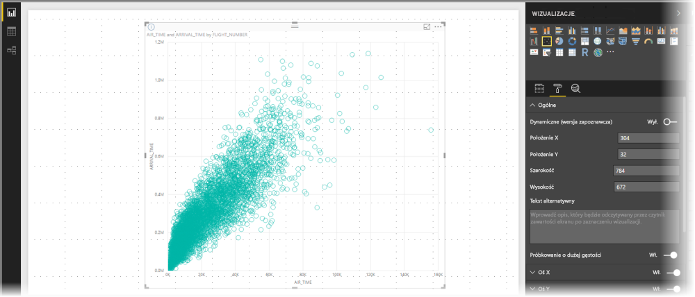

# Próbkowanie o wysokiej gęstości na wykresach punktowych w usłudze Power BI
Wraz z wersją programu **Power BI Desktop** wydaną we wrześniu 2017 r. i aktualizacjami usługi **Power BI** udostępniony został nowy algorytm próbkowania, poprawiający sposób przedstawiania danych o wysokiej gęstości na wykresach punktowych.

Możesz na przykład utworzyć wykres punktowy na podstawie danych sprzedaży w organizacji, obejmujących corocznie dziesiątki tysięcy punktów danych z każdego sklepu. Wykres punktowy mający przedstawiać tego rodzaju informacje próbkuje dostępne dane (wybiera reprezentatywną próbę danych, aby pokazać, w jaki sposób sprzedaż kształtuje się w czasie) i tworzy wykres punktowy, który odzwierciedla dane bazowe. Jest to powszechną praktyką w przypadku wykresów punktowych o wysokiej gęstości. Usługa Power BI oferuje teraz lepsze próbkowanie danych o wysokiej gęstości. Szczegółowe informacje przedstawiono w tym artykule.

> [!NOTE]
> Algorytm **próbkowania o wysokiej gęstości** opisany w tym artykule jest dostępny w wykresach punktowych programu **Power BI Desktop** oraz **usługi Power BI**.
> 
> 

## Jak działają wykresy punktowe o wysokiej gęstości
Wcześniej usługa **Power BI** podczas tworzenia wykresu punktowego wybierała punkty danych do próby spośród całego zakresu danych bazowych w sposób deterministyczny. Polegało to na wybraniu przez usługę Power BI pierwszego i ostatniego wiersza danych w serii wykresu punktowego, a następnie na równomiernym podzieleniu pozostałych wierszy tak, aby na wykresie punktowym wykreślone zostało łącznie 3500 punktów danych. Na przykład jeśli próba zawierała 35 000 wierszy, do wykreślenia wybierane były pierwszy i ostatni wiersz oraz co dziesiąty z pozostałych wierszy (35 000 / 10 = co dziesiąty wiersz = 3500 punktów danych). Wcześniej nie były również pokazywane wartości null ani punkty, których nie można wykreślić (na przykład wartości tekstowe), w serii danych — co prowadziło do ich pominięcia przy generowaniu wizualizacji. Takie próbkowanie powodowało również, że widoczna gęstość wykresu punktowego także zależała od reprezentatywnych punktów danych, a zatem o gęstości wizualnej decydowały wybrane punkty, a nie cały zbiór danych bazowych.

W przypadku włączenia **próbkowania o wysokiej gęstości** usługa Power BI stosuje algorytm eliminujący nakładające się na siebie punkty, zapewniając dostęp do wszystkich punktów danych na wizualizacji podczas korzystania z niej. Algorytm zapewnia również odzwierciedlenie na wizualizacji wszystkich punktów z zestawu danych wraz z kontekstem wskazującym na znaczenie wybranych punktów, a nie tylko wykreślenie reprezentatywnej próby.

Zgodnie z definicją, dane o wysokiej gęstości są próbkowane tak, aby umożliwić w miarę szybkie tworzenie wizualizacji, i reagują na interakcję. Nadmiar punktów danych na wizualizacji może ją przeciążyć i zmniejszyć widoczność trendów. Zatem sposób próbkowania danych zapewniający najlepsze działanie wizualizacji i odzwierciedlenie wszystkich danych stanowi podstawę tworzenia algorytmu próbkowania. W usłudze Power BI algorytm jest teraz ulepszony, aby połączyć krótki czas reakcji, reprezentatywność i czytelne przedstawienie ważnych punktów w całym zestawie danych.

> [!NOTE]
> Wykresy punktowe z zastosowaniem algorytmu **próbkowania o wysokiej gęstości**, podobnie jak inne wykresy punktowe, najlepiej wykreślać na wizualizacjach w kształcie kwadratu.
> 
> 

## Jak działa nowy algorytm próbkowania dla wykresów punktowych
Nowy algorytm **próbkowania o wysokiej gęstości** dla wykresów punktowych opiera się na metodach umożliwiających bardziej efektywne wybieranie i przedstawianie danych bazowych oraz eliminowanie nakładających się punktów. W tym celu na początek dla każdego punktu danych stosowany jest mały promień (rozmiar okręgu przedstawiającego dany punkt na wizualizacji). Następnie promień wszystkich punktów danych jest zwiększany. Jeśli co najmniej dwa punkty danych nakładają się, zostają przedstawione za pomocą jednego okręgu (o tym większym promieniu). Następnie algorytm kontynuuje zwiększanie promienia punktów danych do momentu pozostawienia na wykresie punktowym odpowiedniej liczby punktów danych — 3500.

Metody stosowane w ramach algorytmu zapewniają odzwierciedlenie na wynikowej wizualizacji wartości odstających. Podczas określania nakładania się punktów danych algorytm uwzględnia również skalę, dzięki czemu skale wykładnicze są odzwierciedlane wiernie w stosunku do bazowych punktów danych na wizualizacji.

Algorytm zachowuje także ogólny kształt wykresu punktowego.

> [!NOTE]
> W przypadku zastosowania algorytmu **próbkowania o wysokiej gęstości** do wykresów punktowych celem jest *dokładność rozkładu* danych, a *nie* sugerowana gęstość wizualna. Na przykład jeśli wykres punktowy zawiera dużą liczbę nakładających się okręgów w jednym obszarze (duże zagęszczenie), można pomyśleć, że znajduje się tam wiele punktów danych. Natomiast algorytm **próbkowania o wysokiej gęstości** może przedstawiać wiele punktów danych za pomocą jednego okręgu, a więc takie wizualne zagęszczenie nie będzie miało miejsca. Aby zobaczyć wybrany obszar bardziej szczegółowo, możesz go powiększyć za pomocą fragmentatorów.
> 
> 

Ponadto punkty danych, których nie można wykreślić (na przykład wartości null lub tekstowe), są ignorowane i wybierana jest inna wartość, którą można wykreślić — co umożliwia jeszcze dokładniejsze zachowanie rzeczywistego kształtu wykresu punktowego.

### Kiedy jest używany standardowy algorytm próbkowania dla wykresów punktowych
W pewnych sytuacjach algorytm **próbkowania o wysokiej gęstości** nie może być stosowany do wykresu punktowego, a zamiast niego jest używany pierwotny algorytm. Dotyczy to następujących sytuacji:

* Jeśli klikniesz prawym przyciskiem wartość w pozycji **Szczegóły**, a następnie wybierzesz pozycję **Pokaż elementy bez danych** w wyświetlonym menu, zostanie przywrócony pierwotny algorytm dla wykresu punktowego.
  
  
* Dowolne wartości na **osi odtwarzania** spowodują przywrócenie pierwotnego algorytmu dla wykresu punktowego.
* Jeśli na wykresie punktowym brakuje zarówno osi X, jak i Y, zostanie przywrócony pierwotny algorytm.
* Użycie **Linii współczynnika** w okienku **Analiza** spowoduje przywrócenie pierwotnego algorytmu dla wykresu.
  
  

## Jak włączyć próbkowanie o wysokiej gęstości dla wykresu punktowego
Aby włączyć **próbkowanie o wysokiej gęstości**, wybierz wykres punktowy, przejdź do okienka **Formatowanie**, rozwiń kartę **Ogólne** i u dołu karty ustaw suwak przełączania **Próbkowanie o dużej gęstości** w pozycji **Włączone**.

> [!NOTE]
> Po włączeniu przełącznika usługa Power BI podejmie próbę zastosowania algorytmu **próbkowania o wysokiej gęstości** zawsze, gdy będzie to możliwe. Jeśli nie będzie można zastosować tego algorytmu (na przykład w przypadku umieszczenia wartości na *osi odtwarzania*), suwak pozostanie w pozycji **Włączone** mimo przywrócenia standardowego algorytmu. Jeśli następnie usuniesz wartość z *osi odtwarzania* (lub zmienią się inne warunki, które uniemożliwiały zastosowanie algorytmu próbkowania o wysokiej gęstości), próbkowanie o wysokiej gęstości zostanie zastosowane automatycznie, ponieważ ta funkcja jest aktywna.
> 
> [!NOTE]
> Punkty danych są grupowane lub wybierane według indeksu. Użycie legendy nie wpływa na algorytm próbkowania, a jedynie na organizację wizualizacji.
> 
> 

## Istotne zagadnienia i ograniczenia
Algorytm próbkowania o wysokiej gęstości to ważne usprawnienie usługi Power BI, ale jest kilka istotnych kwestii, o których należy pamiętać, pracując z wykresami punktowymi i wartościami o wysokiej gęstości.

* Algorytm **próbkowania o wysokiej gęstości** działa tylko z połączeniem na żywo z modelami opartymi na usłudze Power BI, modelami zaimportowanymi oraz zapytaniem bezpośrednim.

## Następne kroki
Aby uzyskać więcej informacji na temat próbkowania o wysokiej gęstości w przypadku innych wykresów, zapoznaj się z następującym artykułem.

* [Próbkowanie liniowe o wysokiej gęstości w usłudze Power BI](desktop-high-density-sampling.md)

