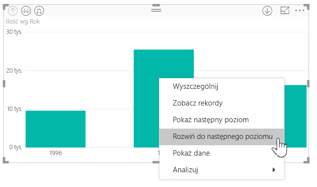

# Używanie etykiet hierarchii wbudowanych w programie Power BI Desktop
Program **Power BI Desktop** obsługuje **etykiety hierarchii wbudowanych**. Jest to pierwsza z dwóch funkcji mających na celu ulepszenie hierarchicznego przechodzenia do szczegółów. Druga funkcja, która jest aktualnie opracowywana, to możliwość używania etykiet hierarchii zagnieżdżonych (śledź nasze aktualizacje, ponieważ są one częste).   

## Jak działają etykiety hierarchii wbudowanych
Etykiety hierarchii wbudowanych pozwalają na wyświetlanie etykiet hierarchii podczas rozwijania wizualizacji przy użyciu funkcji **Rozwiń wszystko**. Jedną z głównych korzyści wyświetlania tych etykiet hierarchii jest możliwość **sortowania** według tych różnych etykiet hierarchii po rozwinięciu danych hierarchicznych.

### Korzystanie z wbudowanej funkcji Rozwiń (bez sortowania według etykiet hierarchii)
Zanim sprawdzimy, jak działają etykiety hierarchii wbudowanych, omówimy działanie domyślnej funkcji **Rozwiń do następnego poziomu**. To pomoże nam zrozumieć (i docenić), jak użyteczne mogą być etykiety hierarchii wbudowanych.

Na poniższej ilustracji przedstawiono wizualizację wykresu słupkowego dla sprzedaży rocznej. Po kliknięciu prawym przyciskiem myszy na pasku możesz wybrać polecenie **Rozwiń do następnego poziomu**.

> [!NOTE]
> Zamiast klikać prawym przyciskiem myszy na pasku, możesz też wybrać przycisk *Rozwiń* w lewym górnym rogu wizualizacji.

  

Po wybraniu polecenia **Rozwiń do następnego poziomu** hierarchia dat na wizualizacji zostanie rozwinięta z poziomu *Year* (Rok) do poziomu *Quarter* (Kwartał), jak pokazano na poniższej ilustracji.

Zwróć uwagę, że etykiety *Year* i *Quarter* są pokazywane w tekście razem — ten schemat etykietowania jest kontynuowany w przypadku użycia polecenia **Rozwiń wszystko** w celu rozwinięcia do końca hierarchii.

Tak się zachowuje hierarchia *Date*, skojarzona z polami o typie danych *data/godzina*. Przejdźmy do następnej sekcji i zobaczmy, czym różni się nowa funkcja etykiet hierarchii wbudowanych.

### Używanie etykiet hierarchii wbudowanych
Teraz przyjrzyjmy się innemu wykresowi — z danymi o hierarchii nieformalnej. Poniższa wizualizacja przedstawia wykres słupkowy ilości **Quantity**, gdzie osią jest nazwa produktu *ProductName*. W tym zestawie danych nazwa produktu *ProductName* i kraj wysyłki *ShipCountry* tworzą hierarchię nieformalną. W tym miejscu można ponownie wybrać polecenie *Rozwiń do następnego poziomu*, aby przejść do szczegółów hierarchii.

Wybranie polecenia **Rozwiń do następnego poziomu** powoduje pokazanie następnego poziomu i wyświetlenie w tekście etykiet hierarchii. Domyślnie hierarchie wbudowane są sortowane według wartości miary — w tym przypadku jest to wartość **Quantity**. Po włączeniu etykiet hierarchii wbudowanych można posortować te dane także według hierarchii, wybierając wielokropek w prawym górnym rogu (**...**), a następnie wybierając pozycję **Sortuj według > ProductName, ShipCountry**, jak pokazano na poniższej ilustracji.

Po wybraniu opcji **ShipCountry** dane są sortowane według wyboru hierarchii nieformalnej, jak pokazano na poniższej ilustracji.

> [!NOTE]
> Funkcja etykiet hierarchii wbudowanych nie umożliwia jeszcze sortowania wbudowanej hierarchii czasu według wartości — jest ona sortowana tylko według kolejności hierarchii.
> 
> 

## Rozwiązywanie problemów
Istnieje możliwość, że wizualizacja zostanie zablokowana w stanie rozwiniętego poziomu hierarchii wbudowanej. Czasami może się zdarzyć, że wizualizacja zostanie zablokowana w trybie, w którym została rozwinięta. W taki przypadku zwijanie szczegółów nie działa. Może się to stać po wykonaniu następujących czynności (rozwiązanie tego problemu znajduje się *poniżej* tych czynności):

Czynności, które mogą spowodować zablokowanie wizualizacji w stanie rozwiniętym:

1. Włączasz funkcję **etykiety hierarchii wbudowanych**
2. Tworzysz wizualizacje z hierarchiami
3. Używasz polecenia **Rozwiń wszystko** i zapisujesz plik
4. Następnie *wyłączasz* funkcję **etykiety hierarchii wbudowanych** i ponownie uruchamiasz program Power BI Desktop
5. Następnie ponownie otwierasz plik

Jeśli wykonasz te czynności i wizualizacje zostaną zablokowane w trybie rozwiniętym, możesz skorzystać z poniższej procedury, aby rozwiązać ten problem:

1. Włącz ponownie funkcję **etykiety hierarchii wbudowanych** i ponownie uruchom program Power BI Desktop
2. Otwórz ponownie plik i zwiń szczegóły zablokowanych wizualizacji
3. Zapisz plik
4. Wyłącz funkcję **etykiety hierarchii wbudowanych** i ponownie uruchom program Power BI Desktop
5. Otwórz ponownie plik

Możesz także usunąć swoją wizualizację i utworzyć ją od nowa.

