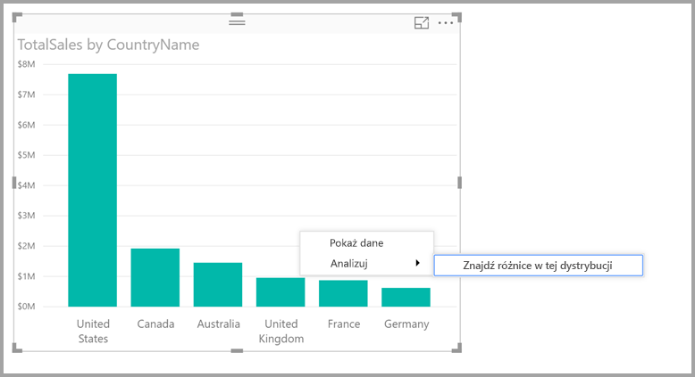
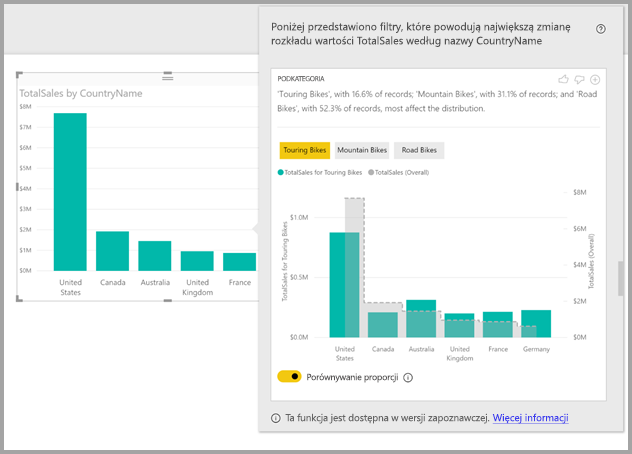

# Znajdowanie różnic w rozkładzie za pomocą funkcji szczegółowych informacji w programie Power BI Desktop (wersja zapoznawcza)

Podczas korzystania z wizualizacji często chcemy się dowiedzieć, czy w danym punkcie danych rozkład jest taki sam dla różnych kategorii. Możesz to łatwo sprawdzić za pomocą funkcji **szczegółowych informacji** w programie **Power BI Desktop**.

Przyjrzyjmy się poniższej wizualizacji, który przedstawia *łączną sprzedaż* według *kraju*. Jak widać na wykresie, większość sprzedaży dotyczy rynku amerykańskiego (57%) przy mniejszym udziale pozostałych krajów. W takich przypadkach często chcemy sprawdzić, czy rozkład jest taki sam dla innych podgrup. Na przykład: czy sytuacja wygląda tak samo we wszystkich latach, kanałach sprzedaży lub kategoriach produktów?  Można stosować różne filtry i wizualnie porównywać wyniki, ale taka metoda jest czasochłonna i podatna na błędy. 

Program **Power BI Desktop** umożliwia znajdowanie różnic w rozkładzie oraz pozwala uzyskiwać szybką, automatyczną i szczegółową analizę danych. Wystarczy kliknąć prawym przyciskiem myszy punkt danych i wybrać polecenie **Analizuj > Znajdź różnice w tej dystrybucji**. Szczegółowe informacje zostaną wyświetlone w nowym, wygodnym w użyciu oknie.

Zgodnie z przykładową, automatyczną analizą w kategorii *Touring Bikes* sprzedaż w Stanach Zjednoczonych i Kanadzie jest niższa, a w innych krajach — wyższa.   

> [!NOTE]
> Ta funkcja jest w wersji zapoznawczej i zostanie zmodyfikowana. Funkcja szczegółowych informacji jest domyślnie włączona (nie trzeba otwierać okna wersji zapoznawczej, aby ją włączyć), począwszy od wersji programu **Power BI Desktop** z września 2017 r.
> 
> 

## Korzystanie z funkcji szczegółowych informacji
Aby za pomocą szczegółowych informacji znaleźć różnice rozkładu na wykresach, po prostu kliknij prawym przyciskiem myszy dowolny punkt danych (lub całą wizualizację) i wybierz polecenie **Analizuj > Znajdź różnice w tej dystrybucji**.

Program **Power BI Desktop** uruchamia algorytmy uczenia maszynowego na odpowiednich danych i wyświetla nowe okno. Zawiera ono wizualizację oraz opis kategorii (kolumn) i wartości tych kolumn, które mają największy wpływ na różnice w rozkładzie. Szczegółowe informacje są dostępne jako wykres kolumnowy, jak pokazano na poniższej ilustracji. 

Po zastosowaniu filtru wartości są wyświetlane przy użyciu koloru domyślnego. Ogólne wartości, widoczne w początkowej wizualizacji, są wyświetlane na szaro w celu ułatwienia porównania. Można uwzględnić maksymalnie trzy różne filtry (w tym przykładzie *Touring Bikes*, *Mountain Bikes* i *Road Bikes*). Aby wybrać filtr, kliknij go (lub klikaj z wciśniętym klawiszem Ctrl w celu wybrania kilku filtrów).

W przypadku prostych miar addytywnych, takich jak *Total Sales* w tym przykładzie, porównanie jest oparte na wartościach względnych, a nie bezwzględnych. Chociaż sprzedaż w kategorii Touring Bikes jest wyraźnie niższa od łącznej sprzedaży dla wszystkich kategorii, w wizualizacji są domyślnie używane dwie osie, aby ułatwić zestawienie wielkości sprzedaży w kategorii Touring Bikes w różnych krajach ze sprzedażą we wszystkich kategoriach rowerów.  Przełączenie opcji widocznej pod wizualizacją powoduje wyświetlenie dwóch wartości na tej samej osi, co pozwala łatwo porównywać wartości bezwzględne (jak pokazano na poniższej ilustracji).    

Treść opisu zawiera liczbę rekordów, które spełniają warunki filtru, co również stanowi pewne wskazanie, jaką wagę ma wartość filtru. W tym przykładzie widać, że chociaż rozkład dla kategorii *Touring Bikes* może się znacznie różnić, produkty te stanowią tylko 16,6% rekordów.

Za pomocą ikon *kciuk w górę* i *kciuk w dół* znajdujących się w górnej części strony można wyrazić opinię na temat wizualizacji i funkcji. Zapewnia to informacje zwrotne, ale obecnie nie powoduje uczenia algorytmu pod kątem wpływania na wyniki zwracane podczas następnego użycia tej funkcji.

Przycisk **+** w górnej części wizualizacji umożliwia dodanie wybranej wizualizacji do raportu, tak jak w przypadku wizualizacji utworzonych ręcznie. Następnie wizualizację można formatować lub dopasowywać ją w inny sposób, tak jak każdą inną wizualizację w raporcie. Wybraną wizualizację szczegółowych informacji można dodać tylko podczas edytowania raportu w programie **Power BI Desktop**.

Szczegółowych informacji można używać w trybie do odczytu i w trybie edytowania raportu, dzięki czemu są one uniwersalne zarówno pod kątem analizowania danych, jak i tworzenia wizualizacji, które można łatwo dodawać do raportów.

## Szczegóły zwróconych wyników
Zasadniczo algorytm pobiera pozostałe kolumny w modelu, a następnie wszystkie wartości z tych kolumn stosuje jako filtry w pierwotnej wizualizacji w celu ustalenia, które wartości filtrów generują największe *różnice* względem oryginalnych wyników.

Można się zastanawiać, co to znaczy, że wyniki są *różne*. Na przykład załóżmy, że wielkość ogólnej sprzedaży w Stanach Zjednoczonych i Kanadzie jest następująca:

|Kraj  |Sprzedaż (w mln USD)|
|---------|----------|
|USA      |15        |
|Kanada   |5         |

W określonej kategorii produktów (*Road Bikes*) sprzedaż może wyglądać tak:

|Kraj  |Sprzedaż (w mln USD)|
|---------|----------|
|USA      |3        |
|Kanada   |1         |

Liczby w tabelach są różne, ale wartości względne są identyczne (75% do 25% ogólnie i w kategorii Road Bikes). Z tego względu powyższe wartości nie są traktowane jako różne. Dlatego w przypadku prostych miar addytywnych algorytm szuka różnic wartości *względnych*.  

Z kolei dla takiej miary jak marża, obliczanej jako stosunek zysku do kosztu, ogólne wartości w Stanach Zjednoczonych i Kanadzie wyglądają tak:

|Kraj  |Marża (%)|
|---------|----------|
|USA      |15        |
|Kanada   |5         |

W określonej kategorii produktów (*Road Bikes*) sprzedaż może wyglądać tak:

|Kraj  |Marża (%)|
|---------|----------|
|USA      |3        |
|Kanada   |1         |

Ze względu na charakter takich miar *należy* uznać, że występuje tu ciekawa różnica. W przypadku miar innych niż addytywne, takich jak ten przykład z marżą, algorytm szuka różnic w wartościach bezwzględnych.

W związku z tym wyświetlane wizualizacje mają wyraźnie pokazywać różnice między rozkładem ogólnym (widocznym w początkowej wizualizacji) a wartościami ujawnianymi po zastosowaniu określonego filtru.  

W przypadku miar addytywnych, takich jak *Sales* w poprzednim przykładzie, używane są wykres kolumnowy i wykres liniowy oraz dwie osie z odpowiednią skalą, które ułatwiają porównywanie wartości względnych. Kolumny przedstawiają wartości po zastosowaniu filtru, a linia reprezentuje ogólną wartość (oś kolumn znajduje się po lewej stronie, a oś linii po prawej, jak zwykle). Przerywana linia jest wyświetlana przy użyciu stylu *schodkowego* z obszarem wypełnionym na szaro. W poprzednim przykładzie maksymalna wartość na osi kolumn wynosi 4, a na osi linii — 20. Pozwala to łatwo porównywać wartości filtrowane i wartości ogólne dotyczące Stanów Zjednoczonych i Kanady. 

Wykres kolumnowo-liniowy używany jest również dla miar innych niż addytywne, takich jak *marża* z poprzedniego przykładu. Użycie jednej osi ułatwia porównywanie wartości bezwzględnych. Podobnie jak wcześniej wartość ogólna jest oznaczona linią (z wypełnionym szarym obszarem). W przypadku porównywania wartości rzeczywistych lub względnych określenie poziomu różnic między rozkładami nie zależy tylko od sposobu obliczania różnicy na podstawie wartości. Na przykład:

* Uwzględniana jest liczność grupy, ponieważ różnica jest mniej interesująca i mniej istotna statystycznie, jeśli dotyczy mniejszej części całej grupy. Na przykład rozkład sprzedaży w wielu krajach może bardzo się różnić dla konkretnego produktu. Ale to nie jest istotne, jeśli mówimy o tysiącach produktów, bo ten jeden produkt stanowi bardzo małą część ogólnej sprzedaży.

* Różnice w kategoriach, w których oryginalne wartości są bardzo duże lub bliskie zeru, mają większą wagę. Na przykład jeśli udział danego kraju w sprzedaży wynosi tylko 1%, ale dla konkretnego typu produktu udział wynosi 6%, jest to bardziej istotne statystycznie niż w przypadku kraju, w którym taki udział ma rozkład 50% do 55%. 

* Aby uzyskać najbardziej znaczące wyniki, stosowane są różne algorytmy heurystyczne, na przykład uwzględniające inne relacje w danych.
     
Po przeanalizowaniu różnych kolumn i wartości zawartych w tych kolumnach wybierany jest zbiór wartości, które generują największe różnice. W celu ułatwienia zrozumienia są one następnie grupowane według kolumn, przy czym w pierwszej kolumnie znajdują się wartości, które generują największą różnicę. W kolumnie są wyświetlane maksymalnie trzy wartości. Może ich być mniej, jeśli liczba wartości wywierających duży wpływ jest mniejsza niż trzy lub niektóre wartości mają znacznie większy wpływ niż inne. 

Zdarza się, że z powodu ograniczeń czasowych nie zostaną przeanalizowane wszystkie kolumny w modelu — nie ma wtedy gwarancji, że wyświetlane kolumny i wartości są tymi, które mają największy wpływ na wyniki. Jednak stosowane algorytmy heurystyczne mają na celu zapewnienie, że w pierwszej kolejności będą badane kolumny o największym znaczeniu. Na przykład po zbadaniu wszystkich kolumn może się okazać, że największy wpływ na rozkład mają następujące kolumny/wartości (ich kolejność odpowiada skali tego wpływu):

    Subcategory = Touring Bikes
    Channel = Direct
    Subcategory = Mountain Bikes
    Subcategory = Road Bikes
    Subcategory = Kids Bikes
    Channel = Store

Kolejność kolumn w danych wyjściowych jest następująca:

    Subcategory: Touring Bikes, Mountain Bikes, Road Bikes (only three listed, with the text including “...amongst others” to indicate that more than three have a significant impact) 

    Channel = Direct (only Direct listed, if it’s level of impact was much greater than Store)

## Istotne zagadnienia i ograniczenia
Poniżej znajduje się lista scenariuszy, które obecnie nie są obsługiwane przez funkcję **szczegółowych informacji**:

* Filtry TopN
* Filtry miary
* Miary nieliczbowe
* Użycie funkcji „Pokaż wartość jako”
* Miary filtrowane to obliczenia na poziomie wizualnym prowadzone po zastosowaniu określonego filtru (na przykład *łączna sprzedaż we Francji*). Są one używane w niektórych wizualizacjach utworzonych przez funkcję szczegółowych informacji

Ponadto następujące typy modeli i źródła danych nie są obecnie obsługiwane dla szczegółowych informacji:

* Zapytanie bezpośrednie
* Połączenie na żywo
* Lokalne usługi Reporting Services
* Osadzanie

## Następne kroki
Aby uzyskać więcej informacji na temat programu **Power BI Desktop** oraz dowiedzieć się, jak rozpocząć pracę w tym programie, zapoznaj się z następującymi artykułami.

* [Co to jest Power BI Desktop?](desktop-what-is-desktop.md)
* [Omówienie zapytań w programie Power BI Desktop](desktop-query-overview.md)
* [Źródła danych w programie Power BI Desktop](desktop-data-sources.md)
* [Łączenie się z danymi w programie Power BI Desktop](desktop-connect-to-data.md)
* [Kształtowanie i łączenie danych w programie Power BI Desktop](desktop-shape-and-combine-data.md)
* [Typowe zadania dotyczące zapytań w programie Power BI Desktop](desktop-common-query-tasks.md)   

