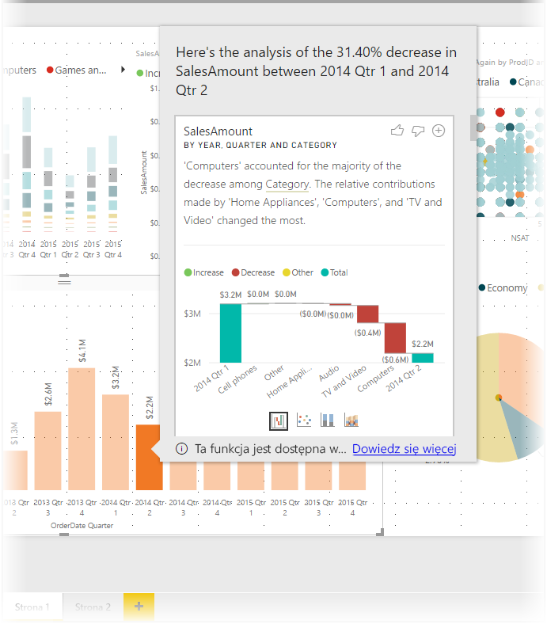
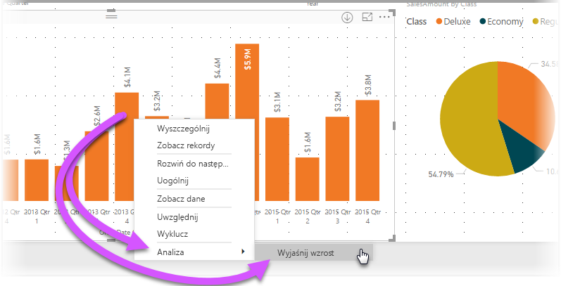
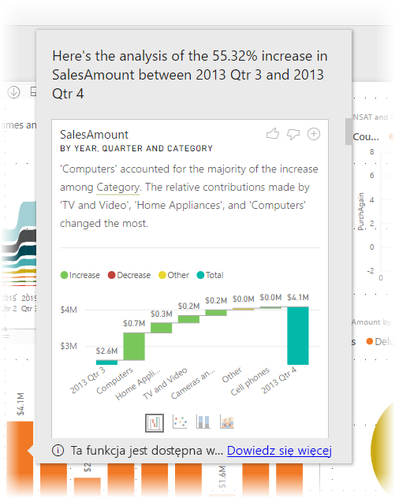
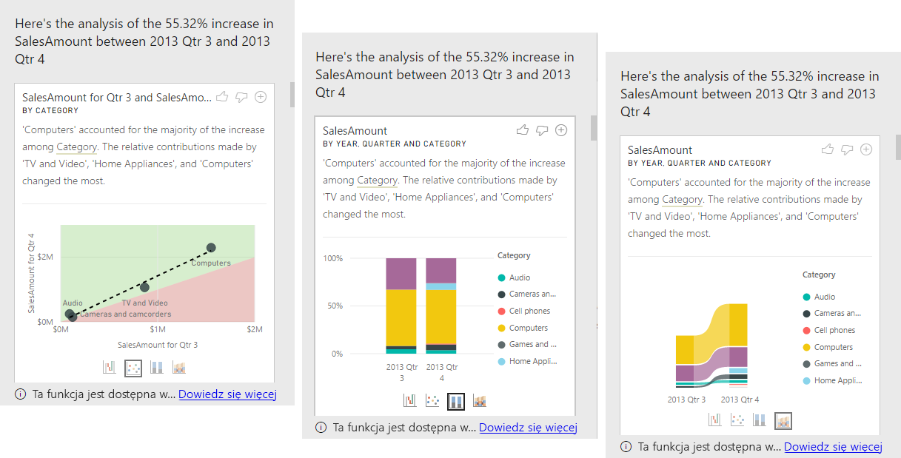

# Używanie funkcji szczegółowych informacji w programie Power BI Desktop w celu wyjaśniania wzrostów i spadków widocznych w wizualizacjach (wersja zapoznawcza)

Często w wizualizacjach można zauważyć duży wzrost, a następnie znaczny spadek wartości. Zastanawiasz się, co jest przyczyną takich wahań? Za pomocą funkcji **szczegółowych informacji** w programie **Power BI Desktop** możesz dowiedzieć się tego za pomocą kilku kliknięć.

Na przykład rozważmy następującą wizualizację, na której przedstawiono *kwotę sprzedaży* w danym *roku* i *kraju*. Duży spadek sprzedaży miał miejsce w 2014 r., gdy sprzedaż znacznie spadła między *1. kwartałem* i *2. kwartałem*. W takich przypadkach możesz eksplorować dane w celu znalezienia przyczyny takiej zmiany. 

Program **Power BI Desktop** może wyjaśnić wzrosty i spadki na wykresach, przedstawić współczynniki rozkładu na wykresach oraz dostarczyć szybką, automatyczną, szczegółową analizę danych. Po prostu kliknij prawym przyciskiem myszy punkt danych i wybierz pozycję **Analizuj > Wyjaśnij spadek** (lub wzrost, jeśli poprzedni słupek był niższy) albo pozycję **Analizuj > Wyszukaj miejsca, w których ten rozkład jest inny**. Szczegółowe informacje zostaną wyświetlone w łatwym do obsługi oknie.

Funkcja szczegółowych informacji jest kontekstowa i jest oparta na bezpośrednio poprzednim punkcie danych, takim jak poprzedni słupek lub kolumna.

> [!NOTE]
> Ta funkcja jest w wersji zapoznawczej i zostanie zmodyfikowana. Funkcja szczegółowych informacji jest domyślnie włączona (nie trzeba otwierać okna wersji zapoznawczej, aby ją włączyć), począwszy od wersji programu **Power BI Desktop** z września 2017 r.

## Korzystanie z funkcji szczegółowych informacji
Aby użyć funkcji szczegółowych informacji w celu wyjaśnienia wzrostów lub spadków widocznych na wykresie, po prostu kliknij prawym przyciskiem myszy dowolny punkt danych na wykresie słupkowym lub liniowym, a następnie wybierz pozycję **Analizuj > Wyjaśnij wzrost** (lub *Wyjaśnij spadek*, ponieważ wszystkie szczegółowe informacje są oparte na zmianie w stosunku do poprzedniego punktu danych).

Program **Power BI Desktop** uruchomi algorytmy uczenia maszynowego na odpowiednich danych i wypełni okno wizualizacją i opisem na temat kategorii, które miały największy wpływ na dany spadek lub wzrost. Szczegółowe informacje są domyślnie przekazywane jako wizualizacja *kaskadowa*, jak pokazano na poniższej ilustracji.

Korzystając z małych ikon w dolnej części tej wizualizacji kaskadowej, można wybrać, aby szczegółowe informacje zostały wyświetlone na wykresie punktowym, skumulowanym kolumnowym lub na wykresie wstążki.

Za pomocą ikon *kciuk w górę* i *kciuk w dół* znajdujących się w górnej części strony można wyrazić opinię na temat wizualizacji i funkcji. Zapewnia to informacje zwrotne, ale obecnie nie powoduje uczenia algorytmu pod kątem wpływania na wyniki zwracane podczas następnego użycia tej funkcji.

Przycisk **+** w górnej części wizualizacji umożliwia dodanie wybranej wizualizacji do raportu, tak jak w przypadku wizualizacji utworzonych ręcznie. Następnie wizualizację można formatować lub dopasowywać ją w inny sposób, tak jak każdą inną wizualizację w raporcie. Wybraną wizualizację szczegółowych informacji można dodać tylko podczas edytowania raportu w programie **Power BI Desktop**.

Szczegółowych informacji można używać w trybie do odczytu i w trybie edytowania raportu, dzięki czemu są one uniwersalne zarówno pod kątem analizowania danych, jak i tworzenia wizualizacji, które można łatwo dodawać do raportów.

## Szczegóły zwróconych wyników

Dane zwrócone przez funkcję szczegółowych informacji służą do wyróżnienia różnic między tymi dwoma okresami, aby lepiej zrozumieć zmiany, które wtedy nastąpiły.  

Na przykład jeśli *sprzedaż* wzrosła ogólnie o 55% między *3. kwartałem* i *4. kwartałem*, i ma to miejsce dla każdej *kategorii* produktu (sprzedaż komputerów wzrosła o 55%, sprzętu audio również i tak dalej), każdego kraju i każdego typu klienta, to w ramach danych nie ma wielu elementów, które pomogą w wyjaśnieniu zmian. Jednak taka sytuacja zwykle nie ma miejsca i zazwyczaj możliwe jest określenie różnic w tym, co się wydarzyło, czyli przykładowo w kategorii *Komputery* i *Sprzęt AGD* miał miejsce znacznie większy wzrost (o 63%), a w kategorii *TV i audio* wzrost wyniósł tylko 23%, w związku z czym kategorie *Komputery* i *Sprzęt AGD* miały większy wpływ na łączną wartość sprzedaży w *4. kwartale* niż w *3. kwartale*.  Dla tego przykładu uzasadnione wyjaśnienie byłoby następujące: *wyjątkowo dobra sprzedaż komputerów oraz sprzętu TV i audio*. 

Algorytm nie zwraca zatem po prostu wartości, które w największym stopniu uległy zmianie. Na przykład jeśli większość sprzedaży (98%) pochodzi ze Stanów Zjednoczonych, to zwykle świadczyłoby to o tym, że większość wzrostu również dotyczyłaby tego kraju. Jeśli jednak Stany Zjednoczone lub inne kraje nie osiągnęły znaczącej zmiany dotyczącej względnego wpływu na łączną wartość sprzedaży, *kraj* nie będzie rozważany w takim kontekście.  

Upraszczając, działanie algorytmu sprowadza się do pobrania wszystkich kolumn w modelu i obliczenia podziału według tej kolumny dla okresów *„przed”* i *„po”*, co pozwoli określić stopień zmiany w ramach tego podziału i zwrócenie kolumn z największą zmianą. Na przykład w powyższym przykładzie wybrano wartość *Kategoria*, ponieważ udział pozycji *TV i wideo* spadł o 7% z 33% do 26%, a udział pozycji *Urządzenia AGD* wzrósł z wartości 0% do 6%. 

Dla każdej zwróconej kolumny istnieją cztery wizualizacje, które można wyświetlić. Trzy z tych wizualizacji są przeznaczone do wyróżnienia zmiany w udziale między dwoma okresami. Na przykład w celu wyjaśnienia wzrostu między okresem *2. kwartał* i *3. kwartał*.

### Wykres punktowy

Wizualizacja w postaci wykresu punktowego przedstawia wartość miary w pierwszym okresie (oś X) względem wartości miary w drugim okresie (oś Y) dla każdej wartości w kolumnie. W tym przypadku jest to kolumna *Kategoria*. Jak więc pokazano na poniższym obrazie, wszystkie punkty danych znajdują się w regionie zielonym w przypadku wzrostu wartości lub w regionie czerwonym w przypadku jej spadku. 

Linia kropkowana pokazuje najlepsze dopasowanie, co oznacza, że punkty danych powyżej tej linii wzrosły o większą wartość niż wynosi ogólny trend, a te poniżej — o mniejszą.  

Należy pamiętać, że elementy danych, których wartość jest pusta w dowolnym z okresów, nie zostaną wyświetlone na wykresie punktowym. W tym przypadku dotyczy to wartości *Urządzenia AGD*.

### 100% skumulowany wykres kolumnowy

Wizualizacja 100% skumulowany wykres kolumnowy służy do wyświetlania wartości miary „przed” i „po” według wybranej kolumny przedstawionej jako 100% skumulowany wykres kolumnowy. Umożliwia to porównanie obok siebie udziału „przed” i „po”. Etykietki narzędzi pokazują rzeczywisty udział dla wybranej wartości.

### Wykres wstążkowy

Wizualizacja Wykres wstążkowy również służy do wyświetlania wartości miary „przed” i „po”. Jest to szczególnie przydatne podczas wyświetlania zmian w udziałach, dla których uległa zmianie *kolejność* elementów składowych, czyli na przykład wartość *Komputery* miała wcześniej największy udział, ale następnie spadła na pozycję 3. 

### Wykres kaskadowy

Czwarta wizualizacja to wykres kaskadowy przedstawiający główne rzeczywiste wzrosty lub spadki między okresami. Na tej wizualizacji w sposób czytelny przedstawiana jest rzeczywista zmiana, ale nie służy ona do wskazywania zmian w poziomie udziału, ale wskazuje, dlaczego kolumna została wybrana jako godna uwagi. 

Podczas klasyfikacji kolumny, dla której występują największe różnice we względnym udziale, rozważane są następuje kwestie: 

* Uwzględniania jest kardynalność, ponieważ różnica jest statystycznie mniej istotna i interesująca, gdy kolumna ma dużą kardynalność. 

* Różnice w kategoriach, w których oryginalne wartości są bardzo duże lub bliskie zeru, mają większą wagę. Na przykład jeśli udział danej kategorii w sprzedaży wynosi tylko 1%, ale wzrósł on do 6%, jest to statystycznie bardziej istotne niż w przypadku kategorii, w którym taki udział wzrósł z 50% do 55%. 

* Aby uzyskać najbardziej znaczące wyniki, stosowane są różne algorytmy heurystyczne, na przykład uwzględniające inne relacje w danych.
 
Po przeanalizowaniu różnych kolumn jako dane wyjściowe wybierane są kolumny z największą zmianą względnej wartości. Dla każdej takiej kolumny wartości, które miały najbardziej znaczący wpływ na zmianę udziału, zostaną wskazane w opisie. Ponadto wskazywane są również wartości, które miały największy rzeczywisty wzrost lub spadek.

## Istotne zagadnienia i ograniczenia
Ponieważ te szczegółowe informacje są oparte na zmianie w stosunku do poprzedniego punktu danych, nie są one dostępne po wybraniu pierwszego punktu danych w wizualizacji. 

Poniżej znajduje się lista scenariuszy, które obecnie nie są obsługiwane w przypadku **wyjaśniania wzrostu lub spadku**:

* Filtry TopN
* Filtry uwzględniające/wykluczające
* Filtry miary
* Miary nieliczbowe
* Użycie funkcji „Pokaż wartość jako”
* Miary filtrowane to obliczenia na poziomie wizualnym prowadzone po zastosowaniu określonego filtru (na przykład *łączna sprzedaż we Francji*). Są one używane w niektórych wizualizacjach utworzonych przez funkcję szczegółowych informacji
* Podzielone na kategorie kolumny na osi x, chyba że definiowane jest sortowanie według kolumny, która jest skalarna. W przypadku używania hierarchii każda kolumna w aktywnej hierarchii musi spełniać ten warunek

Ponadto następujące typy modeli i źródła danych nie są obecnie obsługiwane dla szczegółowych informacji:

* Zapytanie bezpośrednie
* Połączenie na żywo
* Lokalne usługi Reporting Services
* Osadzanie

## Następne kroki
Aby uzyskać więcej informacji na temat programu **Power BI Desktop** oraz dowiedzieć się, jak rozpocząć pracę w tym programie, zapoznaj się z następującymi artykułami.

* [Co to jest Power BI Desktop?](desktop-what-is-desktop.md)
* [Omówienie zapytań w programie Power BI Desktop](desktop-query-overview.md)
* [Źródła danych w programie Power BI Desktop](desktop-data-sources.md)
* [Łączenie się z danymi w programie Power BI Desktop](desktop-connect-to-data.md)
* [Kształtowanie i łączenie danych w programie Power BI Desktop](desktop-shape-and-combine-data.md)
* [Typowe zadania dotyczące zapytań w programie Power BI Desktop](desktop-common-query-tasks.md)   

