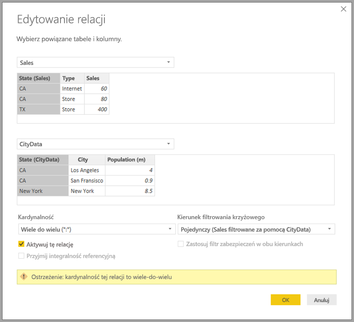
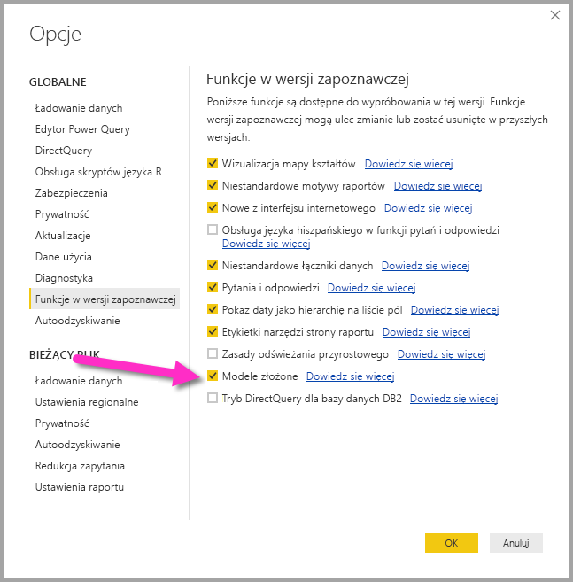

# Relacje wiele-do-wielu w programie Power BI Desktop (wersja zapoznawcza)

Funkcja *relacji wiele-do-wielu* w programie Power BI Desktop umożliwia łączenie tabel używających kardynalności *wiele-do-wielu*. Możesz łatwiej i bardziej intuicyjnie tworzyć modele danych zawierające co najmniej dwa źródła danych. Funkcja *relacji wiele-do-wielu* jest częścią większych możliwości *modeli złożonych* w programie Power BI Desktop.

Możliwość obsługi *relacji wiele-do-wielu* w programie Power BI Desktop jest jedną z trzech pokrewnych funkcji:

* **Modele złożone**: ta funkcja umożliwia użycie w raporcie co najmniej dwóch połączeń danych, takich jak połączenia trybu DirectQuery lub importowanie, w dowolnej kombinacji. Aby uzyskać więcej informacji, zobacz [Modele złożone w programie Power BI Desktop (wersja zapoznawcza)](desktop-composite-models.md).

* **Relacje wiele-do-wielu**: za pomocą *modeli złożonych* można ustanowić *relacje wiele-do-wielu* między tabelami. Takie rozwiązanie powoduje usunięcie wymagań dotyczących unikatowych wartości w tabelach. Powoduje również usunięcie poprzednich obejść, np. wprowadzania nowych tabel tylko w celu ustanowienia relacji. Funkcja została szczegółowo opisana w tym artykule.

* **Tryb przechowywania**: teraz możesz określić, które wizualizacje wymagają zapytania do źródeł danych zaplecza. Wizualizacje, które nie wymagają zapytania, są importowane, nawet jeśli są oparte na trybie DirectQuery. Ta funkcja pomaga zwiększyć wydajność i zmniejszyć obciążenie zaplecza. Wcześniej nawet proste wizualizacje, takie jak fragmentatory, inicjowały zapytania wysyłane do źródeł zaplecza. Aby uzyskać więcej informacji, zobacz [Tryb przechowywania w programie Power BI Desktop (wersja zapoznawcza)](desktop-storage-mode.md).

## Włączanie funkcji *relacji wiele do wielu* w wersji zapoznawczej

Funkcja *relacji wiele-do-wielu* musi być włączona w programie Power BI Desktop. Aby włączyć modele złożone, wybierz kolejno pozycje **Plik**  >  **Opcje i ustawienia**  >  **Opcje**  >  **Funkcje w wersji zapoznawczej**, a następnie zaznacz pole wyboru **Modele złożone**.

Aby włączyć tę funkcję, należy ponownie uruchomić program Power BI Desktop.

## Jakie problemy rozwiązuje *funkcja relacji wiele-do-wielu*

Kiedy funkcja *relacji wiele-do-wielu* nie była jeszcze dostępna, relacja między dwiema tabelami była zdefiniowana w usłudze Power BI. Co najmniej jedna z kolumn tabeli uczestniczących w relacji musiała zawierać unikatowe wartości. Często jednak żadna kolumna nie zawierała unikatowych wartości. 

Na przykład dwie tabele mogły mieć kolumnę z etykietą *Country* (Kraj), ale wartości *Country* nie były unikatowe w żadnej tabeli. Aby można było połączyć takie tabele, trzeba było utworzyć obejście problemu. Jednym z rozwiązań było wprowadzenie w modelu dodatkowych tabel z wymaganymi unikatowymi wartościami. Funkcja *relacji wiele-do-wielu* pozwala połączyć te tabele bezpośrednio przy użyciu relacji z kardynalnością **Wiele-do-wielu**.  

## Używanie *relacji wiele-do-wielu*

Podczas definiowania relacji między dwoma tabelami w usłudze Power BI należy zdefiniować kardynalność relacji. Na przykład relacja między tabelami *ProductSales* (Sprzedaż produktu) i *Product*&mdash; (Produkt) przy użyciu kolumn *ProductSales[ProductCode]* i *Product[ProductCode]*&mdash; zostaną zdefiniowane jako *Wiele-1*. Relacje są definiowane w ten sposób, ponieważ istnieje wiele operacji sprzedaży każdego produktu, a kolumna w tabeli *Product* (Produkt) *(ProductCode)* jest unikatowa. W przypadku definiowania kardynalności relacji jako *wiele-1*, *1-wiele* lub *1-1* usługa Power BI przeprowadza walidację, aby zapewnić zgodność wybranej kardynalności z rzeczywistymi danymi.

Spójrzmy na przykład na prosty model na poniższej ilustracji:

Załóżmy, że w tabeli *Product* (Produkt) są wyświetlane tylko dwa wiersze, jak pokazano na poniższej ilustracji:

Załóżmy również, że tabela *Sales* (Sprzedaż) zawiera tylko cztery wiersze, w tym wiersz dla produktu C. Wiersz produktu C nie istnieje w tabeli *Product* (Produkt) z powodu błędu więzów integralności.

Elementy *ProductName* (Nazwa produktu) i *Price* (Cena) (z tabeli *Product* (Produkt)) oraz łączna ilość (*Qty*) dla każdego produktu (z tabeli *ProductSales* (Sprzedaż produktu)), będą wyglądać jak na poniższej ilustracji: 

Jak pokazano na poprzedniej ilustracji, jest wyświetlany pusty wiersz *ProductName* (Nazwa produktu) skojarzony ze sprzedażą produktu C. Ten pusty wiersz odpowiada:

* Dowolnemu wierszowi w tabeli *ProductSales* (Sprzedaż produktu), który nie ma odpowiadającego wiersza w tabeli *Product* (Produkt). Wystąpił problem z więzami integralności, co widzimy w przypadku produktu *C* w tym przykładzie.

* Dowolnemu wierszowi w tabeli *ProductSales* (Sprzedaż produktu), dla którego kolumna klucza obcego ma wartość null. 

Z tych powodów w obydwu przypadkach pusty wiersz odpowiada operacji sprzedaży, w której wartości *ProductName* (Nazwa produktu) i *Price* (Cena) są nieznane.

Czasami tabele są łączone za pomocą dwóch kolumn, mimo że żadna z nich nie jest unikatowa. Na przykład rozważmy następujące dwie tabele:

* Tabela *Sales* (Sprzedaż) zawiera dane sprzedaży według wartości *State* (Stan), a każdy wiersz zawiera kwotę sprzedaży dla typu sprzedaży w danym stanie. Obejmuje to stany CA (Kalifornia), WA (Waszyngton) i TX (Teksas). 

    

* Tabela *CityData* (Dane miast) zawiera dane dotyczące miast, w tym populacji i stanu (w tym stanów CA (Kalifornia), WA (Waszyngton) i Nowy Jork).

    

Mimo że w obydwu tabelach istnieje kolumna *State* (Stan) i jest uzasadnione raportowanie łącznej wartości sprzedaży według stanu i całkowitej populacji poszczególnych stanów, istnieje problem: kolumna *State* (Stan) nie jest unikatowa w żadnej tabeli. 

## Poprzednie obejście

W programie Power BI Desktop w wersjach sprzed lipca 2018 r. użytkownicy nie mogli utworzyć bezpośredniej relacji między tymi tabelami. Typowym obejściem było wykonanie następujących czynności:

* Utworzenie trzeciej tabeli zawierającej tylko unikatowe identyfikatory stanów (*State*). Tabela może zawierać dowolne lub wszystkie z następujących elementów:
  * Tabela obliczeniowa (zdefiniowana przy użyciu języka Data Analysis Expressions [DAX]).
  * Tabela oparta na zapytaniu zdefiniowanym w edytorze zapytań, która może zawierać unikatowe identyfikatory z jednej z tabel.
  * Połączony pełny zestaw.

* Powiązanie dwóch oryginalnych tabel z nową tabelą za pomocą typowych relacji *wiele-1*.

Możesz pozostawić widoczną tabelę obejścia lub ukryć ją, aby nie była wyświetlana na liście **Pola**. W przypadku ukrycia tabeli relacje *wiele-1* są często ustawione w celu filtrowania w obu kierunkach. Ponadto można użyć pola *State* (Stan) z dowolnej tabeli. Kolejne filtrowanie krzyżowe będzie propagowane do innej tabeli. To rozwiązanie pokazano na poniższej ilustracji:

Wizualizacja z wartością *State* (Stan) (z tabeli *CityData* (Dane miast)) wraz z łącznymi wartościami *Population* (Populacja) i *Sales* (Sprzedaż) wyglądałaby tak, jak przedstawiono poniżej:

> [!NOTE]
> W tym obejściu jest używany stan z tabeli *CityData* (Dane miast), dlatego są wymieniane tylko stany z tej tabeli, w związku z czym stan TX jest wykluczany. Ponadto w odróżnieniu od relacji *wiele-1* wiersz sumy obejmuje wszystkie operacje typu *Sales* (Sprzedaż) (z uwzględnieniem stanu TX), ale szczegóły nie uwzględniają pustego wiersza obejmującego takie niedopasowane wiersze. Podobnie nie byłoby pustych wierszy obejmujących wartość *Sales* (Sprzedaż), dla której element *State* (Stan) miał wartość null.

Jeśli do tej wizualizacji dodano również element *City* (Miasto), a populacja danego elementu *City* (Miasto) jest znana, wartość *Sales* (Sprzedaż) wyświetlana dla elementu *City* (Miasto) będzie po prostu powtórzeniem wartości *Sales* (Sprzedaż) dla odpowiedniego elementu *State* (Stan). Taka sytuacja występuje zwykle w sytuacji, gdy grupowanie w kolumnie nie jest powiązane z miarą zagregowaną, jak pokazano na poniższej ilustracji:

Jeśli zdefiniowano nową tabelę *Sales* (Sprzedaż) jako kombinację wszystkich elementów *State* (Stan) w ramach tego obejścia i wyświetlono ją na liście **Pola**, ta sama wizualizacja będzie zawierać element *State* (Stan) w nowej tabeli, łączną wartość elementu *Population* (Populacja) i łączną wartość elementu *Sales* (Sprzedaż), jak pokazano na poniższej ilustracji:

Jak widać, jest wyświetlany stan *TX*&mdash; z danymi elementu *Sales* (Sprzedaż) i nieznanymi danymi elementu *Population* (Populacja)&mdash; oraz stan *Nowy Jork*&mdash; ze znanymi danymi elementu *Population* (Populacja), ale bez danych elementu*Sales*&mdash; (Sprzedaż). To obejście nie jest optymalne i powoduje wiele problemów. Utworzenie relacji wiele-do-wielu umożliwiło rozwiązanie tych problemów, tak jak opisano to w następnej sekcji.

## Używanie *relacji wiele-do-wielu* zamiast obejścia

Począwszy od programu Power BI Desktop w wersji z lipca 2018 r., można bezpośrednio tworzyć powiązania między tabelami, takie jak opisane wcześniej, bez konieczności stosowania podobnych obejść. Teraz można ustawić kardynalność relacji *Wiele-do-wielu*. To ustawienie wskazuje, że żadna tabela nie zawiera unikatowych wartości. W przypadku takich relacji można nadal kontrolować, która tabela filtruje drugą tabelę, lub stosować filtrowanie dwukierunkowe, w przypadku którego obie tabele filtrują siebie nawzajem.  

> [!NOTE]
> Możliwość tworzenia *relacji wiele-do-wielu* jest dostępna w wersji zapoznawczej. Kiedy funkcja jest dostępna w wersji zapoznawczej, nie można publikować w modelach usługi Power BI, które używają *relacji wiele-do-wielu*. 

W programie Power BI Desktop jest domyślnie ustawiana kardynalność *Wiele-do-wielu*, jeśli zostanie zidentyfikowana sytuacja, w której żadna z tabel nie zawiera unikatowych wartości kolumn w relacji. W takich przypadkach jest wyświetlane ostrzeżenie mające na celu potwierdzenie, że takie ustawienie relacji jest zamierzone i nie jest nieplanowanym efektem problemów z danymi. 

Na przykład podczas tworzenia relacji bezpośrednio między tabelami *CityData* (Dane miasta) i *Sales*&mdash; (Sprzedaż), w której filtry powinny przepływać z tabeli *CityData* (Dane miasta) do tabeli *Sales*&mdash; (Sprzedaż),w programie Power BI Desktop jest wyświetlane okno **Edytowanie relacji**, takie jak na poniższej ilustracji:

Wynikowy widok **Relacje** zawierałby bezpośrednią relację wiele-do-wielu między dwiema tabelami. Wygląd tabel na liście **Pola** i ich następne zachowanie podczas tworzenia wizualizacji są podobne do tych z zastosowanego obejścia. W obejściu dodatkowa tabela zawierająca odrębne dane elementu *State* (Stan) nie jest widoczna. Na przykład zgodnie z opisem w poprzedniej sekcji wizualizacja zawiera elementy *State* (Stan), *Population* (Populacja) i *Sales* (Sprzedaż) wyświetlane w następujący sposób:

Główna różnica między relacjami *wiele-do-wielu* i bardziej typowymi relacjami *wiele-1* byłaby następująca:

* Wyświetlane wartości nie uwzględniają pustego wiersza, który odpowiada niezgodnym wierszom w drugiej tabeli. Wartości nie odpowiadają też wierszom, w których kolumna używana w relacji w drugiej tabeli ma wartość null.
* Nie można używać funkcji `RELATED()`, ponieważ może być powiązany więcej niż jeden wiersz.
* Użycie funkcji `ALL()` w tabeli nie powoduje usunięcia filtrów stosowanych w innych powiązanych tabelach za pomocą relacji wiele-do-wielu. W poprzednim przykładzie miara zdefiniowana tak jak w poniższym skrypcie nie będzie usuwać filtrów w kolumnach powiązanej tabeli *CityData* (Dane miast):

    

    Wizualizacja przedstawiająca dane *State* (Stan), *Sales* (Sprzedaż) i *Sales Total* (Całkowita sprzedaż) byłaby następująca:

    

Pamiętając o poprzednich różnicach, upewnij się, że obliczenia używające funkcji `ALL(\<Table>)`, takiej jak *% sumy końcowej*, zwracają oczekiwane wyniki. 

## Ograniczenia i istotne zagadnienia

Istnieje kilka ograniczeń tej wersji *relacji wiele-do-wielu* i modeli złożonych.

Następujących źródeł wielowymiarowych programu Live Connect nie można używać z modelami złożonymi:

* SAP HANA
* SAP Business Warehouse
* SQL Server Analysis Services
* Zestawy danych usługi Power BI
* Azure Analysis Services

W przypadku łączenia ze źródłami wielowymiarowymi w trybie DirectQuery nie można połączyć się z innym źródłem DirectQuery ani połączyć go z danymi importowanymi.

Istniejące ograniczenia użycia trybu DirectQuery nadal obowiązują w przypadku korzystania z *relacji wiele-do-wielu*. Wiele z tych ograniczeń jest teraz określanych na tabelę, w zależności od trybu przechowywania tabeli. Na przykład kolumna obliczeniowa w zaimportowanej tabeli może odwoływać się do innych tabel, ale kolumna obliczeniowa w tabeli DirectQuery nadal może odwoływać się tylko do kolumn w tej samej tabeli. Inne ograniczenia mają zastosowanie do modelu jako całości, jeśli dowolne tabele w modelu działają w trybie DirectQuery. Na przykład funkcje QuickInsights oraz Pytania i odpowiedzi nie są dostępne w modelu, jeśli dowolne uwzględnione w nim tabele mają ustawiony tryb przechowywania DirectQuery. 

## Następne kroki

Aby uzyskać więcej informacji na temat modeli złożonych i trybu DirectQuery, zobacz następujące artykuły:
* [Modele złożone w programie Power BI Desktop (wersja zapoznawcza)](desktop-composite-models.md)
* [Tryb przechowywania w programie Power BI Desktop (wersja zapoznawcza)](desktop-storage-mode.md)
* [Używanie zapytania bezpośredniego w programie Power BI Desktop](desktop-directquery-about.md)
* [Źródła danych obsługiwane przez tryb DirectQuery w programie Power BI Desktop](desktop-directquery-data-sources.md)
