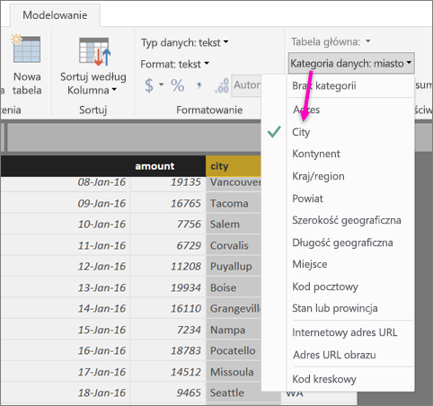
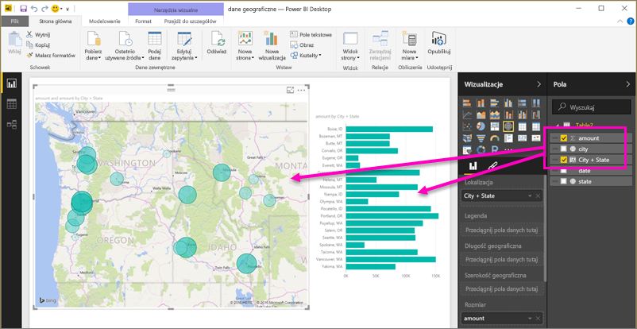
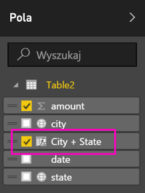

# Ustawianie filtrów geograficznych w programie Power BI Desktop dla aplikacji mobilnych
W programie Power BI Desktop możesz [skategoryzować dane geograficzne](desktop-data-categorization.md) dla kolumny, aby poinformować program Power BI Desktop, jak ma traktować wartości w wizualizacjach w raporcie. Dodatkowo gdy Ty lub Twoi współpracownicy wyświetlą ten raport w aplikacjach mobilnych usługi Power BI, usługa Power BI automatycznie udostępni filtry geograficzne, które pasują do miejsca, gdzie się znajdujesz. 

Załóżmy przykładowo, że jesteś menedżerem sprzedaży podróżującym na spotkanie z klientami i chcesz szybko przefiltrować łączną wartość sprzedaży i przychodu dla określonego klienta, z którym planujesz się spotkać. Możesz rozbić dane dla bieżącej lokalizacji według regionu, miasta lub rzeczywistego adresu. Jeśli zostanie czas, być może zechcesz odwiedzić innych klientów znajdujących się w pobliżu. Możesz [przefiltrować raport według swojej lokalizacji, by znaleźć tych klientów](consumer/mobile/mobile-apps-geographic-filtering.md).

> [!NOTE]
> W aplikacji mobilnej filtrować według lokalizacji można tylko wtedy, jeśli nazwy geograficzne w raporcie są w języku angielskim — na przykład „New York City” lub „Germany”.
> 
> 

## Identyfikowanie danych geograficznych w raporcie
1. W programie Power BI Desktop przejdź do widoku danych .
2. Wybierz kolumnę z danymi geograficznymi — na przykład kolumnę City (Miasto).
   
    
3. Na karcie **Modelowanie** wybierz pozycję **Kategoria danych**, a następnie prawidłową kategorię — w tym przykładzie **Miasto**.
   
    
4. Kontynuuj ustawianie kategorii danych geograficznych dla innych pól w modelu. 
   
   > [!NOTE]
   > Możesz ustawić wiele kolumn dla każdej kategorii danych w modelu, ale jeśli to zrobisz, model nie będzie filtrował lokalizacji geograficznych w aplikacji mobilnej Power BI. Aby korzystać z filtrowania lokalizacji geograficznej w aplikacjach mobilnych, ustaw tylko jedną kolumnę dla każdej kategorii danych — na przykład tylko jedną kolumnę **Miasto**, jedną kolumnę **Województwo** i jedną kolumnę **Kraj**. 
   > 
   > 

## Tworzenie wizualizacji za pomocą danych geograficznych
1. Przełącz się do widoku raportu i utwórz wizualizacje używające pól geograficznych w Twoich danych. 
   
    
   
    W tym przykładzie model zawiera kolumnę obliczeniową, która powoduje połączenie miasta i stanu w jedną kolumnę. Przeczytaj o [tworzeniu kolumn obliczeniowych w programie Power BI Desktop](desktop-calculated-columns.md).
   
    
2. Opublikuj raport w usłudze Power BI.

## Wyświetlanie raportu w aplikacji mobilnej usługi Power BI
1. Otwórz raport w dowolnej [aplikacji mobilnej usługi Power BI](consumer/mobile/mobile-apps-for-mobile-devices.md).
2. Jeśli znajdujesz się w lokalizacji geograficznej, dla której masz dane w raporcie, możesz go automatycznie przefiltrować pod kątem swojej lokalizacji.
   
    

Przeczytaj więcej o [filtrowaniu raportu według lokalizacji w aplikacjach mobilnych Power BI](consumer/mobile/mobile-apps-geographic-filtering.md).

## Następne kroki
* [Kategoryzacja danych w programie Power BI Desktop](desktop-data-categorization.md)  
* Masz pytania? [Zadaj pytanie społeczności usługi Power BI](http://community.powerbi.com/)

