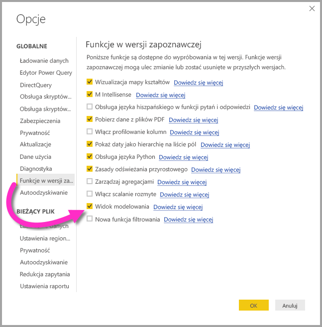
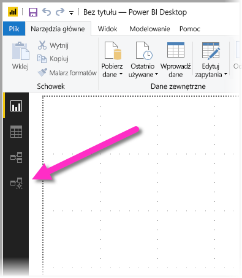
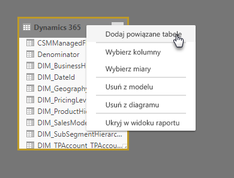
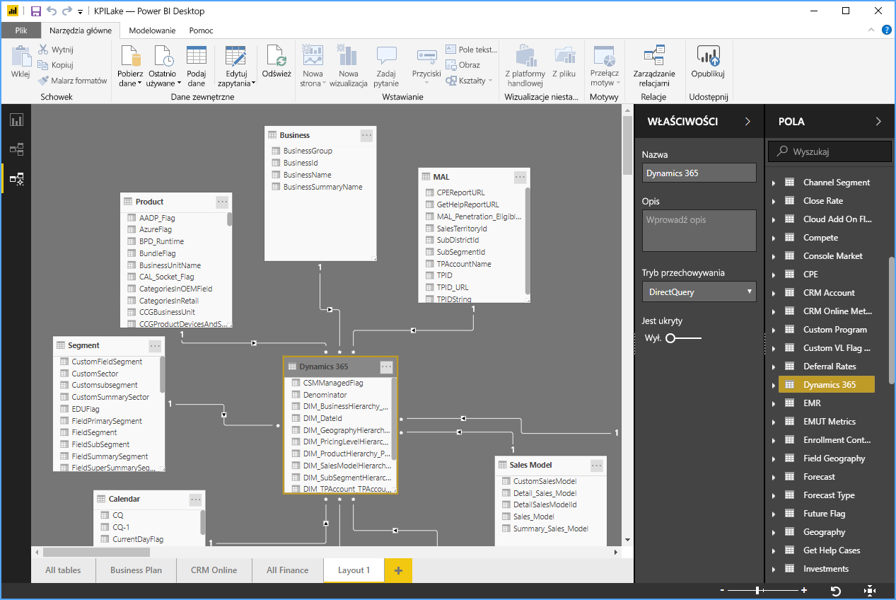
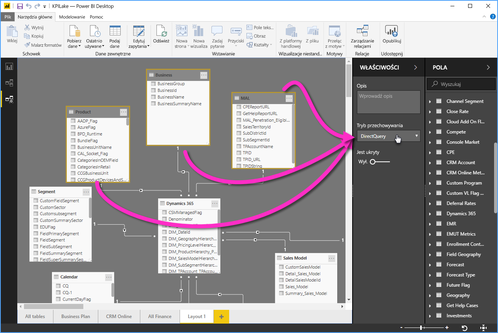

# Widok modelowania w programie Power BI Desktop (wersja zapoznawcza)

Za pomocą **widoku modelowania** w programie **Power BI Desktop**, można przeglądać złożone zestawy danych, które zawierają wiele tabel, oraz pracować nad nimi. W widoku modelowania można wykonać następujące czynności:

## Włączanie funkcji widoku modelowania (wersja zapoznawcza)

Funkcja widoku modelowania jest dostępna w wersji zapoznawczej i trzeba ją włączyć w programie **Power BI Desktop**. Aby włączyć widok modelowania, wybierz **Plik > Opcje i Ustawienia > Opcje > Funkcje wersji zapoznawczej**, a następnie zaznacz pole wyboru **Widok modelowania**, jak pokazano na poniższej ilustracji.

Pojawi się monit, że należy ponownie uruchomić program **Power BI Desktop**, aby funkcja w wersji zapoznawczej została włączona. 

## Używanie widoku modelowania

Aby uzyskać dostęp do widoku modelowania, wybierz ikonę widoku modelowania w lewej części programu **Power BI Desktop**, jak pokazano na poniższej ilustracji.

## Tworzenie oddzielnych diagramów

Przy użyciu widoku modelowania można utworzyć diagramy modelu, które zawierają tylko podzbiór tabel w modelu. Może to ułatwić dostarczanie bardziej czytelnego widoku tabel, nad którymi chcesz pracować, a także uprościć pracę nad złożonymi zestawami danych. Aby utworzyć nowy diagram dotyczący tylko podzbioru tabel, kliknij znak **+** obok karty **Wszystkie tabele** u dołu okna programu Power BI Desktop.

Następnie możesz przeciągnąć tabelę z listy **Pola** na powierzchnię diagramu. Kliknij prawym przyciskiem myszy tabelę, a następnie wybierz pozycję **Dodaj powiązane tabele** z wyświetlonego menu.

Kiedy to zrobisz, tabele powiązane z oryginalną tabelą zostaną wyświetlone na nowym diagramie. Na poniższej ilustracji przedstawiono sposób wyświetlania powiązanych tabel po wybraniu opcji menu **Dodaj powiązane tabele**.

## Ustawianie typowych właściwości

Można jednocześnie wybrać wiele obiektów w widoku modelowania, przytrzymując naciśnięty klawisz **CTRL** i klikając wiele tabel. Po wybraniu wielu tabel stają się one wyróżnione w widoku modelowania. W przypadku wyróżnienia wielu tabel zmiany zastosowane w okienku **Właściwości** są stosowane do wszystkich wybranych tabel.

Na przykład, aby zmienić [tryb przechowywania](desktop-storage-mode.md) wielu tabel w widoku diagramu, można przytrzymać naciśnięty klawisz **CTRL**, wybrać tabele, a następnie zmienić ustawienie trybu przechowywania w okienku **Właściwości**.

## Następne kroki

W poniższych artykułach opisano dokładniej modele danych oraz szczegóły trybu DirectQuery.

* [Agregacje w programie Power BI Desktop (wersja zapoznawcza)](desktop-aggregations.md)
* [Modele złożone w programie Power BI Desktop (wersja zapoznawcza)](desktop-composite-models.md)
* [Tryb przechowywania w programie Power BI Desktop (wersja zapoznawcza)](desktop-storage-mode.md)
* [Relacje wiele-do-wielu w programie Power BI Desktop (wersja zapoznawcza)](desktop-many-to-many-relationships.md)

Artykuły dotyczące trybu DirectQuery:

* [Używanie trybu DirectQuery w usłudze Power BI](desktop-directquery-about.md)
* [Źródła danych obsługiwane przez tryb DirectQuery w usłudze Power BI](desktop-directquery-data-sources.md)
