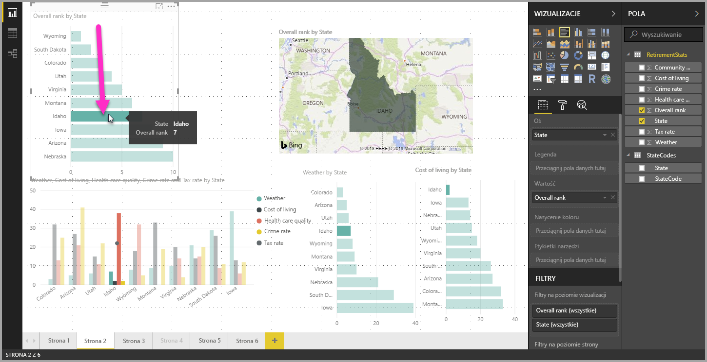
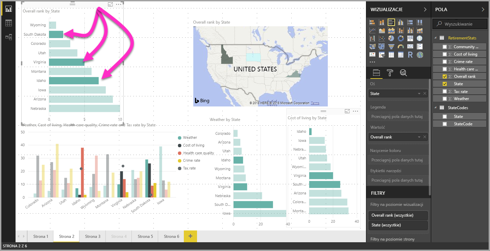

# Wybór wielokrotny elementów danych w wizualizacjach przy użyciu programu Power BI Desktop

W programie **Power BI Desktop** można wyróżnić punkt danych w wizualizacji, klikając go bezpośrednio w wizualizacji. Jeśli na przykład raport zawiera ważny pasek lub wykres i chcesz, aby inne elementy wizualne na stronie raportu wyróżniały dane w oparciu o ten element, możesz kliknąć element danych w jednej wizualizacji, tak aby wyniki zostały odzwierciedlone w innych wizualizacjach na stronie. Jest to wyróżnienie podstawowe lub jednokrotne. Ilustracja poniżej przedstawia wyróżnienie podstawowe. 

Funkcja wyboru wielokrotnego pozwala wybrać więcej niż jeden punkt danych na stronie raportu programu **Power BI Desktop** i wyróżnić wyniki w wizualizacjach na stronie. Jej działanie jest równoważne z instrukcją bądź funkcją **oraz**, np. „wyróżnij wyniki dla stanów Idaho **oraz** Wirginia”. Aby dokonać wyboru wielokrotnego punktów danych w wizualizacjach, wystarczy użyć kombinacji **CTRL+kliknięcie**, zaznaczając wiele punktów danych. Na poniższej ilustracji przedstawiono wybór **wielu punktów danych** (wybór wielokrotny).

Ta funkcja sprawa wrażenie prostej, ale otwiera szerokie możliwości w zakresie tworzenia i udostępniania raportów oraz interakcji z nimi. 

## Następne kroki

Może zainteresują Cię również następujące artykuły:

* [Używanie linii siatki i przyciągania do siatki w raportach programu Power BI Desktop](desktop-gridlines-snap-to-grid.md)
* [Informacje o filtrach i wyróżnianiu w raportach usługi Power BI](power-bi-reports-filters-and-highlighting.md)

