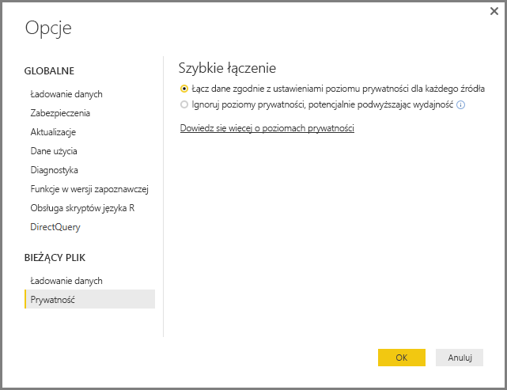
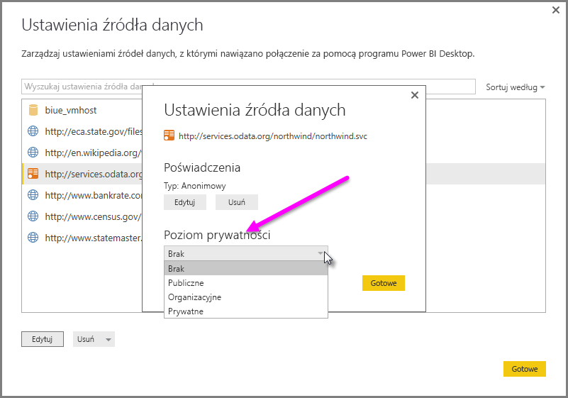

# Poziomy prywatności programu Power BI Desktop
W programie **Power BI Desktop** poziomy prywatności służą do określania poziomu izolacji, który definiuje stopień odizolowania jednego źródła danych od innych źródeł danych. Restrykcyjny poziom izolacji blokuje wymienianie informacji między źródłami danych, ale może spowodować ograniczenie funkcjonalności i obniżenie wydajności.

Ustawienie **Poziomy prywatności**, które można znaleźć, wybierając pozycję **Plik > Opcje i ustawienia > Opcje**, a następnie **Bieżący plik > Prywatność**, służy do określania, czy program Power BI Desktop używa ustawień Poziomy prywatności podczas łączenia danych. To okno dialogowe zawiera link do dokumentacji programu Power BI Desktop dotyczącej poziomów prywatności (ten artykuł).

## Konfigurowanie poziomu prywatności
Za pomocą ustawień poziomów prywatności można określić poziom izolacji, który definiuje żądany stopień odizolowania jednego źródła danych od innych źródeł danych.

| Ustawienie | Opis | Przykładowe źródła danych |
| --- | --- | --- |
| **Prywatne źródło danych** |**Prywatne** źródło danych zawiera poufne informacje. Jego widoczność można ograniczyć do autoryzowanych użytkowników. Prywatne źródło danych jest całkowicie odizolowane od innych źródeł danych. |Dane usługi Facebook, plik tekstowy zawierający informacje o nagrodach w postaci akcji lub skoroszyt zawierający informacje o ocenie pracowników. |
| **Organizacyjne źródło danych** |W przypadku **organizacyjnego** źródła danych widoczność jest ograniczona do grupy zaufanych osób. **Organizacyjne** źródło danych jest odizolowane od wszystkich **publicznych** źródeł danych, ale jest widoczne dla innych **organizacyjnych** źródeł danych. |Dokument programu **Microsoft Word** w intranetowej witrynie programu SharePoint z włączonymi uprawnieniami dla zaufanej grupy. |
| **Publiczne źródło danych** |**Publiczne** źródło danych zapewnia wszystkim wgląd w dane w nim zawarte. Tylko pliki, internetowe źródła danych i dane skoroszytu mogą zostać oznaczone jako **publiczne**. |Bezpłatne dane z witryny Microsoft Azure Marketplace, dane ze strony Wikipedii lub lokalny plik zawierający dane skopiowane z publicznej strony internetowej. |

## Konfigurowanie ustawień poziomu prywatności
Okno dialogowe ustawień **Prywatność** dla poszczególnych źródeł danych można znaleźć, wybierając opcję **Plik > Opcje i ustawienia > Ustawienia źródła danych**.

Aby skonfigurować poziom prywatności źródła danych, wybierz źródło danych, a następnie wybierz pozycję **Edytuj**. Zostanie wyświetlone okno dialogowe **Ustawienia źródła danych**, w którego dolnej części można wybrać odpowiedni poziom prywatności z menu rozwijanego, jak pokazano na poniższym obrazie.

> [!CAUTION]
> Źródło danych zawierające wysoce poufne informacje dane należy skonfigurować jako **prywatne**.
> 

## Konfigurowanie poziomów prywatności
**Poziomy prywatności** to ustawienie mające domyślnie wartość **Łączenie danych zgodnie z ustawieniami poziomu prywatności dla każdego źródła**, co oznacza, że ustawienie **Poziomy prywatności** nie jest włączone.

| Ustawienie | Opis |
| --- | --- |
| **Łączenie danych zgodnie z ustawieniami poziomu prywatności dla każdego źródła** (włączone — ustawienie domyślne) |Ustawienia poziomu prywatności są używane do określenia poziomu izolacji między źródłami danych podczas łączenia danych. |
| **Ignorowanie poziomów prywatności i potencjalne poprawianie wydajności** (wyłączone) |Poziomy prywatności nie są brane pod uwagę podczas łączenia danych. Może to spowodować zwiększenie wydajności i funkcjonalności związanej z danymi. |

> **Uwaga dotycząca zabezpieczeń:** włączenie ustawienia **Poziomy prywatności** przez wybór wartości **Ignorowanie poziomów prywatności i potencjalne poprawianie wydajności** w oknie dialogowym **Poziomy prywatności** może spowodować narażenie poufnych dane na dostęp nieautoryzowanych osób. Nie należy włączać ustawienia **Poziomy prywatności**, dopóki nie masz pewności, czy źródło danych nie zawiera poufnych dane.
> 
> 

> [!CAUTION]
> Pozycja **Ignorowanie poziomów prywatności i potencjalne poprawianie wydajności** nie działa w usłudze Power BI. W związku z tym raporty programu Power BI Desktop, dla których włączono to ustawienie i które zostaną następnie opublikowane w usłudze Power BI, *nie* odzwierciedlają tego zachowania, gdy są używane w usłudze.
> 

**Konfigurowanie poziomów prywatności**

W programie Power BI Desktop lub w Edytorze zapytań wybierz pozycję **Plik > Opcje i ustawienia > Opcje**, a następnie wybierz pozycję **Bieżący plik > Prywatność**.

a. Gdy ustawienie **Łączenie danych zgodnie z ustawieniami poziomu prywatności dla każdego źródła** jest wybrane, dane będą łączone zgodnie z ustawieniem Poziomy prywatności. Scalanie danych w różnych strefach izolacji prywatności spowoduje buforowanie niektórych danych.

b. Gdy ustawienie **Ignorowanie poziomów prywatności i potencjalne poprawianie wydajności** jest wybrane, dane zostaną połączone bez uwzględnienia ustawienia Poziomy prywatności, co może spowodować ujawnienie poufnych danych nieautoryzowanym użytkownikom. To ustawienie może spowodować zwiększenie wydajności i funkcjonalności.

> **Uwaga dotycząca zabezpieczeń:** wybranie ustawienia **Ignorowanie poziomów prywatności i potencjalne poprawianie wydajności** może poprawić wydajność, ale w programie Power BI Desktop nie będzie możliwe zapewnienie prywatności danych scalonych w ramach pliku programu Power BI Desktop.
> 
> 

