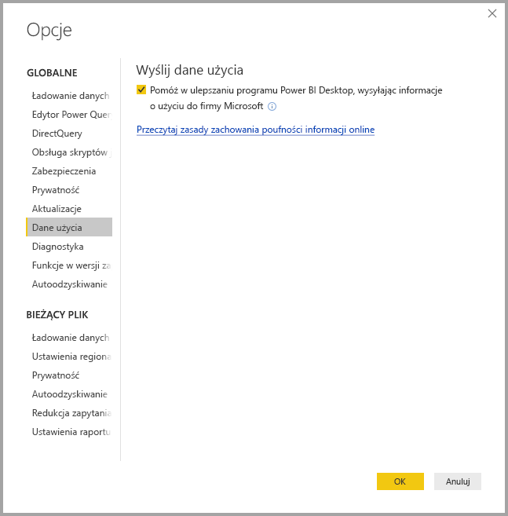
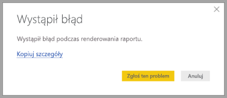

# Ochrona prywatności w programie Power BI Desktop

W firmie Microsoft ciężko pracujemy nad ochroną Twojej prywatności podczas dostarczania produktów, które zapewniają pożądaną wydajność, energię i wygodę. Firma Microsoft zbiera pewne informacje dotyczące korzystania z programu Power BI Desktop, aby pomóc w diagnozowaniu problemów i ulepszaniu produktu. Aby uzyskać więcej informacji na temat rozwiązań firmy Microsoft dotyczących ochrony prywatności, przejrzyj zasady zachowania poufności informacji firmy Microsoft. Te zasady mają zastosowanie do zbieranych przez firmę Microsoft danych dotyczących używania programu **Power BI Desktop**.
 
Informacje zbierane od użytkowników programu **Power BI Desktop** mogą obejmować dane dotyczące systemu operacyjnego, a także informacje dotyczące programu Power BI Desktop i wersji programu Internet Explorer. 
 
Jeśli chcesz zrezygnować z udostępniania tych danych, możesz przejść do pozycji **Plik > Opcje i ustawienia > Opcje** i na karcie **Dane użycia** usunąć zaznaczenie pola wyboru **Wyślij dane użycia**, jak pokazano na poniższej ilustracji.

## Wysyłanie dodatkowych informacji

W przypadku występowania awarii lub innych problemów istnieje możliwość wysyłania raportów o błędach i dodatkowych informacji, które mogą pomóc nam w rozwiązaniu problemu w przyszłej wersji. Zbieramy również informacje o stanie pliku programu **Power BI Desktop**, nad którym są aktualnie prowadzone prace. Są to informacje, takie jak ustawienia regionalne dokumentu, włączone funkcje wersji zapoznawczej i tryb przechowywania. Dane mogą zawierać zrzuty ekranu, komunikaty o błędach i formuły modelu. Te elementy mogą obejmować zawartość plików, które były używane podczas wystąpienia błędu, dlatego przed wysłaniem danych należy je przejrzeć. Przed wysłaniem jest też wyświetlane przypomnienie, że możesz wybrać, które informacje mają zostać przekazane firmie Microsoft.  
 
Jeśli nie chcesz wysyłać tych informacji, możesz kliknąć przycisk **Zamknij**, gdy wystąpi błąd, lub zrezygnować z wysyłania danych użycia, wykonując czynności opisane powyżej. 

