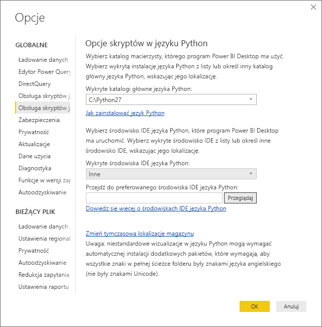
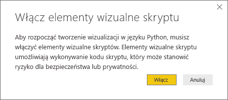
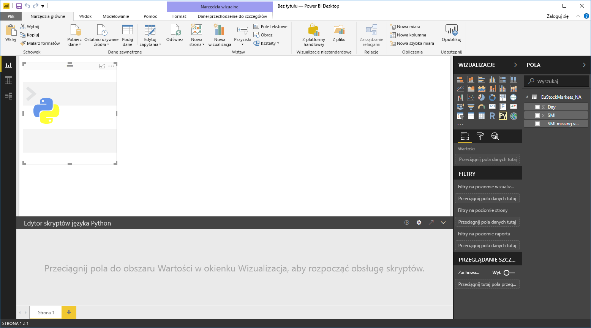
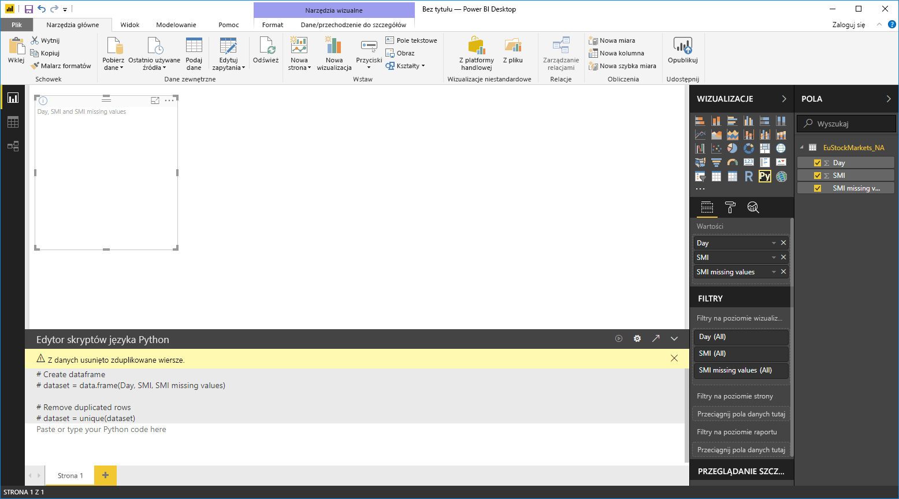
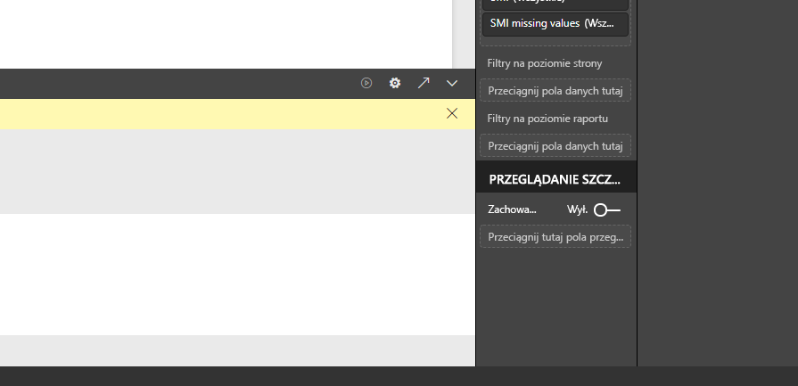
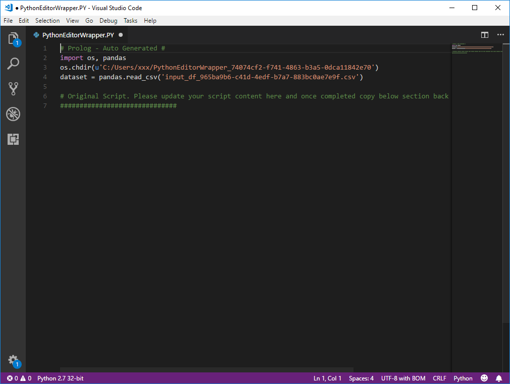

# Używanie zewnętrznego środowiska IDE języka Python z usługą Power BI
W programie **Power BI Desktop** możesz za pomocą zewnętrznego środowiska IDE (zintegrowanego środowiska programistycznego) języka Python tworzyć i dostosowywać skrypty języka Python, a następnie używać tych skryptów w usłudze Power BI.

## Włączanie zewnętrznego środowiska IDE języka Python
Swoje zewnętrzne środowisko IDE języka Python możesz uruchamiać z poziomu programu **Power BI Desktop**, aby automatycznie zaimportować i wyświetlić dane w środowisku IDE języka Python. W zewnętrznym środowisku IDE języka Python możesz zmodyfikować skrypt, a następnie wkleić go z powrotem do programu **Power BI Desktop** w celu utworzenia wizualizacji i raportów usługi Power BI.

Możesz określić, którego środowiska IDE języka Python chcesz używać, i włączyć jego automatyczne uruchamianie z poziomu programu **Power BI Desktop**.

### Wymagania
Aby używać tej funkcji, musisz zainstalować **środowisko IDE języka Python** na komputerze lokalnym. Program **Power BI Desktop** nie zawiera, nie wdraża ani nie instaluje aparatu Python, dlatego musisz oddzielnie zainstalować język **Python** na komputerze lokalnym. Korzystając z następujących opcji, możesz wybrać, które środowisko IDE języka Python ma być używane:

* Możesz zainstalować ulubione środowisko IDE języka Python. Wiele z nich jest dostępnych bezpłatnie, na przykład na [stronie pobierania programu Visual Studio Code](https://code.visualstudio.com/download/).
* Program **Power BI Desktop** obsługuje również program **Visual Studio**.
* Wykonując jedną z następujących czynności, możesz również zainstalować inne środowisko IDE języka Python i spowodować, że program **Power BI Desktop** będzie uruchamiał to **środowisko IDE języka Python**:
  
  * Możesz skojarzyć pliki **.PY** z zewnętrznym środowiskiem IDE, które ma być uruchamiane przez program **Power BI Desktop**.
  * Możesz określić plik .exe, który powinien być uruchamiany przez program **Power BI Desktop**, wybierając pozycję *Inne* w sekcji **Opcje skryptów w języku Python** okna dialogowego **Opcje**. Okno dialogowe **Opcje** możesz wyświetlić, wybierając pozycję **Plik > Opcje i ustawienia > Opcje**.
    
    

Jeśli masz zainstalowanych wiele środowisk IDE języka Python, możesz określić, które z nich będzie uruchamiane, wybierając je z listy rozwijanej *Wykryte środowiska IDE języka Python* w oknie dialogowym **Opcje**.

Domyślnie program **Power BI Desktop** uruchamia program **Visual Studio Code** jako zewnętrzne środowisko IDE języka Python, jeśli jest on zainstalowany na komputerze lokalnym. Jeśli program **Visual Studio Code** nie jest zainstalowany, a masz program **Visual Studio**, będzie on uruchamiany zamiast tego pierwszego. Jeśli żadne z tych środowisk IDE języka Python nie jest zainstalowane, będzie uruchamiana aplikacja skojarzona z plikami **.PY**.

Natomiast jeśli nie istnieje żadne skojarzenie plików **.PY**, w sekcji *Przejdź do preferowanego środowiska IDE języka Python* okna dialogowego **Opcje** możesz określić ścieżkę do niestandardowego środowiska IDE. Inne środowisko IDE języka Python możesz również uruchomić, wybierając ikonę koła zębatego **Ustawienia** obok ikony strzałki **Uruchom środowisko IDE języka Python** w programie **Power BI Desktop**.

## Uruchamianie środowiska IDE języka Python z poziomu programu Power BI Desktop
Aby uruchomić środowisko IDE języka Python z poziomu programu **Power BI Desktop**, wykonaj następujące kroki:

1. Załaduj dane do programu **Power BI Desktop**.
2. W okienku **Pola** wybierz niektóre pola, z którymi chcesz pracować. Jeśli nie zostały jeszcze włączone wizualizacje skryptów, zostanie wyświetlony monit, aby to zrobić.
   
   
3. Gdy wizualizacje skryptów są włączone, w okienku **Wizualizacje** możesz wybrać wizualizację języka Python, co spowoduje utworzenie pustej wizualizacji języka Python gotowej do wyświetlenia wyników działania skryptu. Zostanie również wyświetlone okienko **Edytor skryptów języka Python**.
   
   
4. Teraz możesz wybrać pola, których chcesz użyć w skrypcie języka Python. Gdy wybierzesz pola, **Edytor skryptów języka Python** automatycznie utworzy kod skryptu na podstawie wybranych pól. Możesz utworzyć (lub wkleić) skrypt języka Python bezpośrednio w okienku **Edytor skryptów języka Python** lub pozostawić je puste.
   
   
   
   > [!NOTE]
   > Domyślny typ agregacji ustawiony dla wizualizacji języka Python to *Nie sumuj*.
   > 
   > 
5. Teraz możesz uruchamiać środowisko IDE języka Python bezpośrednio z poziomu programu **Power BI Desktop**. Naciśnij przycisk **Uruchom środowisko IDE języka Python** znajdujący się z prawej strony paska tytułu **Edytora skryptów języka Python**, jak pokazano poniżej.
   
   
6. Określone przez Ciebie środowisko IDE języka Python zostanie uruchomione przez program Power BI Desktop, jak pokazano na poniższej ilustracji (na tej ilustracji domyślnym środowiskiem IDE języka Python jest program **Visual Studio Code**).
   
   
   
   > [!NOTE]
   > Program **Power BI Desktop** dodaje pierwsze trzy wiersze skryptu, aby po uruchomieniu skryptu można było zaimportować dane z programu **Power BI Desktop**.
   > 
   > 
7. Dowolny skrypt utworzony w **okienku edytora skryptów języka Python** programu **Power BI Desktop** zaczyna się od wiersza 4 w środowisku IDE języka Python. W tym momencie możesz utworzyć skrypt języka Python w środowisku IDE języka Python. Po ukończeniu skryptu języka Python w środowisku IDE języka Python musisz go skopiować i wkleić z powrotem do okienka **Edytor skryptów języka Python** w programie **Power BI Desktop**, *z wyłączeniem* pierwszych trzech wierszy skryptu, które zostały wygenerowane automatycznie przez program **Power BI Desktop**. Nie kopiuj pierwszych trzech wierszy skryptu z powrotem do programu **Power BI Desktop**. Służą one wyłącznie do zaimportowania danych z programu **Power BI Desktop** do środowiska IDE języka Python.

### Znane ograniczenia
Uruchamianie środowiska IDE języka Python bezpośrednio z poziomu programu Power BI Desktop ma kilka ograniczeń:

* Automatyczne eksportowanie skryptu ze środowiska IDE języka Python do programu **Power BI Desktop** nie jest obsługiwane.

## Następne kroki
Zapoznaj się z następującymi informacjami dodatkowymi na temat języka Python w usłudze Power BI.

* [Uruchamianie skryptów języka Python w programie Power BI Desktop](desktop-python-scripts.md)
* [Tworzenie wizualizacji usługi Power BI przy użyciu języka Python](desktop-python-visuals.md)

