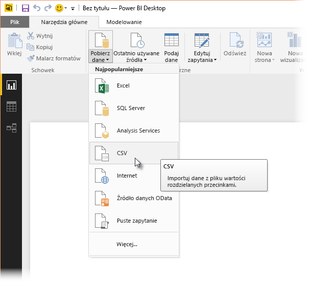
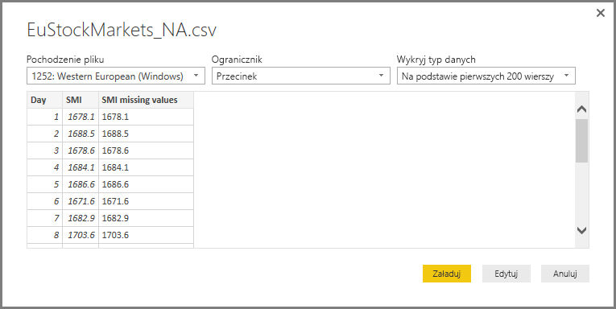
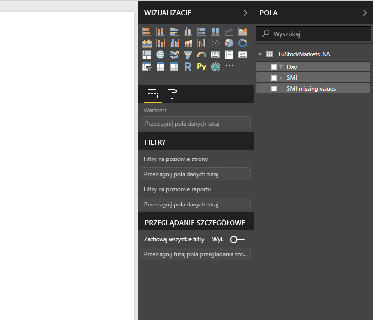
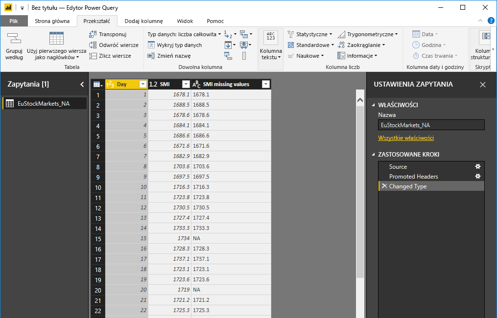
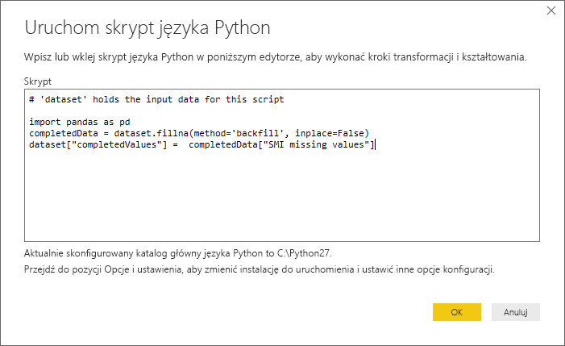
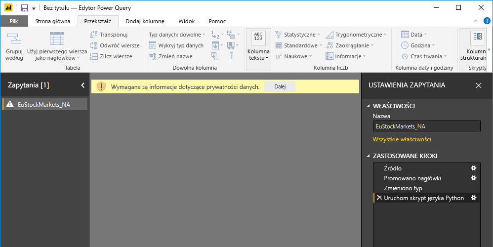
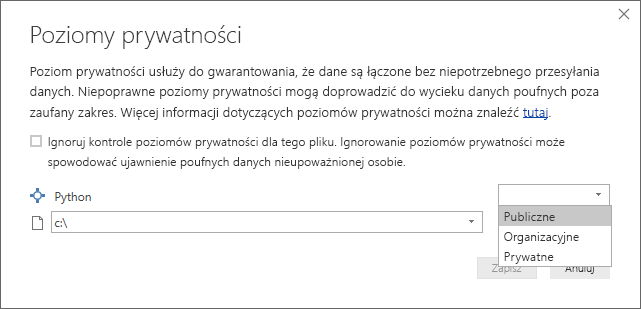
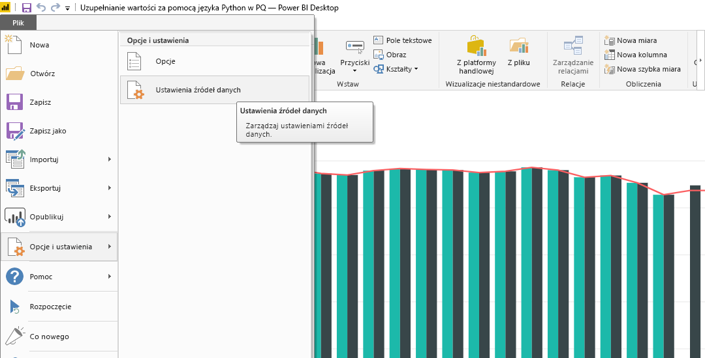
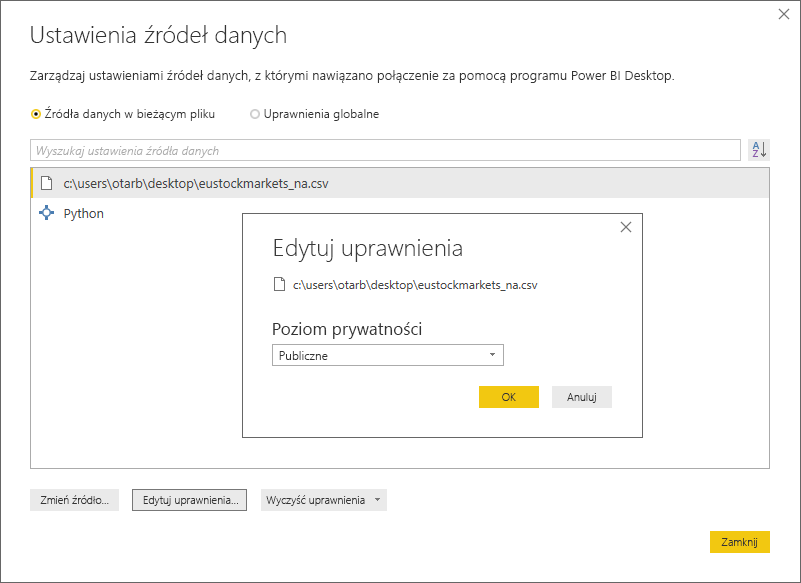

# Używanie języka Python w Edytorze zapytań
W **Edytorze zapytań** programu Power BI Desktop możesz używać języka **Python**, czyli języka programowania używanego powszechnie przez statystyków, naukowców i analityków danych. Dzięki integracji z językiem Python **Edytor zapytań** umożliwia oczyszczanie danych przy użyciu języka Python, a także zaawansowane kształtowanie i analizowanie danych w zestawach danych — na przykład uzupełnianie brakujących danych, przewidywanie i grupowanie danych. **Python** to zaawansowany język, którego możesz używać w **Edytorze zapytań** do przygotowywania modelu danych i tworzenia raportów.

## Instalowanie języka Python
Aby korzystać z języka **Python** w **Edytorze zapytań** programu Power BI Desktop, musisz zainstalować język **Python** na komputerze lokalnym. Język **Python** możesz pobrać i zainstalować bezpłatnie z wielu miejsc, w tym z [oficjalnej strony pobierania języka Python](https://www.python.org/) i witryny [Anaconda](https://anaconda.org/anaconda/python/).

## Używanie języka Python w Edytorze zapytań
Sposób korzystania z języka **Python** w **Edytorze zapytań** przedstawiono na przykładzie zestawu danych giełdowych opartego na pliku CSV, który możesz [pobrać tutaj](http://download.microsoft.com/download/F/8/A/F8AA9DC9-8545-4AAE-9305-27AD1D01DC03/EuStockMarkets_NA.csv) i w którym możesz wykonywać czynności opisane w tym temacie. Podczas pracy z tym przykładem wykonasz następujące czynności:

1. Na początek załaduj dane do programu **Power BI Desktop**. Załaduj plik *EuStockMarkets_NA.csv* pochodzący z tego przykładu i wybierz polecenie **Pobierz dane > CSV** na karcie **Narzędzia główne** wstążki w programie **Power BI Desktop**.
   
   
2. Zaznacz plik i wybierz pozycję **Otwórz**. Plik CSV zostanie wyświetlony w oknie dialogowym **Plik CSV**.
   
   
3. Załadowane dane zostaną wyświetlone w okienku **Pola** w programie Power BI Desktop.
   
   
4. Otwórz **Edytor zapytań**, wybierając pozycję **Edytuj zapytania** na karcie **Narzędzia główne** w programie **Power BI Desktop**.
   
   
5. Na karcie **Przekształć** wybierz pozycję **Uruchom skrypt języka Python**, aby otworzyć edytor **Uruchamianie skryptu języka Python** (widoczny w następnym kroku). Zwróć uwagę, że w wierszach 15 i 20 brakuje danych, podobnie jak w innych wierszach niewidocznych na ilustracji. Wykonując poniższe czynności, możesz uzupełnić dane w tych wierszach przy użyciu języka Python.
   
   
6. W tym przykładzie wprowadź następujący kod skryptu:
   
       import pandas as pd
       completedData = dataset.fillna(method='backfill', inplace=False)
       dataset["completedValues"] =  completedData["SMI missing values"]
   
   > [!NOTE]
   > Aby powyższy kod skryptu działał prawidłowo, wymagane jest zainstalowanie biblioteki *pandas* w środowisku języka Python. Aby zainstalować bibliotekę pandas, w instalacji języka Python uruchom następujące polecenie: |      > pip install pandas
   > 
   > 
   
   Po umieszczeniu w oknie dialogowym **Uruchamianie skryptu języka Python** kod wygląda następująco:
   
   
7. Po wybraniu przycisku **OK** w **Edytorze zapytań** zostanie wyświetlone ostrzeżenie dotyczące prywatności danych.
   
   
8. Aby skrypty języka Python działały prawidłowo w usłudze Power BI, wszystkie źródła danych muszą być ustawione jako *publiczne*. Aby uzyskać więcej informacji na temat ustawień prywatności i ich skutków, zobacz [Poziomy prywatności](desktop-privacy-levels.md).
   
   
   
   W okienku **Pola** zostanie wyświetlona nowa kolumna o nazwie *completedValues* (Uzupełnione wartości). Zwróć uwagę na brakujące elementy danych, na przykład w wierszach 15 i 18. W następnej sekcji przedstawiono, jak język Python sobie z nimi radzi.
   

Wystarczy pięć wierszy skryptu języka Python, aby **Edytor zapytań** uzupełnił brakujące wartości przy użyciu modelu predykcyjnego.

## Tworzenie wizualizacji na podstawie danych skryptu języka Python
Teraz można utworzyć wizualizację, aby zobaczyć, w jaki sposób skrypt języka Python korzystający z biblioteki *pandas* uzupełnił brakujące wartości, co pokazano na poniższej ilustracji:

Po utworzeniu tej i wszelkich innych wymaganych wizualizacji w programie **Power BI Desktop** można zapisać plik programu **Power BI Desktop** (w formacie pbix), a następnie używać tego modelu danych, wraz z zawartymi w nim skryptami języka Python, w usłudze Power BI.

> [!NOTE]
> Chcesz zobaczyć gotowy plik pbix po wykonaniu tych czynności? Masz szczęście — możesz pobrać gotowy plik programu **Power BI Desktop** używany w tych przykładach [tutaj](http://download.microsoft.com/download/A/B/C/ABCF5589-B88F-49D4-ADEB-4A623589FC09/Complete%20Values%20with%20Python%20in%20PQ.pbix).

Po przekazaniu pliku pbix do usługi Power BI należy wykonać kilka dodatkowych czynności w celu włączenia odświeżania danych (w usłudze Power BI) oraz aktualizowania wizualizacji w usłudze (co wymaga włączenia dostępu do języka Python dla danych). Poniżej opisano te dodatkowe czynności:

* **Włącz zaplanowane odświeżanie dla zestawu danych** — aby włączyć zaplanowane odświeżanie skoroszytu zawierającego zestaw danych ze skryptami języka Python, zobacz artykuł [Konfigurowanie zaplanowanego odświeżania](refresh-scheduled-refresh.md), który zawiera również informacje o **bramie osobistej**.
* **Zainstaluj bramę osobistą** — na komputerze, na którym znajduje się plik i na którym zainstalowano język Python, należy zainstalować **bramę osobistą**. Usługa Power BI musi uzyskać dostęp do tego skoroszytu w celu ponownego renderowania zaktualizowanych wizualizacji. Możesz uzyskać więcej informacji na temat [instalowania i konfigurowania bramy osobistej](personal-gateway.md).

## Ograniczenia
Zapytania zawierające skrypty języka Python utworzone w **Edytorze zapytań** podlegają pewnym ograniczeniom:

* Wszystkie źródła danych dla języka Python muszą być ustawione jako *Publiczne*, tak samo jak wszystkie pozostałe kroki zapytania utworzone w **Edytorze zapytań**. Aby przejść do ustawień źródła danych, w programie **Power BI Desktop** wybierz kolejno pozycje **Plik > Opcje i ustawienia > Ustawienia źródła danych**.
  
  
  
  W oknie dialogowym **Ustawienia źródła danych** zaznacz źródła danych, a następnie wybierz pozycję **Edytuj uprawnienia** i upewnij się, że **Poziom prywatności** został ustawiony na *Publiczne*.
  
      
* Aby włączyć zaplanowane odświeżanie wizualizacji lub zestawu danych ze skryptami języka Python, należy włączyć **Zaplanowane odświeżanie** oraz zainstalować **Bramę osobistą** na komputerze, na którym znajduje się skoroszyt oraz instalacja języka Python. Aby dowiedzieć się więcej o obu tych czynnościach, zobacz poprzednią sekcję tego artykułu zawierającą linki do dodatkowych informacji.
* Zagnieżdżone tabele (tabele w tabelach) nie są obecnie obsługiwane. 

Przy użyciu języka Python i zapytań niestandardowych można wykonywać wiele różnorodnych czynności — poznaj je i kształtuj dane dokładnie tak, jak chcesz.

