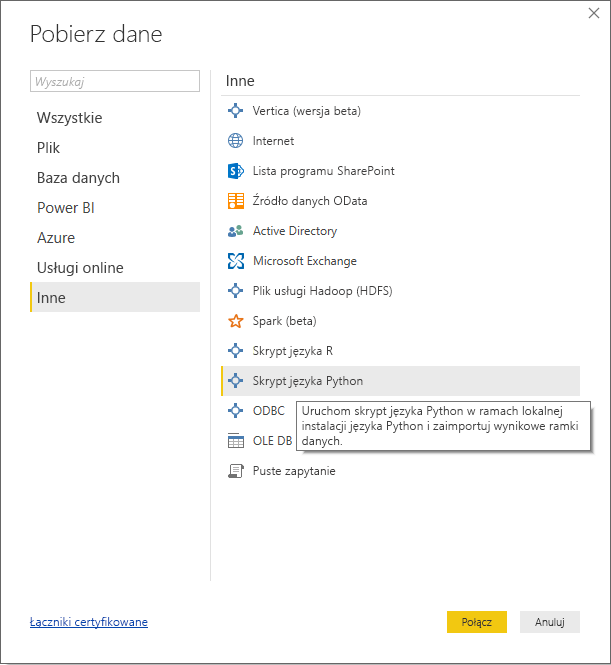
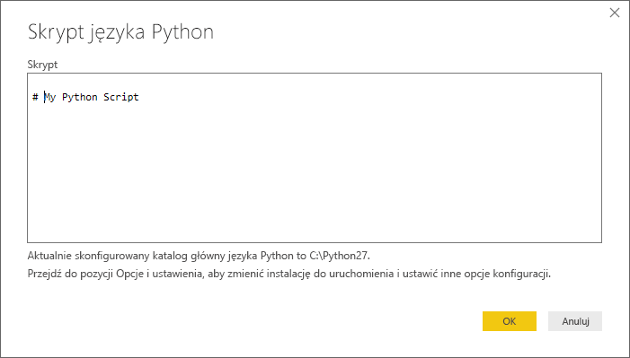
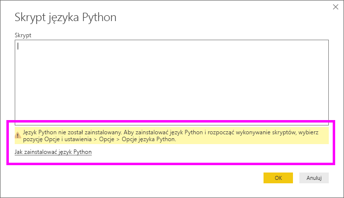
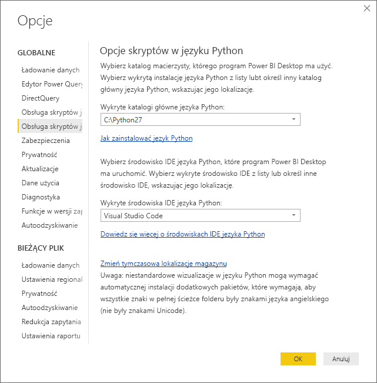

# Uruchamianie skryptów języka Python w programie Power BI Desktop
Skrypty języka Python można uruchamiać bezpośrednio w programie **Power BI Desktop** i importować wynikowe zestawy danych bezpośrednio do modelu danych w programie Power BI Desktop.

## Instalowanie języka Python
Aby uruchamiać skrypty języka Python w programie Power BI Desktop, musisz zainstalować **język Python** na swojej maszynie lokalnej. Język **Python** możesz pobrać i zainstalować bezpłatnie z wielu miejsc, w tym z [oficjalnej strony pobierania języka Python](https://www.python.org/) i witryny [Anaconda](https://anaconda.org/anaconda/python/). Bieżąca wersja mechanizmu obsługi skryptów języka Python w programie Power BI Desktop obsługuje znaki Unicode, a także spacje (puste znaki) w ścieżce instalacji.

## Uruchamianie skryptów języka Python
Wykonując kilka prostych kroków w programie Power BI Desktop, można uruchomić skrypty języka Python i utworzyć model danych, na podstawie którego można z kolei tworzyć raporty i udostępniać je w usłudze Power BI.

### Przygotowywanie skryptu języka Python
Aby uruchomić skrypt języka Python w programie Power BI Desktop, utwórz skrypt w lokalnym środowisku programistycznym języka Python i upewnij się, że działa on prawidłowo.

Aby uruchomić skrypt w programie Power BI Desktop, upewnij się, że działa on prawidłowo w niezmodyfikowanym obszarze roboczym. Oznacza to, że wszystkie pakiety i zależności muszą zostać jawnie załadowane i uruchomione.

Istnieje kilka ograniczeń dotyczących przygotowywania i uruchamiania skryptów języka Python w programie Power BI Desktop:

* Importowane są tylko ramki danych Pandas, dlatego upewnij się, że dane, które chcesz zaimportować do usługi Power BI, są reprezentowane w ramce danych.
* Limit czasu działania każdego skryptu języka Python to 30 minut.
* Interakcyjne wywołania w skrypcie języka Python, takie jak oczekiwanie na wprowadzenie danych przez użytkownika, wstrzymują wykonywanie skryptu.
* Ustawiając katalog roboczy w skrypcie języka Python, *musisz* zdefiniować pełną ścieżkę do katalogu roboczego, a nie ścieżkę względną.
* Zagnieżdżone tabele (tabele w tabelach) nie są obecnie obsługiwane. 

### Uruchamianie skryptu języka Python i importowanie danych
1. W programie Power BI Desktop łącznik danych skryptu języka Python znajduje się w obszarze **Pobierz dane**. Aby uruchomić skrypt języka Python, wybierz pozycje **Pobierz dane &gt; Więcej**, a następnie wybierz pozycje **Inne &gt; Skrypt języka Python**, jak pokazano na poniższej ilustracji:
   
   
2. Jeśli na maszynie lokalnej masz zainstalowany język Python, jako aparat języka jest wybierana jego najnowsza zainstalowana wersja. Po prostu skopiuj skrypt do okna skryptu i wybierz przycisk **OK**.
   
   
3. Jeśli język Python nie jest zainstalowany, nie zostanie zidentyfikowany lub na maszynie lokalnej masz jego wiele instalacji, pojawi się ostrzeżenie.
   
   
   
   Ustawienia instalacji języka Python znajdują się w środku sekcji Obsługa skryptów języka Python okna dialogowego Opcje. Aby określić własne ustawienia instalacji języka Python, wybierz pozycje **Plik > Opcje i ustawienia**, a następnie pozycje **Opcje > Obsługa skryptów języka Python**. Jeśli dostępnych jest wiele instalacji języka Python, zostanie wyświetlone menu rozwijane pozwalające wybrać instalację do użycia. Możesz również wybrać pozycję **Inne** i podać ścieżkę niestandardową.
   
   
4. Wybierz przycisk **OK**, aby uruchomić skrypt języka Python. Gdy skrypt zostanie uruchomiony pomyślnie, można wybrać wynikowe ramki danych do dodania do modelu usługi Power BI.

### Odśwież
Skrypt języka Python w programie Power BI Desktop można odświeżyć. Odświeżenie skryptu języka Python powoduje, że program Power BI Desktop uruchamia go ponownie w swoim środowisku.

## Następne kroki
Zapoznaj się z następującymi informacjami dodatkowymi na temat języka Python w usłudze Power BI.

* [Tworzenie wizualizacji języka Python w programie Power BI Desktop](desktop-python-visuals.md)
* [Używanie zewnętrznego środowiska IDE języka Python z usługą Power BI](desktop-python-ide.md)