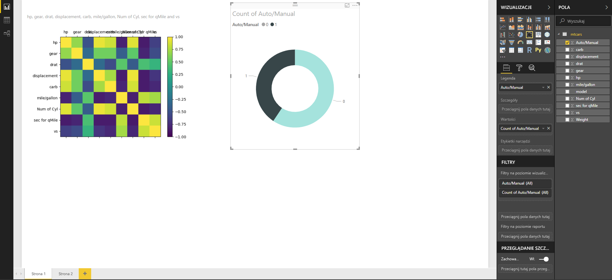

# Tworzenie wizualizacji usługi Power BI przy użyciu języka Python
Program **Power BI Desktop** umożliwia wizualizowanie danych przy użyciu języka **Python**.

## Instalowanie języka Python
Program **Power BI Desktop** nie obejmuje, nie wdraża ani nie instaluje aparatu języka **Python**. Aby uruchamiać skrypty języka Python w programie **Power BI Desktop**, musisz osobno zainstalować język **Python** na swoim komputerze lokalnym. Język **Python** możesz pobrać i zainstalować bezpłatnie z wielu miejsc, w tym z [oficjalnej strony pobierania języka Python](https://www.python.org/) i witryny [Anaconda](https://anaconda.org/anaconda/python/). Bieżąca wersja mechanizmu obsługi skryptów języka Python w programie Power BI Desktop obsługuje znaki Unicode, a także spacje (puste znaki) w ścieżce instalacji.

## Włączanie wizualizacji języka Python
Aby włączyć wizualizacje języka Python, wybierz pozycję **Plik > Opcje i ustawienia > Opcje**, a następnie na stronie **Opcje** sprawdź, czy w sekcji **Obsługa skryptów języka Python** okna **Opcje** jest określona Twoja lokalna instalacja języka Python, jak na poniższym obrazie. Na poniższym obrazie ścieżka do lokalnej instalacji języka Python to **C:\Python27**. Ścieżka ta jest w tej postaci wpisana w polu tekstowym. Sprawdź, czy ścieżka prawidłowo odzwierciedla lokalizację lokalnej instalacji języka Python, z której ma korzystać program **Power BI Desktop**.
   
   

Po określeniu instalacji języka Python możesz zacząć tworzyć wizualizacje w tym języku.

## Tworzenie wizualizacji języka Python w programie Power BI Desktop
1. Aby dodać wizualizację języka Python, wybierz ikonę **Wizualizacja języka Python** w okienku **Wizualizacje**, co pokazano na poniższym obrazie.
   
   

   Dodanie do raportu wizualizacji języka Python powoduje wykonanie poniższych akcji przez program **Power BI Desktop**:
   
   - Na kanwie raportu pojawia się obraz symbolu zastępczego wizualizacji języka Python.
   
   - Na dole okienka środkowego pojawia się **edytor skryptów języka Python**.
   
   

2. Następnie dodaj pola, które chcesz wykorzystać w skrypcie języka Python, do sekcji **Wartości** w obszarze **Pola**, podobnie jak w przypadku każdej innej wizualizacji w programie **Power BI Desktop**. 
    
    Skrypt języka Python może korzystać tylko z pól, które zostały dodane do obszaru **Pola**. Nowe pola można dodawać do obszaru **Pola**, a zbędne pola można z niego usuwać podczas pracy nad skryptem języka Python w **edytorze skryptów języka Python programu Power BI Desktop**. Program **Power BI Desktop** automatycznie wykrywa, które pola zostały dodane, a które usunięte.
   
   > [!NOTE]
   > Domyślny typ agregacji ustawiony dla wizualizacji języka Python to *Nie sumuj*.
   > 
   > 
   
3. Teraz możesz utworzyć wykres, korzystając z wybranych danych. 

    W miarę wybierania pól **edytor skryptów języka Python** generuje pomocniczy kod powiązania skryptu języka Python w oparciu o dane wybrane w szarej sekcji u góry okienka edytora. Jeśli dodasz lub usuniesz kolejne pole, kod pomocniczy w edytorze skryptów języka Python zostanie odpowiednio automatycznie wygenerowany lub usunięty.
   
   Na przykładzie pokazanym na poniższym obrazie zaznaczono trzy pola: hp, gear oraz drat. W wyniku tego edytor skryptów języka Python wygenerował następujący kod powiązania:
   
   * Została utworzona ramka danych o nazwie **dataset**.
     * Ramka danych składa się z różnych pól wybranych przez użytkownika.
   * Domyślny typ agregacji to *Nie sumuj*.
   * Podobnie jak w przypadku wizualizacji tabel, pola są grupowane, a wiersze zduplikowane są wyświetlane tylko raz.
   
   
   
   > [!TIP]
   > W niektórych sytuacjach grupowanie automatyczne może nie być wskazane lub może wystąpić konieczność wyświetlenia wszystkich wierszy (także zduplikowanych). W takiej sytuacji do zestawu danych można dodać pole indeksu, dzięki któremu wszystkie wiersze będą traktowane jako unikatowe i nie zostaną pogrupowane.
   > 
   > 
   
   Wygenerowana ramka danych nosi nazwę **dataset**, a do wybranych kolumn można uzyskać dostęp, korzystając z ich nazw. Na przykład do pola gear odwołasz się, wpisując w skrypcie języka Python ciąg *dataset["gear"]*.

4. Dzięki temu, że ramka danych jest generowana automatycznie przez wybrane pola, można od razu pisać skrypt języka Python powodujący utworzenie wykresu na urządzeniu domyślnym dla języka Python. Kiedy skrypt będzie gotowy, wybierz pozycje **Uruchom** dostępną na pasku tytułu **edytora skryptów języka Python** (pozycja **Uruchom** znajduje się po prawej stronie paska tytułu).
   
    Gdy wybierzesz pozycję **Uruchom**, program **Power BI Desktop** zidentyfikuje wykres i pokaże go na kanwie. Ponieważ proces ma miejsce w lokalnej instalacji języka Python, upewnij się, że wymagane pakiety zostały zainstalowane.
   
   Program **Power BI Desktop** ponownie tworzy wizualizację, jeśli wystąpi dowolne z następujących zdarzeń:
   
   * Na pasku tytułu **edytora skryptów języka Python** wybierzesz pozycję **Uruchom**
   * Nastąpi zmiana danych będąca wynikiem odświeżenia danych, filtrowania lub wyróżniania

    Na poniższym obrazie przedstawiono przykład kodu wykresu korelacji między atrybutami różnych rodzajów samochodów.

    

5. Aby powiększyć widok wizualizacji, można zminimalizować okno **edytora skryptów języka Python**. Podobnie jak w przypadku innych wizualizacji w programie **Power BI Desktop**, można filtrować krzyżowo wykres korelacji, zaznaczając tylko samochody sportowe w wizualizacji pierścieniowej (okrągłej wizualizacji po prawej stronie na powyższym przykładowym obrazie).

    

6. Można także zmodyfikować skrypt języka Python, aby dostosować wizualizację, i wykorzystać możliwości języka Python, dodając parametry do polecenia kreślącego.

    Oryginalne polecenie kreślące było następujące:

    plt.matshow(dataset.corr('pearson'))

    Kilka zmian wprowadzonych w skrypcie języka Python spowodowało, że polecenie wygląda teraz tak:

    plt.matshow(dataset.corr('kendall'))

    W efekcie wizualizacja języka Python kreśli teraz z użyciem współczynnika korelacji Tau Kendalla, tak jak pokazano na poniższym obrazie.

    

    Jeśli podczas wykonywania skryptu języka Python wystąpi błąd, wizualizacja języka Python nie zostanie nakreślona, a na kanwie zostanie wyświetlany komunikat o błędzie. Aby uzyskać szczegółowe informacje na temat błędu, wybierz pozycję **Zobacz szczegóły** w komunikacie o błędzie wizualizacji języka Python na kanwie.

    

    > **Bezpieczeństwo skryptów języka Python:** wizualizacje języka Python są tworzone na podstawie skryptów języka Python, które mogą zawierać kod zagrażający prywatności lub bezpieczeństwu. Podczas pierwszej próby wyświetlenia lub użycia wizualizacji języka Python użytkownik zobaczy komunikat z ostrzeżeniem dotyczącym zabezpieczeń. Wizualizacje języka Python należy włączyć tylko wtedy, gdy ich autor i źródło są zaufane lub po wykonaniu przeglądu i analizy danego skryptu języka Python.
    > 
    > 

## Znane ograniczenia
Wizualizacje języka Python w programie **Power BI Desktop** są objęte kilkoma ograniczeniami:

* Ograniczenia rozmiaru danych — ilość danych używanych do kreślenia wizualizacji języka Python jest ograniczona do 150 000 wierszy. Jeśli jest zaznaczona większa liczba wierszy, uwzględniane są tylko dane z pierwszych 150 000 wierszy, a na obrazie zostaje wyświetlony komunikat.
* Ograniczenie czasu obliczania — jeśli obliczanie wizualizacji języka Python trwa dłużej niż pięć minut, limit czasu zostaje przekroczony i zostaje wyświetlony błąd.
* Relacje — podobnie jak w przypadku innych wizualizacji w programie Power BI Desktop, wybranie pól danych z innych tabel bez zdefiniowanych relacji między nimi powoduje wystąpienie błędu.
* Wizualizacje języka Python są odświeżane w przypadku aktualizowania, filtrowania i wyróżniania danych. Jednak sam obraz nie jest interaktywny i nie może stanowić źródła filtrowania krzyżowego.
* Wizualizacje języka Python reagują na wyróżnianie innych wizualizacji, ale nie można klikać poszczególnych części wizualizacji języka Python w celu filtrowania krzyżowego innych elementów.
* Tylko wykresy wykreślone na urządzeniu wyświetlającym domyślnym dla języka Python są prawidłowo wyświetlane na kanwie. Należy unikać jawnego używania innych urządzeń wyświetlających języka Python.

## Następne kroki
Zapoznaj się z następującymi informacjami dodatkowymi na temat języka Python w usłudze Power BI.

* [Uruchamianie skryptów języka Python w programie Power BI Desktop](desktop-python-scripts.md)
* [Używanie zewnętrznego środowiska IDE języka Python z usługą Power BI](desktop-python-ide.md)

