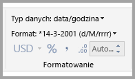
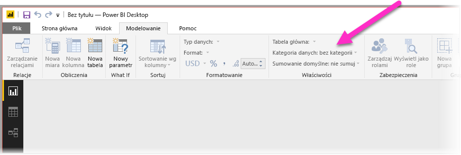
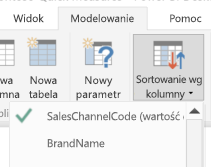
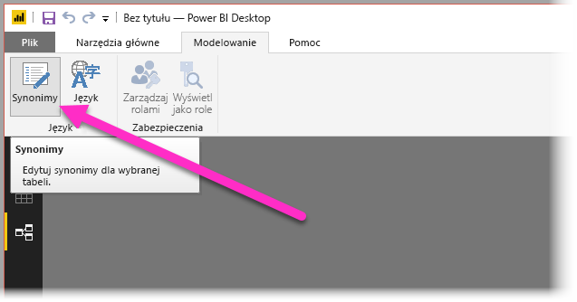
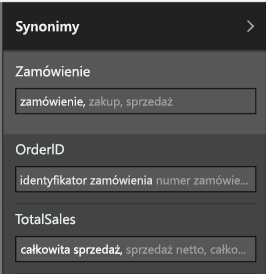

# Używanie funkcji pytań i odpowiedzi dla zapytań w języku naturalnym w programie Power BI Desktop
Używanie typowych fraz i języka naturalnego w celu zadawania pytań na temat danych daje dużo możliwości. Jest to o wiele bardziej skuteczne, gdy dane „odpowiadają” — to właśnie umożliwia funkcja pytań i odpowiedzi w programie **Power BI Desktop**.

Aby umożliwić funkcji pytań i odpowiedzi prawidłowe interpretowanie dużych kolekcji pytań, na które będzie w stanie udzielić odpowiedzi, funkcja ta musi korzystać z założeń dotyczących modelu. Jeśli struktura modelu nie spełnia jednego lub kilku z tych założeń, należy dostosować model. Te dostosowania do funkcji pytań i odpowiedzi są takie same, jak optymalizacja pod kątem najlepszych rozwiązań dla dowolnego modelu w usłudze Power BI, niezależnie od tego, czy używasz funkcji pytań i odpowiedzi. 

W poniższych sekcjach opisano, jak dostosować model, aby dobrze współdziałał z funkcją pytań i odpowiedzi w usłudze Power BI.

## Dodawanie brakujących relacji

Jeśli w modelu brakuje relacji między tabelami, to ani raporty usługi Power BI, ani funkcja pytań i odpowiedzi nie będzie w stanie zinterpretować sposobu połączenia tych tabel, gdy zadasz dotyczące ich pytanie. Relacje to kamień węgielny dobrego modelu. Nie możesz na przykład zapytać o „całkowitą sprzedaż dla klientów z Seattle”, jeśli relacja między tabelą *zamówienia* a tabelą *klienci* nie będzie istnieć. Na poniższych ilustracjach pokazano przykłady modelu, który wymaga pracy, i modelu, który jest gotowy na funkcję pytań i odpowiedzi.

**Wymaga pracy**

**Gotowe na funkcję pytań i odpowiedzi**

## Zmienianie nazw tabel i kolumn

Wybór tabel i kolumn jest bardzo ważny dla funkcji pytań i odpowiedzi. Jeśli na przykład masz tabelę o nazwie *CustomerSummary*, która zawiera listę klientów, należałoby zadawać pytania w stylu „List the customer summaries in Chicago” (Wyświetl listę podsumowań klientów w Chicago) zamiast „List the customers in Chicago” (Wyświetl listę klientów w Chicago). 

Funkcja pytań i odpowiedzi potrafi w pewnym stopniu rozdzielać wyrazy i wykrywać liczbę mnogą, jednak zakłada, że nazwy tabel i kolumn dokładnie odzwierciedlają ich zawartość.

Rozważmy inny przykład. Wyobraź sobie, że masz tabelę o nazwie *Headcount*, zawierającą imiona i nazwiska oraz numery pracowników, i drugą tabelę o nazwie *Employees*, zawierającą numery pracowników, numery zadań i daty rozpoczęcia. Być może jest to zrozumiałe dla osób znających ten model, jednak gdy ktoś inny zapyta „count the employees” (policz pracowników), otrzyma liczbę wierszy z tabeli „Employees”, a raczej nie o to chodziło, ponieważ jest to liczba wszystkich zadań wykonywanych kiedykolwiek przez każdego pracownika. Byłoby o wiele lepiej, gdyby nazwy tych tabel odzwierciedlały ich rzeczywistą zawartość.

**Wymaga pracy**

**Gotowe na funkcję pytań i odpowiedzi**

## Poprawianie nieprawidłowych typów danych

Importowane dane mogą mieć nieprawidłowe typy danych. W szczególności kolumny typu *data* i *liczba*, które są importowane jako *ciągi*, nie będą interpretowane przez funkcję pytań i odpowiedzi jako daty i liczby. Upewnij się, że wybierasz prawidłowy typ danych w swoim modelu usługi Power BI.

## Oznaczanie kolumn zawierających rok i identyfikator za pomocą opcji Nie sumuj

Usługa Power BI domyślnie agreguje kolumny liczbowe, więc pytania takie jak „total sales by year” (całkowita sprzedaż według roku) może czasami dać w wyniku całkowitą sumę sprzedaży wraz z całkowitą sumą lat. Jeśli masz określone kolumny, dla których usługa Power BI ma nie stosować tego zachowania, ustaw dla właściwości **Sumuj według** kolumny wartość **Nie sumuj**. Problemy najczęściej występują w przypadku kolumn typu **rok**, **miesiąc**, **dzień** oraz **identyfikator**, dlatego należy mieć je na uwadze. W przypadku innych kolumn, na które sumowanie nie ma wpływu, takich jak *wiek*, ustawienie dla właściwości **Sumuj według** wartości **Nie sumuj** lub **Średnia** także może być korzystne. To ustawienie można znaleźć na karcie **Modelowanie**.

## Wybieranie kategorii danych dla każdej kolumny daty i kolumny geograficznej

**Kategoria danych** zapewnia dodatkową wiedzę semantyczną na temat zawartości kolumny (poza jej typem danych). Na przykład kolumna liczb całkowitych może być oznaczona jako kod pocztowy, kolumna typu ciąg może być oznaczona jako miasto, kraj lub region i tak dalej. Te informacje są używane przez funkcję pytań i odpowiedzi na dwa istotne sposoby: do wyboru wizualizacji i tendencji językowych.

Po pierwsze, funkcja pytań i odpowiedzi używa informacji w polu **Kategoria danych**, aby lepiej wybrać rodzaj wizualizacji do wyświetlenia. Rozpoznaje na przykład, że kolumny o **kategorii danych** data lub godzina zazwyczaj są dobrym wyborem dla poziomej osi wykresu liniowego lub dla osi odtwarzania wykresu bąbelkowego. Zakłada również, że wyniki zawierające kolumny z geograficznymi **kategoriami danych** mogą wyglądać dobrze na mapie.

Po drugie, funkcja pytań i odpowiedzi w pewien wyuczony sposób próbuje odgadnąć, jak użytkownicy będą mówić o kolumnach daty i kolumnach geograficznych, aby ułatwić sobie zrozumienie niektórych typów pytań. Na przykład wyraz „when” (kiedy) w pytaniu „When was John Smith hired?” (Kiedy został zatrudniony Jan Kowalski?) prawie na pewno jest mapowany na kolumnę daty, a wyraz „Brown” w pytaniu „Count customers in Brown” (Liczba klientów w Brown) prawdopodobnie oznacza miejscowość, a nie kolor włosów.

## Wybieranie właściwości Sortuj według kolumny dla odpowiednich kolumn

Właściwość **Sortuj według kolumny** umożliwia sortowanie jednej kolumny w celu automatycznego sortowania według innej kolumny. Kiedy na przykład mówisz „sortuj klientów według rozmiaru koszuli” prawdopodobnie chcesz posortować kolumnę Rozmiar koszuli według numeru rozmiaru (XS, S, M, L, XL), a nie alfabetycznie (L, M, S, XL, XS).

## Normalizowanie modelu

Nie obawiaj się, nie sugerujemy, że musisz przekształcić cały swój model. Jednak istnieją pewne struktury, które są tak skomplikowane, że funkcja pytań i odpowiedzi po prostu ich dobrze nie obsłuży. Jeśli przeprowadzisz podstawową normalizację struktury swojego modelu, użyteczność raportów usługi Power BI znacznie wzrośnie, tak samo jak dokładność wyników funkcji pytań i odpowiedzi.

Ogólna zasada, której należy przestrzegać, jest następująca: każda unikatowa „rzecz”, o której mówi użytkownik, powinna być reprezentowana przez dokładnie jeden obiekt modelu (tabelę lub kolumnę). Jeśli więc użytkownicy mówią o klientach, powinien istnieć tylko jeden obiekt *klient*. A jeśli użytkownicy mówią o sprzedaży, powinien istnieć tylko jeden obiekt *sprzedaż*. Brzmi prosto, prawda? W zależności od kształtu danych, od których zaczynasz, może tak być. **Edytor zapytań** oferuje zaawansowane funkcje kształtowania danych, jeśli są one potrzebne, jednak wiele prostszych przekształceń można wykonać za pomocą obliczeń w modelu usługi Power BI.

W poniższych sekcjach opisano kilka typowych przekształceń, które być może trzeba będzie przeprowadzić.

### Tworzenie nowych tabel dla jednostek wielokolumnowych

Jeśli masz wiele kolumn, które działają jako pojedyncza, odrębna jednostka w obrębie większej tabeli, należy te kolumny rozdzielić na ich własną tabelę. Jeśli na przykład masz kolumny Contact Name (Nazwa kontaktu), Contact Title (Tytuł kontaktu) i Contact Phone (Telefon kontaktu) w tabeli *Companies* (Firmy), lepiej byłoby utworzyć osobną tabelę *Contacts* (Kontakty) zawierającą kolumny Name (Nazwa), Title (Tytuł) i Phone (Telefon) oraz połączenie z tabelą *Companies* (Firmy). Znacznie ułatwia to zadawanie pytań o kontakty niezależnie od pytań o firmy, których te kontakty dotyczą, oraz poprawia elastyczność wyświetlania.

**Wymaga pracy**

**Gotowe na funkcję pytań i odpowiedzi**

### Przestawianie w celu wyeliminowania zbiorów właściwości

Jeśli model zawiera zbiory właściwości, należy przebudować ich strukturę, aby jedna kolumna odpowiadała jednej właściwości. Zbiory właściwości, mimo że ułatwiają zarządzanie dużą liczbą właściwości, cechują się wieloma nieodłącznymi ograniczeniami, których nie można obejść ani za pomocą raportów usługi Power BI, ani za pomocą funkcji pytań i odpowiedzi.

Rozważmy na przykład tabelę *CustomerDemographics* (Dane demograficzne klientów) z kolumnami CustomerID (Identyfikator klienta), Property (Właściwość) i Value (Wartość), gdzie każdy wiersz reprezentuje inną właściwość klienta (np. wiek, stan cywilny, miasto itp.). Przeciążając znaczenie kolumny Value na podstawie zawartości kolumny Property, uniemożliwiamy funkcji pytań i odpowiedzi interpretowanie większości zapytań, które się do niej odnoszą. Proste pytanie, takie jak „show the age of each customer” (pokaż wiek każdego klienta) może zadziałać, ponieważ może zostać zinterpretowane jako „pokaż klienta i dane demograficzne klienta dla właściwości wiek”. Jednak struktura takiego modelu po prostu nie obsługuje bardziej złożonych pytań, takich jak „average age of customers in Chicago” (średni wiek klientów w Chicago). Użytkownicy, którzy tworzą raporty usługi Power BI, czasami mogą znaleźć sprytne sposoby na uzyskanie potrzebnych danych, jednak funkcja pytań i odpowiedzi działa tylko wtedy, gdy każda kolumna ma tylko jedno znaczenie.

**Wymaga pracy**

**Gotowe na funkcję pytań i odpowiedzi**

### Składanie w celu wyeliminowania partycjonowania

Jeśli dane zostały podzielone na partycje w wielu tabelach lub wartości zostały poprzestawiane w wielu kolumnach, użytkownicy nie będą w stanie wykonać wielu typowych operacji. Rozważ najpierw typowe partycjonowania tabel: tabela *Sales2000-2010* i tabela *Sales2011-2020*. Jeśli wszystkie ważne raporty są ograniczone do określonej dekady, prawdopodobnie można to tak zostawić na potrzeby raportów usługi Power BI. Jednak elastyczność funkcji pytań i odpowiedzi spowoduje, że użytkownicy będą oczekiwać odpowiedzi na pytania takie jak „całkowita sprzedaż według roku”. Aby to działało, musisz złożyć dane w jedną tabelę modelu usługi Power BI.

Podobnie rozważ typową przestawioną kolumnę wartości: tabelę *BookTour* (Przewodnik po książkach) zawierającą kolumny Author (Autor), Book (Książka), City1 (Miasto1), City2 (Miasto2) i City3 (Miasto3). Przy takiej strukturze nawet proste pytanie, takie jak „count books by city” (zlicz książki według miasta), nie może zostać zinterpretowane poprawnie. Aby to działało, należy utworzyć oddzielną tabelę *BookTourCities* (Miasta przewodnika po książkach), która złoży wartości miasta w jedną kolumnę.

**Wymaga pracy**

**Gotowe na funkcję pytań i odpowiedzi**

### Dzielenie kolumn sformatowanych

Jeśli źródło, z którego są importowane dane, zawiera kolumny sformatowane, raporty usługi Power BI (i funkcja pytań i odpowiedzi) nie będzie sięgać do wewnątrz kolumny, aby przeanalizować jej zawartość. Jeśli masz na przykład kolumnę **Full Address** (Pełny adres), która zawiera adres, miasto i kraj, należy podzielić ją na kolumny Address (Adres), City (Miasto) i Country (Kraj), aby użytkownicy mogli wysyłać dla nich osobne zapytania.

**Wymaga pracy**

**Gotowe na funkcję pytań i odpowiedzi**

Podobnie jeśli masz kolumny z pełnym imieniem i nazwiskiem, warto dodać kolumny **First Name** (Imię) i **Last Name** (Nazwisko) na wypadek, gdyby ktoś chciał zadać pytanie, używając części nazwisk. 

### Tworzenie nowych tabel dla kolumn zawierających wiele wartości

Jeśli źródło, z którego są importowane dane, zawiera kolumny z wieloma wartościami, raporty usługi Power BI (i funkcja pytań i odpowiedzi) także nie będą sięgać do wewnątrz kolumny, aby przeanalizować jej zawartość. Jeśli na przykład masz kolumnę Composer (Kompozytor), która zawiera nazwiska wielu kompozytorów utworu, należy podzielić ją na wiele wierszy w osobnej tabeli *Composers* (Kompozytorzy).

**Wymaga pracy**

**Gotowe na funkcję pytań i odpowiedzi**

### Denormalizowanie w celu wyeliminowania nieaktywnych relacji

Jedynym wyjątkiem od reguły „normalizacja jest lepsza” jest przypadek, kiedy od jednej tabeli do drugiej prowadzi wiele ścieżek. Jeśli na przykład masz tabelę *Flights* (Loty) z kolumnami SourceCityID (Identyfikator miasta źródłowego) i DestinationCityID (Identyfikator miasta docelowego), i obydwie te kolumny są powiązane z tabelą *Cities* (Miasta), jedną z tych relacji trzeba oznaczyć jako nieaktywną. Ponieważ funkcja pytań i odpowiedzi korzysta tylko z aktywnych relacji, nie będzie można zadawać pytań o miasto źródłowe lub docelowe, w zależności od tego, które wybierzesz. Jeśli zamiast tego zdenormalizujesz kolumny z nazwami miast w tabelę *Flights* (Loty), będzie można zadawać pytania takie jak: „list the flights for tomorrow with a source city of Seattle and a destination city of San Francisco” (wymień jutrzejsze loty z miasta źródłowego Seattle do miasta docelowego San Francisco).

**Wymaga pracy**

**Gotowe na funkcję pytań i odpowiedzi**

### Dodawanie synonimów do tabel i kolumn

Ten krok dotyczy w szczególności funkcji pytań i odpowiedzi (a nie ogólnie raportów usługi Power BI). Użytkownicy często określają tę samą rzecz za pomocą różnych terminów, na przykład sprzedaż całkowita, sprzedaż netto, całkowita sprzedaż netto. Model usługi Power BI umożliwia dodawanie tych synonimów do tabel i kolumn w obrębie modelu. 

Może to być bardzo ważny krok. Nawet w przypadku dość jednoznacznych nazw kolumn i tabel, użytkownicy funkcji pytań i odpowiedzi zadają pytania przy użyciu słownictwa, które jako pierwsze przychodzi im do głowy, i nie wybierają z listy wstępnie zdefiniowanych kolumn. Im bardziej logiczne synonimy dodasz, tym wygodniejsze będzie korzystanie z Twoich raportów dla użytkowników. Aby dodać synonimy, w widoku **Relacje** wybierz przycisk Synonimy na wstążce, jak pokazano na poniższej ilustracji.

Pole **Synonimy** zostanie wyświetlone po prawej stronie okna programu **Power BI Desktop**, gdzie można dodać synonimy, jak pokazano na poniższej ilustracji.

 Podczas dodawania synonimów należy zachować ostrożność, ponieważ dodanie tych samych synonimów do więcej niż jednej kolumny lub tabeli wprowadzi niejednoznaczności. Funkcja pytań i odpowiedzi wykorzystuje kontekst tam, gdzie to możliwe, aby dokonać wyboru między niejednoznacznymi synonimami, ale nie wszystkie pytania mają wystarczający kontekst. Jeśli na przykład użytkownik zapyta „count the customers” (zlicz klientów), to w przypadku trzech elementów z synonimem „client” (klient) w modelu może nie uzyskać odpowiedzi, jakiej szuka. W takich przypadkach upewnij się, że podstawowy synonim jest unikatowy, czyli jest używany w przeredagowaniu. Może on informować użytkownika o niejednoznaczności (na przykład przeredagowanie „show the number of archived customer records” [pokaż liczbę zarchiwizowanych rekordów klientów]), zalecając inne sformułowanie pytania.

## Następne kroki
Aby uzyskać więcej informacji o funkcjach programu Power BI Desktop, zobacz następujące artykuły:

* [Używanie przeglądania szczegółowego w programie Power BI Desktop](desktop-drillthrough.md)
* [Wyświetlanie kafelka pulpitu nawigacyjnego lub wizualizacji raportu w trybie koncentracji uwagi](service-focus-mode.md)

