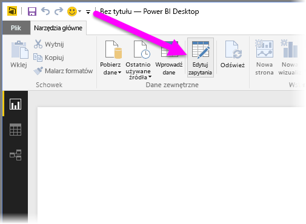
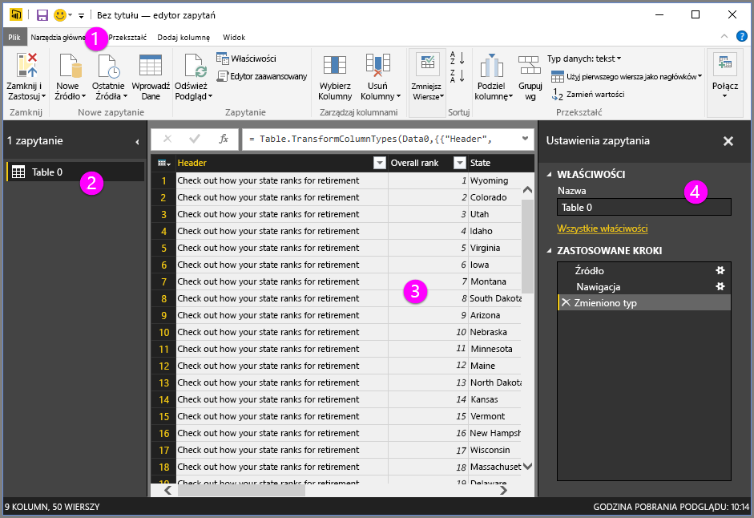
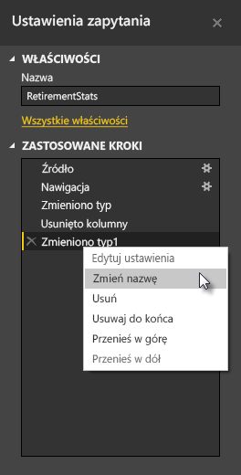
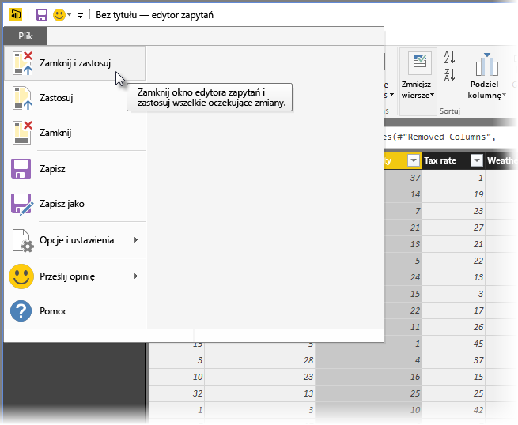

# Omówienie zapytań w programie Power BI Desktop
Program **Power BI Desktop** umożliwia łączenie się ze zbiorami danych, tworzenie atrakcyjnych i fundamentalnych raportów oraz udostępnianie wyników pracy innym osobom, które mogą je następnie rozbudowywać i rozwijać własne rozwiązania analizy biznesowej.

W programie Power BI Desktop dostępne są trzy widoki:

* Widok **Raport** — umożliwia tworzenie za pomocą zapytań atrakcyjnych wizualizacji i rozmieszczanie ich w sposób, w jaki mają być wyświetlane. Widok zawiera wiele stron, które można udostępniać innym użytkownikom.
* Widok **Dane** — umożliwia wyświetlanie danych w raporcie w formacie modelu danych, w którym można dodawać miary, tworzyć nowe kolumny i zarządzać relacjami.
* Widok **Relacje** — zapewnia graficzną reprezentację relacji ustanowionych w modelu danych oraz zarządzanie nimi i modyfikowanie ich według potrzeb.

Dostęp do tych widoków można uzyskać, wybierając jedną z trzech ikon z lewej strony programu Power BI Desktop. Na poniższej ilustracji jest wybrany widok Raport, co jest wskazane żółtym paskiem obok ikony.  

W programie Power BI Desktop dostępny jest też **Edytor zapytań**, w którym można połączyć się z jednym lub większą liczbą źródeł danych, kształtować i przekształcać dane zgodnie z potrzebami, a następnie załadować uzyskany model do programu Power BI Desktop.

Ten dokument zawiera omówienie pracy z danymi w **Edytorze zapytań**. Oczywiście jest dostępnych znacznie więcej informacji, dlatego na końcu tego dokumentu można znaleźć linki do szczegółowych wskazówek dotyczących obsługiwanych typów danych, łączenia się z danymi, kształtowania danych, tworzenia relacji i rozpoczynania pracy.

Jednak najpierw przyjrzyjmy się **Edytorowi zapytań**.

## Edytor zapytań
Aby przejść do **Edytora zapytań**, wybierz pozycję **Edytuj zapytania** na karcie **Narzędzia główne** programu Power BI Desktop.  

Gdy nie ma żadnych połączeń danych, **Edytor zapytań** ma postać pustego okienka gotowego na dane.  

Po załadowaniu zapytania widok **Edytora zapytań** staje się bardziej interesujący. Jeśli połączymy się z następującym internetowym źródłem danych, w **Edytorze zapytań** zostaną załadowane informacje o danych, które można następnie zacząć kształtować.

[*http://www.bankrate.com/finance/retirement/best-places-retire-how-state-ranks.aspx*](http://www.bankrate.com/finance/retirement/best-places-retire-how-state-ranks.aspx)

Oto wygląd **Edytora zapytań** po nawiązaniu połączenia z danymi:

1. Na wstążce wiele przycisków jest teraz aktywnych, umożliwiając interakcje z danymi w zapytaniu.
2. Okienko po lewej stronie, które zawiera listę zapytań dostępnych do wyboru, wyświetlenia i kształtowania.
3. Środkowe okienko zawiera dane z wybranego zapytania i umożliwia kształtowanie.
4. Okno **Ustawienia zapytania** zawiera listę właściwości zapytania i zastosowanych kroków.  
   
   

W kolejnych sekcjach przyjrzymy się każdemu z tych czterech obszarów — wstążce, okienku zapytania, widokowi danych i okienku Ustawienia zapytania.

## Wstążka zapytania
Wstążka w **Edytorze zapytań** składa się z czterech kart — **Narzędzia główne**, **Przekształć**, **Dodaj kolumnę** i **Widok**.

Karta **Narzędzia główne** zawiera typowe zadania dotyczące zapytania, w tym polecenie do pierwszego kroku w każdym zapytaniu: **Pobierz dane**. Poniższa ilustracja przedstawia wstążkę karty **Narzędzia główne**.  

Aby połączyć się z danymi i rozpocząć proces tworzenia zapytania, wybierz przycisk **Pobierz dane**. Zostanie wyświetlone menu z najbardziej typowymi źródłami danych.  

Aby uzyskać więcej informacji o dostępnych źródłach danych, zobacz **Źródła danych**. Aby uzyskać informacje o łączeniu się z danymi, w tym przykłady i procedury, zobacz **Łączenie się z danymi**.

Karta **Przekształć** zapewnia dostęp do typowych zadań przekształcania danych, takich jak dodawanie lub usuwanie kolumn, zmienianie typów danych, dzielenie kolumn i inne zadania oparte na danych. Poniższa ilustracja przedstawia kartę **Przekształć**.  

Aby uzyskać więcej informacji na temat przekształcania danych, wraz z przykładami, zobacz **Łączenie i kształtowanie danych**.

Karta **Dodaj kolumnę** zapewnia dostęp do dodatkowych zadań związanych z dodawaniem kolumny, formatowaniem danych kolumny i dodawaniem kolumn niestandardowych. Poniższa ilustracja przedstawia kartę **Dodaj kolumnę**.  

Karta **Widok** na wstążce służy do wyświetlania i ukrywania określonych okienek i okien. Służy również do wyświetlania Edytora zaawansowanego. Poniższa ilustracja przedstawia kartę **Widok**.  

Warto wiedzieć, że wiele zadań dostępnych z poziomu wstążki jest również dostępnych po kliknięciu prawym przyciskiem myszy kolumny lub innych danych w środkowym okienku.

## Lewe okienko
W okienku po lewej stronie wyświetlana jest liczba aktywnych zapytań oraz nazwa zapytania. Po wybraniu zapytania z okienka po lewej stronie jego dane są wyświetlane w środkowym okienku, w którym można je kształtować i przekształcać zgodnie z potrzebami. Na poniższej ilustracji przedstawiono lewe okienko z wieloma zapytaniami.  

## Środkowe okienko (danych)
Środkowe okienko (okienko danych) zawiera dane z wybranego zapytania. To tutaj realizowana jest znaczna część pracy w widoku zapytania.

Na poniższej ilustracji widać ustanowione wcześniej połączenie z danymi internetowymi. Wybrana jest kolumna **Overall score** (Wynik ogólny). Jej nagłówek został kliknięty, aby pokazać dostępne elementy menu. Wiele z tych elementów menu dostępnych po kliknięciu prawym przyciskiem myszy jest identycznych z przyciskami na kartach wstążki.  

Po wybraniu elementu menu dostępnego po kliknięciu prawym przyciskiem myszy (lub przycisku na wstążce) zapytanie spowoduje zastosowanie danego kroku do danych i zapisanie go jako części samego zapytania. Kroki są rejestrowane w okienku **Ustawienia zapytania** w kolejności sekwencyjnej, tak jak to opisano w następnej sekcji.  

## Okienko Ustawienia zapytania
W okienku **Ustawienia zapytania** wyświetlane są wszystkie kroki związane z zapytaniem. Na przykład na poniższej ilustracji sekcja **Zastosowane kroki** w okienku **Ustawienia zapytania** odzwierciedla fakt, że właśnie zmieniono typ kolumny **Overall score**.

W miarę stosowania do zapytania dodatkowych kroków są one rejestrowane w sekcji **Zastosowane kroki**.

Należy pamiętać, że dane źródłowe *nie* są zmieniane — Edytor zapytań dostosowuje oraz kształtuje jedynie widok danych. Wszelkie interakcje z danymi źródłowymi są realizowane na podstawie ich widoku ukształtowanego i zmodyfikowanego w Edytorze zapytań.

W okienku **Ustawienia zapytania** można zmieniać nazwy kroków, usuwać kroki lub zmieniać ich kolejność według potrzeb. Aby to zrobić, kliknij prawym przyciskiem myszy krok w sekcji **Zastosowane kroki**, a następnie wybierz pozycję z wyświetlonego menu. Wszystkie kroki zapytania są wykonywane w kolejności przedstawionej w okienku **Zastosowane kroki**.

## Edytor zaawansowany
Jeśli chcesz wyświetlić kod, który Edytor zapytań tworzy dla każdego kroku, lub chcesz utworzyć własny kod kształtowania, możesz użyć **Edytora zaawansowanego**. Aby uruchomić Edytor zaawansowany, wybierz kartę **Widok** na wstążce, a następnie pozycję **Edytor zaawansowany**. Zostanie wyświetlone okno zawierające istniejący kod zapytania.  

W oknie **Edytor zaawansowany** ten kod można edytować bezpośrednio. Aby zamknąć okno, wybierz przycisk **Gotowe** lub **Anuluj**.  

## Zapisywanie pracy
Gdy zapytanie ma już odpowiednią postać, można za pomocą Edytora zapytań wprowadzić zmiany w modelu danych w programie Power BI Desktop i zamknąć Edytor zapytań. W tym celu wybierz pozycję **Zamknij i zastosuj** w menu **Plik** Edytora zapytań.  

W trakcie realizowania postępu w programie Power BI Desktop będzie udostępniane okno dialogowe z jego stanem.  

Gdy zapytanie będzie już gotowe lub aby zapisać wykonaną pracę, można zapisać wyniki pracy w programie Power BI Desktop w postaci pliku pbix.

Aby zapisać wykonaną pracę, wybierz pozycję **Plik \> Zapisz** (lub **Plik \> Zapisz jako**), jak pokazano na poniższej ilustracji.  

## Następne kroki
Przy użyciu programu Power BI Desktop można wykonywać różnorodne zadania. Aby uzyskać więcej informacji na temat jego możliwości, skorzystaj z następujących zasobów:

* [Wprowadzenie do programu Power BI Desktop](desktop-getting-started.md)
* [Źródła danych w programie Power BI Desktop](desktop-data-sources.md)
* [Łączenie się z danymi w programie Power BI Desktop](desktop-connect-to-data.md)
* [Kształtowanie i łączenie danych w programie Power BI Desktop](desktop-shape-and-combine-data.md)
* [Typowe zadania dotyczące zapytań w programie Power BI Desktop](desktop-common-query-tasks.md)   

