# Łatwe wykonywanie typowych i zaawansowanych obliczeń przy użyciu szybkich miar
**Szybkie miary** umożliwiają łatwe i szybkie wykonywania typowych i zaawansowanych obliczeń. **Szybka miara** uruchamia zestaw poleceń języka DAX w tle (nie musisz pisać formuł DAX — są już gotowe) w oparciu o dane wprowadzone w oknie dialogowym, a następnie przedstawia wyniki do użycia w raporcie. Ponadto możesz zobaczyć formuły DAX wykonywane przez Szybką miarę i szybko zrozumieć lub rozszerzyć swoją wiedzę o języku DAX.

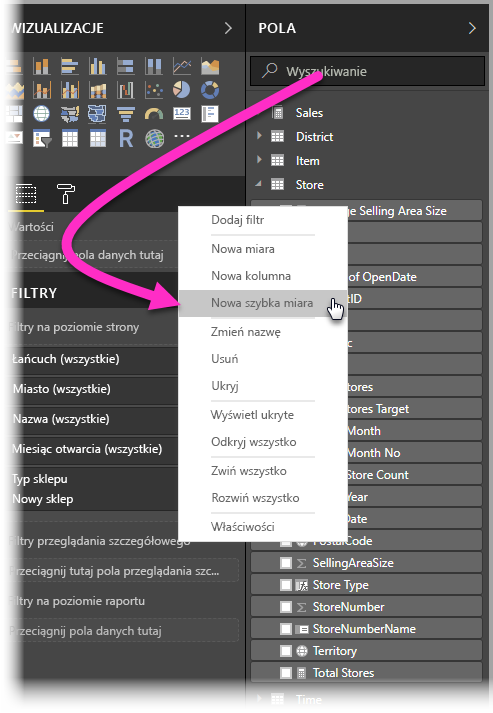

**Szybkie miary** tworzy się poprzez kliknięcie prawym przyciskiem myszy pola na liście **Pola** oraz wybranie opcji **Szybkie miary** z wyświetlonego menu. Możesz też kliknąć prawym przyciskiem myszy dowolną wartość w okienku **Wartości** istniejącej wizualizacji (np. pole *Wartości* w wizualizacji *Wykres słupkowy*). Istnieje wiele dostępnych kategorii obliczeń oraz sposobów dostosowywania obliczeń do potrzeb.

### Szybkie miary teraz ogólnie dostępne

W wersji programu **Power BI Desktop** z lutego 2018 r. szybkie miary są ogólnie dostępne (nie występują już w wersji zapoznawczej). Jeśli używasz wcześniejszej wersji programu **Power BI Desktop**, możesz wypróbować funkcję **Szybkie miary** w wersji programu **Power BI Desktop** z **kwietnia 2017 r.** lub nowszej, wybierając kolejno opcje **Plik > Opcje i ustawienia > Opcje > Funkcje wersji zapoznawczej**, a następnie zaznaczając pole wyboru obok pozycji **Szybkie miary**.

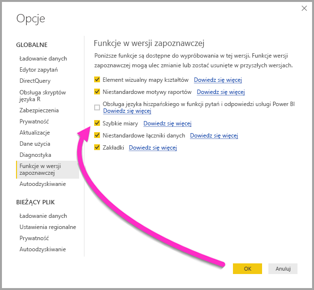

Po zaznaczeniu należy uruchomić ponownie program **Power BI Desktop**.

## Używanie Szybkich miar
Aby utworzyć **Szybką miarę**, kliknij prawym przyciskiem myszy pole (dowolne pole) na liście **Pola** w programie **Power BI Desktop** i wybierz opcję **Szybka miara** z wyświetlonego menu.

Modelowanie musi być dostępne w obecnie załadowanym zestawie danych, aby opcja **Szybkie miary** była dostępna. W związku z tym połączenia na żywo (np. połączenie z zestawem danych usługi Power BI) nie będą wyświetlać elementu **Szybkie miary** w menu po kliknięciu prawym przyciskiem myszy listy **Pola**, z wyjątkiem połączeń na żywo z usługami SSAS. 

W przypadku połączeń na żywo z usługami SQL Server Analysis Services (SSAS) niektóre **Szybkie miary** będą dostępne. Program **Power BI Desktop** wyświetli tylko kolekcję **Szybkich miar**, które są obsługiwane w danej wersji usług SSAS, z którymi nawiązuje się połączenie. Tak więc w przypadku połączenia na żywo ze źródłem danych SSAS możesz nie zobaczyć wybranych **Szybkich miar** na liście, ponieważ wersja usług SSAS, z którą nawiązano połączenie, nie obsługuje miary DAX używanej do wdrożenia tej **Szybkiej miary**.

W przypadku wybrania z menu otwieranego po kliknięciu prawym przyciskiem myszy zostanie wyświetlone następujące okno **Szybkie miary**, które umożliwia wybranie żądanego obliczenia oraz pól, wobec których ma być wykonane obliczenie.

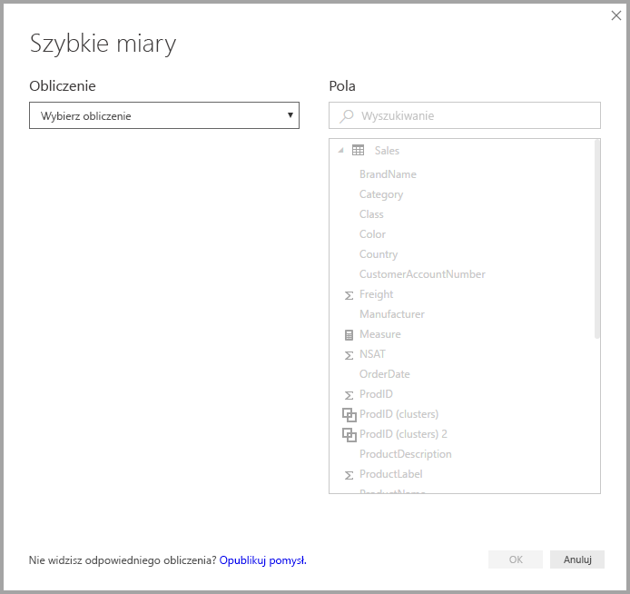

W przypadku wybrania z menu rozwijanego zobaczysz długą listę dostępnych **Szybkich miar**.

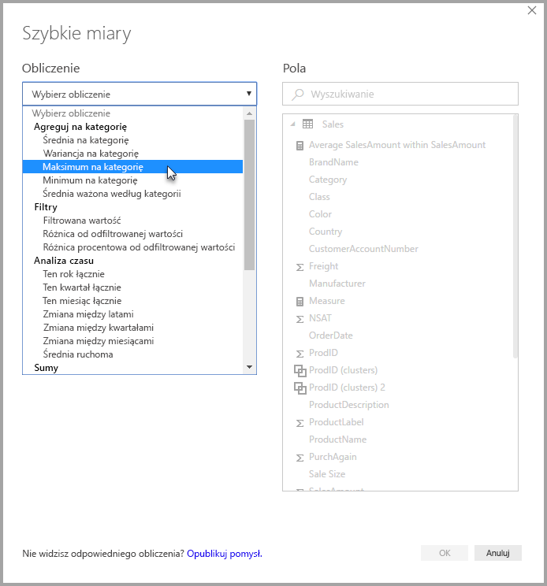

Istnieje pięć oddzielnych grup typów obliczeń Szybkich miar. Każda grupa zawiera kolekcję obliczeń. Te grupy i obliczenia są następujące:

* **Agreguj na kategorię**
  * Średnia w kategorii
  * Wariancja w kategorii
  * Maksimum w kategorii
  * Minimum w kategorii
  * Średnia ważona według kategorii
* **Filtry**
  * Filtrowana wartość
  * Różnica w porównaniu z linią bazową
  * Różnica procentowa od odfiltrowanej wartości
  * Sprzedaż dla nowych kategorii
* **Analiza czasu**
  * Ten rok łącznie
  * Ten kwartał łącznie
  * Ten miesiąc łącznie
  * Zmiana między latami
  * Zmiana między kwartałami
  * Zmiana między miesiącami
  * Średnia ruchoma
* **Sumy**
  * Suma bieżąca
  * Suma dla kategorii (z filtrami)
  * Suma dla kategorii (bez filtrów)
* **Operacje matematyczne**
  * Dodawanie
  * Odejmowanie
  * Mnożenie
  * Dzielenie
  * Różnica procentowa
  * Współczynnik korelacji
* **Tekst**
  * Ocena w gwiazdkach
  * Powiązana lista wartości

Zamierzamy rozbudować te obliczenia i czekamy na opinie użytkowników dotyczące **Szybkich miar**, które chcieliby zobaczyć, oraz wszelkie pomysły (w tym dotyczące źródłowych formuł DAX) związane z **Szybkimi miarami**, które chcieliby przesłać. Więcej informacji znajdziesz pod koniec tego artykułu.

## Przykłady Szybkich miar
Przyjrzyjmy się przykładowi **Szybkich miar** w akcji.

Następująca wizualizacja **Macierz** przedstawia tabelę sprzedaży różnych produktów elektronicznych. Jest to podstawowa tabela zawierająca sumy w każdej kategorii.

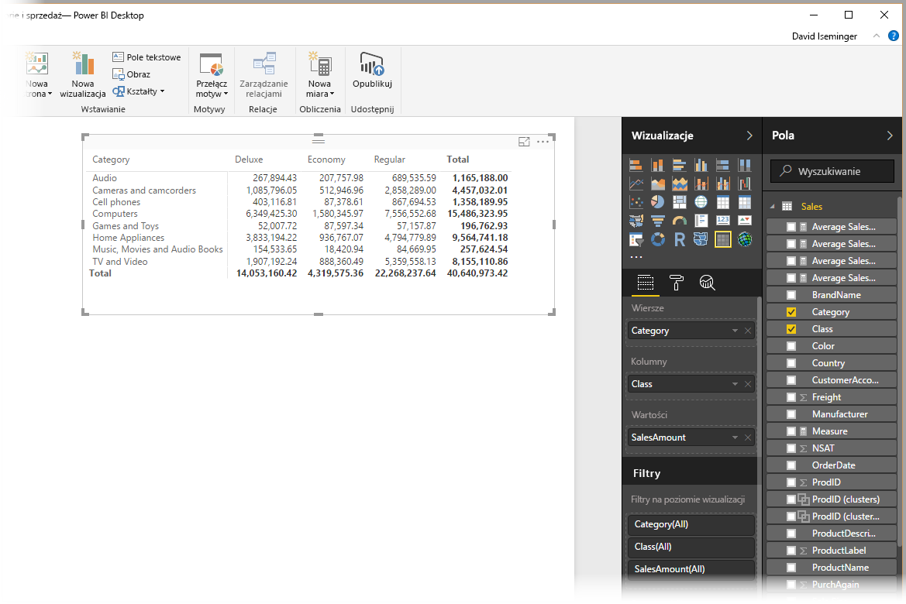

Po kliknięciu prawym przyciskiem myszy pola **Wartości** i wybraniu opcji **Szybkie miary** możemy wybrać opcję *Średnia w kategorii* jako *Obliczenie*, a następnie wybrać *Suma SalesAmount* w pozycji *Wartość podstawowa* i określić pole *SalesAmount* poprzez przeciągnięcie tego pola z pozycji *Pola* w okienku po prawej stronie do sekcji *Kategoria* po lewej stronie.

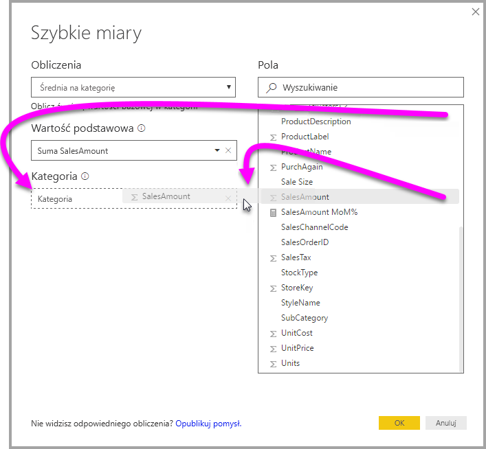

Następnie należy kliknąć przycisk **OK**. Zobaczymy kilka interesujących rzeczy, jak pokazano na ilustracji pod tą listą:

1. Wizualizacja **Macierz** teraz zawiera nową kolumnę przedstawiającą nasze obliczenie (w tym przypadku jest to *Średnia SalesAmount w kategorii SalesAmount*).
2. Nowa **miara** została utworzona. Jest ona dostępna na liście **Pola** i została zaznaczona (usługa Power BI umieściła wokół niej żółte pole). Ta miara jest dostępna dla dowolnej innej wizualizacji w raporcie, a nie tylko wizualizacji, dla której została oryginalnie utworzona.
3. Formuła DAX utworzona na potrzeby **Szybkiej miary** jest wyświetlana na pasku formuły.

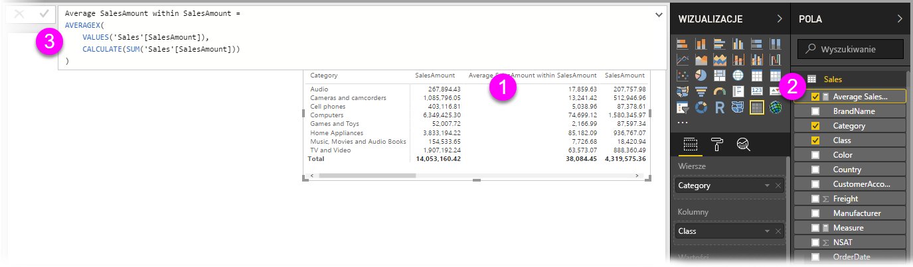

Aby rozpocząć od pierwszego elementu, zwróć uwagę, że **Szybka miara** została zastosowana do wizualizacji. Istnieje teraz nowa kolumna i powiązana wartość, które zostały oparte na utworzonej **Szybkiej mierze**.

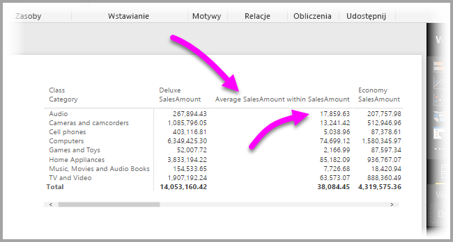

Ponadto **Szybka miara** jest wyświetlana na liście **Pola** w modelu danych i może być używana tak jak dowolne inne pole w modelu dla dowolnej innej wizualizacji. Na poniższej ilustracji utworzono szybką wizualizację **wykres słupkowy** przy użyciu nowego pola utworzonego przez **Szybką miarę**.

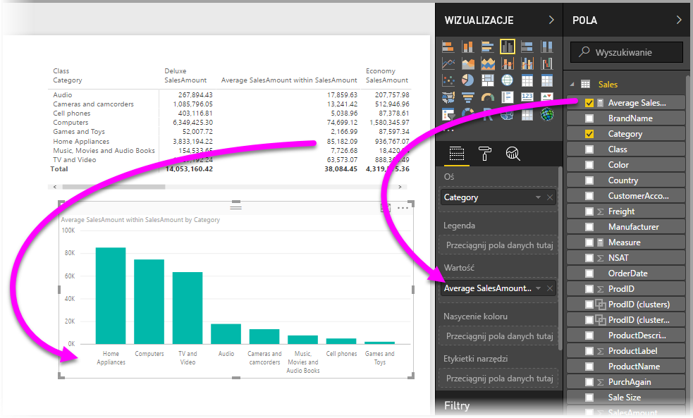

Przejdźmy do kolejnej sekcji, aby omówić trzeci element, formuły języka DAX.

## Nauka języka DAX przy użyciu Szybkich miar
Kolejną wspaniałą korzyścią stosowania **Szybkich miar** jest możliwość bezpośredniego przedstawienia formuły DAX, która została utworzona w celu wdrożenia miary. Na poniższej ilustracji wybraliśmy miarę utworzoną przez **Szybką miarę** (teraz znajduje się na liście **Pola**, więc wystarczy ją kliknąć). Następnie zostanie wyświetlony **Pasek formuły** przedstawiający formułę DAX, którą usługa Power BI utworzyła, aby zastosować miarę.

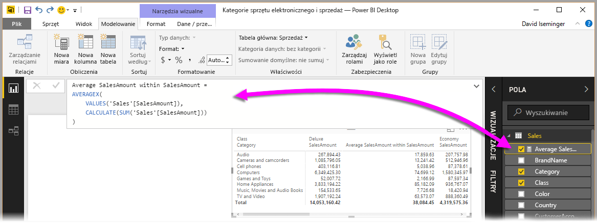

Samo przedstawienie formuły stanowiącej podstawę miary jest miłe. Ale co ważniejsze, umożliwia to użycie **Szybkich miar** do sprawdzenia, jak należy tworzyć źródłowe formuły DAX.

Wyobraźmy sobie sytuację, w której należy wykonać obliczenie z porównaniem między latami, ale nie masz pewności co do struktury formuły DAX (lub nie masz pojęcia, jak zacząć). Zamiast walić głową w biurko, możesz utworzyć **Szybką miarę** przy użyciu obliczenia **Zmiana między latami** i zobaczyć co się stanie. Utwórz **Szybką miarę** i zobacz, jak pojawia się w wizualizacji, sprawdź jak zadziałała formuła DAX, a następnie wprowadź zmiany bezpośrednio w języku DAX lub utwórz kolejną miarę, aż obliczenia będą spełniać potrzeby lub oczekiwania.

Jest to swego rodzaju szybki nauczyciel, który natychmiast reaguje na Twoje pytania „Co się stanie, jeśli?” po kilku kliknięciach. Zawsze możesz usunąć te miary z modelu, jeśli nie będą spełniać Twoich oczekiwań — wystarczy kliknąć miarę prawym przyciskiem myszy i wybrać opcję **Usuń**.

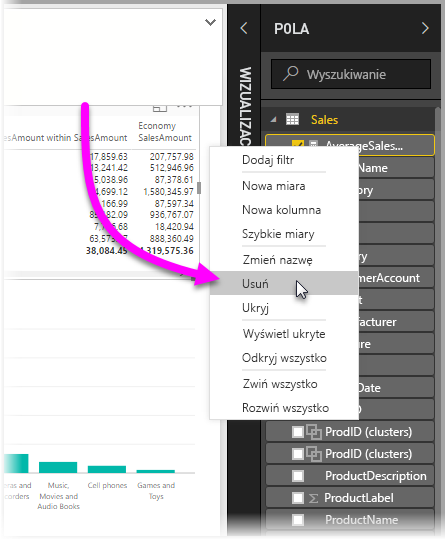

Jeśli uzyskasz odpowiednie miary, możesz zmienić ich nazwy wedle potrzeb, używając tego samego menu dostępnego po kliknięciu prawym przyciskiem.

## Ograniczenia i istotne zagadnienia
Należy pamiętać o kilku ograniczeniach i zagadnieniach.

* **Szybkie miary** są dostępne tylko wtedy, gdy możesz zmodyfikować model; czyli nie są dostępne w przypadku pracy z zapytaniem bezpośrednim lub stosowania większości połączeń na żywo (jak wyjaśniono wcześniej, połączenia na żywo z usługami SSAS są obsługiwane).
* Miara dodana do listy **Pola** może być używana w dowolnej wizualizacji w raporcie.
* Zawsze możesz zobaczyć formułę DAX skojarzoną z **Szybką miarą** poprzez wybranie utworzonej miary na liście **Pola** i sprawdzenie formuły na **Pasku formuły**.

> [!WARNING]
> Szybkie miary obecnie generują *tylko* instrukcje DAX z przecinkami jako separatorami argumentów. Jeśli Twoja wersja programu **Power BI Desktop** jest zlokalizowana w języku stosującym przecinki jako separatory dziesiętne, szybkie miary nie będą działać prawidłowo.
> 
> 

### Analiza czasu i Szybkie miary
Począwszy od aktualizacji programu **Power BI Desktop** z października 2017 r., możesz używać własnych niestandardowych tabel dat z **Szybkimi miarami** analizy czasu. Jeśli model danych zawiera niestandardową tabelę dat, możesz użyć głównej kolumny dat w tabeli na potrzeby Szybkich miar analizy czasu. *Musisz* upewnić się, że podczas tworzenia modelu ta główna kolumna dat w tabeli została oznaczona jako Tabela dat, zgodnie z opisem w [tym artykule](https://docs.microsoft.com/sql/analysis-services/tabular-models/specify-mark-as-date-table-for-use-with-time-intelligence-ssas-tabular).

### Dodatkowe informacje i przykłady
Zamierzamy przedstawiać przykłady i wytyczne dotyczące wszystkich obliczeń **Szybkich miar**, więc wróć wkrótce do tego artykułu, aby uzyskać aktualne informacje.

Masz pomysł na **Szybką miarę**, która nie została jeszcze udostępniona? Świetnie. Sprawdź [tę stronę](https://go.microsoft.com/fwlink/?linkid=842906) i prześlij swoje pomysły (oraz formułę DAX) dotyczące **Szybkiej miary**, którą chcesz zobaczyć w programie **Power BI Desktop**. Rozważymy dodanie jej do listy **Szybkie miary** w przyszłych wersjach.

