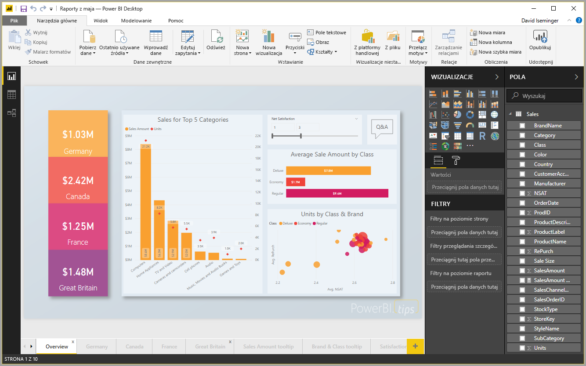

# Szybki start: łączenie się z danymi w programie Power BI Desktop

W tym przewodniku Szybki start połączysz się z danymi przy użyciu programu **Power BI Desktop**. Jest to pierwszy krok do kompilowania modeli danych i tworzenia raportów.

Jeśli nie masz konta usługi Power BI, na początku [zacznij korzystać z bezpłatnej wersji próbnej](https://app.powerbi.com/signupredirect?pbi_source=web).

## Wymagania wstępne

Aby wykonać kroki opisane w tym artykule:
* Pobierz i zainstaluj program **Power BI Desktop**, czyli bezpłatną aplikację uruchamianą na komputerze lokalnym. Możesz [pobrać program **Power BI Desktop**](https://powerbi.microsoft.com/desktop) bezpośrednio lub ze sklepu [**Microsoft Store**](http://aka.ms/pbidesktopstore).
* [Pobierz ten przykładowy skoroszyt programu Excel ](http://go.microsoft.com/fwlink/?LinkID=521962) i utwórz folder o nazwie *C:\PBID-qs*, w którym możesz przechowywać plik programu Excel. W kolejnych krokach tego przewodnika Szybki start przyjęto założenie, że to będzie lokalizacja pliku pobranego skoroszytu programu Excel.

## Uruchamianie programu Power BI Desktop

Po zainstalowaniu programu **Power BI Desktop** uruchom aplikację na komputerze lokalnym. Otrzymasz pustą kanwę, czyli miejsce do tworzenia wizualizacji i raportów na podstawie danych, z którymi się łączysz. 

## Łączenie się z danymi

Korzystając z programu **Power BI Desktop**, możesz nawiązywać połączenie z wieloma różnymi typami danych. Mogą być to połączenia z podstawowymi źródłami danych, takimi jak plik programu Microsoft Excel, oraz połączenia z usługami online, zawierającymi różne rodzaje danych, takimi jak Salesforce, Microsoft Dynamics, Azure Blob Storage i wiele innych. 

Aby nawiązać połączenie z danymi, ze wstążki **Narzędzia główne** wybierz pozycję **Pobierz dane**.

Zostanie wyświetlone okno **Pobieranie danych**, w którym można wybrać wiele różnych źródeł danych, z którymi program **Power BI Desktop** może się łączyć. W tym przewodniku Szybki start używamy pobranego skoroszytu programu Excel, opisanego w sekcji *Wymagania wstępne* na początku tego artykułu. 

Ponieważ jest to plik programu Excel, wybieramy opcję **Excel** z okna **Pobierz dane**, a następnie wybieramy przycisk **Połącz**.

Zostanie wyświetlony monit o podanie lokalizacji pliku programu Excel, z którym chcemy się połączyć. Pobrany plik jest nazwany *Financial Sample* (Przykład finansowy), wybieramy ten plik, a następnie wybieramy pozycję **Otwórz**.

Program **Power BI Desktop** ładuje skoroszyt, odczytuje jego zawartość i pokazuje dostępne dane w pliku przy użyciu okna **Nawigator**, w którym możesz wybrać dane do załadowania programu Power BI Desktop. Należy wybrać tabele, zaznaczając pola wyboru obok każdej tabeli do zaimportowania. W tym przypadku zaimportujemy obie dostępne tabele.

Po dokonaniu wyboru wybierz pozycję **Załaduj** w celu zaimportowania danych do programu Power BI Desktop.

## Wyświetlanie danych w okienku Pola

Po załadowaniu tabel w okienku **Pola** zostaną wyświetlone dane. Można rozwinąć każdą tabelę, wybierając trójkąt znajdujący się obok jego nazwy. Na poniższej ilustracji tabela *Financials* (Finanse) jest rozwinięta i wszystkie jej pola są widoczne. 

I to już wszystko! Po nawiązaniu połączenia z danymi w programie **Power BI Desktop** i załadowaniu danych można wyświetlić wszystkie dostępne pola w tych tabelach.

## Następne kroki
Istnieje wiele różnych sposobów korzystania z programu **Power BI Desktop** po nawiązaniu połączenia z danymi, takich jak tworzenie wizualizacji i raportów. Aby rozpocząć pracę, zapoznaj się z następującym zasobem:

* [Wprowadzenie (podręcznik) dla programu Power BI Desktop](desktop-getting-started.md)

