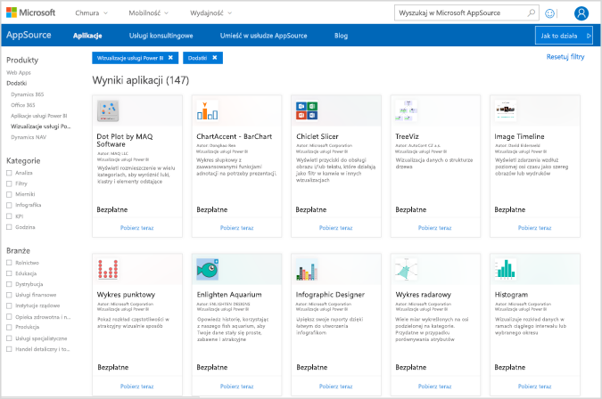
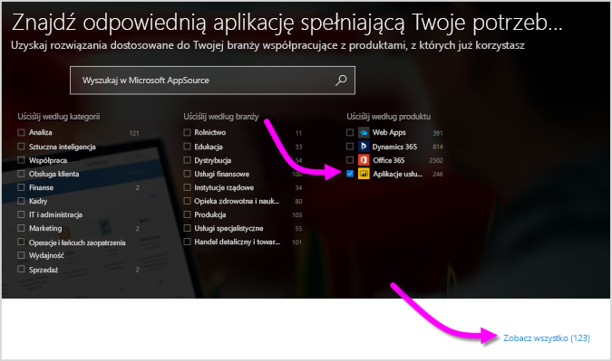
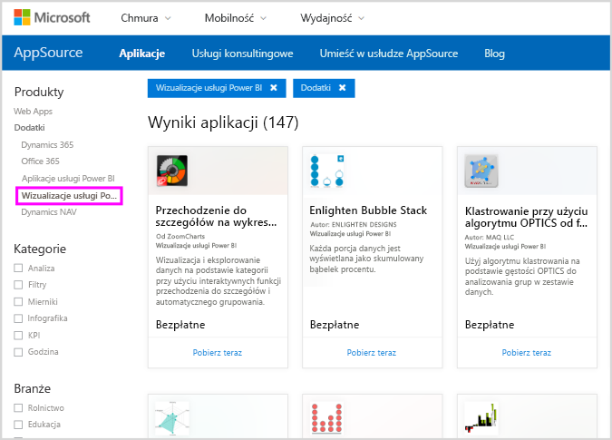
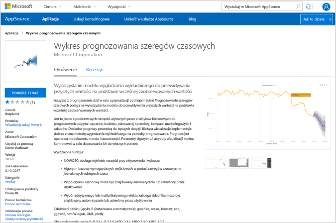
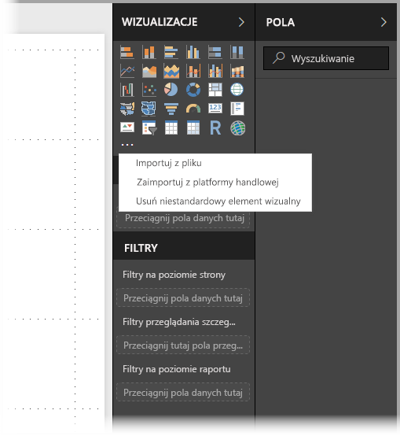
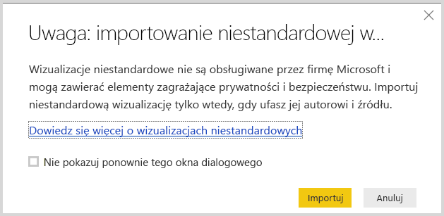
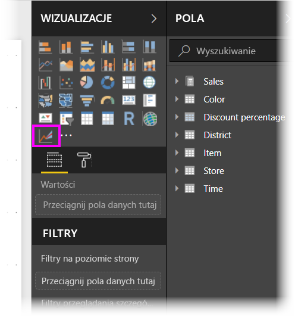
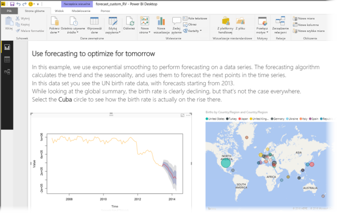
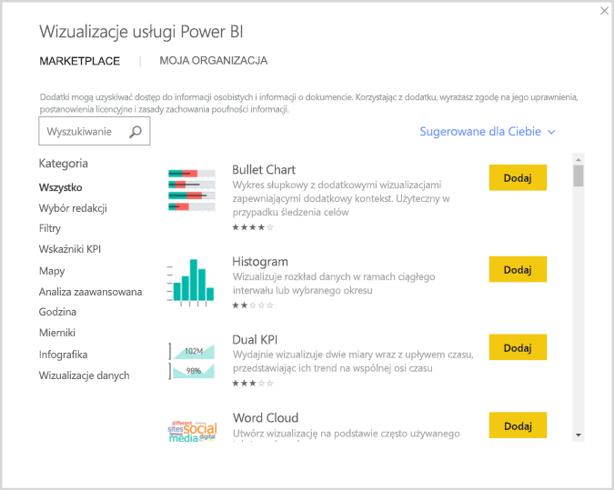

# Używanie w usłudze Power BI wizualizacji niestandardowych utworzonych przy użyciu języka R

Program **Power BI Desktop** i **usługa Power BI** umożliwiają korzystanie z wizualizacji niestandardowych utworzonych w języku R bez konieczności znajomości języka R ani tworzenia skryptów w języku R. Dzięki temu można wykorzystać analityczne i wizualne możliwości wizualizacji i skryptów w języku R bez konieczności przyswajania wiedzy na temat tego języka czy też programowania w nim.

Aby użyć wizualizacji niestandardowych utworzonych w języku R, należy najpierw wybrać i pobrać odpowiednią wizualizację niestandardową utworzoną w języku R z galerii [**AppSource**](https://appsource.microsoft.com/marketplace/apps?product=power-bi-visuals&page=1) zawierającej **wizualizacje niestandardowe** dla usługi Power BI.

W poniższych sekcjach opisano sposób wybierania, ładowania i używania w programie **Power BI Desktop** wizualizacji niestandardowych utworzonych w języku R.

## Używanie wizualizacji niestandardowych utworzonych w języku R

Aby używać wizualizacji niestandardowych utworzonych w języku R, pobierz poszczególne wizualizacje z biblioteki **wizualizacji niestandardowych**, a następnie używaj ich tak jak wszystkich innych typów wizualizacji w programie **Power BI Desktop**. Istnieją dwa sposoby pobrania wizualizacji niestandardowych: pobranie z witryny **AppSource** online lub przejrzenie i pobranie z poziomu programu **Power BI Desktop**. 

### Pobieranie wizualizacji niestandardowych z witryny AppSource

Poniżej przedstawiono kroki przeglądania i wybierania wizualizacji niestandardowych z witryny **AppSource** online:

1. Przejdź do biblioteki wizualizacji usługi Power BI dostępnej pod adresem [https://appsource.microsoft.com](https://appsource.microsoft.com/). Zaznacz pole wyboru *Power BI apps* (Aplikacje Power BI) w obszarze *Uściślij według produktu*, a następnie wybierz link **Zobacz wszystkie**.

   

2. Na stronie biblioteki [wizualizacji usługi Power BI](https://appsource.microsoft.com/marketplace/apps?product=power-bi-visuals&page=1) wybierz pozycję **Power BI visuals** (Wizualizacje usługi Power BI) z listy dodatków w okienku po lewej stronie.

   

3. Wybierz z galerii odpowiednią **wizualizację**. Nastąpi przekierowanie do strony z jej opisem. Wybierz pozycję **Pobierz teraz**, aby rozpocząć pobieranie.

   > [!NOTE]
    > Aby można było tworzyć w programie **Power BI Desktop**, na komputerze lokalnym musi być zainstalowany język R. Wyświetlanie w **usłudze Power BI** wizualizacji utworzonych w języku R nie wymaga jednak zainstalowania lokalnie tego języka.

   

   Instalacja języka R nie jest konieczna do używania w **usłudze Power BI** wizualizacji niestandardowych utworzonych w języku R, ale używanie ich w programie **Power BI Desktop** *wymaga* zainstalowania języka R na komputerze lokalnym. Język R można pobrać z następujących lokalizacji:

   * [CRAN](https://cran.r-project.org/)
   * [MRO](https://mran.microsoft.com/)

4. Po pobraniu wizualizacji (co przypomina pobranie dowolnego pliku w przeglądarce) przejdź do programu **Power BI Desktop**, kliknij wielokropek (...) w okienku **Wizualizacje** i wybierz pozycję **Importuj z pliku**.

   
5. Zostało wyświetlone ostrzeżenie dotyczące importowania wizualizacji niestandardowej, jak pokazano na poniższej ilustracji:

   
6. Przejdź do miejsca, w którym została zapisana wizualizacja, a następnie wybierz plik. Wizualizacje niestandardowe programu **Power BI Desktop** mają rozszerzenie pbivisual.

   
7. Po powrocie do programu Power BI Desktop w okienku **Wizualizacje** widać już nowy typ wizualizacji.

   
8. W przypadku importowania nowej wizualizacji (lub otwierania raportu, który zawiera wizualizację niestandardową utworzoną w języku R) program **Power BI Desktop** instaluje wymagane pakiety języka R.

   

9. Z tego miejsca można dodawać dane do wizualizacji tak jak w przypadku każdej innej wizualizacji w programie **Power BI Desktop**. Po zakończeniu działania gotową wizualizację można obejrzeć na kanwie. Poniższa wizualizacja, **Prognozowanie**, została utworzona w języku R i przedstawia prognozowany przyrost naturalny w krajach ONZ (wizualizacja po lewej).

    

    Podobnie jak w przypadku innych wizualizacji w programie **Power BI Desktop** raport ten można opublikować (z uwzględnieniem wizualizacji niestandardowych utworzonych w języku R) w **usłudze Power BI** i udostępnić go innym użytkownikom.

    Warto regularnie zaglądać do biblioteki, ponieważ stale dodajemy do niej nowe wizualizacje.

### Pobieranie wizualizacji z programu **Power BI Desktop**

1. Wizualizacji można także pobrać z programu **Power BI Desktop**. W programie **Power BI Desktop** kliknij wielokropek (...) w okienku **Wizualizacje**, a następnie wybierz pozycję **Importuj z witryny Marketplace**.

   

2. Zostanie wyświetlone okno dialogowe **Wizualizacje usługi Power BI**, w którym możesz przejrzeć dostępne wizualizacje niestandardowe i wybrać, którą chcesz. Możesz wyszukać wizualizację według nazwy, kategorii lub po prostu przejrzeć dostępne wizualizacje, przewijając zawartość okna. Kiedy zdecydujesz się na określoną wizualizację, wybierz pozycję **Dodaj**, aby dodać tę wizualizację niestandardową do programu **Power BI Desktop**.

   

## Tworzenie wizualizacji niestandardowych w języku R

Wizualizacje, które zostały utworzone samodzielnie w języku R na użytek własnych raportów, można udostępnić innym, przekazując je do **galerii wizualizacji niestandardowych**. Odbywa się to przy użyciu witryny GitHub, a odpowiedni proces jest opisany w następującej lokalizacji:

* [Przekazywanie swoich wizualizacji do galerii wizualizacji niestandardowych w języku R](https://github.com/Microsoft/PowerBI-visuals#building-r-powered-custom-visual-corrplot)

## Rozwiązywanie problemów z wizualizacjami niestandardowymi utworzonymi w języku R

Wizualizacje niestandardowe utworzone w języku R mają pewne zależności, które należy uwzględnić, aby zapewnić prawidłowe działanie wizualizacji. Jeśli wizualizacje niestandardowe utworzone w języku R nie działają lub nie ładują się prawidłowo, jest to zwykle spowodowane jednym z następujących problemów:

* Brakujący aparat języka R
* Błąd w skrypcie języka R, na którym bazuje dana wizualizacja
* Brakujące lub nieaktualne pakiety języka R

W poniższej sekcji przedstawiono procedury rozwiązywania problemów, które możesz napotkać.

### Brakujące lub nieaktualne pakiety języka R

Podczas próby zainstalowania wizualizacji niestandardowej utworzonej w języku R mogą wystąpić błędy spowodowane brakującymi lub przestarzałymi pakietami języka R. Wynika to z jednej z następujących przyczyn:

* Instalacja języka R jest niezgodna z pakietem języka R
* Zapora, oprogramowanie antywirusowe lub ustawienia serwera proxy uniemożliwiają językowi R połączenie się z Internetem
* Połączenie internetowe działa wolno lub występuje problem z połączeniem internetowym

Zespół usługi Power BI aktywnie pracuje nad tymi problemami. Następna wersja programu Power BI Desktop będzie zawierać aktualizacje umożliwiające ich rozwiązanie. Do tego czasu w celu zniwelowania tych problemów można wykonać poniższe czynności (jedną lub kilka):

1. Usuń wizualizację niestandardową, a następnie zainstaluj ją ponownie. Spowoduje to zainicjowanie ponownej instalacji pakietów języka R.
2. Jeśli instalacja języka R nie jest aktualna, uaktualnij ją, a następnie usuń i ponownie zainstaluj wizualizację niestandardową zgodnie z opisem w poprzednim kroku.

   Obsługiwane wersje języka R są wyświetlane w opisie każdej wizualizacji niestandardowej utworzonej w języku R, jak to pokazano na poniższym obrazie.

     
    > [!NOTE]
    > Możesz zachować oryginalną instalację języka R i skojarzyć program Power BI Desktop z bieżącą wersją, którą instalujesz. Przejdź do pozycji **Plik > Opcje i Ustawienia > Opcje > Obsługa skryptów języka R**.

3. Zainstaluj pakiety języka R ręcznie, przy użyciu dowolnej konsoli języka R. Oto etapy tej procedury:

   a.  Pobierz skrypt instalacyjny wizualizacji utworzonej w języku R, a następnie zapisz ten plik na dysku lokalnym.

   b.  Z poziomu konsoli języka R uruchom następujące polecenie:

       source(“C:/Users/david/Downloads/ScriptInstallPackagesForForecastWithWorkarounds.R”)

   Oto typowe domyślne lokalizacje instalacji:

       c:\Program Files\R\R-3.3.x\bin\x64\Rterm.exe (for CRAN-R)
       c:\Program Files\R\R-3.3.x\bin\x64\Rgui.exe (for CRAN-R)
       c:\Program Files\R\R-3.3.x\bin\R.exe (for CRAN-R)
       c:\Program Files\Microsoft\MRO-3.3.x\bin\R.exe (for MRO)
       c:\Program Files\Microsoft\MRO-3.3.x\bin\x64\Rgui.exe (for MRO)
       c:\Program Files\RStudio\bin\rstudio.exe (for RStudio)
4. Jeśli poprzednie kroki nie zadziałają, spróbuj wykonać następujące czynności:

   a. Użyj programu **R Studio** i wykonaj czynność opisaną w punkcie 3.b. powyżej (uruchom wiersz skryptu z poziomu konsoli języka R).

   b. Jeśli poprzedni krok nie zadziała, wybierz pozycję **Tools > Global Options > Packages** (Narzędzia > Opcje globalne > Pakiety) w programie **R Studio** i zaznacz pole wyboru **Use Internet Explorer library/proxy for HTTP** (Użyj biblioteki programu Internet Explorer/serwera proxy dla protokołu HTTP), a następnie powtórz krok 3.b. z powyższej procedury.

## Następne kroki

Spójrz na następujące informacje dodatkowe na temat języka R w usłudze Power BI.

* [Galeria wizualizacji niestandardowych w usłudze Power BI](https://app.powerbi.com/visuals/)
* [Uruchamianie skryptów języka R w programie Power BI Desktop](desktop-r-scripts.md)
* [Tworzenie wizualizacji języka R w programie Power BI Desktop](desktop-r-visuals.md)
* [Używanie zewnętrznego środowiska IDE języka R z usługą Power BI](desktop-r-ide.md)
