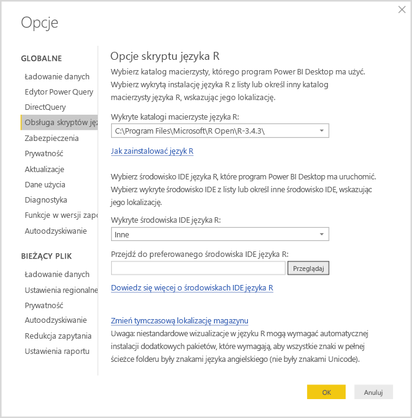
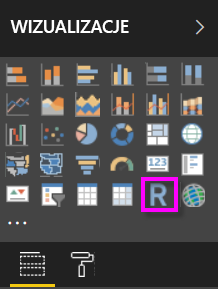
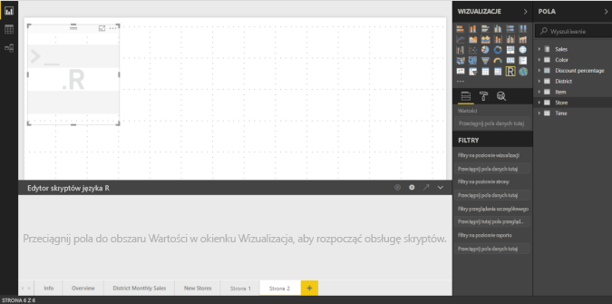
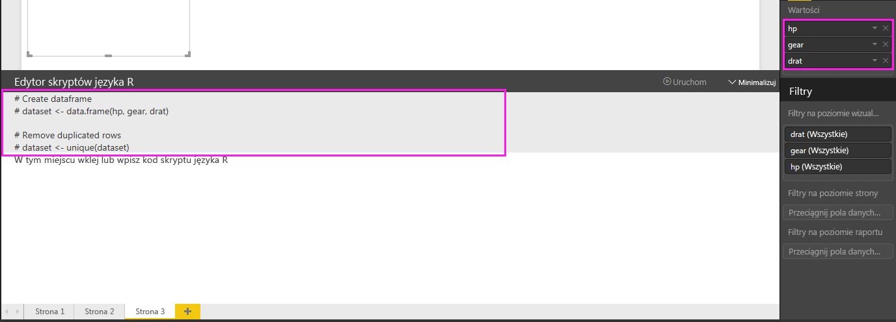
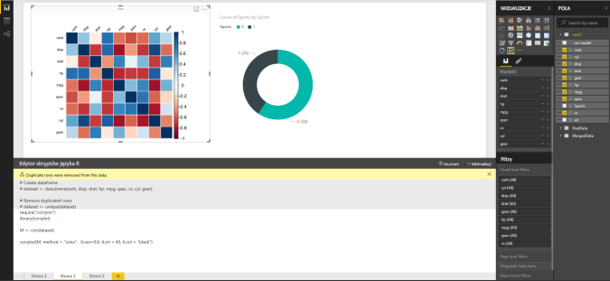
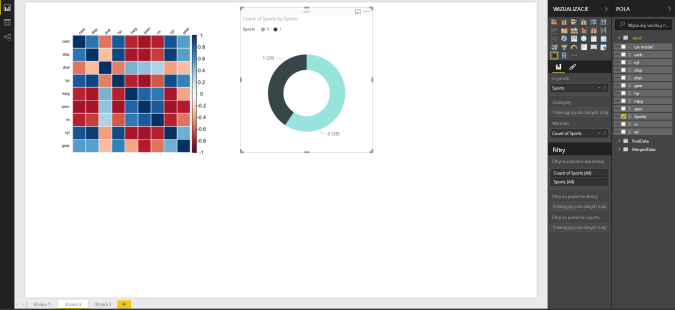
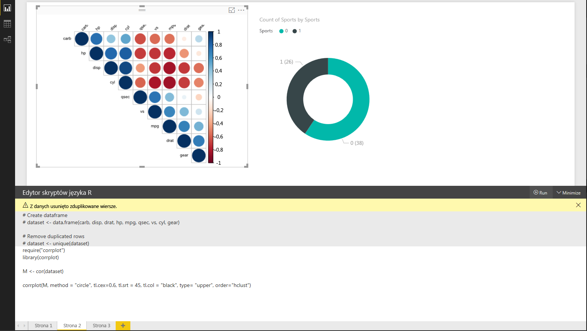
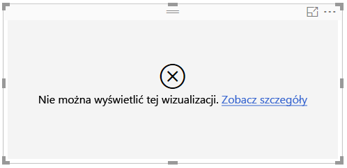

# Tworzenie wizualizacji usługi Power BI przy użyciu języka R
Program **Power BI Desktop** umożliwia wizualizowanie danych przy użyciu języka **R**.

## Instalowanie języka R
Program **Power BI Desktop** nie obejmuje, nie wdraża ani nie instaluje aparatu języka **R**. Aby uruchamiać skrypty języka R w programie **Power BI Desktop**, musisz osobno zainstalować język **R** na swoim komputerze lokalnym. Język **R** możesz pobrać i zainstalować bezpłatnie z wielu miejsc, w tym ze [strony pobierania Revolution Open](https://mran.revolutionanalytics.com/download/) i [repozytorium CRAN](https://cran.r-project.org/bin/windows/base/). Bieżąca wersja mechanizmu obsługi skryptów języka R w programie **Power BI Desktop** obsługuje znaki Unicode, a także spacje (puste znaki) w ścieżce instalacji.

## Włączanie wizualizacji języka R
Aby włączyć wizualizacje języka R, wybierz pozycję **Plik > Opcje i ustawienia > Opcje**, a następnie na stronie **Opcje** sprawdź, czy w sekcji **Obsługa skryptów języka R** okna **Opcje** jest określona Twoja lokalna instalacja języka R, jak na poniższym obrazie. Na poniższych obrazie ścieżka do lokalnej instalacji języka to **C:\Program Files\R\R-3.2.0**. Ścieżka ta jest w tej postaci wpisana w polu tekstowym. Sprawdź, czy ścieżka prawidłowo odzwierciedla lokalizację lokalnej instalacji języka R, z której ma korzystać program **Power BI Desktop**.
   
   

Po określeniu instalacji języka R możesz zacząć tworzyć wizualizacje w tym języku.

## Tworzenie wizualizacji języka R w programie Power BI Desktop
1. Aby dodać wizualizację języka R, wybierz ikonę **Wizualizacja języka R** w okienku **Wizualizacje**, co pokazano na poniższych obrazie.
   
   

   Dodanie do raportu wizualizacji języka R powoduje wykonanie poniższych akcji przez program **Power BI Desktop**:
   
   - Na kanwie raportu pojawia się obraz symbolu zastępczego wizualizacji języka R.
   
   - Na dole okienka środkowego pojawia się **edytor skryptów języka R**.
   
   

2. Następnie dodaj pola, które chcesz wykorzystać w skrypcie języka R, do sekcji **Wartości** w obszarze **Pola**, podobnie jak w przypadku każdej innej wizualizacji w programie **Power BI Desktop**. 
    
    Skrypt języka R może korzystać tylko z pól, które zostały dodane do obszaru **Pola**. Nowe pola można dodawać do obszaru **Pola**, a zbędne pola można z niego usuwać podczas pracy nad skryptem języka R w **edytorze skryptów języka R programu Power BI Desktop**. Program **Power BI Desktop** automatycznie wykrywa, które pola zostały dodane, a które usunięte.
   
   > [!NOTE]
   > Domyślny typ agregacji ustawiony dla wizualizacji języka R to *Nie sumuj*.
   > 
   > 
   
3. Teraz możesz utworzyć wykres, korzystając z wybranych danych. 

    W miarę wybierania pól **edytor skryptów języka R** generuje pomocniczy kod powiązania skryptu języka R w oparciu o dane wybrane w szarej sekcji u góry okienka edytora. Jeśli dodasz lub usuniesz kolejne pole, kod pomocniczy w edytorze skryptów języka R zostanie odpowiednio automatycznie wygenerowany lub usunięty.
   
   Na przykładzie pokazanym na poniższym obrazie zaznaczono trzy pola: hp, gear oraz drat. W wyniku tego edytor skryptów języka R wygenerował następujący kod powiązania:
   
   * Została utworzona ramka danych o nazwie **dataset**.
     * Ramka danych składa się z różnych pól wybranych przez użytkownika.
   * Domyślny typ agregacji to *Nie sumuj*.
   * Podobnie jak w przypadku wizualizacji tabel, pola są grupowane, a wiersze zduplikowane są wyświetlane tylko raz.
   
   
   
   > [!TIP]
   > W niektórych sytuacjach grupowanie automatyczne może nie być wskazane lub może wystąpić konieczność wyświetlenia wszystkich wierszy (także zduplikowanych). W takiej sytuacji do zestawu danych można dodać pole indeksu, dzięki któremu wszystkie wiersze będą traktowane jako unikatowe i nie zostaną pogrupowane.
   > 
   > 
   
   Wygenerowana ramka danych nosi nazwę **dataset**, a do wybranych kolumn można uzyskać dostęp, korzystając z ich nazw. Na przykład do pola gear odwołasz się, wpisując w skrypcie języka R ciąg *dataset$gear*. W przypadku pól, których nazwy zawierają spacje lub znaki specjalne, należy używać cudzysłowów.

4. Dzięki temu, że ramka danych jest generowana automatycznie przez wybrane pola, można od razu pisać skrypt języka R powodujący utworzenie wykresu na urządzeniu domyślnym dla języka R. Kiedy skrypt będzie gotowy, wybierz pozycje **Uruchom** dostępną na pasku tytułu **edytora skryptów języka R** (pozycja **Uruchom** znajduje się po prawej stronie paska tytułu).
   
    Gdy wybierzesz pozycję **Uruchom**, program **Power BI Desktop** zidentyfikuje wykres i pokaże go na kanwie. Ponieważ proces ma miejsce w lokalnej instalacji języka R, upewnij się, że wymagane pakiety zostały zainstalowane.
   
   Program **Power BI Desktop** ponownie tworzy wizualizację, jeśli wystąpi dowolne z następujących zdarzeń:
   
   * Na pasku tytułu **edytora skryptów języka R** wybierzesz pozycję **Uruchom**
   * Nastąpi zmiana danych będąca wynikiem odświeżenia danych, filtrowania lub wyróżniania

     Na poniższym obrazie przedstawiono przykład kodu wykresu korelacji między atrybutami różnych rodzajów samochodów.

     

5. Aby powiększyć widok wizualizacji, można zminimalizować okno **edytora skryptów języka R**. Podobnie jak w przypadku innych wizualizacji w programie **Power BI Desktop**, można filtrować krzyżowo wykres korelacji, zaznaczając tylko samochody sportowe w wizualizacji pierścieniowej (okrągłej wizualizacji po prawej stronie na powyższym przykładowym obrazie).

    

6. Można także zmodyfikować skrypt języka R, aby dostosować wizualizację, i wykorzystać możliwości języka R, dodając parametry do polecenia kreślącego.

    Oryginalne polecenie kreślące było następujące:

    corrplot(M, method = "color",  tl.cex=0.6, tl.srt = 45, tl.col = "black")

    Kilka zmian wprowadzonych w skrypcie języka R spowodowało, że polecenie wygląda teraz tak:

    corrplot(M, method = "circle", tl.cex=0.6, tl.srt = 45, tl.col = "black", type= "upper", order="hclust")

    W wyniku tego wizualizacja języka R tworzy teraz koła, uwzględnia tylko dane z górnej połowy i zmienia układ macierzy, aby skorelowane atrybuty były klastrowane, jak pokazano na poniższym obrazie.

    

    Jeśli podczas wykonywania skryptu języka R wystąpi błąd, wizualizacja języka R nie zostanie nakreślona, a na kanwie zostanie wyświetlany komunikat o błędzie. Aby uzyskać szczegółowe informacje na temat błędu, wybierz pozycję **Zobacz szczegóły** w komunikacie o błędzie wizualizacji języka R na kanwie.

    

    > **Bezpieczeństwo skryptów języka R:** wizualizacje języka R są tworzone na podstawie skryptów języka R, które mogą zawierać kod zagrażający prywatności lub bezpieczeństwu. Podczas pierwszej próby wyświetlenia lub użycia wizualizacji języka R użytkownik zobaczy komunikat z ostrzeżeniem dotyczącym zabezpieczeń. Wizualizacje języka R należy włączyć tylko, jeśli ich autor i źródło są zaufane lub po wykonaniu przeglądu i analizy danego skryptu języka R.
    > 
    > 

## Znane ograniczenia
Wizualizacje języka R w programie **Power BI Desktop** są objęte kilkoma ograniczeniami:

* Ograniczenia rozmiaru danych — ilość danych używanych do kreślenia wizualizacji języka R jest ograniczona do 150 000 wierszy. Jeśli jest zaznaczona większa liczba wierszy, uwzględniane są tylko dane z pierwszych 150 000 wierszy, a na obrazie zostaje wyświetlony komunikat.
* Ograniczenie czasu obliczania — jeśli obliczanie wizualizacji języka R trwa dłużej niż pięć minut, limit czasu zostaje przekroczony i zostaje wyświetlony błąd.
* Relacje — podobnie jak w przypadku innych wizualizacji w programie Power BI Desktop, wybranie pól danych z innych tabel bez zdefiniowanych relacji między nimi powoduje wystąpienie błędu.
* Wizualizacje języka R są odświeżane w przypadku aktualizowania, filtrowania i wyróżniania danych. Jednak sam obraz nie jest interaktywny i nie może stanowić źródła filtrowania krzyżowego.
* Wizualizacje języka R reagują na wyróżnianie innych wizualizacji, ale nie można klikać poszczególnych części wizualizacji języka R w celu filtrowania krzyżowego innych elementów.
* Tylko wykresy nakreślone na urządzeniu domyślnym dla języka R są prawidłowo wyświetlane na kanwie. Dlatego lepiej nie używać do tego innych urządzeń.
* W tej wersji instalacje RRO nie są identyfikowane automatycznie przez 32-bitową wersję programu Power BI Desktop, więc trzeba ręcznie podać ścieżkę do katalogu instalacji języka R za pomocą pozycji **Opcje i ustawienia > Opcje > Obsługa skryptów języka R**.

## Następne kroki
Spójrz na następujące informacje dodatkowe na temat języka R w usłudze Power BI.

* [Uruchamianie skryptów języka R w programie Power BI Desktop](desktop-r-scripts.md)
* [Używanie zewnętrznego środowiska IDE języka R z usługą Power BI](desktop-r-ide.md)

