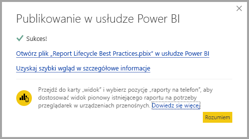
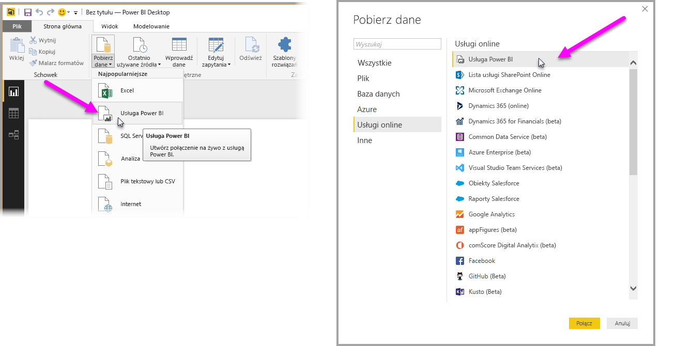

# Łączenie się z zestawami danych w usłudze Power BI z programu Power BI Desktop
Możesz nawiązać połączenie na żywo z udostępnionym zestawem danych w usłudze Power BI i utworzyć wiele różnych raportów na podstawie tego samego zestawu danych. Oznacza to, że możesz utworzyć swój doskonały model danych w programie Power BI Desktop, opublikować go w usłudze Power BI, a następnie możesz sam utworzyć wiele różnych raportów (w oddzielnych plikach pbix) na podstawie tego samego, wspólnego modelu danych lub mogą to zrobić inni użytkownicy. Ta funkcja jest nazywana **Połączenie na żywo usługi Power BI**.

Istnieją różnorodne zalety tej funkcji, łącznie z najlepszymi rozwiązaniami, które omówimy w dalszej części tego artykułu. Istnieją również pewne kwestie i ograniczenia, więc upewnij się, że je znasz — znajdziesz je na końcu tego artykułu.

## Używanie połączenia na żywo usługi Power BI do zarządzania cyklem życia raportu
Jednym z wyzwań związanych z popularnością usługi Power BI jest rozprzestrzenianie się raportów, pulpitów nawigacyjnych i modeli danych, na których są oparte. Oto dlaczego: łatwo jest tworzyć imponujące raporty w programie **Power BI Desktop**, a następnie udostępniać ([publikować](desktop-upload-desktop-files.md)) te raporty w **usłudze Power BI** oraz tworzyć wspaniałe pulpity nawigacyjne na podstawie tych zestawów danych. Ponieważ tak wiele osób to robi, często używając tych samych (lub prawie takich samych) zestawów danych, wiedza o tym, który raport został oparty na którym zestawie danych — i jak świeży może być każdy zestaw danych — staje się wyzwaniem. **Połączenie na żywo usługi Power BI** radzi sobie z tym wyzwaniem i powoduje, że tworzenie, udostępnianie i rozwijanie raportów i pulpitów nawigacyjnych opartych na wspólnych zestawach danych staje się łatwiejsze i spójne.

### Tworzenie zestawu danych, którego może używać każdy, a następnie udostępnienie go
Powiedzmy, że Anna (analityk biznesowy) jest w Twoim zespole i doskonale radzi sobie z tworzeniem dobrych modeli danych (często nazywanych zestawami danych). Dzięki doświadczeniu Anna może utworzyć zestaw danych i raport, a następnie udostępnić ten raport w **usłudze Power BI**.

Wszyscy kochają jej raporty i jej zestaw danych i właśnie dlatego zaczynają się kłopoty — każda osoba w jej zespole chce utworzyć *swoją własną wersję* tego zestawu danych, a następnie udostępnić własne raporty zespołowi. Nagle pojawia się wiele raportów (z różnych zestawów danych) w obszarze roboczym zespołu w **usłudze Power BI**. Który jest najnowszy? Czy zestawy danych są takie same, czy tylko prawie? Jakie są różnice? Dzięki funkcji **Połączenie usługi Power BI na żywo** wszystko to może się zmienić na lepsze. W następnej sekcji zobaczymy, jak inni mogą używać opublikowanego zestawu danych Anny do swoich własnych raportów i umożliwić każdemu stosowanie tego samego trwałego, sprawdzonego, opublikowanego zestawu danych do budowania własnych unikatowych raportów.

### Nawiązywanie połączenia z zestawem danych usługi Power BI za pomocą połączenia na żywo
Gdy Anna utworzy swój raport (i utworzy zestaw danych, na którym jest on oparty), opublikuje go w **usłudze Power BI**, wyświetli w obszarze roboczym zespołu w usłudze Power BI. Teraz jest dostępny dla każdego w jej obszarze roboczym do przeglądania i używania.

Aby dowiedzieć się więcej na temat obszarów roboczych, zobacz [Obszary robocze aplikacji](service-create-distribute-apps.md#app-workspaces).

Inni członkowie jej obszaru roboczego mogą teraz nawiązać połączenie na żywo z udostępnionym modelem danych Anny (za pomocą funkcji **połączenia usługi Power BI na żywo**) i tworzyć własne unikatowe raporty na podstawie *jej oryginalnego zestawu danych*.

Na poniższej ilustracji zobaczysz, jak Anna tworzy jeden raport programu **Power BI Desktop** i publikuje go (co obejmuje model danych) w **usłudze Power BI**. Następnie inne osoby w jej obszarze roboczym mogą się połączyć z jej modelem danych za pomocą **połączenia usługi Power BI na żywo** i utworzyć własne unikatowe raporty na podstawie jej zestawu danych.

> [!NOTE]
> Zestawy danych są udostępniane tylko w jednym obszarze roboczym. Aby nawiązać połączenie z usługą Power BI na żywo, zestaw danych, z którym się łączysz, musi znajdować się w udostępnionym obszarze roboczym, do którego należysz.
> 
> 

## Kolejne kroki używania połączenia na żywo usługi Power BI
Teraz, gdy wiemy jak użyteczne jest **połączenie na żywo usługi Power BI** i jak można go użyć jako najlepszego podejścia praktycznego do zarządzania cyklem życia raportu, przyjrzyjmy się krokom, które przeprowadzą nas od wspaniałego raportu (i zestawu danych) Anny do udostępnionego zestawu danych, którego mogą używać członkowie jej zespołu w jej obszarze roboczym usługi Power BI.

### Publikowanie raportu i zestawu danych usługi Power BI
Pierwszym krokiem zarządzania cyklem życia raportu przy użyciu **połączenia na żywo usługi Power BI** jest posiadanie raportu (i zestawu danych), którego chcą używać członkowie zespołu. Więc Anna musi najpierw **opublikować** swój raport z programu **Power BI Desktop**. Robi to, wybierając pozycję **Publikuj** na wstążce **Narzędzia główne** w programie Power BI Desktop.

Jeśli nie jest zalogowana do konta usługi Power BI, zostanie wyświetlony monit, aby to zrobiła.

Z tego miejsca może ona wybrać docelowy obszar roboczy, gdzie zostanie opublikowany raport i zestaw danych. Pamiętaj, że tylko członkowie mający dostęp do obszaru roboczego, w którym opublikowano raport, mogą uzyskać dostęp do jego zestawu danych za pomocą **połączenia na żywo usługi Power BI**.

Rozpoczyna się proces publikowania i program **Power BI Desktop** pokazuje postęp.

Po zakończeniu program **Power BI Desktop** pokazuje powodzenie i udostępnia kilka linków pozwalających przejść do samego raportu w **usłudze Power BI** i link do uzyskania **szybkiego wglądu w szczegółowe dane** raportu.

Następnie zobaczmy, jak inni członkowie zespołu mający dostęp do obszaru roboczego, gdzie został opublikowany raport (i zestaw danych), łączą się z zestawem danych i kompilują własne raporty.

### Nawiązywanie połączenia na żywo usługi Power BI z opublikowanym zestawem danych
Aby nawiązać połączenie z opublikowanym raportem i utworzyć własny raport na podstawie opublikowanego zestawu danych, wybierz pozycję **Pobierz dane** ze wstążki **Narzędzia główne** w programie **Power BI Desktop**, a następnie wybierz **usługę Power BI**. Możesz też ją wybrać, korzystając z pozycji **Pobierz dane > Usługi online > Usługa Power BI**.

Jeśli jeszcze nie zalogowano się do usługi Power BI, zostanie wyświetlony monit, aby to zrobić. Po zalogowaniu zostanie wyświetlone okno pokazujące obszary robocze, do których należysz, i możesz wybrać, który obszar roboczy zawiera zestaw danych, z którym chcesz nawiązać **połączenie usługi Power BI na żywo**.

Liczba w nawiasach obok obszaru roboczego pokazuje liczbę udostępnionych zestawów danych dostępnych w tej grupie roboczej, a wybranie trójkąta z lewej strony rozwija obszar roboczy, pozwalając wybrać udostępniony zestaw danych.

Istnieje kilka elementów do zanotowania z poprzedniego okna połączenia na żywo **usługi Power BI**:

* Możesz wyszukać udostępniony zestaw danych, ale wyniki wyszukiwania są ograniczone do rozwiniętych elementów i nie będą obejmować żadnych obszarów roboczych, które nie zostały rozwinięte.
* Możesz rozwinąć więcej niż jeden obszar roboczy, aby rozszerzyć swoje wyszukiwanie.

Gdy wybierzesz w oknie pozycję **Załaduj**, nawiążesz połączenie na żywo z wybranym zestawem danych, co oznacza, że widoczne dane (pola i ich wartości) zostaną załadowane do programu **Power BI Desktop** w czasie rzeczywistym.

Teraz Ty (i inni) możesz tworzyć i udostępniać niestandardowe raporty — wszystko z tego samego zestawu danych. Jest to doskonały sposób, aby mieć jedną doświadczoną osobę, która tworzy poprawnie sformułowany zestaw danych (czyli to, co robi Anna), a następnie pozwala wielu członkom zespołu używać tego udostępnionego zestawu danych do tworzenia własnych raportów.

> [!NOTE]
> Podczas tworzenia raportów w oparciu o zestaw danych z użyciem połączenia na żywo z **usługą Power BI**, możesz opublikować ten raport tylko w tym samym obszarze roboczym usługi Power BI, który zawiera użyty zestaw danych.
> 
> 

## Ograniczenia i istotne zagadnienia
Podczas korzystania z **połączenia na żywo usługi Power BI** istnieje kilka ograniczeń i istotnych zagadnień, o których należy pamiętać.

* Członkowie obszaru roboczego tylko do odczytu nie mogą się łączyć z zestawami danych z programu **Power BI Desktop**.
* Tylko użytkownicy, którzy należą do tego samego obszaru roboczego **usługi Power BI**, mogą połączyć się z opublikowanym zestawem danych przy użyciu **połączenia na żywo usługi Power BI**. Użytkownicy mogą (i często tak robią) należeć do więcej niż jednego obszaru roboczego.
* Ponieważ jest to połączenie na żywo, lewy obszar nawigacyjny i modelowanie są wyłączone, podobnie do zachowania w przypadku połączenia z **usługami SQL Server Analysis Services**.
* Ponieważ jest to połączenie na żywo, zabezpieczenia RLS (zabezpieczenia na poziomie wiersza i roli), usługi OneDrive dla Firm i inne takie zachowania połączenia są wymuszane, tak jak po podłączeniu do **usług SQL Server Analysis Services**.
* Podczas wybierania zestawu danych, z którym należy się połączyć w **usłudze Power BI**, pole wyszukiwania dotyczy tylko obszarów roboczych, które zostały rozwinięte.
* Jeśli właściciel zmodyfikuje oryginalny udostępniony plik pbix, zestaw danych i raport, który jest udostępniany w **usłudze Power BI**, zostaną zastąpione.
* Członkowie obszaru roboczego nie mogą zastąpić oryginalnie udostępnionego raportu. Próba wykonania tej czynności powoduje wyświetlenie ostrzeżenia zawierającego monit o zmianę nazwy pliku, a następnie jego opublikowanie.
* Jeśli usuniesz udostępniony zestaw danych w **usłudze Power BI**, wówczas inny program **Power BI Desktop** (pliki pbix) nie będzie już działał poprawnie lub nie będzie wyświetlać swoich wizualizacji.
* W przypadku pakietów zawartości musisz najpierw utworzyć kopię pakietu zawartości, zanim użyjesz go jako podstawy do udostępnienia raportu pbix i zestawu danych w **usłudze Power BI**.
* W przypadku skopiowania pakietów zawartości z pozycji *Moja organizacja* nie możesz zastąpić raportu utworzonego w usłudze lub raportu utworzonego jako część kopiowania pakietu zawartości z połączeniem na żywo. Próba wykonania tej czynności powoduje wyświetlenie ostrzeżenia zawierającego monit o zmianę nazwy pliku, a następnie jego opublikowanie. W tej sytuacji możesz tylko zastąpić połączone na żywo opublikowane raporty.
* Podczas tworzenia raportu w oparciu o zestaw danych z użyciem połączenia na żywo z **usługą Power BI** możesz opublikować ten raport tylko w tym samym obszarze roboczym usługi Power BI, który zawiera użyty zestaw danych.
* Usunięcie udostępnionego zestawu danych w **usłudze Power BI** oznacza, że nie masz już dostępu do tego zestawu danych z programu **Power BI Desktop**.

