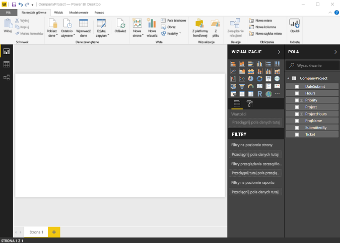
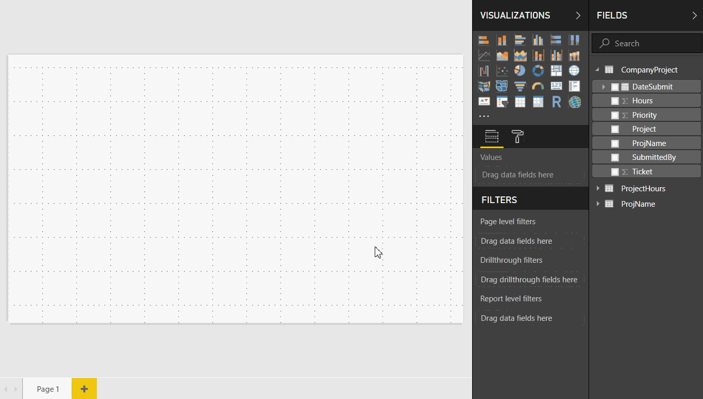
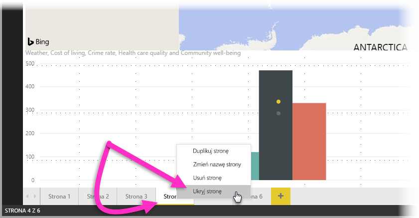
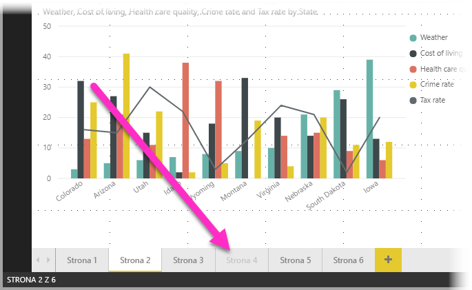

# Widok raportu w programie Power BI Desktop
Jeśli masz doświadczenie w pracy z usługą Power BI, to wiesz jak łatwo jest tworzyć raporty udostępniające dynamiczne perspektywy i szczegółowe informacje dotyczące danych. Usługa Power BI zawiera także inne zaawansowane funkcje w ramach programu Power BI Desktop. Za pomocą programu Power BI Desktop możesz tworzyć zaawansowane zapytania, łączyć dane z wielu źródeł, tworzyć relacje między tabelami i wykonywać wiele innych działań.

Program Power BI Desktop obejmuje **widok raportu**, w którym można tworzyć dowolną liczbę stron raportu z wizualizacjami. Widok raportu udostępnia właściwie takie same środowisko, jak widok do edycji raportu w usłudze Power BI. Wizualizacje można między innymi przenosić oraz kopiować i wklejać.

Różnica między nimi jest następująca: podczas używania programu Power BI Desktop można pracować z zapytaniami i modelować dane, aby zapewnić, że używane dane stanowią najbardziej przydatne informacje w ramach raportów. Następnie możesz zapisać plik programu Power BI Desktop w dowolnym miejscu — nie ma znaczenia, czy jest to dysk lokalny, czy chmura.

## Spójrzmy na przykład.
Podczas pierwszego ładowania danych w programie Power BI Desktop zostanie wyświetlony **widoku raportu** z pustą kanwą.

Możesz przełączać się między **widokiem raportu**, **widokiem danych** i **widokiem relacji**, wybierając ikony na pasku nawigacyjnym po lewej stronie:

Po dodaniu danych możesz dodać pola do nowej wizualizacji na kanwie.

Aby zmienić typ wizualizacji, możesz wybrać go z grupy **Wizualizacja** na wstążce lub kliknąć prawym przyciskiem myszy i wybrać inny typ za pomocą ikony **Zmień typ wizualizacji**.

> [!TIP]
> Pamiętaj, aby wypróbować różnych typów wizualizacji. Istotne jest, aby wizualizacje w jasny sposób przedstawiały informacje.

Na początku raport będzie zawierać co najmniej jedną pustą stronę. Strony są wyświetlane w okienku nawigatora z lewej strony kanwy. Na stronie można dodawać wiele różnych wizualizacji, ale ważne jest, aby ich nie nadużywać. Jeśli na stronie znajduje się zbyt wiele wizualizacji, będzie ona przeładowana i trudno będzie na niej znaleźć odpowiednie informacje. Do raportu można dodawać nowe strony. Po prostu kliknij pozycję **Nowa strona** na Wstążce.

Aby usunąć stronę, kliknij przycisk **X** na karcie strony w dolnej części widoku raportu.

> [!NOTE]
> Do pulpitu nawigacyjnego nie można przypinać raportów ani wizualizacji z programu Power BI Desktop. Aby to zrobić, należy [przeprowadzić publikowanie z programu Power BI Desktop](desktop-upload-desktop-files.md) w witrynie usługi Power BI.

## Kopiowanie i wklejanie między raportami

Można łatwo wziąć wizualizację z jednego raportu programu Power BI Desktop i wkleić ją do innego raportu. Po prostu użyj skrótu klawiszowego **CTRL + C** do skopiowania wizualizacji raportu, a następnie w innym raporcie programu Power BI Desktop użyj **CTRL + V**, aby wkleić wizualizację do tego raportu. Można wybrać pojedynczą wizualizację lub wszystkie wizualizacje na stronie, aby je skopiować, a następnie wkleić w miejscu docelowym raportu programu Power BI Desktop. 

Możliwość kopiowania i wklejania wizualizacji jest przydatna dla osób, które często tworzą i aktualizują wiele raportów. Podczas kopiowania wizualizacji między plikami ustawienia i formatowanie, które zostały jawnie ustawione w okienku formatowania, są przekazywane dalej, natomiast elementy wizualne oparte na motywie lub ustawieniach domyślnych automatycznie aktualizują się, aby pasowały do motywu raportu docelowego. Dlatego po otrzymaniu sformatowanej i odpowiednio wyglądającej wizualizacji możesz skopiować i wkleić tę wizualizację do nowych raportów, zachowując całe dobrze opracowane formatowanie.

Jeśli pola w modelu są różne, zobaczysz błąd w wizualizacji i ostrzeżenie o nieistniejących polach. Błąd przypomina sytuację spotykaną w przypadku usunięcia pola w modelu, który używa wizualizacji. Aby naprawić ten błąd, po prostu zamień uszkodzone pola na odpowiednie pola z modelu w raporcie, do którego wklejono wizualizację. Jeśli używasz wizualizacji niestandardowej, trzeba ją również zaimportować do raportu docelowego.

## Ukrywanie stron raportu

Po utworzeniu raportu można również ukrywać jego strony. Może to być przydatne, jeśli musisz utworzyć podstawowe dane lub wizualizacje w raporcie, ale nie chcesz, by te strony były widoczne dla innych osób, np. w przypadku tworzenia tabel lub wizualizacji pomocniczych używanych na innych stronach raportu. Istnieje wiele innych powodów, dla których możesz utworzyć stronę raportu, a następnie ukryć ją w raporcie, który chcesz opublikować. 

Stronę raportu można ukryć w prosty sposób. Wystarczy kliknąć prawym przyciskiem myszy kartę strony raportu, a następnie wybrać przycisk **Ukryj** z wyświetlonego menu.

Ukrywając stronę raportu, należy pamiętać o kilku kwestiach:

* W programie **Power BI Desktop** można wyświetlić widok ukrytego raportu, nawet jeśli tytuł strony jest wygaszony. Na poniższej ilustracji strona 4 jest ukryta.

    

* Ukrytej strony raportu *nie można* wyświetlić w **usłudze Power BI**.

* Ukrywanie strony raportu *nie* jest środkiem bezpieczeństwa. Użytkownicy mogą nadal uzyskiwać dostęp do strony, a jej zawartość pozostaje dostępna za pomocą drążenia wskroś i innych metod.

* Gdy strona jest ukryta, w trybie widoku nie są wyświetlane żadne strzałki nawigacji.

