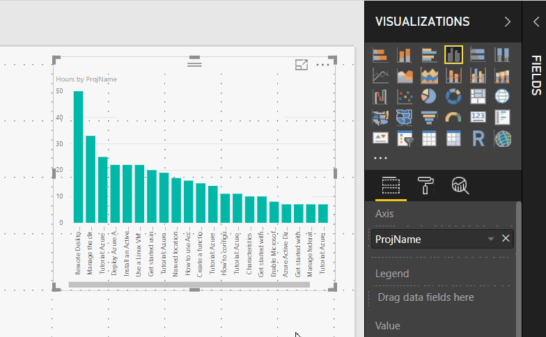

# Widok raportu w programie Power BI Desktop
Jeśli masz doświadczenie w pracy z usługą Power BI, to wiesz jak łatwo jest tworzyć raporty udostępniające dynamiczne perspektywy i szczegółowe informacje dotyczące danych. Usługa Power BI zawiera także inne zaawansowane funkcje w ramach programu Power BI Desktop. Za pomocą programu Power BI Desktop możesz tworzyć zaawansowane zapytania, łączyć dane z wielu źródeł, tworzyć relacje między tabelami i wykonywać wiele innych działań.

Program Power BI Desktop obejmuje **widok raportu**, w którym można tworzyć dowolną liczbę stron raportu z wizualizacjami. Widok raportu udostępnia właściwie takie same środowisko, jak widok do edycji raportu w usłudze Power BI. Wizualizacje można między innymi przenosić oraz kopiować i wklejać.

Różnica między nimi jest następująca: podczas używania programu Power BI Desktop można pracować z zapytaniami i modelować dane, aby zapewnić, że używane dane stanowią najbardziej przydatne informacje w ramach raportów. Następnie możesz zapisać plik programu Power BI Desktop w dowolnym miejscu — nie ma znaczenia, czy jest to dysk lokalny, czy chmura.

## Spójrzmy na przykład.
Podczas pierwszego ładowania danych w programie Power BI Desktop zostanie wyświetlony **widoku raportu** z pustą kanwą.

Możesz przełączać się między **widokiem raportu**, **widokiem danych** i **widokiem relacji**, wybierając ikony na pasku nawigacyjnym po lewej stronie:

Po dodaniu danych możesz dodać pola do nowej wizualizacji na kanwie.

Aby zmienić typ wizualizacji, możesz wybrać go z grupy **Wizualizacja** na wstążce lub kliknąć prawym przyciskiem myszy i wybrać inny za pomocą ikony **Zmień typ wizualizacji**.

> [!TIP]
> Pamiętaj, aby wypróbować różnych typów wizualizacji. Istotne jest, aby wizualizacje w jasny sposób przedstawiały informacje.
> 
> 

Na początku raport będzie zawierać co najmniej jedną pustą stronę. Strony są wyświetlane w okienku nawigatora z lewej strony kanwy. Na stronie można dodawać wiele różnych wizualizacji, ale ważne jest, aby ich nie nadużywać. Jeśli na stronie znajduje się zbyt wiele wizualizacji, będzie ona przeładowana i trudno będzie na niej znaleźć odpowiednie informacje. Do raportu można dodawać nowe strony — wystarczy kliknąć pozycję **Nowa strona** na wstążce.

Aby usunąć stronę, kliknij przycisk **X** na karcie strony w dolnej części widoku raportu.

> [!NOTE]
> Do pulpitu nawigacyjnego nie można przypinać raportów ani wizualizacji z programu Power BI Desktop. Aby to zrobić, należy [przeprowadzić publikowanie z programu Power BI Desktop](desktop-upload-desktop-files.md) w witrynie usługi Power BI.
> 
> 

