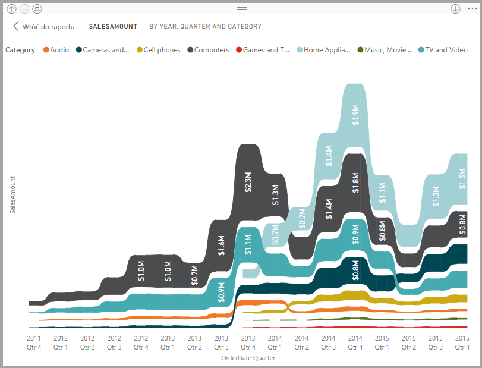
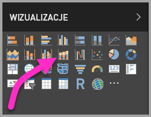
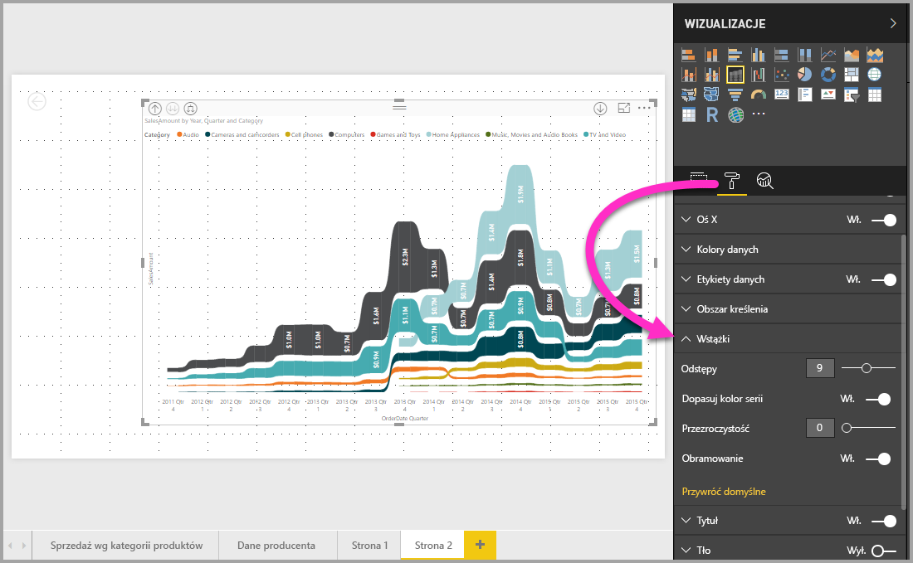

# Używanie wykresów wstążkowych w usłudze Power BI
Przy użyciu wykresów wstążkowych w usłudze **Power BI** można wizualizować dane i szybko określać, które kategorie danych mają najwyższą rangę (największa wartość). Wykresy wstążkowe dobrze obrazują zmianę rangi, zawsze wyświetlając najwyższą rangę (wartość) u góry dla każdego przedziału czasu. Wykresy wstążkowe są dostępne w programie **Power BI Desktop** od wersji z września 2017 r. i następujących po niej aktualizacjach **usługi Power BI**.

## Tworzenie wykresu wstążkowego
Aby utworzyć wykres wstążkowy, wybierz pozycję **Wykres wstążkowy** na panelu **Wizualizacje**.

Wykresy wstążkowe łączą kategorię danych w całym wizualizowanym przedziale czasu za pomocą wstążki, umożliwiając dzięki temu sprawdzenie, jaka była ranga danej kategorii na przestrzeni osi x wykresu (zazwyczaj jest to oś czasu).

## Formatowanie wykresu wstążkowego
Gdy tworzysz wykres wstążkowy, opcje formatowania są dostępne w sekcji **Formatowanie** w okienku **Wizualizacje**. Opcje formatowania dla wykresów wstążkowych są podobne do opcji wykresu skumulowanego kolumnowego z dodatkowymi opcjami formatowania specyficznymi dla wstążki.

Opcje formatowania dla wykresów wstążkowych pozwalają dostosować następujące elementy:

* **Odstępy** — Możesz dostosować odstępy między wstążkami. Liczba określa wartość procentową maksymalnej wysokości kolumny.
* **Dopasuj do koloru serii** — Umożliwia dopasowanie koloru wstążek do koloru serii. Kiedy ta opcja jest wyłączona, wstążki są szare.
* **Przezroczystość** — Określa, jak przezroczyste są wstążki (ustawienie domyślne to 30).
* **Obramowanie** — Umożliwia umieszczenie ciemnego obramowania u góry i u dołu wstążek. Domyślnie obramowanie jest wyłączone.

## Następne kroki
Aby uzyskać więcej informacji na temat programu **Power BI Desktop** oraz dowiedzieć się, jak rozpocząć pracę w tym programie, zapoznaj się z następującymi artykułami.

* [Wprowadzenie do programu Power BI Desktop](desktop-getting-started.md)
* [Omówienie zapytań w programie Power BI Desktop](desktop-query-overview.md)
* [Źródła danych w programie Power BI Desktop](desktop-data-sources.md)
* [Łączenie się z danymi w programie Power BI Desktop](desktop-connect-to-data.md)
* [Kształtowanie i łączenie danych w programie Power BI Desktop](desktop-shape-and-combine-data.md)
* [Typowe zadania dotyczące zapytań w programie Power BI Desktop](desktop-common-query-tasks.md)   

