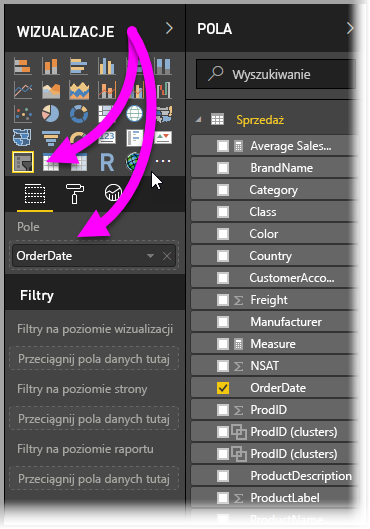
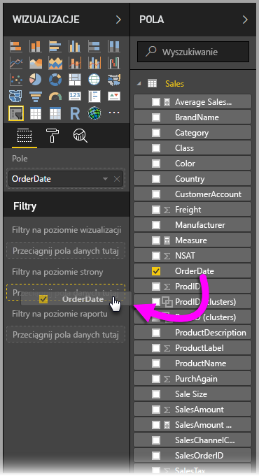

# Używanie fragmentatora i filtru dat względnych w programie Power BI Desktop
Używając **fragmentatora dat względnych** lub **filtru dat względnych**, możesz stosować filtry oparte na czasie do dowolnej kolumny daty w modelu danych. Na przykład przy użyciu **fragmentatora dat względnych** możesz wyświetlić tylko dane sprzedaży, która miała miejsce w ciągu ostatnich 30 dni (lub miesiąca, miesięcy kalendarzowych itd). Podczas odświeżania danych okres względny automatycznie zastosuje odpowiednie ograniczenie dat względnych.

## Używanie fragmentatora zakresów dat względnych
Fragmentatora dat względnych możesz używać podobnie jak każdego innego fragmentatora. Po prostu utwórz wizualizację **fragmentatora** dla raportu, a następnie dla wartości **Pole** wybierz wartość daty. Na poniższej ilustracji jest zaznaczone pole *OrderDate*.

Wybierz strzałkę w prawym górnym rogu **fragmentatora dat względnych**, aby wyświetlić menu.

W przypadku fragmentatora dat względnych wybierz pozycję *Względne*.

Następnie możesz wybrać ustawienia. Z pierwszej listy rozwijanej w oknie *fragmentatora dat względnych* możesz wybrać następujące opcje:

* Ostatnie
* Następne
* Te

Te opcje pokazano na poniższej ilustracji.

Następne (środkowe) ustawienie w oknie *fragmentatora dat względnych* umożliwia wpisanie liczby w celu zdefiniowania zakresu dat względnych.

Trzecie ustawienie umożliwia wybór miary daty. Możesz wybrać następujące opcje:

* Dni
* Tygodnie
* Tygodnie (kalendarzowe)
* Miesiące
* Miesiące (kalendarzowe)
* Lata
* Lata (kalendarzowe)

Te opcje pokazano na poniższej ilustracji.

Jeśli z tej listy wybierzesz pozycję *Miesiące* i wprowadzisz 2 w środkowym ustawieniu, będzie to miało następujący skutek: jeśli bieżąca data to 20 lipca, w wizualizacjach ograniczonych przez fragmentator będą wyświetlane dane z ostatnich dwóch miesięcy, począwszy od 20 maja i skończywszy na 20 lipca (bieżąca data).

Dla porównania, jeśli wybierzesz pozycję *Miesiące (kalendarzowe)*, w ograniczonych wizualizacjach będą wyświetlane dane od 1 maja do 30 czerwca (ostatnie dwa pełne miesiące kalendarzowe).

## Używanie filtru zakresów dat względnych
Filtr zakresów dat względnych możesz również utworzyć dla strony raportu lub całego raportu. Aby to zrobić, po prostu przeciągnij pole daty do obszaru **Filtry na poziomie strony** lub **Filtry na poziomie raportu** w okienku **Pole**, jak pokazano na poniższej ilustracji.

W tym miejscu możesz zmodyfikować zakres dat względnych podobnie jak w przypadku dostosowywania **fragmentatora dat względnych**. Wybierz pozycję **Filtrowanie dat względnych** z listy rozwijanej **Typ filtru**.

Po wybraniu pozycji **Filtrowanie dat względnych** zostaną wyświetlone trzy sekcje, które można zmodyfikować, w tym środkowe pole liczbowe, podobnie jak w przypadku fragmentatora.

I to tyle na temat stosowania ograniczeń dat względnych w raportach.

## Ograniczenia i istotne zagadnienia
Obecnie obowiązują poniższe ograniczenia i istotne zagadnienia dotyczące **fragmentatora i filtru zakresów dat względnych**.

* Modele danych w usłudze **Power BI** nie zawierają informacji o strefie czasowej. Modele mogą przechowywać czas, ale bez informacji o odpowiednich strefach czasowych.
* Fragmentator i filtr zawsze bazują na czasie w formacie UTC, dlatego jeśli skonfigurujesz filtr w raporcie i wyślesz go do współpracownika w innej strefie czasowej, będą wyświetlane te same dane. Jednak jeśli nie jesteś w strefie czasowej UTC, możesz zobaczyć dane dla innego przesunięcia czasowego niż oczekiwane.
* Dane zarejestrowane w lokalnej strefie czasowej można przekonwertować na format UTC przy użyciu **Edytora zapytań**.

